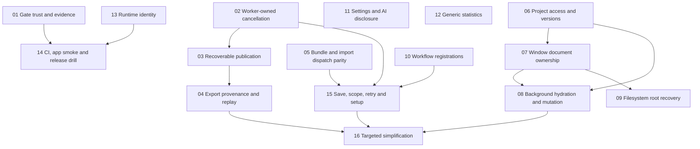

# LGE Audit Remediation Implementation Plan

> **For agentic workers:** REQUIRED SUB-SKILL: Use superpowers:subagent-driven-development (recommended) or superpowers:executing-plans to implement this plan task-by-task. Steps use checkbox (`- [ ]`) syntax for tracking.

**Goal:** Repair the reviewed integrity, lifecycle, workflow, computation and release-assurance defects without replacing LGE's working architecture.

**Architecture:** Preserve the Core/IO/Workflow/UI dependency graph and existing provenance, session and release primitives. Make ownership explicit at asynchronous completion and scientific publication boundaries, then route existing entry points through those contracts. Prefer small, independently reviewable changes and deterministic tests over a global redesign.

**Tech Stack:** Swift 6.2+ package, AppKit/SwiftUI on Apple Silicon macOS 26+, SQLite, Swift Testing/XCTest, Python/shell release tooling, Sparkle, managed tool runtimes.

**Spec:** [Comprehensive assessment](../../reports/2026-09-05-lge-audit/README.md), with linked specialist evidence reports. Audited baseline: `13e114087b1c0a994ad1d957ce7d71b963e5575d`.

## Global constraints

- This pass creates review documents only. Execute no implementation until the user reviews and requests it.
- Every `lungfish-cli` command or app workflow that creates, imports, transforms, exports, or wraps scientific data must write reproducibility provenance into the output bundle/directory.
- Provenance must include the executed tool/workflow name and version, exact argv or reproducible shell command, user-visible options plus resolved defaults, conda/container/runtime identity when applicable, input/output paths, checksums, file sizes, exit status, wall time, and stderr when useful.
- GUI-imported CLI outputs must preserve or rehydrate CLI provenance so the final `.lungfish*` bundle points at the final stored payload, not only a temporary staging file.
- Treat missing provenance as a blocking defect for new scientific features, especially FASTQ, classifier, extraction, import, and derived bundle workflows.
- Keep Swift tools floor 6.2 and macOS deployment floor 26.0; retain arm64 release architecture and the existing release contract unless a separately reviewed platform decision changes them.
- Do not rewrite scientific algorithms or tune domain-specific tools as part of generic lifecycle repairs. Use invented small data for failure, routing, statistics and replay tests.
- No global AppKit-to-SwiftUI migration, database replacement, generic plugin SDK, or new parallel release coordinator is justified by this audit.
- Paths below are repository-relative from `/Users/dho/Documents/lungfish-genome-explorer`. New filenames and interfaces are proposed designs, not claims that they exist. Recheck the baseline and current types before implementing.
- Each package is a review boundary, not an assertion that all work fits in a single short coding session. Split large packages into contract, caller adoption, and validation PRs only when each intermediate state is safe.

## Dependency and review map



01, 05, 06, 10, 11, 12 and contract work for 13 are independent starting points. Do not run agents that simultaneously edit `AppDelegate+ImportCenter.swift`, `OperationCenter.swift`, `ScientificFileExportProvenance.swift`, or shared test files. Merge a contract before delegating dependent callers. Implementation effort is deliberately expressed as scope: small = one focused boundary, medium = multiple callers, large = cross-layer migration plus recovery validation. No delivery-date promise is implied.

## Package 01 — Make test gates fail closed and retain their evidence

**Findings:** QR-01, QR-02, QR-05. **Priority:** first. **Scope:** medium. **Owner:** release/test infrastructure.

**Files:** modify `scripts/full-suite-gate.sh`, `scripts/release/release.py`, `scripts/release/release-candidate-receipt.py`; extend `scripts/tests/test_full_suite_gate_tiers.py`, `scripts/tests/test_release_artifact_receipt.py`, `scripts/tests/test_release_frontdoor.py`. Create a gate-result schema/parser only if existing xUnit outputs cannot provide a single authoritative result model.

**Contract:** gate result carries original process exit, selected/executed counts by harness, completion evidence, skips, retry attempts, timestamps, exact argv, source identity and hashed logs. Candidate receipt consumes a manifest digest for those results. Retry never overwrites original failure evidence.

- [ ] Copy the two temp-only fake-runner scenarios from the quality report into behavioral regression tests: zero-test success and original exit 139 plus isolated passing retry must both fail authorization.
- [ ] Add valid one-test, legitimate mixed XCTest/Swift Testing, partial output, failed required-tool suite, killed runner and unmatched-filter cases. Require execution only for harnesses/suites selected; an unused Swift Testing harness reporting zero is not itself a failure when XCTest executed the requested tests.
- [ ] Replace status promotion with explicit result aggregation. Separate diagnostic rerun success from a clean authoritative gate. Validate selected suite completion using structured outputs, not solely absence of matching failure text.
- [ ] Pass immutable gate results from coordinator to receipt writer; retain logs below the candidate and hash the result manifest. Receipt verification rejects absent/changed evidence.
- [ ] Run `python3 -B -m unittest scripts.tests.test_full_suite_gate_tiers scripts.tests.test_release_artifact_receipt scripts.tests.test_release_frontdoor` in the documented verification runtime. Review a failing, clean and retried receipt before committing.

**Done:** neither empty nor crashed/incomplete selection can authorize packaging, and a retained candidate explains exactly what ran. No credentialed publication is needed to test this change.

## Package 02 — Worker acknowledgement owns terminal status and output leases

**Findings:** ARCH-01, WF-02; covers WF-R3 cancellation. **Scope:** medium/large. **Owner:** operation runtime.

**Files:** modify `Sources/LungfishKit/OperationCenter.swift`, `Sources/LungfishApp/App/AppDelegate+ImportCenter.swift`, `Sources/LungfishApp/Views/MainWindow/MainSplitViewController+FASTQImport.swift`; extend `Tests/LungfishAppTests/OperationCenterLockingTests.swift`; create `Tests/LungfishAppTests/ImportOperationLifecycleTests.swift` for injected importer outcomes. Inventory other `onCancel` registrations before modifying shared semantics.

**Contract:** cancellation callback signals intent; only worker completion after exit, stream drain and cleanup releases ownership. Proposed state invariant:

```text
running --requestCancel--> cancelling [lease held]
cancelling --workerDidDrain(cancelled)--> cancelled [lease released]
running --workerDidDrain(result)--> completed/failed [lease released]
```

- [ ] Add a barrier-controlled worker test: cancel returns, row remains cancelling, same-target start stays blocked. Release worker barrier; one terminal transition occurs and subsequent start succeeds.
- [ ] Add a late-cleanup test with two operation IDs and a deterministic final database name; old cleanup cannot remove new output. Give each operation private staging ownership.
- [ ] Remove automatic finish-on-signal behavior and connect all caller terminal paths. Preserve cancelled outcome when a normal completion arrives after cancellation was accepted. Ensure callbacks cannot terminalize twice.
- [ ] Hoist sidebar reference-import operation identity outside the throwing scope; call failure/complete once on every path and attach output URL on success. Offer cancellation only when worker acknowledgement is supported.
- [ ] Run `swift test --filter 'OperationCenterLockingTests|ImportOperationLifecycleTests'`; then exercise one harmless helper process with delayed exit. Review all converted callbacks before committing.

**Done:** operation UI, lock lifetime and actual worker lifetime agree. Failed reference import cannot leave an uncleared Running row.

## Package 03 — Preserve previous data and recovery artifacts across scientific publication

**Findings:** ARCH-02, DATA-02/03/04. **Dependencies:** 02 for shared lease adoption; transaction contract design can start earlier. **Scope:** large. **Owner:** storage/provenance.

**Files:** modify `Sources/LungfishApp/Services/VariantDeletionMutationService.swift`, `VariantSampleMetadataImportService.swift` in the same directory; `Sources/LungfishCLI/Commands/ConvertCommand.swift`; `Sources/LungfishCLI/Support/CLIProvenanceSupport.swift`; `Sources/LungfishWorkflow/Provenance/ScientificFileExportProvenance.swift`, `ProvenancePublicationSnapshot.swift`. Extend existing mutation/export/provenance tests; create a shared publication-failure fixture in `Tests/Support/LungfishTestSupport` only if multiple tests need it.

**Contract:** publication owns a consumed-input snapshot, staged payload, all sidecars, replacement and recovery. Return distinct committed, rolled-back and recovery-required outcomes. A recovery-required result includes retained artifact locations and both original/restoration errors. Existing readers are coordinated when a database pathname is replaced.

- [ ] Turn recorded failed-overwrite and same-path checksum probes into caller regression tests using only temp files. Add symlink/hard-link alias cases or explicitly reject these aliases before mutation.
- [ ] Add failure injection after payload writing, each sidecar write, backup creation, installation rename and restoration. An unsuccessful restore retains the last valid copy; never unconditionally discard it.
- [ ] Snapshot consumed bytes before mutation. Use `consumedInputSnapshot` deliberately rather than reopening already changed paths. Decide disallow-versus-supported input/output aliasing and document it in CLI help.
- [ ] Use staged replacement and existing provenance primitives as one recoverable transaction. Close/invalidate readers or use a SQLite-supported snapshot strategy; do not assume copying a live database pathname includes WAL state.
- [ ] Adopt the same contract in the two mutation services and the direct user-destination GUI exports. New staging-only callers can keep simpler APIs when ownership is proven.
- [ ] Run `swift test --filter 'VariantDeletionMutationServiceTests|VariantSampleMetadataImportServiceTests|ScientificFileExportProvenanceTests|ScientificCLIProvenanceCoverageTests'`; add a controlled process-interruption/reopen experiment on a disposable copy before final review.

**Done:** failure yields complete previous state, complete committed state, or explicit recoverable artifacts; a false successful payload/provenance pair cannot appear. Commit contract and safe caller adoption in reviewable slices.

## Package 04 — Complete GUI provenance and make exported replay executable

**Findings:** DATA-01, DATA-04/05/06. **Dependency:** 03. **Scope:** medium/large. **Owner:** export/provenance.

**Files:** modify `Sources/LungfishApp/App/AppDelegate+ImportCenter.swift`, `Sources/LungfishApp/Views/Viewer/AnnotationTableDrawerView+Bookmarks.swift`, `Sources/LungfishWorkflow/Provenance/ProvenanceExporter.swift`, `ProvenanceRecord.swift` if needed; extend `Tests/LungfishCLITests/ProvenanceExportCommandTests.swift` and `Tests/LungfishAppTests/ScientificFileExportProvenanceTests.swift`; create `Sources/LungfishApp/Services/AnnotationExportService.swift` and matching caller tests if no current service owns this boundary. Add a real headless replay route under `Sources/LungfishCLI/Commands` only for semantics agreed during review.

**Contract:** export request includes immutable source/selection identity, format, resolved options and final destination. Audit argv and replay argv remain separate. Replay selection prefers supported durable argv; unavailable historical replay is stated explicitly rather than synthesized as a fake command.

- [ ] Add GFF3 GUI-service tests for open document and sidebar bundle, including edited unsaved annotations represented by durable snapshot.
- [ ] Route GFF3 and bookmark exports through package 03 publication. Surface actionable errors; preserve existing outputs on sidecar failure.
- [ ] Add the isolated canonical durable/historical fixture from `cli-probes.json` to exporter tests. Cover steps, no steps, legacy records and chain expansion without changing historical argv.
- [ ] Apply one replay-command selection rule across shell/Python/Nextflow/Snakemake exports; escape generated code according to each language, including filenames with whitespace, quotes, dollar signs and newlines. Validate rather than blindly execute unsupported GUI action labels.
- [ ] Implement or reuse headless replay over retained bookmark/annotation selections. Export after changing the live selection and verify the earlier snapshot still reproduces earlier bytes.
- [ ] Run `swift test --filter 'ProvenanceExportCommandTests|ScientificFileExportProvenanceTests|AnnotationExportServiceTests'`. Execute harmless file-copy replays in an isolated directory after staging deletion; compare output hashes and inspect methods/JSON output for truthful scope.

**Done:** both GUI exports have complete provenance; supported scripts reproduce retained inputs rather than stale staging or invented command names.

## Package 05 — Unify native bundle identity and import validation across entry points

**Findings:** WF-01/03/04; validate WF-R5 condition. **Scope:** medium. **Owner:** import/navigation.

**Files:** modify `Sources/LungfishApp/Services/SidebarImportPlanner.swift`, `Sources/LungfishApp/Views/ImportCenter/ImportCenterViewModel.swift`, `ImportCenterView.swift`, `Sources/LungfishApp/Views/MainWindow/MainSplitViewController+MultiDocument.swift`, `MainSplitViewController+FASTQImport.swift`; use existing `SidebarItem`/bundle capability definitions. Extend `Tests/LungfishAppTests/SidebarImportPlannerTests.swift`; add `ImportCenterDispatchTests.swift` for actual dispatch decisions.

**Contract:** detection returns one recognized object type and capabilities; panel/drop share allowed types and cardinality. Wizard dispatch returns started/cancelled/rejected/error rather than dispatch-only success. A staging lease outlives every consumer.

- [ ] Parameterize all advertised native directory types, direct and ZIP-wrapped; assert exactly one destination and no internal-file import. Include a parent directory containing a native package and an ONT-heuristic conflict case.
- [ ] Replace the three-type whitelist with existing canonical capability data. Define how nested recognized packages are included or visibly rejected.
- [ ] Route wizard drops through the same wizard initialization as clicking Import; reject incompatible drops without closing the center. Enforce exactly-one CSV or implement deliberate per-sheet batch dispatch.
- [ ] Hold ZIP staging until configuration and all consumers finish/cancel. Test the conditional embedded FASTQ attachment case; do not assert ordinary FASTQ ZIP failure without a route.
- [ ] Run `swift test --filter 'SidebarImportPlannerTests|ImportCenterDispatchTests'`; perform one drag/drop per family with count/type/destination assertions and retained provenance.

**Done:** object identity, accepted inputs and outcomes do not depend on the door used to import them.

## Package 06 — Validate project version and effective access before writes

**Findings:** ARCH-03/09. **Scope:** medium. **Owner:** project storage.

**Files:** modify `Sources/LungfishCore/Storage/ProjectFile.swift`, `ProjectStore.swift`, `Sources/LungfishApp/StateManagement/ProjectSession.swift`, `Sources/LungfishApp/App/AppDelegate.swift`; extend `Tests/LungfishCoreTests/Storage/ProjectFileTests.swift`, `ProjectStoreTests.swift`, and `Tests/LungfishAppTests/ProjectSessionTests.swift`.

**Contract:** inspection/read-only open cannot create, migrate or normalize files. Writable open validates metadata, database version and writer lease before mutation. Create and migration are separate explicit operations.

- [ ] Snapshot disposable directory trees before opening missing-metadata, future-format, future-schema, locked and read-only projects. Assert exact unchanged file inventory/hashes on rejection/inspection.
- [ ] Propagate effective access through project/store initialization; remove pre-validation migration from application open. Reject unsupported newer versions before writable SQLite setup.
- [ ] Make supported migration recoverable and version-aware; retain source state until success and record provenance for scientific transformations.
- [ ] Run `swift test --filter 'ProjectFileTests|ProjectStoreTests|ProjectSessionTests'`; exercise writable and read-only migration controls separately.

**Done:** opening an unsupported project cannot silently mutate it; legitimate create/migrate behavior remains explicit and tested.

## Package 07 — Complete per-window document/request ownership

**Findings:** ARCH-05/06. **Dependency:** 06. **Scope:** medium. **Owner:** app/session.

**Files:** modify `Sources/LungfishApp/App/AppDelegate.swift`, `DocumentManager.swift`, `Sources/LungfishApp/StateManagement/ProjectSession.swift`, `AsyncRequestGate.swift` only if needed; `Sources/LungfishApp/Views/MainWindow/MainSplitViewController.swift`, `MainSplitViewController+MultiDocument.swift`; extend `Tests/LungfishAppTests/DocumentManagerTests.swift`, `ProjectSessionRegistryTests.swift`, `AsyncRequestGateTests.swift`.

**Contract:** captured session/request identity authorizes registration and publication. Loading is separate from adding to a session. Document events carry originating session/window identity; a projectless compatibility facade mirrors `nil` exactly.

- [ ] Add controllable A/B loading tests for out-of-order completion, focus switch, project switch and close. Assert viewport, membership, progress and error destination separately.
- [ ] Apply the existing request gate at external-open publication and registration. Scope document-loaded events; remove global fallback authority from mutation destinations.
- [ ] Replace raw path-prefix containment with a shared component-aware helper and explicit symlink policy; test sibling-prefix paths.
- [ ] Run `swift test --filter 'DocumentManagerTests|ProjectSessionRegistryTests|AsyncRequestGateTests'`; validate two projects and one projectless window in the app.

**Done:** late work never changes another request's session or window; focusing a projectless window cannot retain a previous mutation destination.

## Package 08 — Move unbounded storage work off the UI actor

**Findings:** ARCH-04/08. **Dependencies:** 03, 06, 07. **Scope:** large. **Owner:** app performance/storage.

**Files:** modify `Sources/LungfishApp/App/DocumentManager.swift`, `Sources/LungfishApp/StateManagement/ProjectSession.swift`, `Sources/LungfishCore/Storage/ProjectStore.swift`, and mutation-service UI callers in `Sources/LungfishApp/Views/Viewer/AnnotationTableDrawerView.swift`. Create a project hydration worker/coordinator only if existing loaders cannot own the task; add behavioral tests alongside `DocumentManagerTests.swift` and a reproducible synthetic benchmark under `benchmarks` in the implementation pass.

**Contract:** open returns catalog metadata first; selected-content hydration runs on an isolated storage worker and publishes immutable snapshots through package 07 identities. Mutations retain package 03 ownership while work proceeds off MainActor. Cache budgets are per project identity, not accidental window copies.

- [ ] Establish fixtures for many documents, long version histories and large variant tables; measure open-to-shell, selected-content latency, event-loop gaps and peak RSS before changing code.
- [ ] Add delayed hydration tests that prove menus/state remain available and stale results are discarded without needing wall-clock sleeps.
- [ ] Hydrate only selected content; serialize unsafe SQLite access explicitly. Offload snapshot/copy/hash work, not UI reference objects; keep progress and cancellation responsive.
- [ ] Repeat measured fixtures once after changes and report deltas. Set justified per-fixture performance budgets from baseline; do not invent a universal hardware-independent SLA.
- [ ] Run affected project/session/mutation tests and review memory with two windows of the same project before committing.

**Done:** UI work is bounded independently of project payload size and long mutations cannot block interaction. Maintain scientific output/provenance equivalence.

## Package 09 — Make root/volume invalidation visible and recoverable

**Finding:** ARCH-07. **Dependency:** 07. **Scope:** small/medium. **Owner:** filesystem/project UI.

**Files:** modify `Sources/LungfishApp/Services/FileSystemWatcher.swift`, `ProjectFilesystemRefreshCoordinator.swift`, `Sources/LungfishApp/Views/Sidebar/SidebarViewController.swift`; extend `Tests/LungfishAppTests/ProjectFilesystemRefreshCoordinatorTests.swift`.

**Contract:** subscription has changed, unavailable and rebound states. Root loss invalidates usable mutation scope until location/access is revalidated. Coordinator retains enough subscription intent to recover or prompt Locate.

- [ ] Inject root-change/removal events and assert all subscribers receive a terminal/unavailable state rather than silently disappearing.
- [ ] Implement visible missing-volume/root status and explicit or safe automatic rebind; validate session and project identity before resubscribing.
- [ ] Test two-window subscribers, rename, volume loss, replaced root and restoration. No stale callback can mark a replacement project ready.
- [ ] Run `swift test --filter ProjectFilesystemRefreshCoordinatorTests` and perform a disposable directory rename/recovery smoke.

**Done:** the sidebar cannot look normally live while permanently disconnected from refresh.

## Package 10 — Persist workflow registrations independently of package validity

**Findings:** WF-06/07. **Scope:** medium. **Owner:** workflow library.

**Files:** modify `Sources/LungfishApp/Services/WorkflowLibrary.swift`, `Sources/LungfishApp/Views/WorkflowLibrary/WorkflowLibraryViewModel.swift`, and `Sources/LungfishApp/Views/WorkflowLibrary/WorkflowLibraryPanelView.swift`. Extend `Tests/LungfishAppWorkflowTests/WorkflowLibraryTests.swift` and related store tests.

**Contract:** a registration has a stable local ID, manifest identity/version, source URL, last-known metadata and validation status. Missing source does not delete registration. Remove works by registration ID without decoding source. Replacement semantics live in the persistent store.

- [ ] Test missing manifest, malformed manifest, disconnected path and same manifest ID from two different paths across reload.
- [ ] Replace validation-based filtering with registration status rows; add Locate/Revalidate/Remove. Choose linked source versus managed copy explicitly in Add wording.
- [ ] Update the persistent store atomically when replacing an identity, or use explicit version IDs if simultaneous versions are supported. Preserve enablement according to the chosen identity contract.
- [ ] Run `swift test --filter 'WorkflowLibraryTests|WorkflowLibraryStoreTests'`; validate missing-source recovery without launching an external workflow.

**Done:** registrations remain diagnosable and removable, and reload cannot recreate unintended duplicate UI/execution identities.

## Package 11 — Persist settings edits reliably and clarify AI context disclosure

**Finding:** WF-08; product decision WF-R1. **Scope:** small for persistence, medium for disclosure. **Owner:** settings/assistant UI.

**Files:** modify `Sources/LungfishApp/Views/Settings/AIServicesSettingsTab.swift`, `Sources/LungfishApp/Services/AI/AIAssistantService.swift`, `Sources/LungfishApp/Views/AI/AIAssistantPanel.swift` for approved disclosure design only. Create `Tests/LungfishAppTests/AICredentialPersistenceTests.swift` using fake Keychain storage; reuse existing AI tests for context construction.

**Contract:** latest committed field value reaches storage on departure; debounce can govern validation, not silent persistence loss. Existing explicit Clear All stays immediate. Context disclosure names included data classes and actual recipient/fallback policy; default-off and bounded read/navigation tools remain.

- [ ] Test paste/edit/manual clear followed by tab departure before debounce completion; distinguish explicit Clear All. Inject storage error and surface it.
- [ ] Flush/capture pending values on departure or adopt an explicit commit control with visible saved state. Verify settings-window closure with real AppKit lifecycle separately.
- [ ] Review a static context-preview design showing active dataset/table/sample fields and provider recipient before implementing disclosure changes. Do not send real credentials or sample data during validation.
- [ ] Run fake-storage/context tests plus an app smoke for fast tab change. Confirm no new AI mutation capability was added.

**Done:** configuration changes cannot silently vanish and users can understand what context a request includes.

## Package 12 — Share correct Nx and record-aware composition semantics

**Findings:** DATA-07/08. **Scope:** small/medium. **Owner:** Core/IO numerical utilities and CLI.

**Files:** modify `Sources/LungfishCLI/Commands/AnalyzeCommand.swift`, `CompositionCommand.swift`, `Sources/LungfishIO/Assembly/AssemblyStatistics.swift`, `Sources/LungfishIO/Formats/FASTQ/FASTQStatisticsCollector.swift`, `Sources/LungfishWorkflow/Demultiplex/ExactBarcodeDemux.swift` and verified duplicate Nx callers. Place a shared generic threshold implementation in LungfishCore if needed by IO/CLI. Extend `Tests/LungfishIOTests/AssemblyStatisticsTests.swift`, `FASTQStatisticsCollectorTests.swift`; add `Tests/LungfishCLITests/SequenceSummaryBoundaryTests.swift`.

**Contract:** Nx requires at least the requested fraction of total bases; computation must avoid integer overflow and floating-point truncation. Adjacent-pair/triplet aggregation never invents adjacency across independent records. Public help/options match actual output.

- [ ] Add independent expected values: lengths `[3,2,2]` → N50 2; independent records `AA`,`CC` → adjacent pairs `AA`,`CC`, no full triplets. Include zero, exact/non-integral threshold and large total cases.
- [ ] Replace duplicate floor thresholds with one tested rule; preserve histogram operation without expanding read counts. Aggregate positional counts per record with defined partial/ambiguous-symbol denominators.
- [ ] Wire or remove unused stats flags and N90 help promises. Share this decision across text/JSON/TSV and update user help.
- [ ] Run `swift test --filter 'AssemblyStatisticsTests|FASTQStatisticsCollectorTests|SequenceSummaryBoundaryTests'` and repeat the harmless current-CLI probes from the audit with corrected expected values.

**Done:** CLI and stored/viewed summaries agree on explicitly documented boundaries. No biological workflow settings are changed.

## Package 13 — Make runtime/environment and database identity reconstructible

**Findings:** QR-03/06. **Scope:** large if promising full external lock compatibility. **Owner:** dependencies/runtime.

**Files:** modify `Sources/LungfishWorkflow/Conda/CondaLockfileService.swift`, `PluginPack.swift`, managed-tool manifest handling and `Sources/LungfishWorkflow/Resources/ManagedTools/third-party-tools-lock.json`; `Sources/LungfishWorkflow/Metagenomics/MetagenomicsDatabaseRegistry.swift` and `MetagenomicsDatabaseInstallProvenance.swift` in that directory. Extend `Tests/LungfishWorkflowTests/CondaLockfileServiceTests.swift` and database install provenance tests.

**Contract:** distinguish requested specification from resolved artifact lock. Resolved lock retains environment name, platform, all packages, source overlays, URLs/channels and expected digests. Live database snapshots have explicit retrieval identity and retained payload, not a misleading fixed label over a mutable URL.

- [ ] Add round-trip fixtures for renamed environment/package, multiple packages, source overlay, two platforms and malformed/unsupported lock formats. Assert semantic identity, not text substrings.
- [ ] Choose the supported lock contract; either fully implement it or relabel/reject unsupported compatibility. Do not solve a reduced spec and call it exact reconstruction.
- [ ] Add approved immutable database digests where obtainable through normal verified sources; model unpinnable live sources explicitly and bind actual received identity into conformance evidence. Do not invent hashes or silently use latest in a pinned request.
- [ ] Run lock/registry tests with local fixtures; exercise fresh environment reconstruction in an isolated approved runtime and compare complete installed inventories. If advertising an external lock consumer, validate it directly before claiming compatibility.

**Done:** exported identities recreate the requested environment/payload or fail with a precise supported-contract error. This task assesses software reproducibility, not analytical suitability of a database/tool.

## Package 14 — Bind real app checks and corrective-release recovery into release practice

**Findings:** QR-04/07/08/09. **Dependencies:** 01, 13 for final signoff; runner/design work independent. **Scope:** medium/large. **Owner:** release/app QA.

**Files:** modify `.github/workflows/ci.yml`, `config/release-contract.json`, release coordinator/receipt integration as needed; extend the existing `LungfishXCUITests` target via `Lungfish.xcodeproj` and `Tests/LungfishXCUITests/ProjectLifecycleXCUITests.swift`, `MainWindowNavigationXCUITests.swift`, and `BundleBrowserXCUITests.swift` in that target; update `docs/release/sparkle-updates.md`. Pin test dependencies in one reviewed input used by CI and local validation.

**Contract:** automatic feedback identifies source commit and executed checks; Stable has a small reliable real-app gate whose result is receipt-bound. Missing graphical access cannot become a silent green pass. Recovery after an installed bad build uses a documented corrective higher build without weakening monotonicity.

- [ ] Pin action commit revisions and test dependency versions/hashes with an explicit update procedure. Run CI contract tests using the declared environment, including PyYAML.
- [ ] Select a measured affordable automatic Swift compile/behavior subset. Add a deliberate compile-error fixture/check in infrastructure validation to demonstrate automatic failure; avoid duplicating every expensive conformance run on each PR.
- [ ] Add real-app smoke for launch/channel identity, native open, import failure status, save/menu contract, close/reopen and two-window ownership. Use a logged-in runner and harmless fixtures. Record selected/executed counts and result/log hashes via package 01.
- [ ] Write and perform a test-channel drill: preserve bad candidate evidence, stop promotion, build a higher-version correction, verify installed-client channel paths and schema compatibility, and interrupt feed/notes/bridge publication between stages.
- [ ] Run the supported release-skill validators and local gates. Use the release skill for any packaging/publication in a separately authorized implementation session; this plan does not publish artifacts.

**Done:** retained evidence shows both app usability and corrective update behavior. A signing or package-smoke pass alone is not labeled full release readiness.

## Package 15 — Make Save, export scope, retry and setup behavior coherent

**Finding:** WF-05; product decisions WF-R2/3/4. **Dependencies:** 02, 05, 10; project-copy work also 03/06. **Scope:** medium. **Owner:** app product/UI.

**Files:** modify `Sources/LungfishApp/App/MainMenu.swift`, project/window persistence handlers, export selection helpers, `Sources/LungfishKit/OperationCenter.swift` and operations panel only for approved retry contract, Welcome/setup views. Extend existing selection/export/window tests instead of adding a production wrapper for each menu label.

**Contract:** state persistence, export source/count and repeatable run configuration are visible and predictable. “Run Again…” creates a new attempt only after prior completion, using current validated inputs; it does not overwrite history or blindly repeat partial mutation.

- [ ] Review Save decision from the main report. Implement a real project-level action or remove inert document commands and communicate autosave; test reopen scope. Project copy requires an independent portable payload/provenance set.
- [ ] Share export-scope resolution across viewer/sidebar/multiselect and show actual source/count; do not silently export the first eligible item when the user requested many.
- [ ] Add restored run descriptors only for operations with validated replay semantics. Preflight missing input/tool/destination and route users to a repair action before starting.
- [ ] Permit dependency-free viewing before tool setup where supported; maintain explicit blocked operation requirements and existing installer exclusion.
- [ ] Execute the journey matrix in the workflow report with one representative object per family. Record unsupported paths and intentional limitations; no placeholder success states.

**Done:** users can understand what was saved/exported, recover failed work, and reach supported viewing without unrelated setup. Close-loop tests cover output navigation and reopen, not only dialog construction.

## Package 16 — Simplify only after the repaired contracts are proven

**Finding:** ARCH-10; cross-cutting testing sustainability. **Dependencies:** relevant caller adoption from 04/08/15. **Scope:** measured incremental work. **Owner:** subsystem maintainers.

**Files:** selected large controllers, their extracted services and related tests; no blanket file list or deletion target. Start with the modified import/export/document controller paths that now delegate to tested contracts. Genotype-specific decomposition requires a separate focused design rather than an unsolicited rewrite.

**Contract:** controllers translate intent and render state; services own asynchronous identity, storage and publication. Static tests remain for actual static contracts; behavioral tests own dynamic guarantees. One source of truth replaces duplicated capability/filter/transaction definitions.

- [ ] Measure first-pass test failures, slowest suites, actual required-case execution and source-shape assertions in the affected slice. Do not infer redundancy from line count.
- [ ] Remove dead compatibility wrappers only after all callers migrate. Delete source-string tests only when a named behavioral test covers the same requirement and fails under the relevant regression.
- [ ] Extract cohesive responsibilities from touched controllers; avoid extension-only file splitting that leaves ownership unchanged.
- [ ] Run the affected behavior suite and compare build/test time before and after. Review the diff for any accidental feature or provenance contract change.

**Done:** fewer competing authorities and easier tests, with preserved user behavior and no claimed arbitrary reduction percentage.

## Final implementation review and release exit checklist

- [ ] Every finding in the main ledger maps to a completed package, a deliberately disabled affected path, or an explicitly owned remaining P2/P3 item. Scientific provenance omissions cannot be waived as warnings.
- [ ] No P1 path remains enabled without its regression test and reviewed fix. Original test crashes/incomplete runs remain visible even when a diagnostic retry passes.
- [ ] Reopen/relocation checks validate final payload paths, sizes and hashes; historical consumed inputs are truthful and retained replay inputs are usable.
- [ ] Cancellation, failure and retry have independent operation identities and exactly one terminal outcome after worker drain.
- [ ] Rejected/read-only/future-version opens leave bytes unchanged; recovery failures retain an intact artifact with a visible location.
- [ ] Multi-window and delayed-completion cases pass using controlled scheduling plus a narrow actual-app smoke.
- [ ] Test and release evidence states actual counts, skips, retries, environment and source commit. Unsupported graphical/runtime environments are explicit blockers, not empty passes.
- [ ] A fresh reviewer verifies the final changes against the evidence reports, not just this plan's suggested design. Update the reports' finding status with new evidence; never rewrite the original audit as if repairs were present at baseline.

This plan is ready for human and LLM review. It intentionally stops before implementation, as requested.
