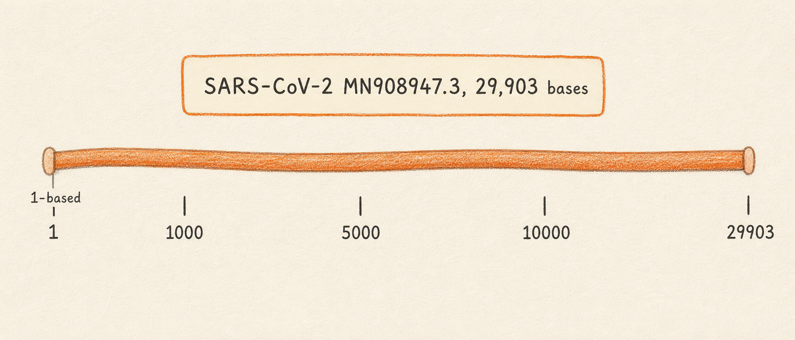
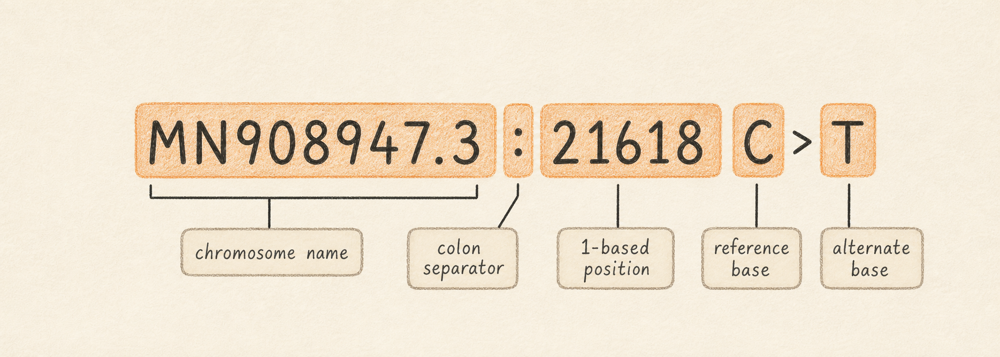

## What it is

A genome is the complete genetic sequence of an organism, written as a string of letters: A, C, G, T for DNA, with U replacing T in RNA. Every cell of every organism, and every particle of every virus, carries a copy. When you sequence a sample on an Illumina machine or a Nanopore flow cell, what comes back is millions of short reads of that string, in fragments, with errors. The job of a genomics tool is to turn those fragments back into a coherent picture of the original sequence and to describe how it differs from a known version.

A reference genome is the known version. It is a specific sequence that the field has agreed to use as the comparison point for everything else. When a paper reports that a SARS-CoV-2 isolate "carries the L452R mutation," what the authors mean is that the codon at amino acid position 452 of the spike protein, when compared to a community-agreed reference, has changed in a way that swaps a leucine for an arginine. Without a reference, the statement has no anchor. Two labs sequencing the same patient sample would describe the same change with different numbers, in different orders, against different starting bases.

This chapter introduces three ideas that every later chapter relies on. First, what kind of object a reference genome is and how it differs from a sample's sequence. Second, how Lungfish addresses positions on a genome (1-based, inclusive, named by chromosome or contig). Third, why the choice of reference matters for the variants you will eventually call. The running example is `MN908947.3`, the original SARS-CoV-2 isolate from December 2019. It is a single chromosome 29,903 bases long. Every variant call you produce in the rest of this manual is described relative to this reference.

So what should you do with this? Read the rest of this chapter once, slowly, and treat the variant notation example as a checkpoint. If you can read `MN908947.3:21618 C>T` and say in your own words what each part means, you are ready for the next chapter.

## What you will learn

By the end of this chapter you will be able to read a position like `MN908947.3:21618` and know that it names a base on the SARS-CoV-2 reference, that the position is 1-based (the first base of the genome is position 1, not 0), and that the variant tables you encounter later use this same convention. You will also understand why two papers can describe what looks like the same biological variant with different position numbers if the labs used different references.

### Sample sequence versus reference sequence

A sample's sequence is what you measured. A reference is what you compare it to. The two are different objects with different jobs.

Your sample sequence is empirical. It came off an instrument, with quality scores, with sequencing errors, with regions that nobody covered well. In Lungfish you will encounter it first as a FASTQ file (a text file holding one read and one quality string per record) and later as a BAM file (a compact, indexed file holding those reads after they have been aligned to a reference). You will see the words FASTQ and BAM throughout the manual; both are introduced properly in their own chapters.

A reference sequence, by contrast, is curated. Someone, often a consortium, decided which bases to put at which positions, gave the result a stable accession number, and deposited it in a public database such as GenBank or RefSeq. The reference does not change between your samples. That stability is the whole point. Because the reference is fixed, two analysts working on different samples can talk about "position 21618" and mean the same physical location on the same conceptual molecule.

Lungfish treats the two objects very differently in the user interface. References live in a project's `Reference Sequences/` folder as FASTA bundles (a `.fasta` file plus its `.fai` index, packaged with provenance metadata). Sample data lives in `Imports/` for files you brought in from disk, or in `Downloads/` for files Lungfish fetched from a public archive on your behalf. The folder layout itself is a teaching tool: when you open a project and see those folders side by side, the categorical difference between "what you measured" and "what you compare against" is visible at a glance.

### Linear, circular, and segmented genomes

Bacterial chromosomes and the genomes of many viruses are physically circular: the molecule has no ends, and base 1 is whatever position the curator chose to call base 1. Eukaryotic chromosomes are linear, with two physical ends. Some virus families, including influenza and the segmented bunyaviruses, distribute their genome across several physically separate molecules called segments. Each segment gets its own accession.

For the analysis tools in this manual the distinction is mostly cosmetic. Lungfish, like every aligner and variant caller it wraps, treats every reference as linear. A circular genome is unrolled at the curator's chosen origin. A read that physically spans the origin in the lab will, in the file, look like two pieces (one near the end and one near position 1) that the alignment tool may or may not stitch back together. For SARS-CoV-2 this is irrelevant in practice, because the molecule is RNA and is not circular at all. The "circular by convention" issue matters more for plasmids and bacterial genomes, which the current Lungfish toolset does not target.

DNA viruses (such as adenoviruses, herpesviruses, and HPV) and RNA viruses (such as SARS-CoV-2, influenza, and Ebola) look identical once their genomes have been deposited as a sequence file. Reference databases and analysis tools store everything as DNA letters. An RNA virus reference such as `MN908947.3` is written with `T` rather than `U` so that a single tool stack can process it without special-casing the alphabet. When you load SARS-CoV-2 reads into Lungfish, you are aligning DNA-letter reads (because the sequencer reverse-transcribed the RNA into cDNA before reading it) against a DNA-letter reference. The biology was RNA. The bookkeeping is DNA.

## Coordinates: how Lungfish names a position

A coordinate is the way a tool points at a specific base on a reference. Across the bioinformatics ecosystem there are two conventions for counting, and the difference is a frequent source of off-by-one bugs. Lungfish presents 1-based, inclusive coordinates to the user everywhere in the GUI, and it preserves whatever convention each underlying file format uses internally.

In a 1-based, inclusive scheme, the very first base of the genome is position 1, and a range from position 100 to position 110 contains 11 bases (positions 100, 101, 102, ..., 110). VCF files, GFF3 annotation files, and SAM/BAM read-alignment positions all use this convention. In a 0-based, half-open scheme, the first base is position 0, and a range from position 100 to position 110 contains 10 bases (positions 100 through 109). BED files and most programming-language string slices use this second convention. If you ever write a script that mixes a BED region with a VCF position, you will at some point be off by one. The Lungfish GUI hides this entirely: every position you see in the inspector, in the variant table, and in the genome ruler is 1-based.

The other half of a coordinate is the chromosome name, also called the contig name in the assembly literature (a contig is a contiguous stretch of assembled sequence; for a finished single-chromosome reference, "chromosome" and "contig" mean the same thing). The chromosome name is whatever the FASTA header says it is, with everything after the first space stripped off. For our running example the FASTA header is `>MN908947.3 Severe acute respiratory syndrome coronavirus 2 isolate Wuhan-Hu-1, complete genome`, and the chromosome name that every downstream tool uses is `MN908947.3`. A full coordinate combines the two halves with a colon: `MN908947.3:21618` names the base at position 21,618 on the SARS-CoV-2 reference. That base happens to be a C, the start of the spike-gene D614G codon's third position.

For multi-chromosome organisms (a human genome, a fungal genome, an assembly from your own MEGAHIT run) the same notation extends naturally. `chr7:117559590` names a position on human chromosome 7. `contig_42:8121` names a position on the 42nd contig produced by an assembler. Lungfish accepts a coordinate string in this form anywhere it asks for a location, and it will reject a coordinate whose chromosome name is not present in the loaded reference, which is usually the first sign that you have loaded the wrong reference for your data.

## Reading a variant: MN908947.3:21618 C>T

The full variant notation packs a chromosome, a position, and an observed change into a single string. Reading it is a small skill that pays off across every variant table you will ever look at.

The string `MN908947.3:21618 C>T` decomposes into four pieces. The chromosome name is `MN908947.3`. The 1-based position is `21618`. The reference base, called REF in VCF terminology, is `C`. The alternate base, called ALT, is `T`. The `>` separator is read aloud as "to," so the whole string is "MN908947.3 colon 21618, C to T." It says: at position 21,618 on the SARS-CoV-2 Wuhan-Hu-1 reference, where the reference has a C, this sample carries a T instead. Biologically, that particular substitution sits inside the spike gene and changes amino acid 614 from aspartate to glycine. It is the D614G variant that became a defining marker of the early pandemic.

A few details are worth absorbing while you have a concrete example in front of you. REF is always taken from the reference, not from any sample. If your sample matches the reference at a position, that position will not appear in the VCF at all; VCF only records differences. ALT is the alternate base actually observed in the sample's reads. For the simplest case (a single-nucleotide variant, or SNP) both REF and ALT are one base long. For an insertion the REF is one base and the ALT is several bases; for a deletion the REF is several bases and the ALT is one. A separate chapter in this manual walks through how Lungfish renders insertions and deletions in the variant inspector, so do not worry about the exact formatting yet.

The position number `21618` is anchored to `MN908947.3` and to nothing else. If a colleague sequenced the same sample, aligned it against a different SARS-CoV-2 reference (for example a later isolate whose sequence happens to differ by one base near the start of the genome), and called the same biological variant, the position number they report could shift. The change is real. The number is reference-relative. This is why every variant in a Lungfish project is stored alongside the accession of the reference it was called against, and why the variant table always shows the chromosome name in its first column.

## Why reference choice matters

The purpose of a reference is to give the field a shared coordinate system. Choose a different reference and you choose a different coordinate system. Most of the time this is invisible because everyone in a given subfield uses the same canonical reference. SARS-CoV-2 work uses `MN908947.3` (sometimes also called the Wuhan-Hu-1 reference, after the isolate name in the FASTA header). Influenza A work uses one reference per segment per subtype. Human germline work uses GRCh38 or its predecessor GRCh37, and a substantial part of clinical-genomics infrastructure exists specifically to translate between the two coordinate systems.

The visible failure mode is a mismatch between what your variant caller reports and what a public database or a colleague's spreadsheet says. If your run was aligned against a slightly different reference, even a single-base insertion near the start of the genome will shift every downstream position by one, and a variant your collaborator calls `21618` will appear in your output as `21619`. The variant is the same. The coordinate is not.

Lungfish addresses this in two ways. First, every reference imported into a project carries provenance metadata: the accession, the source database, the date of download, and a checksum. You can inspect this from the project sidebar at any time, and it appears in the citation block of any export. Second, every variant call carries the reference accession in its record header, so a VCF you hand to a collaborator is self-describing. They will know, without asking, which coordinate system they are reading. The chapters on importing references and on calling variants come back to both of these facts in detail.

So what should you do with this? When someone hands you a list of variant positions, ask which reference they were called against before you do anything else with the numbers.

## A preview of what comes next

The remaining foundations chapters introduce, in order, sequencing reads (the FASTQ format and what quality scores mean), read alignment (how reads are mapped onto a reference to produce a BAM file), and variant calling (how Lungfish turns a BAM file into a VCF). Each of those chapters comes back to `MN908947.3` as the running reference, so the position numbers you see will keep being interpretable.

After foundations, the manual moves to the GUI tour. You will meet the project window, the reference inspector that shows the FASTA bundle's metadata you just read about, the genome ruler that displays 1-based coordinates, and the variant table that uses the exact REF/ALT notation introduced in this chapter. By the time you reach the procedure chapters, every term in the interface should already be familiar.

## Next

Continue to [Sequencing Reads](02-sequencing-reads.md) to learn what FASTQ files are and how raw sequencing output relates to the reference you just met.
