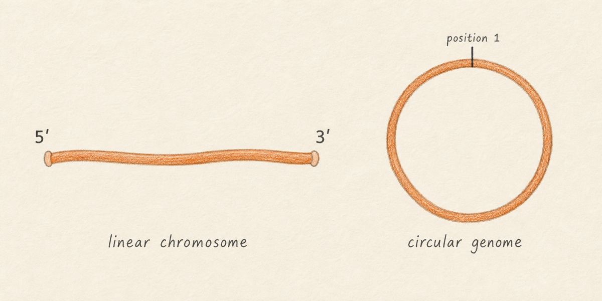
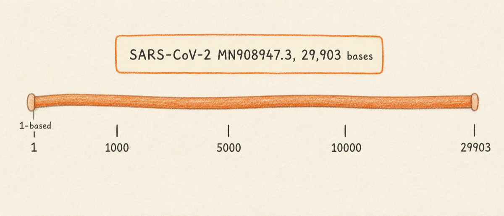
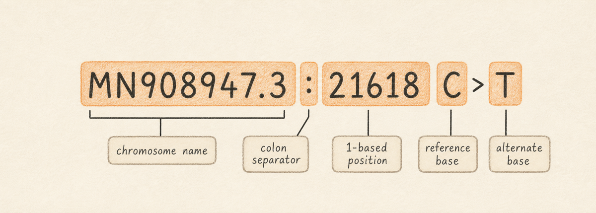

A [genome](../../GLOSSARY.md#reference-genome) is the complete genetic sequence carried by an organism, virus, or other biological entity, written as a string of letters: A, C, G, T for DNA, with U replacing T in RNA. Almost every cell of every organism, and almost every virus particle, contains the same genetic blueprint, with a few familiar exceptions (mature red blood cells have no nucleus; some cells are polyploid; defective viral particles can carry incomplete genomes). When you sequence a sample on an Illumina machine or a Nanopore flow cell, what comes back is millions of short [reads](../../GLOSSARY.md#fastq) of that string, in fragments, with errors. The job of a genomics tool is to turn those fragments back into a coherent picture of the original sequence and to describe how it differs from a known version.

A [reference genome](../../GLOSSARY.md#reference-genome) is the known version. It is a specific sequence that was determined from a well-characterised isolate, deposited in a public database under a stable accession, and adopted by the field as the comparison point for everything else. When a paper reports that a SARS-CoV-2 isolate "carries the L452R mutation," the position number and the substitution only make sense relative to that community-agreed reference. Without one, two labs sequencing the same patient sample would describe the same change with different numbers, against different starting bases.

A short detour on nomenclature, since it will come up repeatedly. A mutation name like L452R refers to an amino acid change. Genes are read in three-base groups called [codons](../../GLOSSARY.md#codon), and each codon translates to one amino acid. L452R says: at amino acid position 452 of the spike protein, leucine (L) has been replaced by arginine (R), and the underlying change is one or more nucleotide substitutions in that codon. Most of this manual works at the nucleotide level (positions and bases on the reference) rather than the amino acid level, but the two are linked through the reading frame of each gene.

This chapter introduces three ideas that every later chapter relies on. First, what a reference genome contains and how it differs from a sample's sequence. Second, how Lungfish Genome Explorer addresses positions on a genome (1-based and inclusive, meaning the first base is position 1, not 0, and named by chromosome or [contig](../../GLOSSARY.md#contig)). Third, why the choice of reference matters for the variants you will eventually call. We use `MN908947.3` as the recurring example throughout this manual: the original [SARS-CoV-2](https://www.ncbi.nlm.nih.gov/nuccore/MN908947.3) isolate from December 2019, a single positive-sense single-stranded RNA genome 29,903 nucleotides long. Every variant call you produce in the rest of this manual is described relative to this reference.

So what should you do with this? Read the rest of this chapter once, slowly, and treat the variant notation example as a checkpoint. If you can read `MN908947.3:23403 A>G` and say in your own words what each part means, you are ready for the next chapter.

## What you will learn

By the end of this chapter you will be able to read a position like `MN908947.3:23403` and know that it names a base on the SARS-CoV-2 reference, that the position is 1-based (the first base of the genome is position 1, not 0), and that the variant tables you encounter later use this same convention. You will also understand why two papers can describe what looks like the same biological variant with different position numbers if the labs used different references.

### Sample sequence versus reference sequence

A sample's sequence is the data you collected. A reference is what you compare it to. The two play different roles and have different provenance.

Your sample sequence is empirical. It came off a sequencing instrument, with per-base [quality scores](../../GLOSSARY.md#phred-score) (a confidence value attached to each base, introduced in the next chapter), with sequencing errors, and with regions where few reads landed (called low-coverage regions, discussed in [Alignment Files](04-alignment-files.md)). In Lungfish Genome Explorer (LGE) you will encounter it first as a [FASTQ](../../GLOSSARY.md#fastq) file (a text file holding many sequencing reads and their quality strings) and later as a [BAM](../../GLOSSARY.md#bam) file (a compact, indexed file holding those reads after they have been aligned to a reference). Both formats are introduced in their own chapters.

A reference sequence, by contrast, is curated. It was determined from a specific representative sample by a sequencing or curation group, given a stable accession number, and deposited in a public database such as [GenBank](https://www.ncbi.nlm.nih.gov/genbank/) or [RefSeq](https://www.ncbi.nlm.nih.gov/refseq/). The reference itself does not change while you analyse many samples against it. That stability is the whole point. Because the reference is fixed, two analysts working on different samples can talk about "position 23403" and mean the same physical location on the same conceptual molecule.

A small but useful aside on the running example. `MN908947.3` is the GenBank record for SARS-CoV-2 Wuhan-Hu-1. The same sequence is mirrored by NCBI's curated [RefSeq](https://www.ncbi.nlm.nih.gov/refseq/) database under accession `NC_045512.2`. The two accessions are interchangeable in practice for SARS-CoV-2 (identical 29,903-nucleotide sequence) but they appear in different tool defaults, so seeing both is normal. The trailing `.3` is the record's version number: when a curator updates the deposited sequence (a fix or a clarification), the version increments to `.4` and the older version stays available for reproducibility. Always pin the version when you publish a position.

LGE treats sample data and reference data very differently in the user interface. References live in a project's `Reference Sequences/` folder as [reference bundles](../../GLOSSARY.md#reference-bundle): folders that hold the reference's `.fasta` file (the sequence in plain text), its `.fai` [index](../../GLOSSARY.md#fai) (a small companion file that lets tools jump to a position quickly), and a [provenance](../../GLOSSARY.md#provenance) record describing where the sequence came from, when, and from which version. Sample data lives in `Imports/` for files you brought in from disk, or in `Downloads/` for files LGE fetched from a public archive on your behalf. The folder layout itself is a teaching tool: when you open a project and see those folders side by side, the categorical difference between sample data and reference data is visible at a glance.

### Linear, circular, and segmented genomes

Bacterial chromosomes and the genomes of many viruses are physically circular: the molecule has no ends, and base 1 is whatever position the curator chose to call base 1. Eukaryotic chromosomes are linear, with two physical ends. Some virus families, including influenza and the segmented bunyaviruses, distribute their genome across several physically separate molecules called segments, and each segment gets its own accession (influenza A has eight segments, each treated as its own contig in downstream tools).

For the analysis tools in this manual the distinction is mostly cosmetic. LGE, like every aligner and [variant caller](../../GLOSSARY.md#variant-caller) it wraps, treats every reference as linear. A circular genome is unrolled at the curator's chosen origin. A read that physically spans the origin in the lab will, in the file, look like two pieces (one near the end and one near position 1) that the alignment tool may or may not stitch back together. For SARS-CoV-2 this is irrelevant in practice, because the molecule is single-stranded RNA and is not circular at all. The "circular by convention" issue matters more for plasmids and bacterial genomes, which the current LGE toolset does not target.

DNA viruses (such as adenoviruses, herpesviruses, and HPV) and RNA viruses (such as SARS-CoV-2, influenza, and Ebola) look identical once their genomes have been deposited as a sequence file. Reference databases and analysis tools store everything in the DNA alphabet. An RNA virus reference such as `MN908947.3` is written with `T` rather than `U` so that a single tool stack can process it without special-casing the alphabet.

Sequencing instruments physically read DNA, not RNA. For an RNA virus the wet-lab protocol therefore converts the RNA into complementary DNA (cDNA) by reverse transcription during library preparation, and the sequencer reads the cDNA. The downstream files therefore contain DNA letters even though the original molecule was RNA. The biology was RNA; the bookkeeping is DNA.

## Coordinates: how LGE names a position

A [coordinate](../../GLOSSARY.md#coordinate) is the way a tool points at a specific base on a reference. Across the bioinformatics ecosystem there are two conventions for counting, and the difference is a frequent source of off-by-one bugs. LGE presents 1-based, inclusive coordinates to the user everywhere in the GUI, and it preserves whatever convention each underlying file format uses internally.

In a 1-based, inclusive scheme, the very first base of the genome is position 1, and a range from position 100 to position 110 contains 11 bases (positions 100, 101, 102, ..., 110). [VCF](../../GLOSSARY.md#vcf) files, [GFF3](../../GLOSSARY.md#gff) annotation files, and SAM/BAM read-alignment positions all use this convention. In a 0-based, half-open scheme, the first base is position 0, and a range from position 100 to position 110 contains 10 bases (positions 100 through 109). BED files and most programming-language string slices use this second convention. If you ever write a script that mixes a BED region with a VCF position, you will at some point be off by one. The LGE GUI hides this entirely: every position you see in the inspector, in the variant table, and in the genome ruler is 1-based.

The other half of a coordinate is the chromosome name, also called the [contig](../../GLOSSARY.md#contig-reference) name in the assembly literature (a contig is a contiguous stretch of assembled sequence; for a finished single-chromosome reference, "chromosome" and "contig" mean the same thing, and for a segmented virus each segment is its own contig with its own name). The chromosome name is whatever the FASTA header says it is, with everything after the first space stripped off. For our running example the FASTA header is `>MN908947.3 Severe acute respiratory syndrome coronavirus 2 isolate Wuhan-Hu-1, complete genome`, and the contig name that every downstream tool uses is `MN908947.3`. A full coordinate combines the two halves with a colon: `MN908947.3:23403` names the base at position 23,403 on the SARS-CoV-2 reference. That base happens to be an `A` and sits inside the codon for amino acid 614 of the spike gene.

For multi-contig references (a human genome, a fungal genome, a segmented influenza reference with eight contigs, an assembly bundle from your own MEGAHIT run with hundreds of contigs) the same notation extends naturally. `chr7:117559590` names a position on human chromosome 7. `contig_42:8121` names a position on the 42nd contig produced by an assembler. `PB1:120` names a position on the PB1 segment of an influenza A reference. LGE will reject a coordinate whose contig name is not present in the loaded reference, which is usually the first sign that you have loaded the wrong reference for your data.

## Reading a variant: MN908947.3:23403 A>G

The full variant notation packs a contig, a position, and an observed change into a single string. Reading it is a small skill that pays off across every variant table you will ever look at.

The string `MN908947.3:23403 A>G` decomposes into four pieces. The contig name is `MN908947.3`. The 1-based position is `23403`. The reference base, called [REF](../../GLOSSARY.md#ref-alt) in [VCF](../../GLOSSARY.md#vcf) terminology (the standard variant-call file format covered in [Variants and VCF Files](05-variants-and-vcf.md)), is `A`. The alternate base, called [ALT](../../GLOSSARY.md#ref-alt), is `G`. The `>` separator is read aloud as "to," so the whole string is "MN908947.3 colon 23403, A to G." It says: at position 23,403 on the SARS-CoV-2 Wuhan-Hu-1 reference, where the reference has an A, this sample carries a G instead. Biologically, that single substitution sits in the second position of the codon for amino acid 614 of the spike gene, converting the codon `GAT` (aspartate, D) into `GGT` (glycine, G). It is the D614G variant that became a defining marker of the early pandemic and is associated with the first global wave of SARS-CoV-2 dominance.

A few details are worth absorbing while you have a concrete example in front of you. REF is always taken from the reference, not from any sample. ALT is the alternate base actually observed in the sample's reads. For the simplest case (a single-nucleotide variant, or SNP) both REF and ALT are one base long. For an insertion the REF is one base and the ALT is several bases; for a deletion the REF is several bases and the ALT is one. A later chapter walks through how LGE renders insertions and deletions in the variant inspector, so do not worry about the exact formatting yet.

A subtle but important point about what does and does not appear in a VCF. In a single-sample VCF like the ones LGE produces, only positions that differ from the reference are written out. In a multi-sample joint-genotyped VCF, a position can appear because at least one sample has the alternate, and the file then records the reference state in the other samples too. In a genomic VCF (gVCF), the reference state is recorded across all positions for confidence-aware downstream merging. For the workflows in this manual, the single-sample convention applies, so treat "the row appears" as "this sample disagrees with the reference here."

The position number `23403` is anchored to `MN908947.3` and to nothing else. If a colleague sequenced the same sample, aligned it against a different SARS-CoV-2 reference, and called the same biological variant, the position number they report could shift if their reference differed by an insertion or deletion near the start of the genome. The change is real. The number is reference-relative. This is why every variant in an LGE project is stored alongside the accession of the reference it was called against, and why the variant table always shows the contig name in its first column.

## Why reference choice matters

The purpose of a reference is to give the field a shared coordinate system. Choose a different reference and you choose a different coordinate system. Most of the time this is invisible because everyone in a given subfield uses the same canonical reference. SARS-CoV-2 work uses `MN908947.3` (also known as Wuhan-Hu-1, after the isolate name in the FASTA header) or the equivalent RefSeq accession `NC_045512.2`. Influenza A work uses one reference per segment, with the choice of which strain to use depending on the question. Human germline work uses [GRCh38](https://www.ncbi.nlm.nih.gov/datasets/genome/GCF_000001405.40/) or its predecessor GRCh37, and a substantial part of clinical-genomics infrastructure exists specifically to translate between the two coordinate systems.

The most common symptom of a reference mismatch is a disagreement between what your variant caller reports and what a public database or a colleague's spreadsheet says. If your run was aligned against a slightly different reference, even a single-base insertion near the start of the genome will shift every downstream position by one, and a variant your collaborator calls `23403` will appear in your output as `23404`. The variant is the same. The coordinate is not.

LGE addresses this in two ways. First, every reference imported into a project carries provenance metadata: the accession, the source database, the date of download, and a checksum. You can inspect this from the project sidebar at any time, and it travels with any export. Second, every variant call carries the reference accession in its record header, so a VCF you hand to a collaborator is self-describing. They will know, without asking, which coordinate system they are reading. The chapters on importing references and on calling variants come back to both of these facts in detail.

So what should you do with this? When someone hands you a list of variant positions, ask which reference they were called against before you do anything else with the numbers.

## A preview of what comes next

The remaining foundations chapters introduce, in order, sequencing reads (the [FASTQ](../../GLOSSARY.md#fastq) format and what quality scores mean), read alignment (how reads are mapped onto a reference to produce a [BAM](../../GLOSSARY.md#bam) file), and variant calling (how LGE turns a BAM file into a [VCF](../../GLOSSARY.md#vcf)). Each of those chapters comes back to `MN908947.3` as the recurring reference, so the position numbers you see will keep being interpretable.

After foundations, the manual moves to the GUI tour. You will meet the project window, the reference inspector that shows the reference bundle's metadata you just read about, the genome ruler that displays 1-based coordinates, and the variant table that uses the exact REF/ALT notation introduced in this chapter. By the time you reach the procedure chapters, every term in the interface should already be familiar.

## Next

Continue to [Sequencing Reads](02-sequencing-reads.md) to learn what FASTQ files are and how raw sequencing output relates to the reference you just met.
