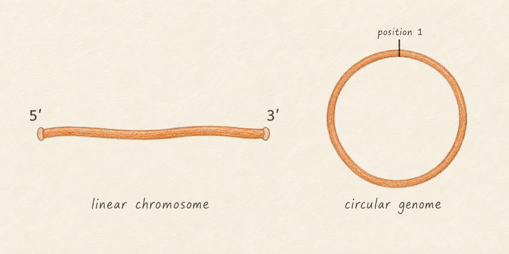
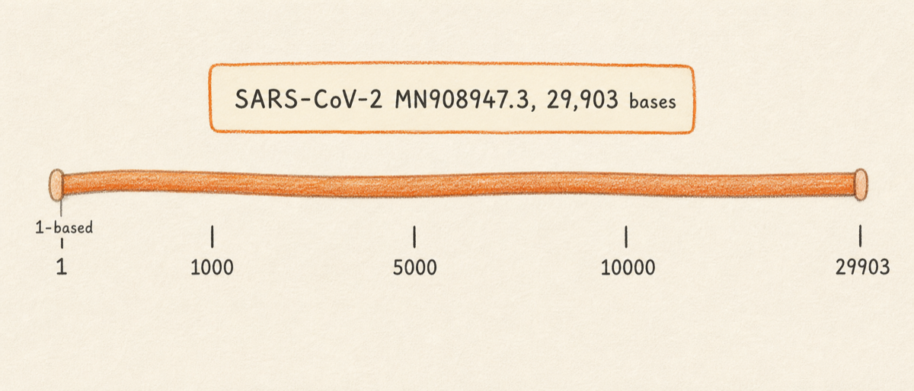
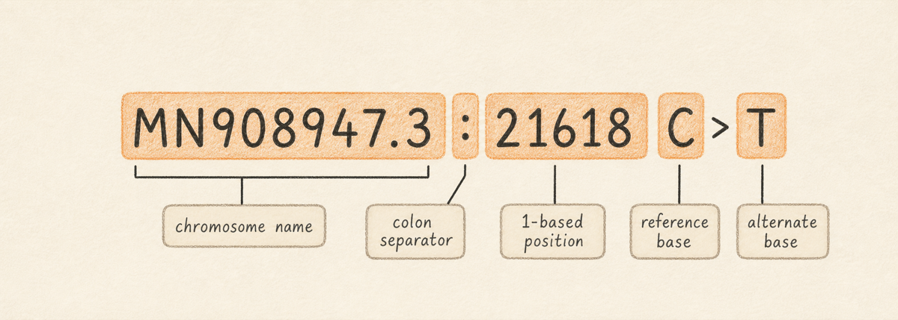

Every organism runs on an instruction set written in a four-letter alphabet. That set is its [genome](../../GLOSSARY.md#reference-genome), the complete genetic sequence of a cell, a virus, or any other biological entity, spelled in A, C, G, and T for DNA, with U standing in for T in RNA. Nearly every cell an organism owns, and nearly every virus particle, carries the same copy. The exceptions are the famous ones: mature red blood cells throw out their nucleus, some cells are polyploid, and a defective virus particle can package an incomplete genome. Sequencing does not hand you that genome whole. Run a sample on an Illumina machine or a Nanopore flow cell and what comes back is millions of short [reads](../../GLOSSARY.md#fastq), fragments of the sequence studded with errors. A genomics tool exists to put those fragments back into a coherent picture and to say how it differs from a version already known.

That already-known version is the [reference genome](../../GLOSSARY.md#reference-genome). It is one specific sequence, read from a well-characterised isolate, filed in a public database under a stable accession, and adopted by the field as the fixed point every other sequence is measured against. When a paper reports that a SARS-CoV-2 isolate "carries the L452R mutation," the position and the substitution mean nothing on their own. They are coordinates on a shared map. Take the map away and two labs sequencing the same patient sample would name the same change with different numbers, counting from different starting bases.

One piece of nomenclature is worth a short detour, because it recurs throughout the manual. A label like L452R names an amino acid change. Genes are read in three-base words called [codons](../../GLOSSARY.md#codon), and each codon spells a single amino acid. So L452R says that at amino acid 452 of the spike protein, a leucine (L) has given way to an arginine (R), driven by one or more nucleotide substitutions inside that codon. Most of this manual works one level down, at the nucleotides themselves, tracking positions and bases on the reference rather than amino acids. The two views stay tied together by each gene's reading frame.

Three ideas in this chapter carry through every chapter that follows. The first is what a reference genome holds, and how it differs from the sequence of any one sample. The second is the way Lungfish Genome Explorer points at a position: 1-based and inclusive, so the first base is position 1 rather than 0, and always tied to a chromosome or [contig](../../GLOSSARY.md#contig) name. The third is why the choice of reference shapes the variants you will eventually call. One example runs through all of it, and through the rest of the manual: `MN908947.3`, the original [SARS-CoV-2](https://www.ncbi.nlm.nih.gov/nuccore/MN908947.3) isolate from December 2019, a single positive-sense, single-stranded RNA genome 29,903 nucleotides long. Every variant you call from here on is described relative to it.

So what should you do with this? Read the chapter once, unhurried, and treat the variant-notation example as a checkpoint. If you can look at `MN908947.3:23403 A>G` and say in your own words what each part means, you are ready for the next chapter.

## What you will learn

Work through this chapter and a string like `MN908947.3:23403` should read at a glance: it names a base on the SARS-CoV-2 reference, counted 1-based, so the genome's first base is position 1 and not 0. The variant tables you meet later lean on the same convention. You will also see why two papers can pin what looks like the same biological variant to different position numbers, for no deeper reason than that the labs measured against different references.

### Sample sequence versus reference sequence

A sample's sequence is the data you gathered. A reference is what you hold it up against. The two play opposite roles, and they come from opposite places.

Your sample sequence is empirical. It came off an instrument carrying per-base [quality scores](../../GLOSSARY.md#phred-score) (a confidence value on every base, covered in the next chapter), a share of sequencing errors, and stretches where almost no reads landed, the low-coverage regions discussed in [Alignment Files](04-alignment-files.md). In Lungfish Genome Explorer (LGE) you meet it first as a [FASTQ](../../GLOSSARY.md#fastq) file, a text file packed with sequencing reads and their quality strings, and later as a [BAM](../../GLOSSARY.md#bam) file, the compact indexed form those reads take once aligned to a reference. Each format gets its own chapter.

A reference sequence is the opposite: curated, not collected. Some sequencing or curation group determined it from one representative sample, stamped it with a stable accession, and deposited it in a public database such as [GenBank](https://www.ncbi.nlm.nih.gov/genbank/) or [RefSeq](https://www.ncbi.nlm.nih.gov/refseq/). It does not budge while you analyse sample after sample against it, and that stillness is the entire point. Because the reference holds fixed, two analysts working on different samples can both say "position 23403" and mean one physical spot on one conceptual molecule.

The running example is worth pinning down. `MN908947.3` is the GenBank record for SARS-CoV-2 Wuhan-Hu-1. NCBI's curated [RefSeq](https://www.ncbi.nlm.nih.gov/refseq/) database mirrors the identical 29,903-nucleotide sequence under the accession `NC_045512.2`. For SARS-CoV-2 the two are interchangeable in practice, but they surface in different tool defaults, so expect to see both. The trailing `.3` is a version number. When a curator revises the deposited sequence, whether a fix or a clarification, the version ticks to `.4` and the earlier one stays available for reproducibility. When you publish a position, pin the version.

LGE keeps sample data and reference data visibly apart in its interface. References sit in a project's `Reference Sequences/` folder as [reference bundles](../../GLOSSARY.md#reference-bundle): folders that hold the reference's `.fasta` sequence in plain text, its `.fai` [index](../../GLOSSARY.md#fai) (a small companion file that lets tools jump straight to a position), and a [provenance](../../GLOSSARY.md#provenance) record of where the sequence came from, when, and from which version. Sample data lives elsewhere, in `Imports/` for files you brought from disk or `Downloads/` for files LGE fetched from a public archive on your behalf. The layout teaches as it organises. Open a project, see those folders side by side, and the line between sample data and reference data is obvious at a glance.

### Linear, circular, and segmented genomes

Genomes come in different physical shapes. Bacterial chromosomes and many viral genomes are circular, a closed loop with no ends, where base 1 is wherever the curator decided to start counting. Eukaryotic chromosomes are linear, with two real ends. And some virus families, influenza and the segmented bunyaviruses among them, split their genome across several separate molecules called segments, each with its own accession. Influenza A carries eight, and downstream tools treat each as its own contig.

For the tools in this manual, the shape barely matters. LGE, like every aligner and [variant caller](../../GLOSSARY.md#variant-caller) it wraps, treats every reference as linear. A circular genome is simply unrolled at the curator's chosen origin. A read that physically crossed that origin in the lab shows up in the file as two pieces, one near the end and one near position 1, which the aligner may or may not stitch back together. None of this touches SARS-CoV-2, whose genome is single-stranded RNA and not circular at all. The "circular by convention" problem belongs to plasmids and bacterial genomes, which the current LGE toolset does not target.

On disk, a DNA virus and an RNA virus are indistinguishable. Adenoviruses, herpesviruses, and HPV on one side, SARS-CoV-2, influenza, and Ebola on the other, all end up as the same kind of sequence file, because reference databases and analysis tools store everything in the DNA alphabet. An RNA reference like `MN908947.3` is spelled with `T` in place of `U`, so a single tool stack can read it without special cases.

The reason is mechanical. Sequencers read DNA, not RNA. For an RNA virus, the wet-lab protocol first copies the RNA into complementary DNA (cDNA) by reverse transcription during library preparation, and the instrument reads the cDNA. The files that follow are written in DNA letters even though the original molecule was RNA. The biology was RNA; the bookkeeping is DNA.

## Coordinates: how LGE names a position

A [coordinate](../../GLOSSARY.md#coordinate) is how a tool points at one specific base. The catch is that bioinformatics counts two different ways, and the gap between them is a classic source of off-by-one bugs. LGE shows you 1-based, inclusive coordinates everywhere in the interface, and quietly preserves whatever convention each underlying file format uses internally.

Count 1-based and inclusive, and the genome's first base is position 1, while a range from 100 to 110 holds eleven bases: 100, 101, and on through 110. [VCF](../../GLOSSARY.md#vcf) files, [GFF3](../../GLOSSARY.md#gff) annotation files, and SAM/BAM alignment positions all count this way. Count 0-based and half-open, the other convention, and the first base is position 0, while a range from 100 to 110 holds only ten: 100 through 109. BED files and most programming-language string slices use that scheme. Mix a BED region with a VCF position in a script and sooner or later you will be off by one. The LGE interface spares you the whole trap. Every position it shows, in the inspector, the variant table, and the genome ruler, is 1-based.

The other half of a coordinate is the chromosome name, which the assembly literature also calls the [contig](../../GLOSSARY.md#contig-reference) name. A contig is a continuous run of assembled sequence. For a finished single-chromosome reference, "chromosome" and "contig" mean the same thing; for a segmented virus, each segment is a contig with its own name. That name is whatever the FASTA header declares, up to the first space. Our example's header reads `>MN908947.3 Severe acute respiratory syndrome coronavirus 2 isolate Wuhan-Hu-1, complete genome`, and every downstream tool takes the contig name as `MN908947.3`. Join the two halves with a colon and you have a full coordinate: `MN908947.3:23403` points at base 23,403 on the SARS-CoV-2 reference. That base is an `A`, and it sits inside the codon for amino acid 614 of the spike gene.

The notation scales without any new rules. `chr7:117559590` names a position on human chromosome 7. `contig_42:8121` names a position on the 42nd contig from an assembler. `PB1:120` names a position on the PB1 segment of an influenza A reference. Hand LGE a coordinate whose contig is not in the loaded reference and it refuses, which is usually the first sign that you have loaded the wrong reference for your data.

## Reading a variant: MN908947.3:23403 A>G

Full variant notation folds a contig, a position, and an observed change into one string. Learning to read it is a small skill that pays off at every variant table you will ever open.

`MN908947.3:23403 A>G` breaks into four pieces. `MN908947.3` is the contig. `23403` is the 1-based position. `A` is the reference base, called [REF](../../GLOSSARY.md#ref-alt) in the language of [VCF](../../GLOSSARY.md#vcf), the standard variant-call format covered in [Variants and VCF Files](05-variants-and-vcf.md). `G` is the alternate base, [ALT](../../GLOSSARY.md#ref-alt). Read the `>` aloud as "to," and the whole string becomes "MN908947.3 colon 23403, A to G." It says that at position 23,403 on the SARS-CoV-2 Wuhan-Hu-1 reference, where the reference reads A, this sample reads G. In the biology, that one substitution lands in the second position of the codon for amino acid 614 of the spike gene, turning `GAT` (aspartate, D) into `GGT` (glycine, G). It is D614G, the variant that became a signature of the early pandemic and rode the first global wave of SARS-CoV-2 to dominance.

A few habits are worth forming while the example is in front of you. REF always comes from the reference, never from a sample. ALT is the base actually seen in the sample's reads. In the simplest case, a single-nucleotide variant or SNP, REF and ALT are each one base long. An insertion makes REF one base and ALT several; a deletion does the reverse. A later chapter shows how LGE lays out insertions and deletions in the variant inspector, so leave the exact formatting for now.

One subtlety governs what actually shows up in a VCF. A single-sample VCF, the kind LGE produces, writes out only the positions where the sample departs from the reference. A multi-sample joint-genotyped VCF lists a position whenever at least one sample carries the alternate, and records the reference state in the rest. A genomic VCF (gVCF) goes further, logging the reference state at every position for confidence-aware merging later. The workflows in this manual use the single-sample convention, so read "the row appears" as "this sample disagrees with the reference here."

And the number itself is anchored to `MN908947.3` and to nothing else. Suppose a colleague sequenced the same sample, aligned it to a different SARS-CoV-2 reference, and called the same biological variant. If their reference carried an insertion or deletion near the start of the genome, the position they report could shift. The change is real; the number is reference-relative. That is why every variant in an LGE project is stored next to the accession of the reference it was called against, and why the variant table always shows the contig name in its first column.

## Why reference choice matters

A reference exists to give a field one shared coordinate system. Pick a different reference and you have picked a different coordinate system. Most of the time the switch is invisible, because everyone in a given subfield leans on the same canonical choice. SARS-CoV-2 work uses `MN908947.3` (also called Wuhan-Hu-1, after the isolate named in the FASTA header) or its RefSeq twin `NC_045512.2`. Influenza A work uses one reference per segment, the strain chosen to fit the question. Human germline work uses [GRCh38](https://www.ncbi.nlm.nih.gov/datasets/genome/GCF_000001405.40/) or its predecessor GRCh37, and a sizeable slice of clinical-genomics infrastructure exists for the sole purpose of translating between those two coordinate systems.

A reference mismatch usually announces itself the same way: your variant caller and a public database, or a colleague's spreadsheet, disagree. Align against a reference that differs by even a single-base insertion near the start of the genome, and every downstream position slides by one. The variant your collaborator calls `23403` lands in your output as `23404`. Same variant, different coordinate.

LGE guards against this on two fronts. Every reference imported into a project carries provenance: the accession, the source database, the download date, and a checksum, all visible from the project sidebar and all traveling with any export. And every variant call keeps the reference accession in its record header, so a VCF you hand to a collaborator describes itself. They will know which coordinate system they are reading without having to ask. The chapters on importing references and on calling variants return to both facts in detail.

The habit that saves the most grief is a simple one. When someone hands you a list of variant positions, ask which reference they were called against before you do anything else with the numbers.

## A preview of what comes next

The remaining foundations chapters pick up, in order, sequencing reads (the [FASTQ](../../GLOSSARY.md#fastq) format, and what quality scores actually mean), read alignment (how reads are mapped onto a reference to build a [BAM](../../GLOSSARY.md#bam) file), and variant calling (how LGE turns a BAM file into a [VCF](../../GLOSSARY.md#vcf)). Each returns to `MN908947.3` as its reference, so the position numbers stay interpretable from one chapter to the next.

After foundations, the manual turns to the interface itself. You will meet the project window, the reference inspector that displays the bundle metadata you just read about, the genome ruler with its 1-based coordinates, and the variant table built on the exact REF/ALT notation introduced in this chapter. By the time you reach the procedure chapters, the vocabulary on screen should already be yours.

## Next

Continue to [Sequencing Reads](02-sequencing-reads.md) to learn what FASTQ files are and how raw sequencing output relates to the reference you just met.
