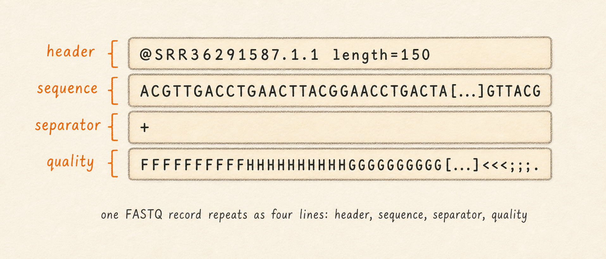
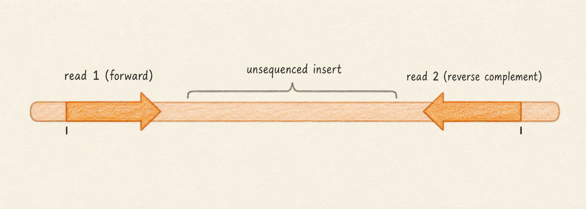
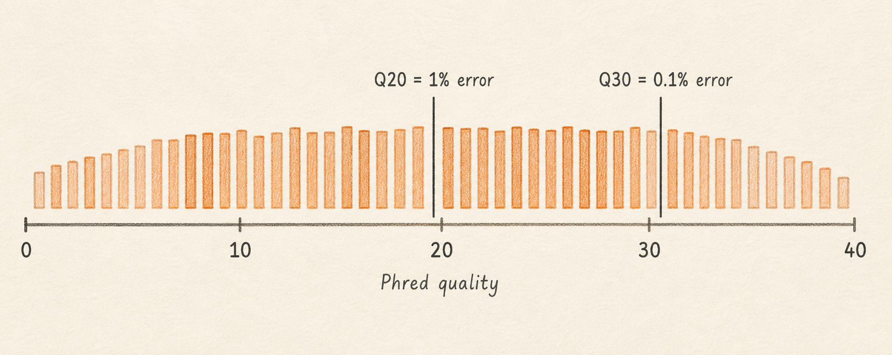
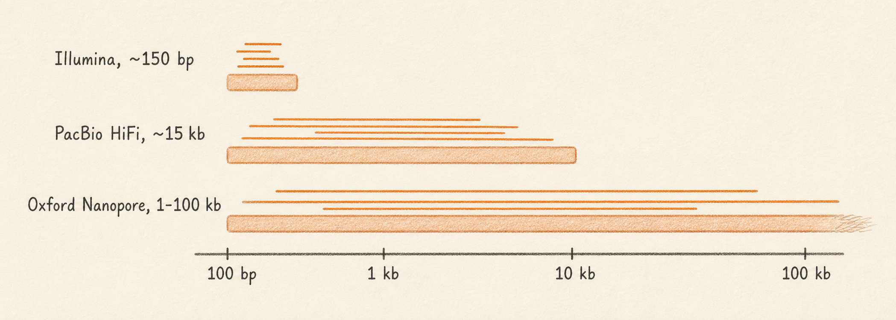

## What it is

A sequencing read is one fragment of DNA or RNA that came off the sequencer, recorded as a sequence of letters and a parallel sequence of quality scores. A FASTQ file (the standard text format for raw sequencing output) holds many of these reads, typically thousands to millions, in a four-line-per-read text format. FASTQ is the input format for every workflow in this manual that starts from raw sequencing data.

This chapter introduces three ideas. First, the four-line FASTQ record and what each line means. Second, why most sequencing runs produce paired files (`SRR36291587_1.fastq.gz` and `SRR36291587_2.fastq.gz`) and what "paired-end" means in practice. Third, how to read a Phred quality score, the per-base confidence value that downstream tools use to decide whether to trust each base call.

A typical SARS-CoV-2 amplicon Illumina run produces roughly 100,000 to 1 million read pairs, each about 150 bases long, with Phred scores mostly above 30 (meaning 0.1% error or better). The example fixture used in [Calling Variants from Amplicon Reads](../05-variants/01-calling-variants-from-amplicons.md) has 86,281 read pairs.

So what should you do with this? Recognize FASTQ when you see it, keep paired files together, and trust per-base quality numbers above Q30 for variant calling.

## What you will learn

By the end of this chapter you will be able to recognize a FASTQ file by its four-line record structure, understand why paired files travel together and need to be paired by suffix convention (`_1`/`_2` or `_R1`/`_R2`), read a Phred quality score (Q20 = 1% error rate, Q30 = 0.1% error rate), and explain why Illumina and Oxford Nanopore reads are not interchangeable inputs to the same tools.

## The four-line FASTQ record

A FASTQ file is plain text, with every read taking exactly four consecutive lines. Here is one record from the SARS-CoV-2 fixture, reformatted for inspection:

```
@SRR36291587.1 1/1
GATCTGTTCTCTAAACGAACAAACTAAAATGTCTGATAATGGACCCCAAAATCAGCGAAATGCACCCCGCATTACGTTTGGTGGACCCTCAGATTCAACT
+
FFFFFFFFFFFFFFFFFFFFFFFFFFFFFFFFFFFFFFFFFFFFFFFFFFFFFFFFFFFFFFFFFFFFFFFF:FFFFFFFFFFFFFFFFFFFFFFF,FFF
```



Line 1 is the **header**. It always starts with `@` and carries an identifier the sequencer assigned to this read. The text after the first space is free-form metadata; in this fixture it carries the read pair number (`1/1`). The header is unique within the file.

Line 2 is the **sequence**. It is the read itself, written in A, C, G, T, and (occasionally) N for "the sequencer could not decide." There are no spaces, no line breaks within the sequence, and no separators between bases. The length of this line is the read length.

Line 3 is the **separator**. It is always a single `+` character, sometimes followed by a repeat of the header. Most modern files leave it as a bare `+`. The separator exists to mark the boundary between sequence and quality, since the quality string can contain any printable character including letters that look like bases.

Line 4 is the **quality string**. It has exactly the same length as the sequence on line 2, and each character encodes the Phred score for the base at the same position. The string above starts with many `F` characters; in the standard ASCII offset 33 encoding, `F` decodes to Phred 37, meaning a 1-in-5,000 error rate at that base.

That four-line pattern repeats for every read in the file. A FASTQ with 86,281 reads has 345,124 lines.

## Compressed FASTQ files

In practice almost every FASTQ you encounter is compressed with gzip and named `.fastq.gz`. A 100 MB FASTQ shrinks to roughly 25 MB compressed, and downstream tools read the compressed form directly without an explicit decompression step. Lungfish handles `.fastq` and `.fastq.gz` transparently. You do not need to gunzip a file before importing it, and the import dialog labels both the same way.

If you do uncompress a file for inspection, the four-line structure described above is exactly what you will see.

## Paired-end reads

Most short-read Illumina protocols sequence each DNA fragment from both ends. The result is two reads per fragment: one starting at the 5' end of the fragment moving inward, and one starting at the 3' end moving inward. These are called **paired-end reads**, and they live in two parallel files.



The two files share a base name and differ only in a suffix. The fixture for this manual uses the SRA convention `_1` and `_2`:

```
SRR36291587_1.fastq.gz   (forward reads, also called R1)
SRR36291587_2.fastq.gz   (reverse reads, also called R2)
```

Illumina's own naming convention writes the suffix as `_R1` and `_R2`. Both conventions mean the same thing, and Lungfish accepts either. The two files have the same number of records, in the same order: the Nth record in `_1.fastq.gz` and the Nth record in `_2.fastq.gz` describe the same physical DNA fragment from opposite ends.

This pairing matters for two reasons. Aligners use the pairing to place reads correctly even when one mate is ambiguous on its own, because the mate's position constrains where this read can sit. And variant callers count a read pair as a single observation of a fragment, not two independent observations, so they need both mates to compute coverage honestly.

If you split the pair, drop one file, or shuffle the order of one file, every downstream step degrades silently. Keep the pair together, and let Lungfish carry both files through the pipeline. The opposite of paired-end is **single-end**, where each fragment is sequenced from one end only, producing one file.

## Phred quality scores

A Phred score is a per-base confidence value that estimates the probability the base is wrong. It is a logarithmic scale, defined as `Q = -10 * log10(P)`, where P is the error probability. The scale is easier to read as a small table than as the formula:

| Phred score | Error probability | Meaning |
|---|---|---|
| Q10 | 1 in 10 | Low confidence, often trimmed |
| Q20 | 1 in 100 | Acceptable for many tasks |
| Q30 | 1 in 1,000 | Standard threshold for "good" |
| Q40 | 1 in 10,000 | Excellent, common on modern Illumina |



In a FASTQ file the score is encoded as a single ASCII character per base, with an offset of 33. To decode a quality character: take its ASCII code and subtract 33. The character `!` (ASCII 33) is Q0; `5` (ASCII 53) is Q20; `?` (ASCII 63) is Q30; `I` (ASCII 73) is Q40. The character `F` from the example record above has ASCII code 70, which decodes to Q37 (about a 1-in-5,000 error rate).

You usually do not decode quality strings by hand. Lungfish and the underlying tools (FastQC, fastp, BWA, minimap2) do this for you and report aggregate statistics. What you should know is the rough thresholds. A run where most bases sit above Q30 is good. A run where quality drops below Q20 in the last 20 to 30 bases of every read is normal for Illumina, and read trimming will fix it. A run where the average is below Q20 across most of the read length is a failed run; do not call variants on it.

In the example record the entire quality line is `F` characters except for two positions that drop to `:` (Q25) and `,` (Q11). That is a typical Illumina pattern: most bases are excellent, with occasional dips at low-complexity or low-signal positions.

## Read length and platform differences

Different sequencing platforms produce reads of very different lengths and at very different costs per base. The choice of platform constrains which tools can analyze the data, because aligners and variant callers tuned for short reads make assumptions that long reads violate, and vice versa.

| Platform | Typical read length | Typical reads per run | Typical accuracy |
|---|---|---|---|
| Illumina (NextSeq, NovaSeq, MiSeq) | 75 to 300 bp | 10M to 10B | Q30 to Q40 |
| Oxford Nanopore (MinION, PromethION) | 1,000 to 100,000 bp | 1M to 100M | Q10 to Q25 raw, higher after polishing |
| PacBio HiFi | 10,000 to 25,000 bp | 1M to 10M | Q30+ (consensus reads) |
| Ion Torrent | 200 to 400 bp | 1M to 100M | Q20 to Q30 |



Read length is reported in base pairs (bp) for short reads and kilobases (kb) for long reads, where 1 kb is 1,000 bp. A 150 bp Illumina read covers about 0.5% of the SARS-CoV-2 genome (29,903 bp). A 15 kb PacBio HiFi read covers about half the genome in a single observation.

Lungfish ships variant callers tuned for two of these platforms. LoFreq and iVar handle Illumina short reads from shotgun and amplicon protocols. Medaka handles Oxford Nanopore long reads, where the higher per-base error rate requires a model that knows the characteristic error patterns of nanopore sequencing. Feeding nanopore reads to LoFreq, or short reads to Medaka, produces nominally valid VCF output but with calibration that is wrong for the data. The platform choice is therefore not a detail; it determines the rest of the pipeline.

You will usually know your platform from the sequencing service or kit. If you do not, the read-length distribution is a strong hint: uniform 150 bp reads are Illumina, and a wide distribution from 200 bp to 50,000 bp is nanopore.

## What good quality looks like in practice

For a SARS-CoV-2 Illumina amplicon run like the fixture used later in this manual, "good" means roughly the following. Read count is at least 100,000 read pairs per sample, often into the millions. Read length is uniform, typically 150 bp. Per-base quality stays above Q30 across the first 130 bases, then dips toward Q20 in the last 20 bases (this is normal and trimming removes it). Adapter contamination is below 1% after trimming. Coverage of the reference, after alignment, is above 100x across at least 95% of the genome.

For a nanopore run the same numbers do not apply. You would expect lower per-base quality (Q10 to Q20 raw), longer reads (1 to 10 kb for amplicons, longer for whole-genome), and a smaller total number of reads (10,000 to 1,000,000 per sample). Coverage targets are similar because longer reads provide more bases per read.

If your numbers look very different from the platform's expected range, talk to your sequencing provider before continuing. Variant calling cannot rescue a failed run.

## Next

Continue to [Amplicons and Shotgun Sequencing](03-amplicon-vs-shotgun.md) to learn the two main ways sample DNA gets prepared for sequencing and why the choice matters for variant calling.
