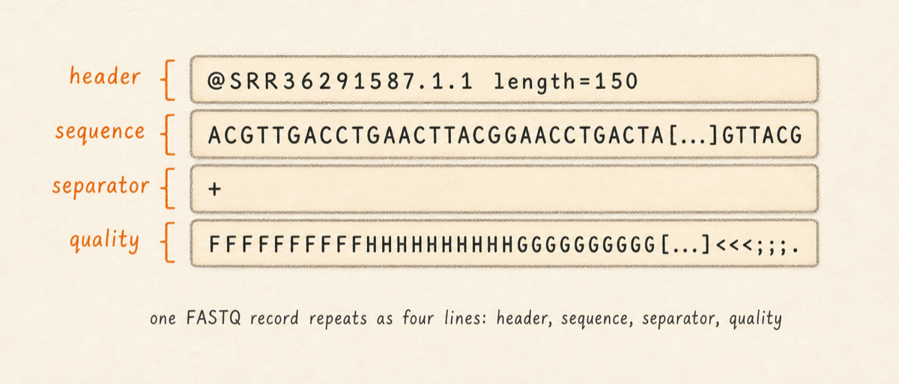
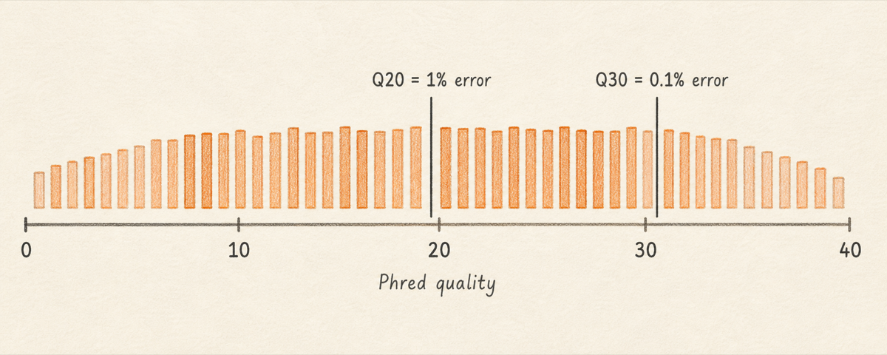
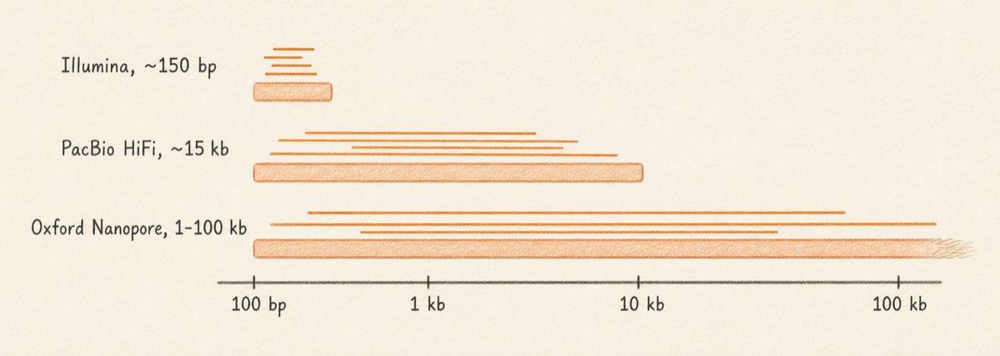

A sequencing [read](../../GLOSSARY.md#fastq) is one fragment of DNA or RNA that came off the sequencer, stored as a string of letters beside a parallel string of quality scores. A [FASTQ](../../GLOSSARY.md#fastq) file (the standard text format for raw sequencing output) packs many of these reads together, typically thousands to millions, four lines to a read. FASTQ is where every workflow in this manual that begins with raw sequencing data begins.

Three ideas run through this chapter. The first is the four-line FASTQ record, and what each line holds. The second is why most sequencing runs arrive as [paired-end](../../GLOSSARY.md#paired-end) files (`SRR36291587_1.fastq.gz` and `SRR36291587_2.fastq.gz`), and what "paired-end" means once the data is in front of you. The third is how to read a [Phred quality score](../../GLOSSARY.md#phred-score), the per-base confidence value that downstream tools consult before they trust a base call.

A typical SARS-CoV-2 amplicon Illumina run yields somewhere between 100,000 and 1 million read pairs, each about 150 bases long, with per-base quality mostly above Q30 through the bulk of the read. The example fixture used in [Calling Variants from Amplicon Reads](../05-variants/01-calling-variants-from-amplicons.md) holds 86,281 read pairs.

So what should you do with this? It comes down to three habits: recognise FASTQ on sight, keep paired files together, and treat per-base quality as one signal among several, weighed alongside depth, mapping quality, and strand balance when you judge a variant.

## What you will learn

Work through this chapter and you will spot a FASTQ file by its four-line record, explain why paired files travel together and must be matched by suffix convention (`_1`/`_2` or `_R1`/`_R2`), read a Phred quality score (Q20 = 1% error rate, Q30 = 0.1% error rate), and say why Illumina and Oxford Nanopore reads cannot be fed to the same tools interchangeably.

## The four-line FASTQ record

A FASTQ file is plain text, and every read takes exactly four consecutive lines. Here is one record from the SARS-CoV-2 fixture, reformatted for inspection:

```
@SRR36291587.1 1/1
GATCTGTTCTCTAAACGAACAAACTAAAATGTCTGATAATGGACCCCAAAATCAGCGAAATGCACCCCGCATTACGTTTGGTGGACCCTCAGATTCAACT
+
FFFFFFFFFFFFFFFFFFFFFFFFFFFFFFFFFFFFFFFFFFFFFFFFFFFFFFFFFFFFFFFFFFFFFFFF:FFFFFFFFFFFFFFFFFFFFFFF,FFF
```



Line 1 is the **header**. It always opens with `@` and carries the identifier the sequencer assigned to this read. Everything after the first space is free-form metadata; in this fixture it records the read pair number (`1/1`). No two headers in the file are the same.

Line 2 is the **sequence**: the read itself, spelled in A, C, G, T, and now and then N, the letter for "the sequencer could not decide." No spaces, no line breaks, no separators between bases. The length of this line is the read length.

Line 3 is the **separator**, always a single `+`, sometimes trailed by a repeat of the header. Most modern files leave it bare. It marks the boundary between sequence and quality, which matters because the quality string can contain any printable character, including letters that look exactly like bases.

Line 4 is the **quality string**, exactly as long as the sequence on line 2, with one character encoding the Phred score for the base above it. The string here opens with a run of `F` characters. In the standard ASCII offset 33 encoding, `F` decodes to Phred 37: a 1-in-5,000 chance that base is wrong.

That four-line pattern repeats for every read in the file. A FASTQ with 86,281 reads runs to 345,124 lines.

## Compressed FASTQ files

Almost every FASTQ you meet in the wild is compressed with [gzip](https://www.gnu.org/software/gzip/) (a general-purpose lossless compression format) and named `.fastq.gz`, or sometimes `.fq.gz`. A 100 MB FASTQ shrinks to roughly 25 MB, and downstream tools read the compressed form directly, with no decompression step in between. LGE handles `.fastq` and `.fastq.gz` alike. You never need to unzip a file before importing it, and the import dialog labels both the same way. Behind the scenes, LGE stores reads compressed to keep project folders small.

Unzip a file to look inside, and the four-line structure above is exactly what greets you.

## Paired-end reads

Most short-read Illumina protocols read each DNA fragment from both ends at once. That gives two reads per fragment: one starting at the fragment's 5' end and running inward, the other starting at the 3' end and running inward to meet it. These are [paired-end reads](../../GLOSSARY.md#paired-end), and they live in two parallel files.


The two files share a base name and part company only at a suffix. The fixture for this manual uses the SRA convention, `_1` and `_2`:

```
SRR36291587_1.fastq.gz   (forward reads, also called R1)
SRR36291587_2.fastq.gz   (reverse reads, also called R2)
```

Illumina's own convention writes the suffix as `_R1` and `_R2`. The two mean the same thing, and LGE accepts either. Both files hold the same number of records in the same order: the Nth record in `_1.fastq.gz` and the Nth record in `_2.fastq.gz` describe one physical DNA fragment, read from opposite ends.

The pairing earns its keep in two ways. Aligners lean on it to place a read that would be ambiguous on its own, because the mate's position pins down where this read can sit. And variant callers count a read pair as one observation of a fragment, not two, so they need both mates to compute coverage honestly.

Split the pair, drop one file, or shuffle the order of one, and every downstream step quietly degrades. Keep the pair together and let LGE carry both files through the pipeline. The opposite arrangement is [single-end](../../GLOSSARY.md#single-end) sequencing, where each fragment is read from one end only and the run produces a single file.

When a fragment is shorter than twice the read length (say 150 bp paired-end reads on a 250 bp insert), the two mates overlap in the middle and read the same bases from opposite strands. That happens often in viral and amplicon libraries, and merging tools such as `fastp --merge` or `bbmerge` turn the overlap to advantage. LGE keeps the mates as separate records by default and leaves the overlap to the downstream aligner.

### Interleaved FASTQ

A paired-end run can also live in a single file where R1 and R2 records alternate: record N from R1, record N+1 its matching R2, then back to R1, and on down. This is [interleaved FASTQ](../../GLOSSARY.md#paired-end), and most modern read processors read it (`fastp`, `bwa-mem` with `-p`, `minimap2`). LGE bundles store paired-end reads interleaved internally, keeping both halves of a fragment together, but the import and export surfaces speak the two-file convention so external tools see the format they expect.

## Phred quality scores

A [Phred score](../../GLOSSARY.md#phred-score) is a per-base confidence value: an estimate of the probability that the base is wrong. The scale is logarithmic, defined as `Q = -10 * log10(P)`, where P is the error probability. It reads more easily as a small table than as the formula:

| Phred score | Error probability | Meaning |
|---|---|---|
| Q10 | 1 in 10 | Low confidence; often trimmed |
| Q20 | 1 in 100 | Acceptable for many tasks |
| Q30 | 1 in 1,000 | Standard Illumina pass/fail heuristic |
| Q40 | 1 in 10,000 | Common on modern Illumina; sometimes seen on PacBio HiFi consensus |



In a FASTQ file each score is packed into a single ASCII character, offset by 33, a convention called Phred+33. To decode a quality character, take its ASCII code and subtract 33. The character `!` (ASCII 33) is Q0; `5` (ASCII 53) is Q20; `?` (ASCII 63) is Q30; `I` (ASCII 73) is Q40. The `F` in the record above has ASCII code 70, which decodes to Q37, about a 1-in-5,000 error rate. Full Phred+33 lookup tables are all over the web, but these four anchor characters are usually enough to read a quality string at a glance.

You rarely decode quality strings by hand. LGE and the tools underneath it ([FastQC](https://www.bioinformatics.babraham.ac.uk/projects/fastqc/), [fastp](https://github.com/OpenGene/fastp), [BWA](https://github.com/lh3/bwa), [minimap2](https://github.com/lh3/minimap2)) do the decoding and report the aggregate statistics. What you need to carry in your head is the rough thresholds, and the fact that they shift with the platform.

For Illumina short reads, Q30 is the working definition of a "good" base, Q20 is the usual "trim" threshold, and the last 20 to 30 bases of a read routinely sag into the Q20 range. That is normal, and trimming clears it. A run that averages below Q20 across most of the read length has failed. Do not call variants on it.

Other platforms move the goalposts. Oxford Nanopore raw reads from current Dorado basecallers typically post median per-base Q-scores of Q12 to Q20; for nanopore, "good" is measured by median read quality, and by duplex Q30+ when the duplex protocol is running. PacBio HiFi reports consensus Q-scores averaged across many subreads of one molecule, and there Q30+ is the assumption, not the exception. Treat Q30 as the Illumina convention and reach for platform-specific guidance everywhere else.

In the Illumina record above, the whole quality line is `F` characters but for two positions that dip to `:` (Q25) and `,` (Q11). That is the typical Illumina shape: most bases excellent, with the occasional stumble at a low-complexity or low-signal position.

## Read length and platform differences

Sequencing platforms turn out reads of wildly different lengths, at wildly different costs per base. The platform you use fences in which tools can analyse the data, because aligners and variant callers tuned for short reads make assumptions that long reads break, and the reverse holds too.

| Platform | Typical read length | Typical reads per run | Typical accuracy |
|---|---|---|---|
| Illumina (NextSeq, NovaSeq, MiSeq) | 75 to 300 bp | 10M to 10B | Q30 to Q40 |
| Oxford Nanopore (MinION, PromethION) | 200 bp to 100 kb+ | 1M to 100M | Q12 to Q20 simplex; Q30+ duplex |
| PacBio HiFi | 10 to 25 kb | 1M to 10M | Q30+ (consensus reads) |
| Ion Torrent | 200 to 400 bp | 1M to 100M | Q20 to Q30 |



Read length is quoted in base pairs (bp) for short reads and kilobases (kb) for long reads, where 1 kb is 1,000 bp. A 150 bp Illumina read spans about 0.5% of the SARS-CoV-2 genome (29,903 bp). A 15 kb PacBio HiFi read takes in roughly half the genome in a single stretch.

LGE ships variant callers for both ends of the spectrum. [LoFreq](../../GLOSSARY.md#variant-caller) and [iVar](../../GLOSSARY.md#variant-caller) handle Illumina short reads from shotgun and amplicon protocols. [Medaka](../../GLOSSARY.md#variant-caller) and [Clair3](../../GLOSSARY.md#variant-caller) handle Oxford Nanopore long reads, where the higher per-base error rate demands a model that already knows nanopore's characteristic mistakes. Feed nanopore reads to LoFreq, or short reads to Medaka, and you get VCF output that looks valid but is calibrated for the wrong data. Match the caller to the platform.

Most of the time the sequencing service or kit tells you the platform. When it does not, the read-length distribution gives it away: uniform 150 bp reads are Illumina, while a broad spread that reaches past a few thousand bases is nanopore or PacBio.

## What good quality looks like in practice

For a SARS-CoV-2 Illumina amplicon run like the fixture used later in this manual, "good" looks roughly like this. Read count sits at 100,000 read pairs per sample at the low end, often climbing into the millions. Read length is uniform, typically 150 bp. Per-base quality holds above Q30 across the first 130 bases, then eases toward Q20 in the last 20 (normal, and trimming removes it). Adapter contamination falls below 1% after trimming. Coverage of the reference, once the reads are aligned, clears 100x across at least 95% of the genome.

A nanopore run plays by different numbers. Expect lower per-base quality (typically Q12 to Q20 for simplex reads), longer reads (1 to 10 kb for amplicons, longer for whole-genome), and fewer reads overall (10,000 to 1,000,000 per sample). Coverage targets land in the same range, because each longer read carries more bases.

If your numbers stray far from the platform's expected range, call your sequencing provider before you go further. Variant calling cannot rescue a failed run.

## Next

Continue to [Amplicons and Shotgun Sequencing](03-amplicon-vs-shotgun.md) to learn the two main ways sample DNA gets prepared for sequencing and why the choice matters for variant calling.
