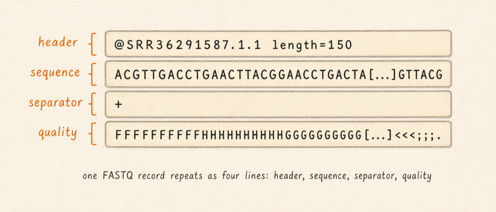
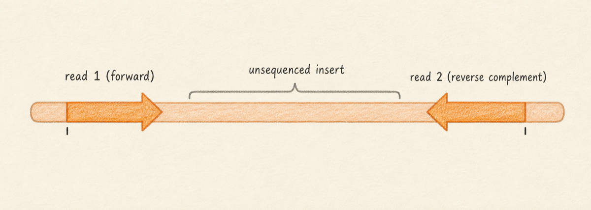
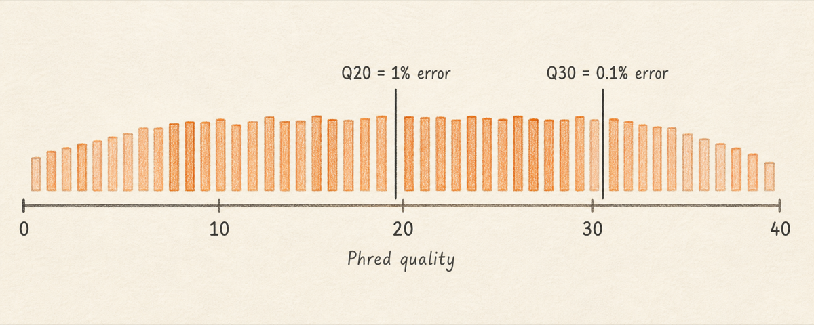
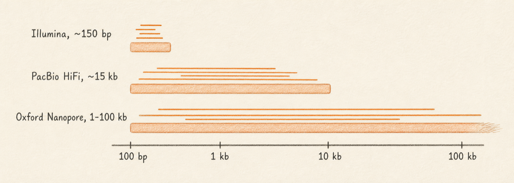

## What it is

A sequencing [read](../../GLOSSARY.md#read) is the record a sequencer writes for one DNA [fragment](../../GLOSSARY.md#fragment), with its bases and a quality score for each base. A fragment is one piece of your sample's DNA as it went onto the instrument. The molecule itself was used up on the instrument, and the read is all that survives of it. One read is a short and noisy guess at what one piece of your sample said, noisy in the sense that it contains errors. A run produces millions of reads, and the analysis that follows compares the many reads covering one position until they agree on an answer.

Reads arrive in a [FASTQ](../../GLOSSARY.md#fastq) file, the plain-text format that every read workflow in Lungfish Genome Explorer (LGE) starts from. Plain text means the file holds ordinary characters that any text editor can show. FASTQ spends exactly four lines on each read, a name, the bases, a separator, and one quality character per base. Nothing else is in the file. There is no header block, no index, and no note of which genome the reads came from.

Three facts about a read set shape everything downstream. They are how many reads there are, how long they are, and how far you can trust each base. This chapter takes them in turn, using two [fixtures](../../GLOSSARY.md#fixture), the public data sets this manual's chapters use. The HG002 chromosome 20 slice supplies short Illumina reads from a 500,001-base region of human chromosome 20. The HG002 long reads supply Oxford Nanopore and PacBio HiFi reads from the same person's mitochondrial DNA.

The practical step is to learn to read one FASTQ record by eye, because every quality number LGE shows you is a summary of those four lines.

## Why you would do this

Every question you ask of sequencing data runs through the reads. A variant call, the claim that your sample differs from a reference at one position, is really a claim that enough reads disagreed with the reference there. An assembly, the rebuilding of long sequences from short ones, is a claim that the reads overlap in one consistent way. When either answer looks wrong, the reads are the first place to look.

HG002 is a human genome from the Genome in a Bottle project, which supplies human samples whose true sequence is already known. The same person's DNA has been read on many instruments, so the two fixtures let you compare 250-base short reads with long reads of around 10,000 bases, and see what the extra length costs in per-base accuracy.

## Before you start

This chapter is reading only. It quotes the `hg002-chr20` and `hg002-long-reads` fixtures, so nothing needs to be downloaded or opened. To look at the reads on screen, open the Human Reads [demo project](../../GLOSSARY.md#demo-project) as [The Lungfish Genome Explorer Project](06-the-lungfish-project.md#demo-projects) showed. It already holds the short reads as the `HG002.chr20.10.0-10.5Mb` bundle and the nanopore reads as `HG002.chrM.ont`.

The raw files are listed in [Fixture files](06-the-lungfish-project.md#fixture-files), where the short reads are `HG002.chr20.10.0-10.5Mb_R1.fastq.gz` and `HG002.chr20.10.0-10.5Mb_R2.fastq.gz` in the [hg002-chr20 folder](https://github.com/dhoconno/lungfish-genome-explorer/tree/v2026.9.39/docs/user-manual/fixtures/hg002-chr20) and the long reads are in the [hg002-long-reads folder](https://github.com/dhoconno/lungfish-genome-explorer/tree/v2026.9.39/docs/user-manual/fixtures/hg002-long-reads). Each folder's `README.md` holds the source and citation. Importing the files is the subject of [Importing Sequencing Reads](../03-reads/01-importing-fastq.md).

## The four-line FASTQ record

Here is the second record in `HG002.chr20.10.0-10.5Mb_R1.fastq.gz`, copied out unchanged. Every record has the same shape, so the choice of the second one is arbitrary. The sequence and quality lines are each 250 characters long and wrap across several screen lines, but the block is four lines:

```
@D00360:94:H2YT5BCXX:1:1101:1582:14700
GTTTAGATTAACACATCTTCTTGATTTTACTTTTTCCTGCATGTACACTCTTGTGTCCAACCCAAGTTTCTGGGGAACACTATGCTGTTTGGGTCCACATTTCCCTGTTTCTCCCTTCCTAGTGGCTCCTCACACAACCCTGGACCAATTGCTCTGACATCAACCTGGTCTCCATCTTGCCTTAAAATGAACAAAGGGGTAAAGATTTAAAAATGAGAATCTTGCTGCTAACTGCTCTGAAGGTATTAAC
+
DDDDDIIIIHIIIHIIIHIHIIIIIIIIIIIIIIIIIIHIEHHHIHIGIIHIGHIIIHIIGIIIIHHIIIIIIHGHFIHHIIIGIIIIIIIIIIIHIHHHHFEHHCHHIIIIIIIHIHIIIIIEHIIGHHHFHCGH@G=HHIIHHHIHHHEHGEHFHIHCHHHH1<<FGHIIIE0<0<<GHIICHFCHEEHHC?CC@C-<</<CC?ECGEEHCHIIFF.DGFH.C@C.B6A@.8@CC@EGHEHCEHF?EA
```



Line 1 is the **header**, the read's name. It always opens with `@`. This Illumina header packs seven fields separated by colons, which name where the read was made.

| Field in the example | What it names |
|---|---|
| `D00360` | The instrument |
| `94` | The run on that instrument |
| `H2YT5BCXX` | The flow cell, the glass slide the DNA was sequenced on |
| `1` | The lane on that flow cell |
| `1101` | The tile, one imaged patch of the lane |
| `1582` and `14700` | The x and y position of this read's spot on the tile |

You will rarely take a header apart. What matters is that each read has its own name.

Line 2 is the **sequence**, spelled in A, C, G, T, and occasionally N. An N marks a position where the instrument made no call at all. A base called wrongly still reads as A, C, G, or T, and only its quality score hints at the problem. The number of characters on this line is the [read length](../../GLOSSARY.md#read-length), 250 here.

Line 3 is the **separator**, a single `+`, sometimes followed by a copy of the header. It marks where the sequence stops, which matters because a quality character can look exactly like a base.

Line 4 is the **quality string**, exactly as long as line 2, with one character per base. The character under each base is that base's confidence score, decoded in [Phred quality scores](#phred-quality-scores) below.

The pattern repeats for every read. Each of this fixture's two files holds 45,574 reads, so each runs to 182,296 lines, four per read. That is a deliberately small teaching slice. A real run holds tens or hundreds of millions of reads per file.

### Compressed FASTQ files

Almost every FASTQ you meet is compressed with gzip, a standard format that shrinks a file without losing any of it, and is named `.fastq.gz` or `.fq.gz`. The two files of this fixture take 8.7 MB and 9.3 MB compressed. LGE reads `.fastq` and `.fastq.gz` alike, so never unzip a file before importing it, and LGE stores the imported reads compressed as well.

## Paired-end reads

Most short-read Illumina protocols read each DNA fragment from both ends. That gives two reads per fragment, a [read pair](../../GLOSSARY.md#read-pair), and each is called the [mate](../../GLOSSARY.md#mate) of the other. Each mate starts at one end and runs inward, so the two may overlap in the middle, meet exactly, or stop short and leave a gap of unread bases. These are [paired-end](../../GLOSSARY.md#paired-end) reads. Because the mates start from opposite ends, they read opposite strands. The picture labels read 2 the reverse complement for that reason, meaning that to line it up with read 1 you reverse its order and swap each base for its partner, A for T and C for G.



The mates usually arrive as two files that share a name and differ only in a suffix. This fixture writes `_R1` and `_R2`:

```
HG002.chr20.10.0-10.5Mb_R1.fastq.gz   (read 1 of every pair)
HG002.chr20.10.0-10.5Mb_R2.fastq.gz   (read 2 of every pair)
```

The Sequence Read Archive, NCBI's public store of raw sequencing data and usually written [SRA](../../GLOSSARY.md#sra), writes `_1` and `_2` instead. The naming patterns LGE accepts as a pair are listed in [How LGE decides two files are a pair](../03-reads/01-importing-fastq.md#how-lge-decides-two-files-are-a-pair). Both files hold the same number of records in the same order. The Nth record of R1 and the Nth record of R2 are one fragment read from opposite ends, which is why they carry the same header:

```
@D00360:94:H2YT5BCXX:1:1101:1582:14700   (in the R1 file, 250 bases)
@D00360:94:H2YT5BCXX:1:1101:1582:14700   (in the R2 file, 249 bases)
```

The two mates need not be the same length. Each read is trimmed on its own, so 250 and 249 in one pair is ordinary.

Pairing is worth the second file for two reasons. A read that could fit two places in the genome can often be placed correctly, because its mate narrows down where it sits. And a [variant caller](../../GLOSSARY.md#variant-caller), the program that compares aligned reads to a reference and reports the differences, can count a pair as one observation. The two mates came from one fragment, so counting them as two would inflate the support for a call.

Split the pair, lose one file, or reorder one of them, and every later step quietly degrades. Some read operations keep both mates together, some can leave a mate on its own, and merging joins the two into one read, as [Which operations keep pairs](../03-reads/01-importing-fastq.md#which-operations-keep-pairs) sets out. The other arrangement is [single-end](../../GLOSSARY.md#single-end) sequencing, where each fragment is read from one end and each sample has one file.

### Overlapping mates and interleaved files

The [insert size](../../GLOSSARY.md#insert-size) is the length of the original fragment the two mates came from. When it is shorter than twice the read length, the mates overlap and read the same bases from both strands. With 250-base reads, that happens on any fragment under 500 bases. Insert size is usually measured after mapping, from where the two mates land, and can be estimated before mapping from pairs that overlap, as [Read Processing](../03-reads/08-read-processing.md#merging-the-overlapping-pairs) shows.

A pair can also be written as one [interleaved FASTQ](../../GLOSSARY.md#interleaved-fastq) file, where the records alternate, read 1 then read 2 of each pair, and that is how LGE stores the two mates of a sample inside one bundle. [Importing Sequencing Reads](../03-reads/01-importing-fastq.md) covers the storage details.

## Phred quality scores

A [Phred score](../../GLOSSARY.md#phred-score) is a per-base estimate of how likely that base is to be wrong, written on a logarithmic scale. Logarithmic here means every 10 points divides the chance of error by ten. So 20 means one wrong base in a hundred and 30 means one in a thousand. A higher score is a more trustworthy base. Reading only the table is enough.

| Phred score | Chance the base is wrong | What it means in practice |
|---|---|---|
| Q10 | 1 in 10 | Low confidence, usually trimmed away |
| Q20 | 1 in 100 | Usable for many tasks, a common trimming threshold |
| Q30 | 1 in 1,000 | The usual definition of a good Illumina base |
| Q40 | 1 in 10,000 | The best bases a modern Illumina run reaches |

Judge an Illumina base against Q30. Q40 is the practical ceiling for a single Illumina base, not a bar every base should clear.

If you prefer the arithmetic, the score is `Q = -10 * log10(P)`, where P is the chance of error written as a number between 0 and 1. A P of 0.001 gives Q30. Skipping this paragraph costs you nothing.



### Decoding the quality characters

In the file each score is stored as one printable character, offset by 33, a convention called Phred+33. ASCII is the standard numbering that gives every keyboard character a number, so `A` is 65. To decode a quality character, take its ASCII number and subtract 33. Four anchors cover most of what you will see. `!` is ASCII 33 and decodes to Q0. `5` is ASCII 53 and decodes to Q20. `?` is ASCII 63 and decodes to Q30. `I` is ASCII 73 and decodes to Q40.

Apply that to the record above. The quality line opens `DDDDD`, and `D` is ASCII 68, so those five bases are Q35, about one error in 3,000. The long run of `I` that follows is Q40. Toward the end the line reaches `.` (Q13) and `6` (Q21), so the last stretch of the read is less trustworthy than the first. That shape, strong at the start and sagging at the end, is a normal Illumina read, and trimming is what removes the weak tail.

You will rarely decode a quality string by hand. The tools LGE runs do the decoding and report summaries for you. What to carry in your head is the rough thresholds, and the fact that they shift with the platform.

## Read length and platform differences

Sequencing platforms produce reads of very different lengths at very different per-base accuracy. The platform limits which tools can analyse the data, because a program written for 250-base reads makes assumptions that a 40,000-base read breaks. Lengths are given in base pairs (bp), or in kilobases (kb) for long reads, where 1 kb is 1,000 bp.

| Platform | Typical read length | Typical accuracy |
|---|---|---|
| Illumina (MiSeq, NextSeq, NovaSeq) | 75 to 300 bp, fixed per run | Q30 to Q40 |
| Oxford Nanopore (MinION, PromethION) | 200 bp to over 100 kb, highly variable | Q12 to Q20 simplex, Q30 and above duplex |
| PacBio HiFi | 10 to 25 kb | Q30 and above |
| Ion Torrent | 200 to 400 bp | Q20 to Q30 |

A [simplex](../../GLOSSARY.md#simplex-read) nanopore read comes from one strand of DNA passing through a pore once. A [duplex](../../GLOSSARY.md#duplex-read) read comes from reading both strands of the same molecule and reconciling them, which is slower but more accurate. Ion Torrent is listed for completeness and does not return in this manual.



The human mitochondrial genome, 16,569 bases long, makes a handy yardstick because the long-read fixture comes from it. A 250-base Illumina read spans about 1.5% of it. A 10,000-base nanopore read spans about 60% of it in one piece.

### A nanopore read

The HG002 long reads hold 950 Oxford Nanopore reads. Here is the header of the third one, with the first 60 characters of its sequence and quality lines:

```
@0b3c8fbc-4b82-45d9-9805-ac77b873001a
TGTTGTACTTCGTTCAGTTACGTATTGCTGTGTAGCGGTGAAAAGTGGTTGGTTTAGACG
+
('5;AO'";eD2*b5+>$S<A<J1{S=*Q4\E=sP;=U?12XD?@O(?@e"26_KSUWF2
```

The header is a random identifier rather than a flow-cell position, because a nanopore read comes from one molecule threaded through one pore. The quality string is a jumble of punctuation rather than a run of high characters. Its first character, `(`, is ASCII 40, which decodes to Q7, a little worse than one error in ten.

That looks alarming and is normal for this data. This read is 16,303 bases long, 98% of the mitochondrial genome in one molecule. Across the fixture the nanopore reads average Q7.9 and range from 263 to 39,647 bases. Their [N50](../../GLOSSARY.md#n50) is 10,615 bases. N50 is the length at which reads that long or longer hold half of all the sequenced bases.

The Q7.9 average sits below the Q12 to Q20 of current nanopore software, because these reads were converted from raw signal to bases some years ago. Treat the fixture as an example of the format, not a standard your run should meet. Nanopore errors fall in different places in different reads, so when many reads cover a position the errors disagree with each other and the majority base is right.

### A HiFi read

The same fixture holds 363 PacBio HiFi reads. Here is the third one in the same form:

```
@m64011_190830_220126/18416252/ccs
ATACCAAATGCATGGAGAGCTCCCGTGAGTGGTTAATAGGGTGATAGACCTGTGATCCAT
+
~qrT~N~~}~~~~N~~~~~~~>~~~~~~~~\~X~|~~~X~~~}~~~~~t~~~~~~~[~~~
```

The `ccs` in the header stands for [circular consensus sequencing](../../GLOSSARY.md#circular-consensus-sequencing). The instrument reads the same circular molecule over and over and reports the consensus of those passes. That is why the quality string is mostly `~`, ASCII 126, which decodes to Q93. The Phred scale has no ceiling at Q40, and Q93 is a confidence claimed for a consensus of many passes, not for one measurement.

This read is 16,565 bases long. Across the fixture the HiFi reads average Q29, with 97.6% of bases at Q30 or better and an N50 of 13,663 bases. The average is lower than the `~` characters suggest because it includes every weaker base at every read end. HiFi reaches most of nanopore's length at close to Illumina's per-base accuracy.

## Know your reads before you choose a tool

Every Choosing a tool section in this manual starts from a few facts about your reads. Check them once, when the reads first arrive, and most tool choices follow from them. Four can be read from the reads themselves or their archive record. Two, how the library was made and how many genome copies the organism carries, come from knowing the sample.

| Fact | The usual answers | Why it matters |
|---|---|---|
| Platform | Illumina, Oxford Nanopore, or PacBio HiFi | Tools built for short reads fail on long ones, and the reverse |
| Read length | About 75 to 300 bases for short reads, thousands for long reads | Some trimmers and mappers suit one length range only |
| Single, paired, or merged | One read per fragment, two mates, or mates already joined into one read | Pairs place reads better, and merged reads have no mates |
| Amplicon or shotgun | Copied by PCR with designed primers, or DNA broken at random | Amplicon reads need primer trimming and keep their duplicates |
| Haploid or diploid | One genome copy, as in a virus or bacterium, or two, as in a person or macaque | Decides whether a genotype-based or a frequency-based variant caller fits |
| A reference for the organism | A finished genome such as GRCh38 for human or Mmul_10 for the rhesus macaque, or none | With a good reference you map, and without one you assemble |

**Platform and read length.** The header of one record settles the platform, since an Illumina header names a flow cell and a nanopore header is a random identifier, as the records above show. Reads that all sit near one length of 300 bases or less are short reads, and lengths in the thousands mean nanopore or PacBio. LGE reads the same header traces itself when you import a file, and it never names a platform from read length alone, as [How LGE decides the platform](../03-reads/01-importing-fastq.md#how-lge-decides-the-platform) explains.

**Single, paired, or merged.** A paired run arrives as two files or one interleaved file, as [Paired-end reads](#paired-end-reads) explains. [Merged reads](../../GLOSSARY.md#read-merging) are pairs already joined into one longer read where the mates overlapped, so a merged set holds no pairs, or holds merged reads and leftover pairs together.

**Amplicon or shotgun.** An [amplicon](../../GLOSSARY.md#amplicon) library is copied from the sample by PCR with designed primers, and a [shotgun](../../GLOSSARY.md#shotgun) library is DNA broken at random. A [duplicate read](../../GLOSSARY.md#pcr-duplicate) is a copy of another read made from the same original fragment during PCR. A shotgun analysis marks duplicates so each fragment counts once, while every read of an amplicon library starts at a primer, so there the duplicates are the data, as [Alignment Quality](../04-alignments/04-alignment-quality.md) explains. Nothing in a FASTQ file says which preparation made it. A run downloaded from a public archive records it as its library strategy, AMPLICON or WGS for example, and otherwise ask the person who made the library, as [How to tell which prep your sample had](03-amplicon-vs-shotgun.md#how-to-tell-which-prep-your-sample-had) explains.

**Haploid or diploid.** [Ploidy](../../GLOSSARY.md#ploidy) is the number of copies of each chromosome an organism carries. A person or a macaque is diploid, so a real variant sits on one copy or both. A virus, a bacterium, or the mitochondrial genome is carried as one copy per genome, but a sample can hold many differing copies, so a change can appear in any share of the reads. [One copy or two](05-variants-and-vcf.md#one-copy-or-two) explains how this picks the variant caller.

**A reference for the organism.** A reference is a finished genome sequence for your species. To check whether one exists for another organism, search NCBI in Genome mode, as [Downloading from NCBI](../02-sequences/02-downloading-from-ncbi.md) shows. When a good reference exists, the usual route is to map your reads to it. When none does, [When to Assemble](../07-assembly/01-when-to-assemble.md) is the place to start.

Where LGE shows each of these facts for an imported read bundle, in the Inspector and on the summary cards, is listed in [Quality Control for Reads](../03-reads/03-quality-control.md).

## What good looks like

Judge a read set on four numbers before trusting anything built from it. The first three come straight from the FASTQ.

Read count is how many records the file holds. This fixture holds 45,574 pairs, enough for a 500,001-base slice but far too few for a whole genome. How many reads a project needs follows from the depth it aims for, which [Coverage and the coverage track](04-alignment-files.md#coverage-and-the-coverage-track) works out for a human genome. Too few reads and no later step rescues the result.

Read length should match the platform. Illumina reads are close to uniform, and this fixture's read 1 file averages 248.6 bases with 90.8% of reads at 249 or 250. A handful of much shorter reads were trimmed hard, which is expected. Lengths reaching thousands of bases mean nanopore or PacBio. A length pattern that disagrees with the kit you ran suggests the wrong files were imported.

Mean quality should sit where the platform puts it. For Illumina, Q30 across the body of the read with a sagging tail is healthy, and a run averaging below Q20 over most of the read has failed. For current nanopore data, expect Q12 to Q20. For HiFi, expect Q30 and above.

The fourth number is [depth](../../GLOSSARY.md#depth), the number of reads covering one reference position, also called [coverage](../../GLOSSARY.md#coverage). It decides whether a variant can be called, and it cannot be read from a FASTQ because it is measured after the reads are mapped to a reference, as [Coverage and the coverage track](04-alignment-files.md#coverage-and-the-coverage-track) explains.

If any number strays far from what the platform and protocol lead you to expect, ask your sequencing provider for three figures before going further. They are the total reads passing filter, the percentage of bases at Q30 or above, and the expected insert size of the library.

Three habits are what this chapter is for. Read the four lines, keep paired files together, and treat a quality score as one signal among several.

## Next

Continue to [Amplicons and Shotgun Sequencing](03-amplicon-vs-shotgun.md) to see the two main ways sample DNA is prepared before sequencing, and why the choice changes how you call variants. The order in which reads are usually cleaned and checked before mapping is set out in [The order of read preparation](../03-reads/01-importing-fastq.md#the-order-of-read-preparation), for when you reach Reads.
