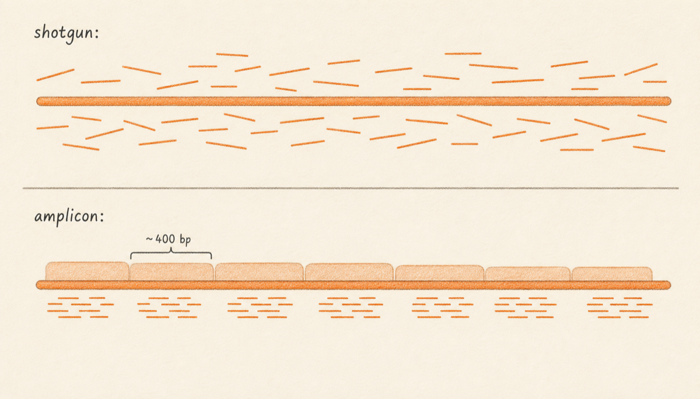
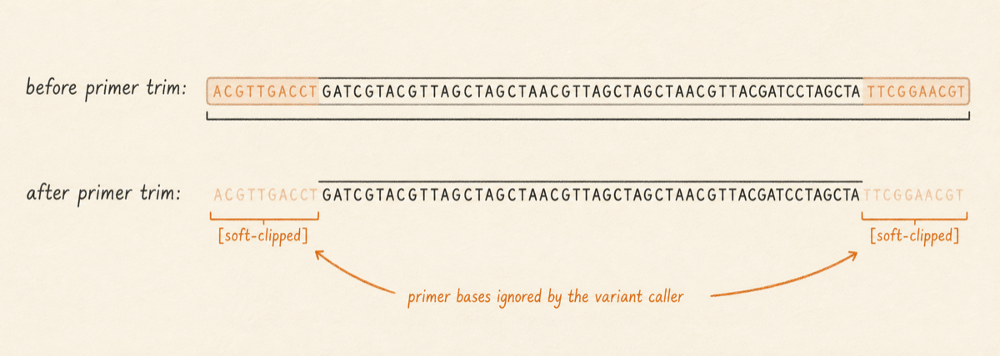
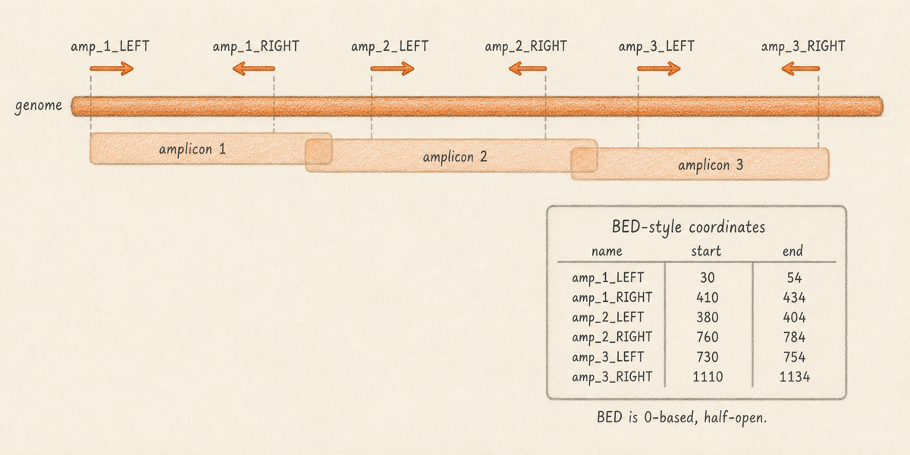

## What it is

Sample DNA reaches the sequencer in one of two ways. Either it is chopped at random into small fragments before being read (shotgun sequencing), or it is amplified at fixed positions across the genome by PCR with carefully chosen primers (amplicon sequencing). Both approaches produce FASTQ files that look identical at the file level: same four-line records, same Phred scores, same paired-end conventions. The difference lives in how the reads sit on the genome, and that difference changes how you must analyse them.

This chapter explains what amplicon protocols are, why they dominate viral surveillance (SARS-CoV-2 ARTIC and QIAseq Direct, dengue PrimalSeq, monkeypox amplicon panels), and what a primer scheme is as a file. It also explains why the first analysis step on amplicon data is always primer trimming, and why skipping that step produces phantom variants that look real but are not.



So what should you do with this? Before you start any variant analysis in Lungfish, find out which library prep your sample used. If the protocol name contains "ARTIC", "QIAseq", "PrimalSeq", or any panel name with a version number tied to a virus, the data is amplicon and you will need a primer scheme. If the protocol name is "Nextera XT", "TruSeq DNA", "NEBNext Ultra", or similar, the data is shotgun and primer trimming does not apply.

## Shotgun sequencing: random fragments

In shotgun prep, total nucleic acid from the sample is enzymatically or mechanically broken into short pieces, sequencing adapters are ligated to both ends, and the resulting library is sequenced. Where any given read lands on the genome is essentially random. The position depends on where the fragmentation enzyme happened to cut, which is dictated by physics and chemistry rather than design.

The benefit is that shotgun captures whatever DNA is in the tube without bias toward known sequence. If your sample contains an unknown pathogen, a recombinant, or a wildly diverged variant, shotgun will see it as long as enough template is present. The cost is sensitivity. To get even one-times coverage of a 30 kb viral genome from a sample where the virus is 0.01% of total nucleic acid, you need roughly 300 million reads of background before you see a single viral read. That is why shotgun viral sequencing usually requires either a high-titre clinical isolate or a sample that has been physically enriched for the target.

Shotgun reads do not need primer trimming, because there are no fixed primers. The adapter sequences attached during library prep are removed by the sequencer's basecaller or by a tool such as `fastp` before alignment, and that adapter trim is a separate concern from primer trim.

## Amplicon sequencing: fixed PCR products

In amplicon prep, instead of fragmenting first, the protocol uses PCR to make many copies of a defined region of the genome. A pair of primers, each a short oligonucleotide of 18 to 30 bases, binds to two known positions on the reference, and DNA polymerase extends between them. The product is called an amplicon: a double-stranded DNA molecule whose ends are exactly the two primer binding sites and whose middle is the genomic sequence between them.

A single primer pair only covers one stretch of the genome, so real surveillance protocols use many primer pairs in two or more pools to tile the entire region of interest. ARTIC v3 for SARS-CoV-2 uses 98 primer pairs across two pools to produce 98 overlapping amplicons of about 400 bp each, covering the 30 kb genome end to end. After PCR, the amplicons are pooled, given sequencing adapters, and sequenced exactly like a shotgun library.

The benefit is sensitivity at low template input. PCR amplifies the target by orders of magnitude, so amplicon protocols routinely pull out useful viral genomes from clinical samples with cycle-threshold values up to around 32 or 33. Coverage is also predictable: every amplicon should produce reads at its assigned coordinates, so a coverage drop tells you something specific (a primer failure, a deletion, a mutation under one of the primer-binding sites). The cost is that amplicon protocols only see what the primers were designed to amplify. A novel virus, or a variant that mutates a primer-binding site, may be invisible or under-represented.

## What an amplicon looks like, end to end

A worked example helps. Imagine an amplicon defined by:

- A 22 bp forward primer at reference positions 1000 to 1021.
- A 22 bp reverse primer at reference positions 1378 to 1399.

The full amplicon is 400 bp long, spanning positions 1000 to 1399. After PCR, every copy of this molecule starts and ends at exactly those coordinates. After sequencing on a 150 bp paired-end Illumina run, you get two reads per molecule: read 1 sequences the first 150 bases (positions 1000 to 1149), read 2 sequences the last 150 bases from the other strand (positions 1250 to 1399). The middle of the amplicon (positions 1150 to 1249) is covered only when reads from neighbouring overlapping amplicons fill it in.

Now, here is the part that matters for variant calling. The first 22 bases of read 1 are not the sample's DNA. They are the primer sequence, copied into the read because the primer itself was incorporated as the 5' end of the amplicon during PCR. Whatever the sample's true sequence at positions 1000 to 1021 happens to be, the read at those positions will display the primer sequence. Likewise, the last 22 bases of read 2 will display the reverse primer sequence rather than the sample. Across thousands of reads from this amplicon, every single one shows the same primer-derived bases at the same positions.

If a variant caller looks at position 1015 and sees the primer base at 100% of reads when the reference says something different, the caller has no way to know that this is a protocol artifact. It will report a high-confidence, high-frequency variant. That variant is not real. It is the primer.



## Primer trimming and soft-clipping

The fix is primer trimming. Given a list of where every primer lands on the reference, the trimmer walks each aligned read, finds the read's leftmost or rightmost mapped position, and marks any bases that fall inside a primer footprint as soft-clipped in the BAM file. Soft-clipping is the alignment format's way of saying "these bases are still present in the record, but ignore them when computing pileup, coverage, or variants". Chapter [Alignment Files](04-alignment-files.md) covers soft-clipping in more detail; for now, treat it as a tag that hides primer bases from downstream analysis without deleting them.

In Lungfish, primer trim runs as a BAM-level operation using `ivar trim` against a selected primer scheme. The trim runs once after alignment and before variant calling. The output BAM has the same number of reads as the input, but the primer-derived ends are soft-clipped, and a variant caller pointed at the trimmed BAM will not call the primer sequence as a variant.

## What a primer scheme is, as a file

A primer scheme is a coordinate table. For each primer, it lists the chromosome name, the start coordinate, the end coordinate, the primer name (which usually encodes its pool and direction, for example `nCoV-2019_1_LEFT` and `nCoV-2019_1_RIGHT`), and the primer sequence itself. The most common on-disk format is BED, a tab-separated text file where each row is one primer and the columns are chromosome, start, end, name, score, strand.

A minimal BED row for the forward primer in the worked example above would read:

```
MN908947.3	999	1021	nCoV-2019_1_LEFT	1	+
```

(BED is zero-based half-open, so a primer at one-based positions 1000 to 1021 is written as 999 to 1021.)

Lungfish packages primer schemes as `.lungfishprimers` bundles. A bundle is a folder containing the BED file, optional primer sequences as FASTA, and a provenance note naming the source and reference accession the coordinates apply to. Bundles live in the project's `Primer Schemes/` folder and appear in the primer picker whenever a workflow needs one. The bundle layout is documented in [Primer Scheme Bundles](../appendices/primer-schemes.md#appendix-primer-schemes).



## Amplicon versus shotgun, side by side

| Property | Shotgun | Amplicon |
|---|---|---|
| Where reads start | Random across the genome | At fixed primer coordinates |
| Sensitivity at low input | Low; needs high titre or enrichment | High; routinely works to Ct ~32 |
| Sample input required | Often hundreds of ng | A few ng or less |
| Primer trim required? | No | Yes, always |
| Strand-bias filter useful? | Yes | No, usually disabled |
| Cost per genome | Higher | Lower |
| Detects novel sequence? | Yes | Only what primers target |

When to choose shotgun: high-titre cultures, metagenomic discovery, samples where you do not yet know what virus you are looking at, host-depleted clinical samples with substantial viral load. When to choose amplicon: targeted surveillance of a known pathogen, low-titre clinical samples, large sample batches where cost matters, settings where uniform coverage is needed for variant comparison across samples.

## Common SARS-CoV-2 amplicon protocols

Most public SARS-CoV-2 sequence in archives such as SRA and ENA was produced by one of a handful of amplicon protocols. Knowing which protocol generated a sample tells you which primer scheme to select in Lungfish.

- **ARTIC v3.** The original 98-amplicon, 400 bp scheme; widespread in 2020 and 2021. Coordinates target Wuhan-Hu-1 (`MN908947.3`).
- **ARTIC v4.1.** Updated to handle mutations in Alpha, Delta, and Omicron primer sites. Same 400 bp amplicon size; revised primer positions. The default for many late-2021 and 2022 sequencing efforts.
- **ARTIC v5.3.2.** Current ARTIC primer set, redesigned for circulating variants and rebalanced for coverage uniformity.
- **QIAseq Direct SARS-CoV-2.** A commercial enhanced-amplicon kit with shorter (~250 bp) amplicons designed for fragmented RNA. Useful for archival and FFPE samples.
- **Midnight (1200 bp).** A coarser, 1200 bp amplicon scheme designed for Oxford Nanopore long reads.

Picking the wrong scheme is the single most common cause of phantom variants in viral surveillance pipelines. If you trim a sample that was generated with ARTIC v4.1 against the v3 BED file, the primers in the BAM will not match what the trimmer is looking for, and the real primer bases will pass through into the pileup. The result is a clean-looking VCF that lists ten or twenty fixed-frequency "variants" at the v4.1 primer footprints. They will not appear in any database, they will not match any lineage, and they will track perfectly with the protocol metadata if you compare across samples.

## So how do you tell which protocol a sample used?

In practice, three places usually carry the answer. The sample's submission record in SRA or ENA names the library prep kit in the `library_strategy` and `library_construction_protocol` fields. The publication or sequencing centre's protocol documentation names the version. The wet-lab notebook of whoever prepared the sample is the authoritative record. If none of these are available, the coverage profile can sometimes give it away: amplicon coverage shows characteristic step changes at primer junctions, while shotgun coverage looks smoother and varies with GC content rather than at fixed coordinates.

When in doubt, ask the person who prepared the library. Guessing at a primer scheme is worse than running the analysis untrimmed, because trimming with the wrong scheme can soft-clip real sample bases at positions that happen to overlap an unrelated primer.

## Next

Continue to [Alignment Files](04-alignment-files.md) to learn what happens after FASTQ reads are mapped to the reference, including how soft-clipping is recorded in a BAM file.
