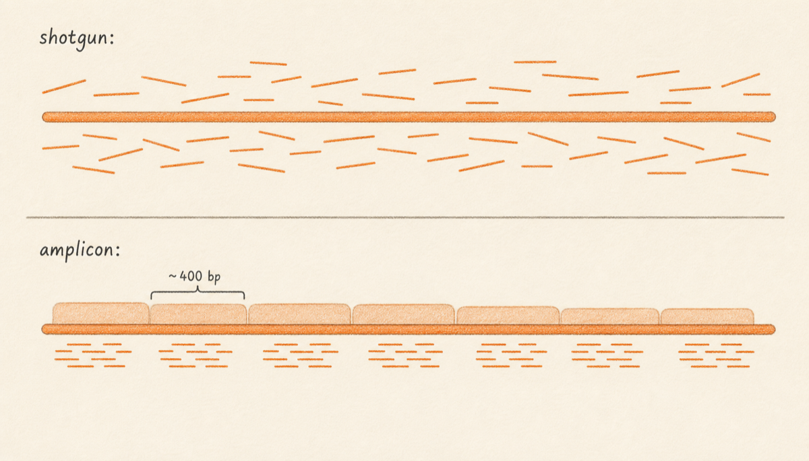
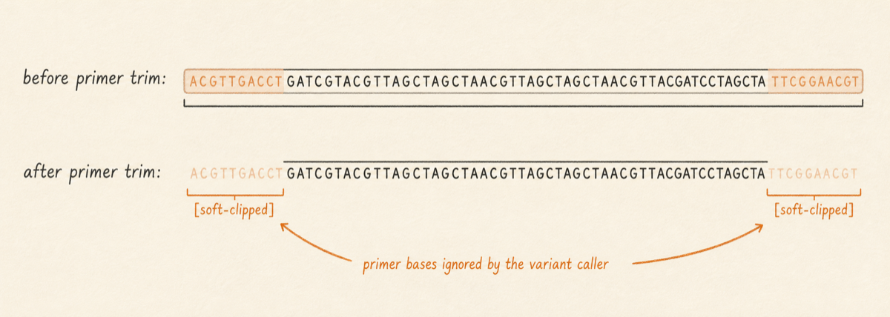
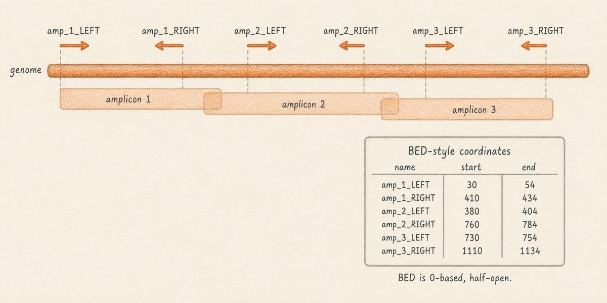

Sample DNA reaches the sequencer by one of three main routes. It can be chopped at random into small fragments before reading ([shotgun](../../GLOSSARY.md#shotgun) sequencing), copied at fixed positions across the genome by PCR with carefully chosen primers ([amplicon](../../GLOSSARY.md#amplicon) sequencing), or fished out by hybridisation to oligonucleotide probes that pull target sequences from a crowded background (target-enrichment sequencing, also called capture-based sequencing). All three produce FASTQ files that look identical on disk: the same four-line records, the same Phred scores, the same paired-end conventions. What sets them apart is how the reads land on the genome, and that difference changes how you must analyse them.

This chapter lays out what amplicon protocols are, why they dominate viral surveillance ([SARS-CoV-2 ARTIC](https://artic.network/ncov-2019) and [QIAseq Direct](https://www.qiagen.com/), [dengue PrimalSeq](https://github.com/grubaughlab), monkeypox amplicon panels), and what a primer scheme looks like as a file. It also explains why amplicon data needs primer trimming before variant calling, and how skipping that step conjures phantom variants that look real but are not. A short section at the end introduces target-enrichment sequencing, a third approach that often rescues harder samples.



Before you start any variant analysis in LGE, find out which library prep made your sample. If the protocol name carries "ARTIC", "QIAseq", "PrimalSeq", or any panel name with a version number tied to a virus, the data is amplicon and you will need a [primer scheme](../../GLOSSARY.md#primer-scheme). If it reads "Nextera XT", "TruSeq DNA", "NEBNext Ultra", or the like, the data is shotgun and primer trimming does not apply. If it names a "capture" or "panel" product such as Twist Comprehensive Viral or IDT xGen, the data is target-enriched and behaves like shotgun for primer-trimming purposes.

## Shotgun sequencing: random fragments

In shotgun prep, the total nucleic acid in a sample is broken into short pieces, by enzyme or by shearing, sequencing adapters are ligated to both ends, and the library is sequenced. Where any given read lands on the genome is essentially random. Its position turns on wherever the fragmentation enzyme happened to cut, a matter of physics and chemistry rather than design.

The payoff is that shotgun captures whatever DNA is in the tube, with no bias toward sequence anyone already knows. If your sample harbours an unknown pathogen, a recombinant, or a wildly diverged variant, shotgun will see it, provided enough template is present. The price is sensitivity when template is scarce, because most reads come from the dominant background (host, microbiome, contaminants) and only a sliver reach the target.

A quick back-of-the-envelope makes the price concrete. Say viral reads are 0.01% of the reads in a shotgun library. Then on average one read in 10,000 is viral. A 30 kb viral genome needs roughly 200 perfectly placed 150 bp reads to reach 1x nominal coverage. Put those two figures together and you would need about 2 million total reads just to catch ~200 viral ones, before the usual losses to host depletion, duplicates, mapping failures, uneven coverage, and quality filters. In practice, plan for several million to tens of millions of total reads to reach usable coverage at this fraction. That is why shotgun viral sequencing usually demands either a high-titre clinical isolate or a sample physically enriched for the target.

Shotgun reads need no primer trimming, because there are no fixed primers to trim. The adapter sequences added during library prep are stripped by the sequencer's basecaller or by a tool such as [fastp](https://github.com/OpenGene/fastp) before alignment, and that adapter trim is a separate matter from primer trim.

## Amplicon sequencing: fixed PCR products

Amplicon prep skips the fragmentation and reaches for PCR instead, copying a defined region of the genome over and over. A pair of [primers](../../GLOSSARY.md#primer), each a short oligonucleotide of 18 to 30 bases, binds to two known positions on the reference, and DNA polymerase fills the gap between them. The product is an [amplicon](../../GLOSSARY.md#amplicon): a double-stranded DNA molecule whose ends are exactly the two primer binding sites and whose middle is the genomic sequence in between.

One primer pair covers just one stretch of the genome, so real surveillance protocols marshal many pairs across two or more pools to tile the whole region of interest. ARTIC v3 for SARS-CoV-2 uses 98 primer pairs in two pools to make 98 overlapping amplicons of about 400 bp each, blanketing the 30 kb genome end to end. After PCR, the amplicons are pooled, given sequencing adapters, and sequenced exactly like a shotgun library.

The payoff is sensitivity at low template input. PCR amplifies the target by orders of magnitude, so amplicon protocols routinely pull usable viral genomes from clinical samples with cycle-threshold (Ct) values as high as 32 or 33. (Ct is the qPCR cycle number at which a positive signal first appears; lower values mean higher viral load. Ct 32 to 33 corresponds to roughly 10^3 viral copies per microlitre for many SARS-CoV-2 assays, though the exact figure varies by assay.) Coverage is predictable too: every amplicon should produce reads at its assigned coordinates, so a drop tells you something specific (a primer failure, a deletion, a mutation lurking under one of the primer-binding sites). The price is that amplicon protocols see only what the primers were designed to amplify. A novel virus, or a variant that mutates a primer-binding site, may be invisible or under-represented.

PCR also breeds artifacts that shotgun does not: chimeric reads where the polymerase stitched two templates together, jackpot effects where one early molecule dominates an amplicon's read pile, and polymerase errors carried forward through cycles. Most of these surface as low-frequency variants rather than fixed ones, so the default minimum-allele-frequency threshold usually filters them out. The [Variants and VCF Files](05-variants-and-vcf.md) chapter and the variant-calling workflow chapters cover the filter settings in detail.

## What an amplicon looks like, end to end

A worked example helps. Picture an amplicon defined by:

- A 22 bp forward primer at reference positions 1000 to 1021.
- A 22 bp reverse primer at reference positions 1378 to 1399.

The full amplicon runs 400 bp, spanning positions 1000 to 1399. After PCR, every copy starts and ends at exactly those coordinates. Sequence it on a 150 bp paired-end Illumina run and you get two reads per molecule: read 1 covers the first 150 bases (positions 1000 to 1149), read 2 covers the last 150 from the other strand (positions 1250 to 1399). The middle, positions 1150 to 1249, stays uncovered until reads from neighbouring overlapping amplicons fill it in.

Here is the part that matters for variant calling. The first 22 bases of read 1 are not the sample's DNA. They are the primer sequence, copied into the read because the primer itself became the 5' end of the amplicon during PCR. Whatever the sample truly reads at positions 1000 to 1021, the read at those positions shows the primer sequence instead. The last 22 bases of read 2 do the same with the reverse primer. Across thousands of reads from this amplicon, every one carries the same primer-derived bases at the same positions.

If a variant caller looks at position 1015 and finds the primer base in 100% of reads while the reference says something else, it has no way to know this is a protocol artifact. It reports a high-confidence, high-frequency variant. That variant is not real. It is the primer.



## Primer trimming and soft-clipping

The fix is [primer trimming](../../GLOSSARY.md#primer-trim). Two approaches exist, and LGE supports both, depending on where in the workflow you want the trim to fall.

The first is **read-based primer trimming**. A tool such as `fastp` takes the primer sequences, walks each FASTQ read end, matches primer sequence at the read's 5' edge, strips those bases, and writes a trimmed FASTQ. The trim happens before alignment and needs no reference, but it is easily thrown by mutations under the primer-binding site: if your sample carries a SNP there, the read end no longer matches the canonical primer, and the bases slip through untrimmed. Read-based trimming also throws away the primer information you might want for QC later.

The second is **alignment-based primer trimming**. A tool such as `ivar trim` or `samtools ampliconclip` takes the primer coordinates from a [BED](../../GLOSSARY.md#primer-scheme) file, walks each aligned read in the BAM, finds where the read's mapped position overlaps a primer footprint, and marks those bases as [soft-clipped](../../GLOSSARY.md#soft-clip). Soft-clipping is the alignment format's way of saying "these bases are still in the record, but ignore them when computing pileup, coverage, or variants" ([Alignment Files](04-alignment-files.md) covers soft-clipping in more detail). Because it works from coordinates rather than sequences, alignment-based trimming shrugs off primer-site mutations, and it keeps the original bases in the BAM for later inspection. It is the ARTIC project's recommended approach, and the LGE default for the iVar variant-calling lane.

In LGE, the BAM-level primer trim runs `ivar trim` against a chosen primer scheme, after alignment and before variant calling. Most reads pass through with their primer ends soft-clipped, though some `ivar trim` options can drop reads whose remaining aligned span is too short or whose ends match no expected primer. The operation's provenance sidecar records the exact options used, so the run is always recoverable.

## What a primer scheme is, as a file

A [primer scheme](../../GLOSSARY.md#primer-scheme) is, at heart, a coordinate table. For each primer it lists the contig name, the start coordinate, the end coordinate, the primer name (which usually encodes pool and direction, as in `nCoV-2019_1_LEFT` and `nCoV-2019_1_RIGHT`), a score, and a strand. The usual on-disk format is BED, a tab-separated text file where each row is one primer and the six standard columns are chrom, start, end, name, score, strand. Standard BED omits the primer sequence itself; where a scheme provides it, the sequences live in a companion FASTA or TSV file. Some schemes extend BED with extra columns for pool number or sequence, but the six-column form is the baseline.

A minimal BED row for the forward primer in the example above reads:

```
MN908947.3	999	1021	nCoV-2019_1_LEFT	1	+
```

(BED is zero-based half-open, so a primer at one-based positions 1000 to 1021 is written as 999 to 1021.)

LGE packages primer schemes as `.lungfishprimers` bundles. Each bundle is a folder holding the BED file, the primer sequences as a companion FASTA, and a provenance note naming the source and the reference accession the coordinates apply to. Bundles sit in the project's `Primer Schemes/` folder and show up in the primer picker whenever a workflow needs one. The bundle layout is documented in [Primer Scheme Bundles](../appendices/primer-schemes.md#appendix-primer-schemes).



## Amplicon versus shotgun, side by side

| Property | Shotgun | Amplicon |
|---|---|---|
| Where reads start | Random across the genome | At fixed primer coordinates |
| Sensitivity at low input | Low; needs high titre or enrichment | High; routinely works to Ct ~32 |
| Sample input required | Often hundreds of ng | A few ng or less |
| Primer trim required? | No | Yes |
| Default strand-bias behaviour | Filter useful as a default check | Filter thresholds need adjustment; inspect protocol context |
| Cost per genome | Higher | Lower |
| Detects novel sequence? | Yes | Only what primers target |

Reach for shotgun when you have high-titre cultures, a metagenomic hunt, a sample where you do not yet know what virus you are chasing, or host-depleted clinical material with a substantial viral load. Reach for amplicon for targeted surveillance of a known pathogen, low-titre clinical samples, large batches where cost matters, and any setting that needs uniform coverage to compare variants across samples.

Which amplicon protocols you choose between depends on what is currently maintained for your target. The next section lists the canonical SARS-CoV-2 options at the time of writing; for any specific run, check the scheme name and version against the wet-lab record or the [ARTIC primer scheme repository](https://github.com/artic-network/primer-schemes).

## Common SARS-CoV-2 amplicon protocols

Most public SARS-CoV-2 sequence in archives such as SRA and ENA came off one of a handful of amplicon protocols. Knowing which one made a sample tells you which primer scheme to pick in LGE.

- **[ARTIC v3](https://github.com/artic-network/artic-ncov2019).** The original 98-amplicon, 400 bp scheme, everywhere in 2020 and 2021. Coordinates target Wuhan-Hu-1 (`MN908947.3`).
- **[ARTIC v4.1](https://community.artic.network/t/sars-cov-2-version-4-scheme-release/312).** Released in late 2021 to cope with mutations in Alpha, Delta, and early Omicron primer sites. Same 400 bp amplicon size, revised primer positions.
- **[ARTIC v5.3.2](https://community.artic.network/t/sars-cov-2-version-5-3-2-scheme-release/462) (released January 2023).** A redesigned 400 bp scheme rebalanced for coverage uniformity. The ARTIC project keeps shipping updates (the v5.4.2 scheme, for one, released for JN.1-era mutations), so always check the scheme version against your protocol metadata.
- **QIAseq Direct SARS-CoV-2.** A commercial enhanced-amplicon kit with shorter (~250 bp) amplicons built for fragmented RNA. Handy for archival and FFPE samples.
- **[Midnight (1200 bp)](https://github.com/quick-lab/SARS-CoV-2_Midnight_Nanopore).** A coarser, 1200 bp amplicon scheme built for Oxford Nanopore long reads.

Picking the wrong scheme is one of the most common sources of phantom variants in viral surveillance pipelines. Trim a sample made with ARTIC v4.1 against the v3 BED file, and the primers in the BAM will not line up with what the trimmer expects, so the real primer bases stream through into the pileup. The result is a clean-looking VCF listing ten or twenty fixed-frequency "variants" at the v4.1 primer footprints. They appear in no database, match no lineage, and track perfectly with the protocol metadata when you compare across samples.

## So how do you tell which protocol a sample used?

Three places usually hold the answer. The sample's submission record in SRA or ENA names the library prep kit in the `library_strategy` and `library_construction_protocol` fields. The publication or sequencing centre's protocol documentation names the version. And the wet-lab notebook of whoever prepared the sample is the authoritative record. If none of those are within reach, the coverage profile can sometimes give it away: amplicon coverage steps sharply at primer junctions, while shotgun coverage is smoother and rises and falls with GC content rather than at fixed coordinates.

When in doubt, ask the person who prepared the library. Guessing at a primer scheme is worse than running untrimmed, because trimming with the wrong scheme can soft-clip real sample bases wherever they happen to overlap an unrelated primer.

## Target-enrichment sequencing

A third major library-prep approach sits between amplicon and shotgun. Target-enrichment (also called capture-based or hybridisation-capture sequencing) uses biotinylated oligonucleotide probes that latch onto predefined regions of interest, so the targeted nucleic acid can be physically pulled out of a high-background sample before sequencing. The Twist Comprehensive Viral Research Panel, the IDT xGen Pan-Viral panel, and the broader Viral Surveillance Panel 2 (VSP2) family are common examples.

Capture-based libraries straddle amplicon and shotgun on several axes. Like amplicons, they aim at known sequence and need probe panels designed in advance; unlike amplicons, they do not produce reads anchored to fixed coordinates with primer-derived ends, so they need no primer trimming. Like shotgun, they generate randomly sheared inserts and tolerate broad sequence diversity within the probe footprint, some divergence from the probe sequence included; unlike shotgun, they focus on the targets and reach useful viral coverage at far lower template input. Coverage tends to be more uneven than amplicon coverage, with characteristic drops at probe boundaries and in regions that mutated away from probe affinity.

For LGE workflows, treat capture-based data like shotgun data. Skip primer trimming, pick a variant caller suited to the platform, and watch the coverage profile for probe-boundary dropouts rather than amplicon-junction dropouts.

## Next

Continue to [Alignment Files](04-alignment-files.md) to learn what happens after FASTQ reads are mapped to the reference, including how soft-clipping is recorded in a BAM file.
