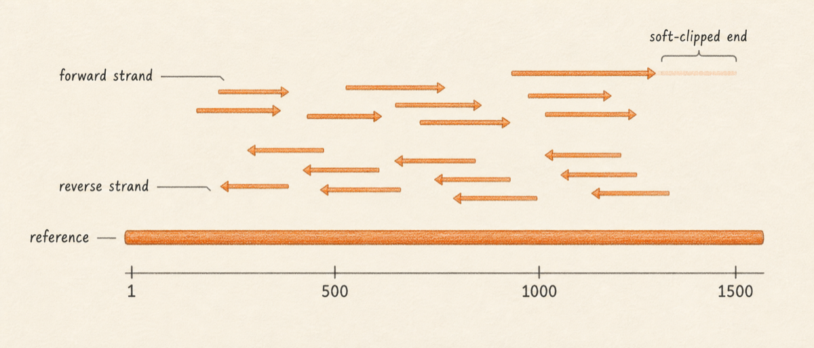
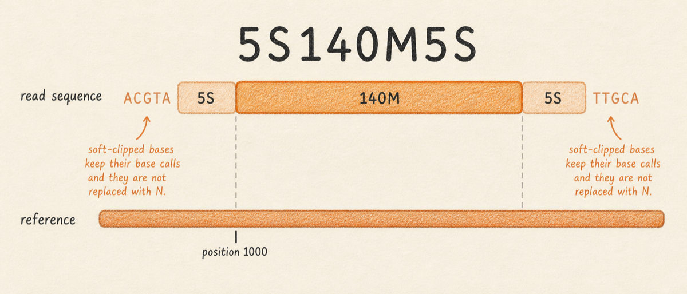
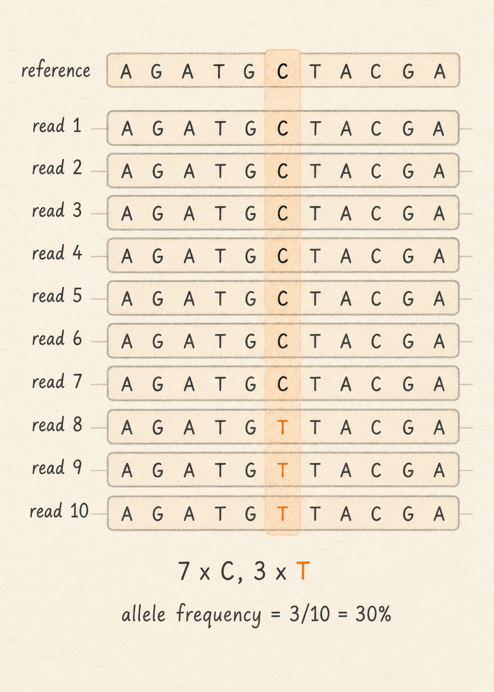

After a FASTQ read comes off a sequencer, one common next step is to figure out where on the reference genome it came from. A read [mapper](../../GLOSSARY.md#mapper) takes a FASTQ file and a reference genome and produces a [BAM](../../GLOSSARY.md#bam) file that records, for every read, the position on the reference where the read best matches. A [BAI](../../GLOSSARY.md#bai) file is the companion index that lets viewers and downstream tools jump to a specific position quickly without reading the whole BAM. This matters because real BAM files can hold hundreds of millions or billions of reads against genomes that are billions of nucleotides long. LGE supports several mappers behind the scenes, and the user-facing surface for everything in this chapter is the BAM viewport, where reads stack on top of the reference and the coverage track sits along the top.

[Mapping](../../GLOSSARY.md#mapping) is the bridge between raw reads and many biological questions. Variant calling, primer trimming, coverage QC, and consensus generation all read a BAM. If the BAM is wrong (wrong reference, wrong mapper for the read type, missing index), every step downstream is wrong. Reading a BAM well is one of the most useful skills the chapters that follow assume.

This chapter introduces three ideas. First, what a BAM file actually contains: one record per alignment, with a mapping position, an orientation (forward or reverse strand), per-base qualities, and a [CIGAR](../../GLOSSARY.md#cigar) string that says which bases match, which are inserted or deleted, and which are clipped. Second, what [coverage](../../GLOSSARY.md#coverage) means: at each position on the reference, how many reads cover that position. In this manual coverage and depth are synonyms. Third, what a [pileup](../../GLOSSARY.md#pileup) is: the column of bases observed at one specific reference position across all the reads that cover it. Variant callers read pileups, position by position, and decide whether enough reads disagree with the reference to report a variant.

So what should you do with this? When you open a BAM in LGE, look at the coverage track first, then zoom in to a position and read the pileup the way the variant caller will read it.

## What you will learn

By the end of this chapter you will be able to recognise a BAM file by its `.bam` extension and the requirement that it travel with a `.bam.bai` (or `.csi`) index, know that "coverage" and "depth" mean the same thing in this manual, read a per-position pileup as the evidence the variant caller will use, recognise a [CIGAR](../../GLOSSARY.md#cigar) string and explain what soft-clipping means for primer-trimmed reads, and understand why long-read BAMs and short-read BAMs share a file format but display very differently.

## Mapping, in one paragraph

A mapper takes a read and asks: where on the reference does this sequence fit best, allowing for some mismatches and small insertions or deletions? The answer is a position (the leftmost reference coordinate the read covers), a [strand](../../GLOSSARY.md#strand) (forward if the read sequence aligns as written, reverse if it aligns to the reverse complement), and a CIGAR string that describes, base by base, how the read aligns. A read that fits well anchors confidently at one place. A read that fits two places equally well gets a low mapping quality ([MAPQ](../../GLOSSARY.md#mapq)), and most callers ignore it. A read that does not fit anywhere is recorded as unmapped and carries no position.



LGE ships four mappers and chooses sensible defaults by read type. [minimap2](https://github.com/lh3/minimap2) is the default for long reads (Oxford Nanopore, PacBio) and for many short-read jobs. [BWA-MEM2](https://github.com/bwa-mem2/bwa-mem2) is offered for short paired-end Illumina data. [Bowtie2](https://github.com/BenLangmead/bowtie2) is offered for users who want a familiar short-read aligner. [BBMap](https://sourceforge.net/projects/bbmap/) is offered for messier reads where local alignment helps. The mapper choice matters, but the BAM format does not change with the mapper. Every BAM has the same columns regardless of which tool produced it.

## What is in a BAM file

BAM is the binary form of SAM. SAM is the text format defined by the [SAM/BAM specification](https://samtools.github.io/hts-specs/SAMv1.pdf), with one record per alignment and a header describing the reference contigs. BAM is the same data, gzipped block by block, with an index. Project-stored alignment tracks in LGE are always sorted, indexed BAMs; the GUI surfaces never present a SAM file for user-level work. Some external tools emit SAM as an intermediate, and LGE converts those outputs to sorted, indexed BAM in the same workflow step.

A BAM stores one record per alignment, not one per read. A single sequenced read can generate several records: a primary alignment, secondary alignments (alternative equally-good mappings), [supplementary alignments](../../GLOSSARY.md#supplementary-alignment) (chimeric or split-read alignments common for long reads), and an unmapped record if the read failed to map. The [FLAG](../../GLOSSARY.md#flag) column (a bitwise integer with twelve canonical bits) tells tools how to interpret each record, including which mate of a pair it is and whether it is primary or secondary. Treat "one read" and "one BAM record" as related but not identical concepts; coverage and pileup calculations need to know the difference.

Each record carries the read name, the reference contig, the leftmost reference position the record covers (1-based), the FLAG, the mapping quality, the CIGAR string, the read sequence, the per-base Phred qualities, and a small set of optional tags that the mapper can attach. The header at the top of the file lists every reference contig with its length, so any consumer of the BAM knows exactly what coordinate system the records are using.

A 150-base Illumina read mapping at reference position 1000 with five soft-clipped bases at each end might look (in human-readable form) like this:

```
read_id   : SRR36291587.4231
flag      : 99 (paired, mapped, mate mapped, forward strand)
RNAME     : MN908947.3
POS       : 1000
MAPQ      : 60
CIGAR     : 5S140M5S
SEQ       : ACGTAACGTGTCTCTGCCG...ACGTACGTTTGCA  (150 bases)
QUAL      : !!!!!FFFFFFFFFFF...FFFFFF!!!!!         (Phred string)
```



The CIGAR `5S140M5S` says: the first five bases are soft-clipped, the next 140 bases are aligned to the reference (matches or mismatches, the CIGAR does not distinguish), and the last five bases are soft-clipped. The record still occupies 150 bases of memory, but only the middle 140 contribute to anything downstream. The soft-clipped bases keep their original base calls and qualities for traceability. They are not replaced with `N`.

## The BAI index, and why it must travel with the BAM

A BAM file by itself can only be read sequentially. The BAI index lets a viewer jump to "position 23000 on MN908947.3" in milliseconds without reading the gigabytes of reads that come before. Every BAM that LGE writes is paired with a `.bam.bai` alongside it. If you copy a BAM into a project and the index is missing, LGE rebuilds it when the file is loaded; the rebuild is fast for small viral BAMs but takes time proportional to file size for human-scale data. Treat BAM and BAI as a single unit. They belong in the same folder with the same base name.

For viral and small-genome work the BAI format is sufficient. The BAI format has a per-contig size limit of 512 megabases; references with individual contigs longer than that (some plant genomes, the lungfish nuclear genome itself, gapless human builds with very long chromosomes) need the CSI index format instead. LGE creates the appropriate index automatically; you only need to know that two index extensions exist if you see one in a third-party file.

## Coverage, depth, and the coverage track

At each reference position, the number of reads that cover that position is the coverage at that position. Some sources call this depth; in this manual the two words are interchangeable. The coverage track at the top of the BAM viewport shows coverage as a histogram across the reference, one bar per position (or one bar per pixel-bin when zoomed out). A SARS-CoV-2 amplicon run typically shows coverage in the hundreds to low thousands across most of the genome, with sharp dips at amplicon boundaries and at primer dropouts.


Low-coverage regions are the first thing to investigate in a new BAM. A position with five reads of coverage cannot support a confident variant call. A position with zero coverage cannot be called at all and will appear as `N` in the consensus. Coverage tells you which parts of the genome the run actually saw.

## Pileup: what the variant caller sees at one position

A pileup is the column of bases observed at one reference position across every read that covers it. Imagine the reference printed as a horizontal line, the reads stacked underneath wherever they map, and a vertical slice taken at position 1000. The slice contains one base per read at that position, plus the per-base quality of each, plus which strand each read came from. That slice is the pileup.



An example. At reference position 1000 the reference base is `C`. Ten reads cover the position. Seven of them show `C`. Three of them show `T`. The [allele frequency](../../GLOSSARY.md#allele-frequency) of the alternate base `T` is 3 divided by 10, or 30 percent. A variant caller looking at this column will weigh the evidence (how many reads, what their qualities are, whether both strands agree) and decide whether to emit a `C>T` call at position 1000 with allele frequency 0.30. If the same column showed nine `C` and one `T`, the alternate would sit at 10 percent and most callers would treat it as too rare to call confidently (LGE's iVar and LoFreq lanes default to a minimum alternate-allele frequency of 0.05, so a 10 percent ALT is reportable but a 0.5 percent ALT is not). If the column showed zero `C` and ten `T`, the alternate would sit at 100 percent and the call would be a confident fixed substitution. The pileup is the evidence; the variant caller is the judge.

## Soft-clipping and primer trimming

[Soft-clipping](../../GLOSSARY.md#soft-clip) is how the BAM format records "this record had bases that did not align, but I am keeping them in the file anyway". The unaligned bases stay in the read sequence and quality string, but the CIGAR marks them with `S`, and downstream tools that respect the CIGAR will skip them. Hard-clipping (`H` in the CIGAR) is the harsher cousin that drops the bases entirely; LGE uses soft-clipping wherever possible.

Primer trimming is the most common reason a BAM ends up with soft-clipped ends. In an amplicon protocol, the first few dozen bases of every read are primer-derived rather than sample-derived, and counting them as evidence in a pileup would bias the variant call toward whatever the primer sequence happens to be. LGE's BAM-level primer trim runs `ivar trim` against a primer scheme and rewrites the BAM so that primer regions are soft-clipped (see [Amplicons and Shotgun Sequencing](03-amplicon-vs-shotgun.md) for the alternative read-based trim path). Most records pass through unchanged in count, but some `ivar trim` options can drop records whose remaining aligned span is too short. The coverage track stays readable, and the variant caller sees only the non-primer bases. A primer-trimmed BAM and an untrimmed BAM look identical in the viewport at first glance; the difference is in the CIGAR strings.

## Strand, and a preview of strand bias

Each BAM record carries a [strand](../../GLOSSARY.md#strand): forward if it aligned as sequenced, reverse if the mapper aligned its reverse complement. In a healthy shotgun run the reads at any position come roughly evenly from both strands, because fragments are sampled in both orientations. Strand becomes interesting at variant positions. If a candidate variant is supported by ten forward-strand reads and zero reverse-strand reads, the imbalance is suspicious: it might mean a sequencing artifact tied to one strand rather than a real biological signal. This pattern is called [strand bias](../../GLOSSARY.md#strand-bias).

Amplicon data systematically violates the strand-balance assumption that the default strand-bias filter is tuned for, because primers fix the strand orientation at each amplicon boundary. The right response is to adjust filter thresholds and to inspect the pileup at flagged positions in context, not to dismiss every strand-biased call. The variant calling chapters revisit this with concrete defaults and dialog settings.

## Long reads versus short reads

A BAM produced from Illumina paired-end reads and a BAM produced from Oxford Nanopore reads share the same file format and the same columns. The contents look very different. A short-read BAM has many short alignment records (typically 150 bases each), high mapping qualities, low per-base error rates, and a coverage track that is fairly even within an amplicon. A long-read BAM has fewer, much longer records (often 1000 to 50,000 bases), more insertions and deletions in the CIGAR, lower per-base quality, and frequently soft-clipped ends where the read ran past a contig boundary or a supplementary record split the alignment. LGE reads both, but the recommended variant caller differs: LoFreq or iVar for short reads, Medaka or Clair3 for Oxford Nanopore. The viewport behaves the same way; only the appearance of the records changes.

## Next

Continue to [Variants and VCF Files](05-variants-and-vcf.md) to learn how the pileup gets summarized as a list of disagreements with the reference.
