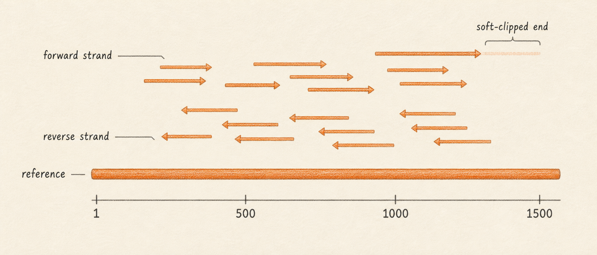
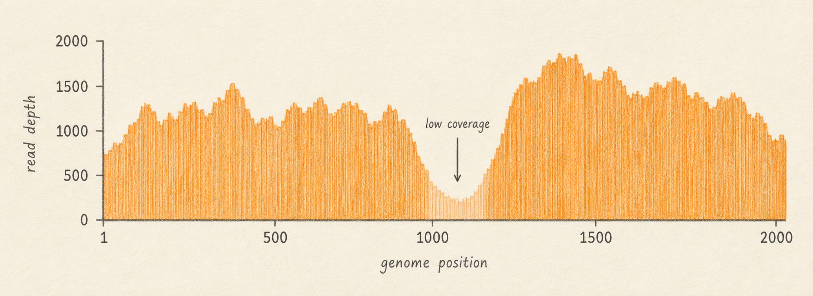

## What it is

After a FASTQ read leaves the sequencer, the next step is to figure out where on the reference genome it came from. A read mapper takes a FASTQ file and a reference genome and produces a BAM file that records, for every read, the position on the reference where the read best matches. A BAI file is the companion index that lets viewers and downstream tools jump to a specific position quickly without reading the whole BAM. Lungfish supports several mappers behind the scenes, and the user-facing surface for everything in this chapter is the BAM viewport, where reads stack on top of the reference and the coverage track sits along the top.

Mapping is the bridge between raw reads and any biological question. Variant calling, primer trimming, coverage QC, and consensus generation all read a BAM. If the BAM is wrong (wrong reference, wrong mapper for the read type, missing index), every step downstream is wrong. Reading a BAM well is the single most useful skill in this manual.

This chapter introduces three ideas. First, what a BAM file actually contains: one row per read, with a mapping position, an orientation (forward or reverse strand), per-base qualities, and a CIGAR string that says which bases match, which are inserted or deleted, and which are clipped. Second, what coverage means: at each position on the reference, how many reads cover that position. In this manual coverage and depth are synonyms. Third, what a pileup is: the column of bases observed at one specific reference position across all the reads that cover it. Variant callers read pileups, position by position, and decide whether enough reads disagree with the reference to report a variant.

So what should you do with this? When you open a BAM in Lungfish, look at the coverage track first, then zoom in to a position and read the pileup the way the variant caller will read it.

## What you will learn

By the end of this chapter you will be able to recognize a BAM file by its `.bam` extension and the requirement that it travel with a `.bam.bai` index, know that "coverage" and "depth" mean the same thing in this manual, read a per-position pileup as the evidence the variant caller will use, recognise a CIGAR string and explain what soft-clipping means for primer-trimmed reads, and understand why long-read BAMs and short-read BAMs share a file format but display very differently.

## Mapping, in one paragraph

A mapper takes a read and asks: where on the reference does this sequence fit best, allowing for some mismatches and small insertions or deletions? The answer is a position (the leftmost reference coordinate the read covers), a strand (forward if the read sequence aligns as written, reverse if it aligns to the reverse complement), and a CIGAR string that describes, base by base, how the read aligns. A read that fits well anchors confidently at one place. A read that fits two places equally well gets a low mapping quality (`MAPQ`), and most callers ignore it. A read that does not fit anywhere is recorded as unmapped and carries no position.



Lungfish ships four mappers and chooses sensible defaults by read type. `minimap2` is the default for long reads (Oxford Nanopore, PacBio) and for many short-read jobs. `BWA-MEM2` is offered for short paired-end Illumina data. `Bowtie2` is offered for users who want a familiar short-read aligner. `BBMap` is offered for messier reads where local alignment helps. The mapper choice matters, but the BAM format does not change with the mapper. Every BAM has the same columns regardless of which tool produced it.

## What is in a BAM file

BAM is the binary form of SAM. SAM is the text format defined by the SAM/BAM specification, with one row per read alignment and a header describing the reference contigs. BAM is the same data, gzipped block by block, with an index. Lungfish always reads and writes BAMs, never SAMs, because a SAM of a real sequencing run is ten times larger and cannot be indexed for random access. If a tool emits SAM (some mappers do), Lungfish converts it to a sorted, indexed BAM in the same step and deletes the SAM.

Each row in a BAM describes one alignment of one read against the reference. The row carries the read name, the reference contig, the leftmost reference position the read covers (1-based), the strand, the mapping quality, the CIGAR string, the read sequence, the per-base Phred qualities, and a small set of optional tags that the mapper can attach. The header at the top of the file lists every reference contig with its length, so any consumer of the BAM knows exactly what coordinate system the rows are using.

A 150-base Illumina read mapping at reference position 1000 with five soft-clipped bases at each end might look (in human-readable form) like this:

```
read_id   : SRR36291587.4231
flag      : 99 (paired, mapped, mate mapped, forward strand)
RNAME     : MN908947.3
POS       : 1000
MAPQ      : 60
CIGAR     : 5S140M5S
SEQ       : ACGTAACGTGTCTCTGCCG...ACGTACGTTTGCA  (150 bases)
QUAL      : !!!!!FFFFFFFFFFF...FFFFFF!!!!!         (Phred string)
```


The CIGAR `5S140M5S` says: the first five bases are soft-clipped, the next 140 bases are aligned to the reference (matches or mismatches, the CIGAR does not distinguish), and the last five bases are soft-clipped. The read still occupies 150 bases of memory, but only the middle 140 contribute to anything downstream. The soft-clipped bases keep their original base calls and qualities for traceability. They are not replaced with `N`.

## The BAI index, and why it must travel with the BAM

A BAM file by itself can only be read sequentially. The BAI index lets a viewer jump to "position 23000 on MN908947.3" in milliseconds without reading the gigabytes of reads that come before. Every BAM that Lungfish reads or writes has a `.bam.bai` next to it. If you copy a BAM to another folder and forget the index, Lungfish will offer to regenerate it, but the regeneration takes time proportional to the file size. Treat BAM and BAI as a single unit. They belong in the same folder with the same base name.

## Coverage, depth, and the coverage track

At each reference position, the number of reads that cover that position is the coverage at that position. Some sources call this depth; in this manual the two words are interchangeable. The coverage track at the top of the BAM viewport shows coverage as a histogram across the reference, one bar per position (or one bar per pixel-bin when zoomed out). A SARS-CoV-2 amplicon run typically shows coverage in the hundreds to low thousands across most of the genome, with sharp dips at amplicon boundaries and at primer dropouts.



Low-coverage regions are the first thing to investigate in a new BAM. A position with five reads of coverage cannot support a confident variant call. A position with zero coverage cannot be called at all and will appear as `N` in the consensus. Coverage tells you which parts of the genome the run actually saw.

## Pileup: what the variant caller sees at one position

A pileup is the column of bases observed at one reference position across every read that covers it. Imagine the reference printed as a horizontal line, the reads stacked underneath wherever they map, and a vertical slice taken at position 1000. The slice contains one base per read at that position, plus the per-base quality of each, plus which strand each read came from. That slice is the pileup.


A worked example. At reference position 1000 the reference base is `C`. Ten reads cover the position. Seven of them show `C`. Three of them show `T`. The allele frequency of the alternate base `T` is 3 divided by 10, or 30 percent. A variant caller looking at this column will weigh the evidence (how many reads, what their qualities are, whether both strands agree) and decide whether to emit a `C>T` call at position 1000 with allele frequency 0.30. If the same column showed nine `C` and one `T`, the alternate would sit at 10 percent and most callers would treat it as too rare to call confidently. If the column showed zero `C` and ten `T`, the alternate would sit at 100 percent and the call would be a confident fixed substitution. The pileup is the evidence; the variant caller is the judge.

## Soft-clipping and primer trimming

Soft-clipping is how the BAM format records "this read had bases that did not align, but I am keeping them in the file anyway". The unaligned bases stay in the read sequence and quality string, but the CIGAR marks them with `S`, and downstream tools that respect the CIGAR will skip them. Hard-clipping (`H` in the CIGAR) is the harsher cousin that drops the bases entirely; Lungfish uses soft-clipping wherever possible.

Primer trimming is the most common reason a BAM ends up with soft-clipped ends. In an amplicon protocol, the first few dozen bases of every read are primer-derived rather than sample-derived, and counting them as evidence in a pileup would bias the variant call toward whatever the primer sequence happens to be. Lungfish runs `ivar trim` against a primer scheme and rewrites the BAM so that primer regions are soft-clipped. The reads are still there, the read counts still match, the coverage track is still readable, but the variant caller sees only the non-primer bases. A primer-trimmed BAM and an untrimmed BAM look identical in the viewport at first glance; the difference is in the CIGAR strings.

## Strand, and a preview of strand bias

Each read in a BAM carries a strand: forward if it aligned as sequenced, reverse if the mapper aligned its reverse complement. In a healthy run the reads at any position come roughly evenly from both strands, because fragments are sampled in both orientations. Strand becomes interesting at variant positions. If a candidate variant is supported by ten forward-strand reads and zero reverse-strand reads, the imbalance is suspicious: it might mean a sequencing artifact tied to one strand rather than a real biological signal. This pattern is called strand bias, and variant callers usually apply a strand-bias filter to flag it. Amplicon data systematically violates the strand-bias assumption (primers fix the strand at each amplicon boundary), so the filter is normally turned off for amplicon workflows. The variant calling chapters revisit this in detail.

## Long reads versus short reads

A BAM produced from Illumina paired-end reads and a BAM produced from Oxford Nanopore reads share the same file format and the same columns. The contents look very different. A short-read BAM has many short rows (typically 150 bases each), high mapping qualities, low per-base error rates, and a coverage track that is fairly even within an amplicon. A long-read BAM has fewer, much longer rows (often 1000 to 50,000 bases), more insertions and deletions in the CIGAR, lower per-base quality, and frequently soft-clipped ends where the read ran past a contig boundary. Lungfish reads both, but the recommended variant caller differs: LoFreq or iVar for short reads, Medaka for Oxford Nanopore. The viewport behaves the same way; only the appearance of the reads changes.

## Next

Continue to [Variants and VCF Files](05-variants-and-vcf.md) to learn how the pileup gets summarized as a list of disagreements with the reference.
