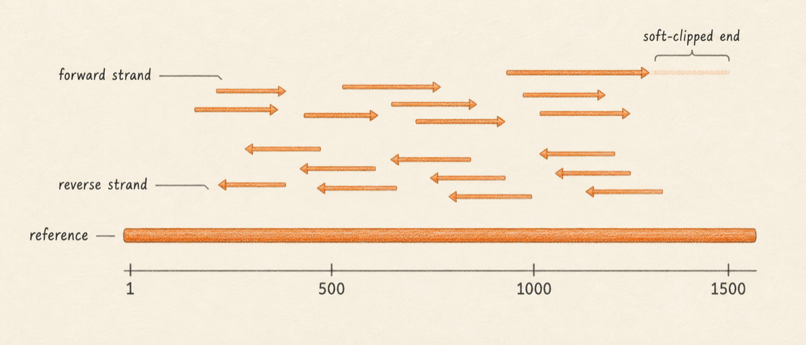
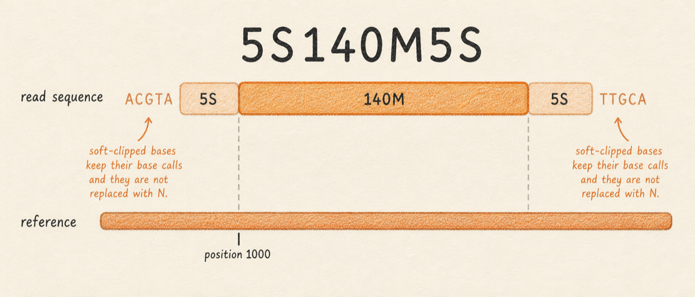
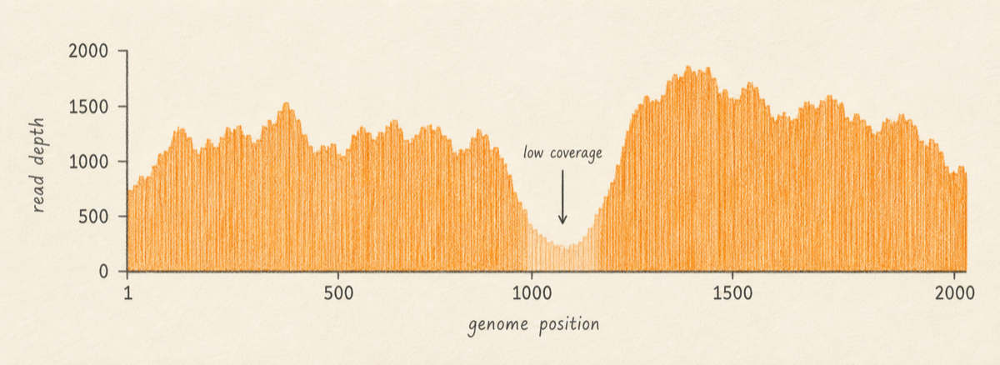
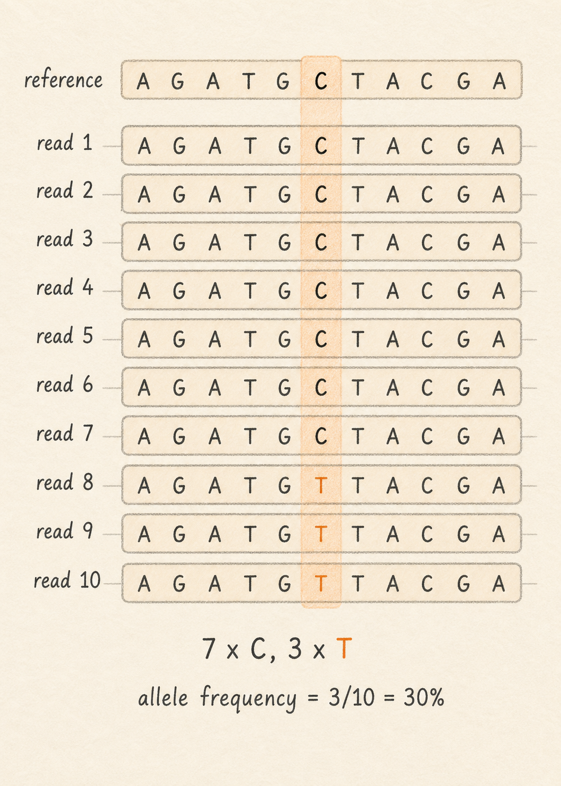

Once a FASTQ read comes off the sequencer, a common next step is to work out where on the reference genome it came from. A read [mapper](../../GLOSSARY.md#mapper) takes a FASTQ file and a reference genome and produces a [BAM](../../GLOSSARY.md#bam) file that records, for every read, the position on the reference where it best matches. A [BAI](../../GLOSSARY.md#bai) file is the companion index that lets viewers and downstream tools jump to a chosen position without reading the whole BAM. That shortcut matters, because real BAM files can hold hundreds of millions or billions of reads against genomes billions of nucleotides long. LGE runs several mappers behind the scenes, and the surface you actually work with in this chapter is the BAM viewport, where reads stack on top of the reference and the coverage track runs along the top.

[Mapping](../../GLOSSARY.md#mapping) is the bridge between raw reads and almost every biological question you might ask. Variant calling, primer trimming, coverage QC, and consensus generation all read a BAM. If the BAM is wrong (wrong reference, wrong mapper for the read type, missing index), everything downstream is wrong with it. Reading a BAM well is one of the most useful skills the chapters that follow take for granted.

Three ideas run through this chapter. The first is what a BAM file actually holds: one record per alignment, each with a mapping position, an orientation (forward or reverse strand), per-base qualities, and a [CIGAR](../../GLOSSARY.md#cigar) string that says which bases match, which are inserted or deleted, and which are clipped. The second is [coverage](../../GLOSSARY.md#coverage): at each position on the reference, how many reads cover it. In this manual, coverage and depth are the same word. The third is the [pileup](../../GLOSSARY.md#pileup): the column of bases observed at one specific reference position across all the reads that cover it. Variant callers read pileups position by position and decide whether enough reads disagree with the reference to report a variant.

The habit to build: when you open a BAM in LGE, read the coverage track first, then zoom to a position and read the pileup the way the variant caller will.

## What you will learn

This chapter leaves you able to recognise a BAM file by its `.bam` extension and the rule that it must travel with a `.bam.bai` (or `.csi`) index, to treat "coverage" and "depth" as one thing in this manual, to read a per-position pileup as the evidence the variant caller will weigh, to recognise a [CIGAR](../../GLOSSARY.md#cigar) string and say what soft-clipping means for primer-trimmed reads, and to understand why long-read BAMs and short-read BAMs share a file format yet look so different on screen.

## Mapping, in one paragraph

A mapper takes a read and asks one question: where on the reference does this sequence fit best, allowing for a few mismatches and small insertions or deletions? The answer comes in three parts: a position (the leftmost reference coordinate the read covers), a [strand](../../GLOSSARY.md#strand) (forward if the read aligns as written, reverse if it aligns to the reverse complement), and a CIGAR string that spells out, base by base, how the read aligns. A read that fits well anchors confidently in one place. A read that fits two places equally well earns a low mapping quality ([MAPQ](../../GLOSSARY.md#mapq)), and most callers pass it by. A read that fits nowhere is filed as unmapped and carries no position at all.



LGE ships four mappers and picks a sensible default by read type. [minimap2](https://github.com/lh3/minimap2) is the default for long reads (Oxford Nanopore, PacBio) and for many short-read jobs. [BWA-MEM2](https://github.com/bwa-mem2/bwa-mem2) is on offer for short paired-end Illumina data. [Bowtie2](https://github.com/BenLangmead/bowtie2) is there for anyone who wants a familiar short-read aligner. [BBMap](https://sourceforge.net/projects/bbmap/) handles messier reads where local alignment helps. The choice of mapper matters, but the BAM format does not budge with it. Every BAM carries the same columns, whichever tool produced it.

## What is in a BAM file

BAM is the binary form of SAM. SAM is the text format set out in the [SAM/BAM specification](https://samtools.github.io/hts-specs/SAMv1.pdf), one record per alignment, with a header describing the reference contigs. BAM holds the same data, gzipped block by block, with an index bolted on. Project-stored alignment tracks in LGE are always sorted, indexed BAMs; the GUI never puts a raw SAM file in front of you. Some external tools emit SAM as an intermediate, and LGE folds those outputs into sorted, indexed BAM in the same workflow step.

A BAM stores one record per alignment, not one per read. A single sequenced read can spawn several records: a primary alignment, secondary alignments (alternative, equally good mappings), [supplementary alignments](../../GLOSSARY.md#supplementary-alignment) (chimeric or split-read alignments, common for long reads), and an unmapped record if the read never found a home. The [FLAG](../../GLOSSARY.md#flag) column, a bitwise integer with twelve canonical bits, tells tools how to read each record: which mate of a pair it is, whether it is primary or secondary. Treat "one read" and "one BAM record" as cousins, not twins; coverage and pileup calculations depend on the difference.

Each record carries the read name, the reference contig, the leftmost reference position it covers (1-based), the FLAG, the mapping quality, the CIGAR string, the read sequence, the per-base Phred qualities, and a small set of optional tags the mapper can attach. The header at the top of the file lists every reference contig with its length, so anything reading the BAM knows exactly which coordinate system the records speak.

A 150-base Illumina read mapping at reference position 1000, with five soft-clipped bases at each end, might look like this in human-readable form:

```
read_id   : SRR36291587.4231
flag      : 99 (paired, mapped, mate mapped, forward strand)
RNAME     : MN908947.3
POS       : 1000
MAPQ      : 60
CIGAR     : 5S140M5S
SEQ       : ACGTAACGTGTCTCTGCCG...ACGTACGTTTGCA  (150 bases)
QUAL      : !!!!!FFFFFFFFFFF...FFFFFF!!!!!         (Phred string)
```



The CIGAR `5S140M5S` reads left to right: the first five bases are soft-clipped, the next 140 are aligned to the reference (matches or mismatches, which the CIGAR does not distinguish), and the last five are soft-clipped. In memory the record still occupies all 150 bases, but only the middle 140 feed anything downstream. The soft-clipped bases keep their original calls and qualities for traceability. They are not overwritten with `N`.

## The BAI index, and why it must travel with the BAM

A BAM on its own can only be read straight through, front to back. The BAI index lets a viewer jump to "position 23000 on MN908947.3" in milliseconds, skipping the gigabytes of reads that come before. Every BAM LGE writes gets a `.bam.bai` alongside it. Copy a BAM into a project without its index and LGE rebuilds one when the file loads: quick for small viral BAMs, slower in proportion to file size for human-scale data. Treat BAM and BAI as a single unit. They belong in the same folder under the same base name.

For viral and small-genome work, BAI is enough. It carries a per-contig size limit of 512 megabases, so references with a single contig longer than that (some plant genomes, the axolotl genome, gapless human builds with very long chromosomes) need the CSI index format instead. LGE creates the right index for you automatically; the only reason to know both extensions exist is so you recognise one when it turns up in a third-party file.

## Coverage, depth, and the coverage track

At each reference position, the number of reads covering it is the coverage there. Some sources call it depth; in this manual the two words are interchangeable. The coverage track at the top of the BAM viewport draws coverage as a histogram across the reference, one bar per position, or one bar per pixel-bin when you zoom out. A SARS-CoV-2 amplicon run typically runs coverage in the hundreds to low thousands across most of the genome, with sharp dips at amplicon boundaries and at primer dropouts.



Low-coverage regions are the first thing to check in a new BAM. A position with five reads behind it cannot support a confident variant call. A position with zero coverage cannot be called at all and shows up as `N` in the consensus. Coverage tells you which parts of the genome the run actually saw.

## Pileup: what the variant caller sees at one position

A pileup is the column of bases seen at one reference position across every read that covers it. Picture the reference printed as a horizontal line, the reads stacked underneath wherever they map, and a vertical slice cut at position 1000. The slice holds one base per read at that position, each base's quality, and the strand each read came from. That slice is the pileup.



An example. At reference position 1000 the reference base is `C`. Ten reads cover the position. Seven show `C`, three show `T`. The [allele frequency](../../GLOSSARY.md#allele-frequency) of the alternate base `T` is 3 divided by 10, or 30 percent. A variant caller reading this column weighs the evidence (how many reads, what their qualities are, whether both strands agree) and decides whether to emit a `C>T` call at position 1000 with allele frequency 0.30. Had the column shown nine `C` and one `T`, the alternate would sit at 10 percent, and most callers would judge it too rare to call with confidence (LGE's iVar and LoFreq lanes default to a minimum alternate-allele frequency of 0.05, so a 10 percent ALT is reportable but a 0.5 percent ALT is not). Had it shown zero `C` and ten `T`, the alternate would sit at 100 percent and the call would be a confident fixed substitution. The pileup is the evidence; the variant caller is the judge.

## Soft-clipping and primer trimming

[Soft-clipping](../../GLOSSARY.md#soft-clip) is how the BAM format says "this record had bases that did not align, but I am keeping them anyway." The unaligned bases stay in the read sequence and quality string, the CIGAR marks them with `S`, and any downstream tool that respects the CIGAR skips them. Hard-clipping (`H` in the CIGAR) is the harsher cousin that drops the bases outright; LGE uses soft-clipping wherever it can.

Primer trimming is the most common reason a BAM ends up with soft-clipped ends. In an amplicon protocol the first few dozen bases of every read are primer-derived, not sample-derived, and counting them as evidence in a pileup would tilt the variant call toward whatever the primer sequence happens to be. LGE's BAM-level primer trim runs `ivar trim` against a primer scheme and rewrites the BAM so that primer regions are soft-clipped (see [Amplicons and Shotgun Sequencing](03-amplicon-vs-shotgun.md) for the alternative read-based trim path). Most records pass through, their count unchanged, though some `ivar trim` options can drop records whose remaining aligned span is too short. The coverage track stays readable, and the variant caller sees only the non-primer bases. A primer-trimmed BAM and an untrimmed one look identical in the viewport at first glance; the difference hides in the CIGAR strings.

## Strand, and a preview of strand bias

Each BAM record carries a [strand](../../GLOSSARY.md#strand): forward if it aligned as sequenced, reverse if the mapper aligned its reverse complement. In a healthy shotgun run, the reads at any position arrive roughly evenly from both strands, because fragments are sampled in both orientations. Strand gets interesting at variant positions. If a candidate variant rests on ten forward-strand reads and zero reverse-strand reads, the imbalance is suspicious: it may signal a sequencing artifact tied to one strand rather than a real biological event. That pattern is [strand bias](../../GLOSSARY.md#strand-bias).

Amplicon data breaks the strand-balance assumption the default strand-bias filter is tuned for, systematically, because primers fix the strand orientation at each amplicon boundary. The right response is to adjust the filter thresholds and inspect the pileup at flagged positions in context, not to throw out every strand-biased call. The variant calling chapters return to this with concrete defaults and dialog settings.

## Long reads versus short reads

A BAM from Illumina paired-end reads and a BAM from Oxford Nanopore reads share the same file format and the same columns. Their contents look nothing alike. A short-read BAM carries many short alignment records (typically 150 bases each), high mapping qualities, low per-base error rates, and a coverage track that stays fairly even within an amplicon. A long-read BAM carries fewer, far longer records (often 1000 to 50,000 bases), more insertions and deletions in the CIGAR, lower per-base quality, and frequent soft-clipped ends where a read overran a contig boundary or a supplementary record split the alignment. LGE reads both, but the recommended variant caller differs: LoFreq or iVar for short reads, Medaka or Clair3 for Oxford Nanopore. The viewport behaves the same either way; only the look of the records changes.

## Next

Continue to [Variants and VCF Files](05-variants-and-vcf.md) to learn how the pileup gets summarized as a list of disagreements with the reference.
