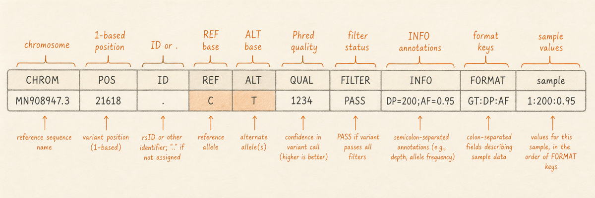
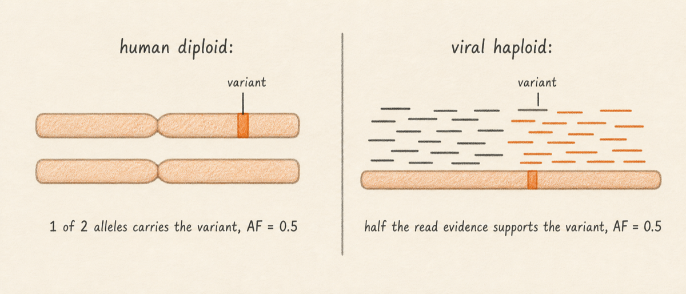
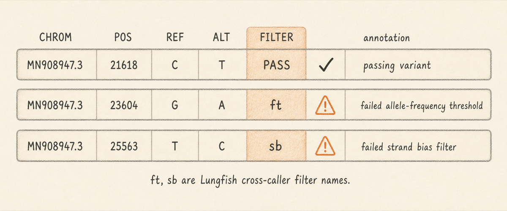

## What it is

A variant is a position on a reference genome where the reads from your sample disagree with the reference base. The disagreement might be a single-base substitution (a SNP, such as `C` in the reference being read as `T` in your sample), an insertion of one or more bases that the reference does not have, a deletion of one or more bases the reference does have, or a larger structural rearrangement. Whatever the shape, the unit of analysis is the same: a coordinate on the reference, the base or bases the reference has there, and the base or bases the reads support instead. (Larger structural rearrangements need specialised tools beyond the scope of this chapter; the callers covered here handle SNPs and small insertions or deletions.)

A [VCF](../../GLOSSARY.md#vcf) (Variant Call Format) file is the standard tab-separated table that lists those disagreements. A [variant caller](../../GLOSSARY.md#variant-caller) reads a BAM file (you met BAMs in [Alignment Files](04-alignment-files.md)), walks down the reference position by position, examines the [pileup](../../GLOSSARY.md#pileup) at each position, applies thresholds for evidence (minimum depth, minimum allele frequency, minimum base quality, strand-bias checks), and emits one VCF row for every position that clears the thresholds. The VCF is the analysable output of every variant-calling workflow in this manual. When this chapter says "variant" it means one row of a VCF.

This chapter walks through the eight standard VCF columns, the per-sample payload that follows them, the [FILTER](../../GLOSSARY.md#filter) flags LGE's variant callers attach, and one specific interpretation point that has tripped every audience reviewer so far: in a single-organism viral sample, allele frequency means the fraction of reads supporting the alternate base, not the fraction of alleles in a diploid genome carrying the variant. By the end you should be able to look at a VCF row and read it the way the variant caller intended.

So what should you do with this? Read it once before the variants part of the manual. Every later chapter assumes you can name the columns and interpret allele frequency in a haploid context.

One caveat about VCF field semantics that the chapter returns to in detail. The meaning of `AF`, `GT`, `QUAL`, and `FILTER` is set by the VCF header for each file, not by the format itself. The conventions in this chapter describe LGE's viral haploid output. When you open a human germline VCF from GATK, a joint-called cohort VCF, or a pooled-sample wastewater VCF, the same field names can carry different semantics and the file's own header is the authoritative source.

## What you will learn

By the end of this chapter you will be able to read a VCF row and name what every column means; interpret allele frequency in a viral context (a fraction of reads, not of alleles); identify a high-confidence variant by combining `PASS` filter, allele frequency near 1.0, and depth above a few hundred; recognize the `INFO` and `FORMAT` payloads that carry per-row and per-sample detail; and find the same row in Lungfish's variant browser by clicking through to the table view.

## What a VCF file looks like

A VCF file is plain text. It has two regions: a header at the top and a body of variant rows below. Header lines begin with `##` and carry metadata (the file format version, the reference used, the meaning of every `INFO` and `FORMAT` field, the contigs, the variant caller's command line). One header line begins with a single `#` and names the columns. Every line below the column header is one variant.

A typical iVar VCF for a SARS-CoV-2 isolate begins with about 30 header lines and then a few hundred variant rows. Compressed and indexed VCFs (`.vcf.gz` paired with `.vcf.gz.tbi`) are the standard for production use. The compression is `bgzip` (block gzip), not ordinary gzip, and the index is a `tabix` index. Lungfish writes both files for every variant track it produces, so the variant browser can jump to any genomic region without scanning the whole file. When you see a `.vcf.gz` next to a `.vcf.gz.tbi`, treat them as a pair: the index is meaningless without the data, and the data is slow to query without the index.

A small VCF excerpt looks like this:

```
##fileformat=VCFv4.2
##source=lofreq call
##reference=MN908947.3
##INFO=<ID=DP,Number=1,Type=Integer,Description="Raw Depth">
##INFO=<ID=AF,Number=1,Type=Float,Description="Allele Frequency">
##FILTER=<ID=ft,Description="Failed allele-frequency threshold">
##FORMAT=<ID=GT,Number=1,Type=String,Description="Genotype">
##FORMAT=<ID=DP,Number=1,Type=Integer,Description="Depth">
##FORMAT=<ID=AF,Number=1,Type=Float,Description="Allele frequency">
#CHROM  POS    ID  REF  ALT  QUAL  FILTER  INFO              FORMAT      SRR36291587
MN908947.3  23403  .   A    G    228   PASS    DP=1842;AF=0.998  GT:DP:AF    1/1:1842:0.998
MN908947.3  1989   .   A    G    9     ft      DP=1750;AF=0.005  GT:DP:AF    0/0:1750:0.005
```

The first nine columns are the same in every VCF on earth. The tenth and any further columns are per-sample, one column per sample in the file. Lungfish's variant callers always produce single-sample VCFs, so there is exactly one sample column.

## The eight standard columns plus FORMAT

Each row of a VCF carries the same fields in the same order. The first eight describe the variant and its row-level metadata. The ninth column (`FORMAT`) declares what the per-sample payload looks like, and one or more sample columns follow with the actual values.



| Column   | What it carries                                                              | Example                |
|----------|------------------------------------------------------------------------------|------------------------|
| `CHROM`  | The reference contig or chromosome name. Must match the reference FASTA.     | `MN908947.3`           |
| `POS`    | The 1-based position on `CHROM` where the variant starts.                    | `23403`                |
| `ID`     | A database identifier (dbSNP, ClinVar) or `.` if none assigned.              | `.`                    |
| `REF`    | The reference base or bases at this position.                                | `A`                    |
| `ALT`    | The alternate base or bases observed in the reads.                           | `G`                    |
| `QUAL`   | Phred-scaled confidence that the variant is real. Higher is better.          | `228`                  |
| `FILTER` | `PASS` or a semicolon-separated list of named filters the row failed.        | `PASS`                 |
| `INFO`   | Semicolon-separated `KEY=VALUE` pairs of per-row metadata.                   | `DP=1842;AF=0.998`     |

A few details matter. `POS` is 1-based: the first base of the reference is position 1, not 0, the same convention you met in [What Is a Genome](01-what-is-a-genome.md). For an indel, `POS` names the base immediately before the insertion or deletion, and the `REF` and `ALT` strings include that base as an anchor; this is the convention `ivar`, `lofreq`, and `bcftools` all follow. `QUAL` is Phred-scaled, so a value of 20 means a 1% probability that the variant is a false positive and 30 means 0.1%. A `QUAL` of `.` means the caller did not score the row, which is common in LGE-normalised iVar output: iVar natively emits a TSV with a `PASS` boolean, and LGE's conversion to VCF sets `QUAL` to `.` where iVar did not score the row directly.

The ninth column, `FORMAT`, is a colon-separated list of keys that describe the per-sample payload. Lungfish's variant callers emit a small set of keys: `GT` (genotype), `DP` (depth at this position), `AF` (allele frequency), and sometimes `AD` (per-allele depths, a comma-separated list of read counts for each of REF and the ALT alleles). One sample column follows for each sample, with values in the same order as the FORMAT keys.

| FORMAT key | What it carries                                                                   |
|------------|-----------------------------------------------------------------------------------|
| `GT`       | Genotype, written diploid-style as `0/0`, `0/1`, `1/1`, or `./.` (missing).       |
| `DP`       | Number of reads covering this position.                                           |
| `AF`       | Fraction of reads at this position supporting the ALT base. Range 0.0 to 1.0.     |
| `AD`       | Comma-separated read counts per allele, in the order `REF,ALT`.                   |

Genotype notation is a quirk inherited from VCF's diploid origins. `0` means "the reference allele," `1` means "the first ALT allele," `2` means "the second ALT allele," and so on. In a viral haploid context the convention has flattened to `1/1` for a confidently-called variant and `0/0` (or the row simply not being emitted) for a confidently-called reference base. Treat the slash as cosmetic in viral data.

## Walking through one row

The high-confidence row from the excerpt above is worth reading column by column.

```
MN908947.3  23403  .  A  G  228  PASS  DP=1842;AF=0.998  GT:DP:AF  1/1:1842:0.998
```

`CHROM` is `MN908947.3`, the SARS-CoV-2 reference. `POS` is `23403`, the spike-gene position introduced in [What Is a Genome](01-what-is-a-genome.md). `ID` is `.`, meaning no public-database identifier has been attached. `REF` is `A`, the base at position 23403 on the reference. `ALT` is `G`, the base the reads support instead. `QUAL` is `228`, a high Phred score corresponding to a vanishingly small probability that the variant is a false positive. `FILTER` is `PASS`, meaning the row cleared every filter the caller applied.

`INFO` carries two row-level facts: `DP=1842` (1842 reads cover this position) and `AF=0.998` (99.8% of those reads carry the `G`). `FORMAT` declares that the sample column will list `GT`, then `DP`, then `AF`, separated by colons. The single sample column shows `1/1:1842:0.998`. The [genotype](../../GLOSSARY.md#genotype) `1/1` means "the alternate allele is the only allele observed"; in some haploid VCFs the same idea is written as a single `1`, and LGE's iVar lane uses `1/1` for compatibility with downstream diploid-shaped tooling. Depth `1842` repeats the row-level number (per-sample and per-row depth happen to be the same when there is only one sample). Allele frequency `0.998` likewise repeats the row-level value.

Read in plain English: at position 23403 of the SARS-CoV-2 reference, the reads disagreed with the reference `A` and supported `G` instead, the nucleotide change underlying the D614G spike substitution. There were 1842 reads at that position. 1840 of them carried `G`, two carried something else. The caller applied every filter, every filter passed, and the result is a high-confidence variant.

The other row in the excerpt is the opposite case.

```
MN908947.3  1989  .  A  G  9  ft  DP=1750;AF=0.005  GT:DP:AF  0/0:1750:0.005
```

`POS 1989`, `REF A`, `ALT G`, `QUAL 9` (low), `FILTER ft` (failed threshold), `DP=1750`, `AF=0.005`. Eight or nine reads out of 1750 carry the `G`. Everyone else carries the reference `A`. The allele frequency is well below the caller's minimum-AF threshold, so the row is flagged `ft`. Genotype is `0/0`, meaning the reads are dominantly reference. This is what sequencing-error noise looks like in a VCF: low allele frequency, low quality, a non-PASS filter, and a genotype that says "no, this is reference." The row is in the file because the caller saw a non-zero ALT count, but it is not a confident variant.

The contrast between those two rows is the basic reading skill this chapter trains. If you can sort a VCF, look at `FILTER`, `AF`, and `DP` together, and decide whether a row is signal or noise, you can read every Lungfish variant track.

## Allele frequency in haploid viral data

This section addresses the most common point of confusion when scientists move from human genomics to viral genomics, or arrive at viral genomics from a wet-lab background where VCF was a black box.

VCF was originally designed to describe human genetic variation, and humans are diploid: every position on a non-sex chromosome has two copies, one from each parent. In that context, `AF=0.5` means "one of the two chromosome copies carries the variant" (the sample is heterozygous for that position, written `0/1` in the GT field), and `AF=1.0` means "both copies carry the variant" (the sample is homozygous for the variant, `1/1`). This is the convention GATK and most human-genomics tooling assumes. Allele frequency reports the fraction of alleles in the genome that are alternate, and there are exactly two alleles at any autosomal position.

A virus is not a diploid organism. Each virion carries one genome. A clinical SARS-CoV-2 sample contains many virions, often millions, and the sequencing reads are sampled from the population of virions. A position with `AF=1.0` does not mean "homozygous." It means every read at that position carried the alternate base, which in turn means every virion in the sample (within the sensitivity of the experiment) carries the variant. A position with `AF=0.5` does not mean "heterozygous." It means half of the reads at that position carry the variant. The reasons that fraction might be 0.5 instead of 0 or 1 are biological and technical at once.



A genuinely intermediate viral allele frequency has at least three plausible explanations. The sample might contain a mixed infection: two distinct viral lineages co-circulating in one host, each contributing some fraction of reads. The sample might be a transmission bottleneck signature: a small number of founding virions diverging into a population during the host's infection window, with one new mutation rising toward fixation. The sample might be a sequencing or amplification artifact: PCR errors, sequencer base-call errors, or strand-specific primer artifacts. Distinguishing these requires looking at the depth, the strand distribution of supporting reads, the position's coverage profile, and often a second sample from the same patient over time.

The practical consequence: in an LGE viral VCF, a confidently-called variant looks like `AF` near 1.0 with `DP` in the hundreds or thousands and `FILTER=PASS`. A genuinely intermediate `AF` (say 0.2 to 0.8) is interesting and worth investigating, not automatically wrong. An `AF` near 0 is noise. There is no notion of "homozygous variant" in a single-organism viral isolate; the genotype column's `1/1` is mostly cosmetic for the LGE viral case, but if you open a human germline VCF or a wastewater mixture file the GT field carries real diploid or pooled meaning and should be read accordingly.

Wastewater and other mixed-population samples are a different regime entirely: every position carries some allele frequency between 0 and 1, the spectrum is continuous, and the analysis question shifts from "what variant does this isolate carry" to "what mixture of lineages is in this sample." The VCF columns are the same; the interpretation is different. Wastewater is out of scope for this chapter and is covered later in the manual.

## FILTER flags

The `FILTER` column is the variant caller's most direct signal about whether to trust the row. `PASS` means the row cleared every filter the caller applied. Anything else is a flag that names the filter the row failed. Multiple flags can appear on one row, separated by semicolons.



LGE supports four variant callers across its short-read and long-read lanes: [iVar](../../GLOSSARY.md#variant-caller), [LoFreq](../../GLOSSARY.md#variant-caller), [Medaka](../../GLOSSARY.md#variant-caller), and [Clair3](../../GLOSSARY.md#variant-caller). Each caller emits its own native FILTER vocabulary, and iVar's native output is actually a TSV that LGE converts to VCF with a normalisation pass. The table below lists FILTER flags as they appear in LGE-normalised viral VCFs; for any specific file, the `##FILTER` header lines are authoritative.

| Flag    | What it means (LGE-normalised)                                                      | What to do                                                                  |
|---------|-------------------------------------------------------------------------------------|-----------------------------------------------------------------------------|
| `PASS`  | The row cleared every filter the caller applied.                                    | Treat as a candidate variant subject to your other quality criteria.        |
| `ft`    | The row failed the allele-frequency threshold (typically `AF` below 0.05 or 0.10).  | Usually noise. Investigate only if you specifically expect minor variants.  |
| `sb`    | The row failed a strand-bias filter: ALT support is lopsided across the strands.    | Common in amplicon data near primer ends; inspect the pileup in context.    |
| `bq`    | The row failed a base-quality filter: the supporting bases were low Phred quality.  | Investigate the pileup; the variant may be real but poorly sequenced.       |
| `q10`   | `QUAL` was below 10 (a 10% false-positive probability).                             | Treat as low confidence; rarely worth promoting without orthogonal support. |

LGE's variant browser starts unfiltered: every row in the VCF is shown. The fastest way to focus on confident calls is the `Presets > PASS` chip in the filter bar, which hides every row whose `FILTER` is anything other than `PASS`. The non-PASS rows remain in the underlying file. Filtering is a view, not a rewrite.

A non-PASS row is not necessarily wrong. For amplicon data the `sb` filter is famously noisy, because amplicon protocols by design create strand-imbalanced read piles near every primer pair. iVar disables strand-bias filtering by default for that reason, and the LGE iVar dialog ships with `Ignore strand bias` already on. If you see `sb`-flagged rows in a LoFreq VCF, the right move is usually to inspect the position in the alignment view rather than to dismiss the row outright.

## Where the VCF comes from

A VCF is a derivative of a BAM. The variant caller does not look at FASTQ reads directly; it reads the alignment. For each position on the reference, the caller asks the BAM's index for every read that covers that position, builds a pileup (the column of bases observed at that position across all covering reads), counts how many reads support the reference base and how many support each alternate base, computes the allele frequency, and applies filters: minimum depth, minimum allele frequency, minimum base quality, optionally strand bias, optionally allele-specific quality. If the position clears the filters with at least one alternate allele above threshold, the caller emits a VCF row.

Three details follow from this pipeline. First, primer-trimmed BAMs and untrimmed BAMs produce different VCFs even when the underlying reads are identical, because the trim changes which bases enter each pileup. Always know which BAM the VCF came from. Lungfish's variant tracks carry that provenance in the Inspector. Second, the caller's thresholds (especially minimum allele frequency) directly shape the VCF: lowering the threshold from 0.10 to 0.01 will inflate the row count by an order of magnitude with mostly noise. Lungfish exposes the threshold in every variant-calling dialog so the choice is visible. Third, two callers run on the same BAM will not produce identical VCFs even at the same threshold, because their statistical models for "is this evidence enough" differ. Cross-caller comparison is its own analysis.

## How Lungfish renders a VCF

Lungfish's variant browser opens when you click any variant track in the project sidebar. The browser has three regions stacked vertically. The genome track at the top renders each variant as a tick at its `POS`, color-encoded by `FILTER` (PASS rows in Creamsicle, non-PASS rows in Peach). The reference panel in the middle shows the bases around the currently-selected position, with the `REF` and `ALT` annotated above the relevant base. The variant table at the bottom is sortable and filterable, with one row per VCF row and one column per VCF field plus a few derived columns (the source caller, the gene name from any attached GFF3 annotation, the protein consequence when iVar's codon-merge applied).

Clicking a row in the table centers the genome track on that position, fills the reference panel with the relevant context, and populates the Inspector with the per-variant detail: the full `INFO` field broken out into one row per key, the `FORMAT` payload for the sample, any annotation context (gene, codon, amino acid change), and the provenance of the row (the caller, the BAM, the threshold settings). This is the surface where most variant reading happens. The chapters in the variants part of the manual use the browser as the primary tool and the underlying VCF text only when something is wrong with the rendering.

## Next

Continue to [The Lungfish Project](06-the-lungfish-project.md) to learn how Lungfish organizes everything you have just read about (sequences, reads, alignments, variants) into a single project window.
