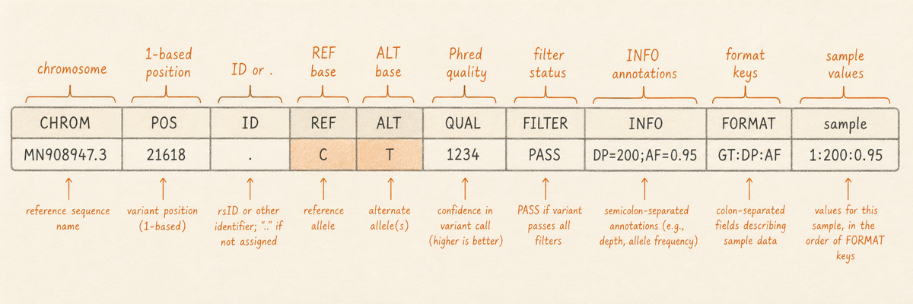
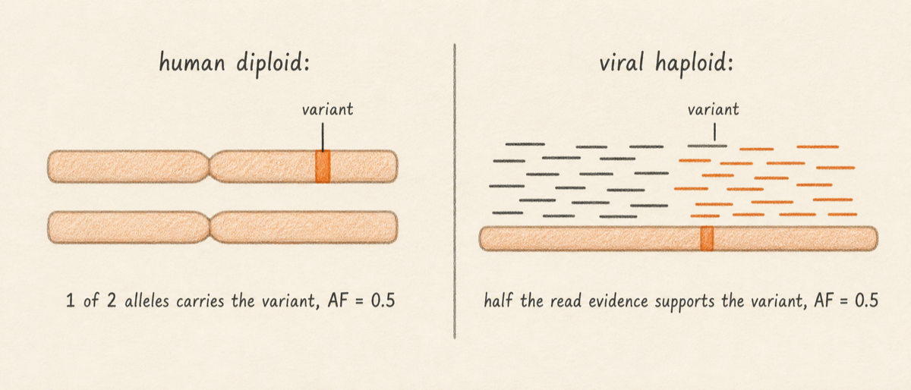
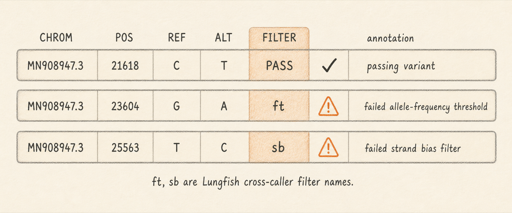

A variant is a position on a reference genome where the reads from your sample disagree with the reference base. The disagreement might be a single-base substitution (a SNP, where the reference `C` is read as `T` in your sample), an insertion of one or more bases the reference lacks, a deletion of one or more bases the reference has, or a larger structural rearrangement. Whatever its shape, the unit of analysis stays the same: a coordinate on the reference, the base or bases the reference holds there, and the base or bases the reads support instead. (Larger structural rearrangements need specialised tools beyond this chapter; the callers covered here handle SNPs and small insertions or deletions.)

A [VCF](../../GLOSSARY.md#vcf) (Variant Call Format) file is the standard tab-separated format that lists those disagreements. A [variant caller](../../GLOSSARY.md#variant-caller) reads a BAM file (you met BAMs in [Alignment Files](04-alignment-files.md)), walks the reference position by position, examines the [pileup](../../GLOSSARY.md#pileup) at each one, applies its evidence thresholds (minimum depth, minimum allele frequency, minimum base quality, strand-bias checks), and emits one VCF row for every position that clears them. The VCF is the analysable output of every variant-calling workflow in this manual. When this chapter says "variant," it means one row of a VCF.

This chapter walks through the eight standard VCF columns, the per-sample payload that trails them, the [FILTER](../../GLOSSARY.md#filter) flags LGE's variant callers attach, and one interpretation point that trips almost every reader: in a single-organism viral sample, allele frequency is the fraction of reads supporting the alternate base. It is not, as it would be in a diploid germline VCF or a cohort joint-call, the fraction of chromosome copies (or sampled individuals) carrying the variant. Read this and you should be able to look at a VCF row and read it the way the variant caller meant it.

The practical takeaway: read this once before you reach the variants part of the manual. Every later chapter assumes you can name the columns and read allele frequency in a haploid context.

One caveat, which the chapter returns to in detail. The meaning of `AF`, `GT`, `QUAL`, and `FILTER` is set by each file's VCF header, not by the format itself. The conventions here describe LGE's viral haploid output. Open a human germline VCF from GATK, a joint-called cohort VCF, or a pooled-sample wastewater VCF, and the same field names can carry different meanings, with the file's own header the authoritative source.

## What you will learn

When you finish here, you will be able to read a VCF row and name what every column means; read allele frequency in a viral context (the fraction of reads supporting a particular variant); spot a confident call from its combination of `PASS` filter, sufficient depth, and an allele frequency the reads genuinely support (which in a viral sample may run anywhere from a few percent to 100 percent and still be authentic); recognise the `INFO` and `FORMAT` payloads that carry per-row and per-sample detail; and find the same row in LGE's variant browser by clicking through to the table view.

## What a VCF file looks like

A VCF file is plain text, in two regions: a header at the top and a body of variant rows below. Header lines begin with `##` and carry metadata: the file format version, the reference used, the meaning of every `INFO` and `FORMAT` field, the contigs, the variant caller's command line. One header line begins with a single `#` and names the columns. Every line below that is one variant.

A typical iVar VCF for a SARS-CoV-2 isolate opens with about 30 header lines, then a few hundred variant rows. Compressed and indexed VCFs (`.vcf.gz` paired with `.vcf.gz.tbi`) are the standard interchange format. The compression is `bgzip` (block gzip, a samtools/htslib variant of gzip that allows random access through its companion `tabix` index), not ordinary gzip. When you see a `.vcf.gz` beside a `.vcf.gz.tbi`, treat them as a pair: the index is meaningless without the data, and the data is slow to query without the index.

Inside an LGE bundle, variants are not stored as a `.vcf.gz` on disk. The variant track is a SQLite database (`variants.db`) holding the same per-row content, schema-validated and indexed for the variant browser's fast filtering. Treat the VCF text as the canonical interchange format and the SQLite store as the on-disk representation. When an operation needs a VCF (export, a downstream tool, sharing), LGE regenerates one from SQLite; on import it reads VCFs back in through the same path. Every example in this chapter appears as VCF text, because that is the language the format specification, the literature, and command-line tools all speak; the variant browser shows you the same data, sourced from SQLite.

A small VCF excerpt looks like this:

```
##fileformat=VCFv4.2
##source=lofreq call
##reference=MN908947.3
##INFO=<ID=DP,Number=1,Type=Integer,Description="Raw Depth">
##INFO=<ID=AF,Number=1,Type=Float,Description="Allele Frequency">
##FILTER=<ID=ft,Description="Failed allele-frequency threshold">
##FORMAT=<ID=GT,Number=1,Type=String,Description="Genotype">
##FORMAT=<ID=DP,Number=1,Type=Integer,Description="Depth">
##FORMAT=<ID=AF,Number=1,Type=Float,Description="Allele frequency">
#CHROM  POS    ID  REF  ALT  QUAL  FILTER  INFO              FORMAT      SRR36291587
MN908947.3  23403  .   A    G    228   PASS    DP=1842;AF=0.998  GT:DP:AF    1/1:1842:0.998
MN908947.3  1989   .   A    G    9     ft      DP=1750;AF=0.005  GT:DP:AF    0/0:1750:0.005
```

The first nine columns are identical in every VCF. The tenth and any beyond it are per-sample, one column for each sample in the file. LGE's variant callers produce single-sample VCFs in the viral workflows covered here, so there is exactly one sample column.

## The eight standard columns plus FORMAT

Every row of a VCF carries the same fields in the same order. The first eight describe the variant and its row-level metadata. The ninth column, `FORMAT`, declares the shape of the per-sample payload, and one or more sample columns follow with the actual values.



| Column   | What it carries                                                              | Example                |
|----------|------------------------------------------------------------------------------|------------------------|
| `CHROM`  | The reference contig or chromosome name. Must match the reference FASTA.     | `MN908947.3`           |
| `POS`    | The 1-based position on `CHROM` where the variant starts.                    | `23403`                |
| `ID`     | A database identifier (dbSNP, ClinVar) or `.` if none assigned.              | `.`                    |
| `REF`    | The [reference base](../../GLOSSARY.md#ref-alt) or bases at this position.   | `A`                    |
| `ALT`    | The [alternate base](../../GLOSSARY.md#ref-alt) or bases observed in the reads. | `G`                 |
| `QUAL`   | Phred-scaled confidence that the variant is real. Higher is better.          | `228`                  |
| `FILTER` | `PASS` or a semicolon-separated list of named [filter](../../GLOSSARY.md#filter) flags the row failed. | `PASS` |
| `INFO`   | Semicolon-separated `KEY=VALUE` pairs of per-row metadata (see [INFO](../../GLOSSARY.md#info)). | `DP=1842;AF=0.998` |

A few details repay attention. `POS` is 1-based: the first base of the reference is position 1, not 0, the same convention you met in [What Is a Genome](01-what-is-a-genome.md). For an indel, `POS` names the base just before the insertion or deletion, and the `REF` and `ALT` strings carry that base as an anchor; `ivar`, `lofreq`, and `bcftools` all follow this convention. `QUAL` is Phred-scaled, so 20 means a 1% chance the variant is a false positive and 30 means 0.1%. A `QUAL` of `.` means the caller did not score the row, common in LGE-normalised iVar output: iVar natively emits a TSV with a `PASS` boolean, and LGE's conversion to VCF sets `QUAL` to `.` wherever iVar did not score the row directly.

The ninth column, [`FORMAT`](../../GLOSSARY.md#format), is a colon-separated list of keys describing the per-sample payload. LGE's variant callers emit a small set: [`GT`](../../GLOSSARY.md#genotype) (genotype), `DP` (depth at this position), `AF` ([allele frequency](../../GLOSSARY.md#allele-frequency)), and sometimes `AD` (per-allele depths, a comma-separated list of read counts for REF and each ALT allele). One sample column follows for each sample, its values in the same order as the FORMAT keys.

| FORMAT key | What it carries                                                                   |
|------------|-----------------------------------------------------------------------------------|
| `GT`       | Genotype, written diploid-style as `0/0`, `0/1`, `1/1`, or `./.` (missing).       |
| `DP`       | Number of reads covering this position.                                           |
| `AF`       | Fraction of reads at this position supporting the ALT base. Range 0.0 to 1.0.     |
| `AD`       | Comma-separated read counts per allele, in the order `REF,ALT`.                   |

Genotype notation is a quirk inherited from VCF's diploid origins. `0` means "the reference allele," `1` means "the first ALT allele," `2` means "the second ALT allele," and so on. In a viral haploid context the convention has flattened to `1/1` for a confidently called variant and `0/0` (or no row at all) for a confidently called reference base. Treat the slash as cosmetic in viral data.

## Walking through one row

The high-confidence row from the excerpt above rewards a column-by-column read.

```
MN908947.3  23403  .  A  G  228  PASS  DP=1842;AF=0.998  GT:DP:AF  1/1:1842:0.998
```

`CHROM` is `MN908947.3`, the SARS-CoV-2 reference. `POS` is `23403`, the spike-gene position introduced in [What Is a Genome](01-what-is-a-genome.md). `ID` is `.`, so no public-database identifier is attached. `REF` is `A`, the base at position 23403 on the reference. `ALT` is `G`, the base the reads support instead. `QUAL` is `228`, a high Phred score standing for a vanishingly small chance that the variant is a false positive. `FILTER` is `PASS`: the row cleared every filter the caller applied.

`INFO` carries two row-level facts: `DP=1842` (1842 reads cover this position) and `AF=0.998` (99.8% of them carry the `G`). `FORMAT` declares that the sample column will list `GT`, then `DP`, then `AF`, colon-separated. The single sample column reads `1/1:1842:0.998`. The [genotype](../../GLOSSARY.md#genotype) `1/1` means "the alternate allele is the only allele observed"; some haploid VCFs write the same idea as a bare `1`, but LGE's iVar lane uses `1/1` to stay compatible with downstream diploid-shaped tooling. Depth `1842` echoes the row-level number (per-sample and per-row depth coincide when there is only one sample). Allele frequency `0.998` echoes the row-level value in the same way.

In plain English: at position 23403 of the SARS-CoV-2 reference, the reads disagreed with the reference `A` and backed `G` instead, the nucleotide change behind the D614G spike substitution. There were 1842 reads at that position. 1840 carried `G`, two carried something else. Every filter ran, every filter passed, and the result is a high-confidence variant.

The other row in the excerpt is the opposite case.

```
MN908947.3  1989  .  A  G  9  ft  DP=1750;AF=0.005  GT:DP:AF  0/0:1750:0.005
```

`POS 1989`, `REF A`, `ALT G`, `QUAL 9` (low), `FILTER ft` (failed threshold), `DP=1750`, `AF=0.005`. Eight or nine reads out of 1750 carry the `G`; every other read carries the reference `A`. The allele frequency sits well below the caller's minimum-AF threshold, so the row is flagged `ft`. The genotype is `0/0`, the reads overwhelmingly reference. This is what sequencing-error noise looks like in a VCF: low allele frequency, low quality, a non-PASS filter, and a genotype that says "no, this is reference." The row is in the file because the caller saw a non-zero ALT count, but it is no confident variant.

The contrast between those two rows is the basic reading skill this chapter trains. If you can sort a VCF, read `FILTER`, `AF`, and `DP` together, and judge whether a row is signal or noise, you can read every LGE variant track.

## Allele frequency in haploid viral data

This section tackles the most common point of confusion when scientists cross from human genomics into viral genomics, or arrive at viral genomics from a wet-lab background where VCF was a black box.

VCF was first designed to describe human genetic variation, and humans are diploid: every position on a non-sex chromosome has two copies, one from each parent. In that world, `AF=0.5` means "one of the two chromosome copies carries the variant" (the sample is heterozygous there, written `0/1` in the GT field), and `AF=1.0` means "both copies carry it" (homozygous for the variant, `1/1`). This is the convention GATK and most human-genomics tooling assumes. Allele frequency reports the fraction of alleles in the genome that are alternate, and at any autosomal position there are exactly two.

A virus is not a diploid organism. Each virion carries a single genome. A clinical SARS-CoV-2 sample holds many virions, often millions, and the sequencing reads are sampled from that population. A position with `AF=1.0` does not mean "homozygous." It means every read there carried the alternate base, which in turn means every virion in the sample (within the sensitivity of the experiment) carries the variant. A position with `AF=0.5` does not mean "heterozygous." It means half the reads there carry the variant. Why that fraction lands at 0.5 rather than 0 or 1 is a question with both biological and technical answers.



A genuinely intermediate viral allele frequency has at least three plausible explanations. It might be a mixed infection: two distinct viral lineages co-circulating in one host, each contributing a share of the reads. It might be a transmission bottleneck signature: a handful of founding virions diverging into a population during the host's infection window, with one new mutation climbing toward fixation. Or it might be a sequencing or amplification artifact: PCR errors, sequencer base-call errors, strand-specific primer artifacts. Telling these apart means weighing the depth, the strand distribution of the supporting reads, the position's coverage profile, and often a second sample from the same patient over time.

The practical consequence: in an LGE viral VCF, a fixed variant shows `AF` near 1.0, `DP` in the hundreds or thousands, and `FILTER=PASS`. A genuinely intermediate `AF` (anywhere from 0.05 to 0.8) is interesting and worth a look, not automatically wrong. Even an `AF` of 0.05 (5% of the reads at that position) can be a real minority variant in a mixed infection or an emerging mutation, as long as the depth is high and the filter passes. An `AF` near 0 is noise. There is no such thing as a "homozygous variant" in a single-organism viral isolate; the genotype column's `1/1` is mostly cosmetic for the LGE viral case. Open a human germline VCF or a wastewater mixture file, though, and the GT field carries real diploid or pooled meaning that you should read accordingly.

Wastewater and other mixed-population samples are a different regime altogether: every position carries some allele frequency between 0 and 1, the spectrum is continuous, and the question shifts from "what variant does this isolate carry" to "what mixture of lineages is in this sample." The VCF columns are the same; the interpretation is not. Wastewater is out of scope here and comes later in the manual.

## FILTER flags

The `FILTER` column is the variant caller's most direct verdict on whether to trust the row. `PASS` means the row cleared every filter the caller applied. Anything else is a flag naming a filter the row failed. Several flags can stack on one row, separated by semicolons.



LGE supports four variant callers across its short-read and long-read lanes: [iVar](../../GLOSSARY.md#variant-caller), [LoFreq](../../GLOSSARY.md#variant-caller), [Medaka](../../GLOSSARY.md#variant-caller), and [Clair3](../../GLOSSARY.md#variant-caller). Each speaks its own native FILTER vocabulary, and iVar's native output is in fact a TSV that LGE converts to VCF with a normalisation pass. The table below lists FILTER flags as they appear in LGE-normalised viral VCFs; for any specific file, the `##FILTER` header lines are the authority.

| Flag    | What it means (LGE-normalised)                                                      | What to do                                                                  |
|---------|-------------------------------------------------------------------------------------|-----------------------------------------------------------------------------|
| `PASS`  | The row cleared every filter the caller applied.                                    | Treat as a candidate variant subject to your other quality criteria.        |
| `ft`    | The row failed the allele-frequency threshold (typically `AF` below 0.05 or 0.10).  | Usually noise. Investigate only if you specifically expect minor variants.  |
| `sb`    | The row failed a strand-bias filter: ALT support is lopsided across the strands.    | Common in amplicon data near primer ends; inspect the pileup in context.    |
| `bq`    | The row failed a base-quality filter: the supporting bases were low Phred quality.  | Investigate the pileup; the variant may be real but poorly sequenced.       |
| `q10`   | `QUAL` was below 10 (a 10% false-positive probability).                             | Treat as low confidence; rarely worth promoting without orthogonal support. |

LGE's variant browser starts unfiltered: every row in the VCF is on show. The quickest way to home in on confident calls is the `Presets > PASS` chip in the filter bar, which hides every row whose `FILTER` is anything but `PASS`. The non-PASS rows stay in the underlying file. Filtering is a view, not a rewrite.

A non-PASS row is not necessarily wrong. For amplicon data the `sb` filter is noisy, because amplicon protocols by design pile strand-imbalanced reads near every primer pair. iVar disables strand-bias filtering by default for exactly that reason, and the LGE iVar dialog ships with `Ignore strand bias` already on. If `sb`-flagged rows turn up in a LoFreq VCF, the right move is usually to inspect the position in the alignment view rather than dismiss the row outright.

## Where the VCF comes from

A VCF is a derivative of a BAM. The variant caller never looks at FASTQ reads directly; it reads the alignment. At each position on the reference, it asks the BAM's index for every read covering that position, builds a pileup (the column of bases observed there across all covering reads), counts how many reads back the reference base and how many back each alternate, computes the allele frequency, and applies its filters: minimum depth, minimum allele frequency, minimum base quality, optionally strand bias, optionally allele-specific quality. If the position clears the filters with at least one alternate allele above threshold, the caller emits a VCF row.

Three things follow from this pipeline. First, primer-trimmed and untrimmed BAMs produce different VCFs even from identical reads, because the trim changes which bases enter each pileup. Always know which BAM a VCF came from; LGE's variant tracks carry that provenance in the Inspector. Second, the caller's thresholds, minimum allele frequency above all, directly shape the VCF: drop the threshold from 0.10 to 0.01 and the row count swells by an order of magnitude, most of it noise. LGE exposes the threshold in every variant-calling dialog, so the choice stays visible. Third, two callers run on the same BAM will not produce identical VCFs even at the same threshold, because their statistical models of "is this evidence enough" differ. Cross-caller comparison is an analysis in its own right.

## How LGE renders a VCF

LGE's variant browser opens when you click any variant track in the project sidebar. It stacks three regions top to bottom. The genome track at the top draws each variant as a tick at its `POS`, colour-coded by `FILTER` (PASS rows in Creamsicle, non-PASS rows in Peach). The reference panel in the middle shows the bases around the currently selected position, with the `REF` and `ALT` annotated above the relevant base. The variant table at the bottom is sortable and filterable, one row per VCF row and one column per VCF field, plus a few derived columns: the source caller, the gene name from any attached GFF3 annotation, the protein consequence where iVar's codon-merge applied.

Click a row in the table and the genome track centres on that position, the reference panel fills with the surrounding context, and the Inspector populates with the per-variant detail: the full `INFO` field broken out one row per key, the `FORMAT` payload for the sample, any annotation context (gene, codon, amino acid change), and the row's provenance (the caller, the BAM, the threshold settings). This is where most variant reading happens. The chapters in the variants part of the manual lean on the browser as the primary tool and drop to the underlying VCF text only when something in the rendering looks wrong.

## Next

Continue to [The Lungfish Genome Explorer Project](06-the-lungfish-project.md) to learn how LGE organises everything you have just read about (sequences, reads, alignments, variants) into a single project window.
