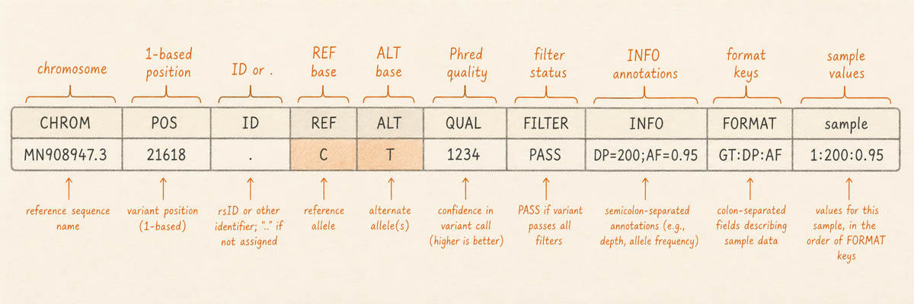
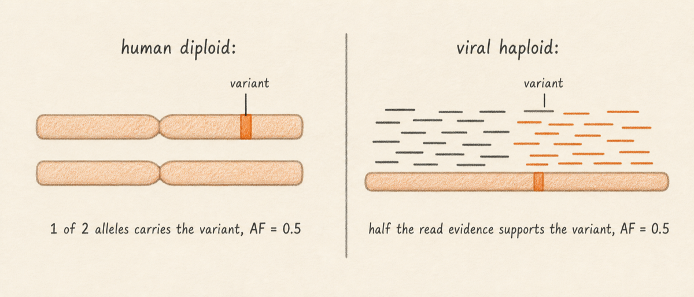
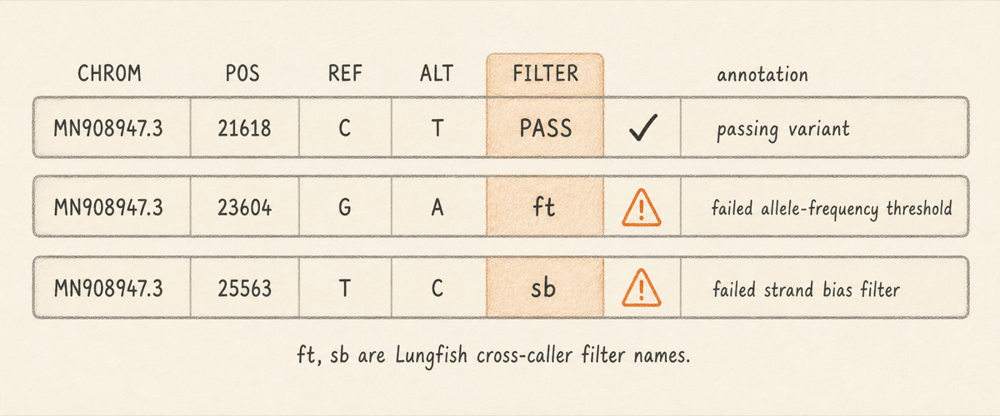

## What it is

A [variant](../../GLOSSARY.md#variant) is a position where a sample's sequence differs from the reference genome. The disagreement might be a single-base substitution, where the reference `C` is read as `T` in your sample, called an [SNV](../../GLOSSARY.md#snv), short for single-nucleotide variant. It might be an insertion of bases the reference lacks, or a deletion of bases the reference has, and the two together are called [indels](../../GLOSSARY.md#indel). Many sources say SNP for an SNV, and this manual writes SNV throughout. Whatever its shape, a variant is described by three things. They are a coordinate on the reference, the base or bases the reference holds there, and the base or bases the reads support instead.

A [VCF](../../GLOSSARY.md#vcf) is a tab-separated file with one row per position where the sample differs from the reference. The name stands for Variant Call Format. A [variant caller](../../GLOSSARY.md#variant-caller) is the program that writes one. It reads a BAM alignment file, the format [Alignment Files](04-alignment-files.md) describes, moves along the reference one position at a time, and examines the [pileup](../../GLOSSARY.md#pileup) there, the stack of read bases over that position. Wherever the evidence clears its thresholds, such as a minimum number of reads backing the change, it writes a row. When this chapter says "variant", it means one row of a VCF.

The chapter covers the eight standard VCF columns and the per-sample columns that can follow them, genotype notation, what one chromosome copy or two means for a call, the three things `AF` can mean, the [FILTER](../../GLOSSARY.md#filter) flags real callers write, and which variant-calling route fits which data. One caution runs through all of it. The meaning of each key in a VCF is declared in that file's own header, and two callers can write the same key and mean slightly different things by it. Read the header when a number surprises you.

## Why you would do this

Most questions you ask of sequencing data are about difference. Where does this sample depart from the reference, and can that departure be trusted? A VCF is the file that answers them, and steps such as filtering a call set, comparing samples, and clinical interpretation of a change read the VCF rather than the reads. A consensus sequence, one corrected sequence for the sample, can be built either way, from the VCF or straight from the reads, as [Pileup consensus versus variants-applied consensus](../05-variants/05-consensus-and-lineage.md#pileup-consensus-versus-variants-applied-consensus) explains.

This chapter works from the HG002 chromosome 20 slice. HG002 is the human reference sample that [Sequencing Reads](02-sequencing-reads.md#why-you-would-do-this) introduces, and its true variants are already known, so an answer key exists. The fixture's reads are Illumina [paired-end](02-sequencing-reads.md#paired-end-reads) reads 250 bases long, and its reference is a 500,001-base slice of human chromosome 20.

The fixture carries three VCFs, and the contrast between them is the point. Two hold calls made from the fixture's own reads, one by bcftools and one by LoFreq, two widely used variant callers. The third is the Genome in a Bottle [benchmark VCF](../../GLOSSARY.md#benchmark-vcf) for HG002, produced independently by the US National Institute of Standards and Technology (NIST) and used here only as the answer key.

## Before you start

This chapter is reading only, and nothing in it has to be run in Lungfish Genome Explorer (LGE). To see the calls on screen, open the Human Mapping and Variants (with results) [demo project](../../GLOSSARY.md#demo-project) as [The Lungfish Genome Explorer Project](06-the-lungfish-project.md#demo-projects) showed.

That project already holds the three call sets as [variant tracks](../../GLOSSARY.md#variant-track), named `HG002 bcftools`, `HG002 LoFreq`, and `HG002.chr20.10.0-10.5Mb.benchmark.vcf`. They sit in the reference bundle inside the mapping result, the `minimap2-2026-09-25T00-00-00` row of the Analyses group, and [Reading the Variants Table](../05-variants/02-reading-the-variant-browser.md) shows how to open them. The chapter's one screenshot shows the bcftools track there. The rows quoted below come from the `hg002-chr20` fixture's own VCF files, `expected/variants/bcftools/HG002.bcftools.vcf.gz`, `expected/variants/lofreq/HG002.lofreq.vcf.gz`, and `HG002.chr20.10.0-10.5Mb.benchmark.vcf.gz`, listed in [Fixture files](06-the-lungfish-project.md#fixture-files). A VCF is plain text once uncompressed, so they can be read in any text editor.

## What a VCF file looks like

A VCF has two parts, a header at the top and then one row per variant. Header lines begin with `##` and carry facts about the file. They give the format version, the reference used, the contigs and their lengths, the caller's command line, and one declaration for every `INFO`, `FORMAT`, and `FILTER` key the file uses. A contig is one continuous reference sequence, which for human data usually means one chromosome. A single line beginning with one `#` names the columns, and every line below it is a variant.

Headers are shorter than people expect. The fixture's bcftools VCF has 29 header lines above 1,056 variant rows, and its LoFreq VCF has 18 above 862. The benchmark is the exception at 235 header lines above 961 rows, because it records how the answer key was assembled.

A VCF is normally stored compressed, as a `.vcf.gz` beside a small index file. The compression is `bgzip`, which packs the file into small blocks that a reader can open one at a time. That lets a viewer show one gene out of a whole-genome VCF without unpacking everything in front of it. The index is usually a [tabix](../../GLOSSARY.md#tabix) `.tbi` file, and a [CSI](../../GLOSSARY.md#csi) index does the same job for a reference sequence longer than about 512 million bases, which no human chromosome reaches. Treat the data file and its index as one unit and move them together. A [BCF](../../GLOSSARY.md#bcf) is the same content in a compact binary form that only programs read.

In LGE the rows appear on the **Variants** tab of the [table drawer](../../GLOSSARY.md#table-drawer), which [Reading the Variants Table](../05-variants/02-reading-the-variant-browser.md#what-it-is) covers. Each row of the table is one row of the file, and its Chrom, Position, ID, Ref, Alt, Quality, and Filter columns are the VCF columns described next.

<!-- SHOT: variants-tab-hg002-bcftools -->

## The eight standard columns, and what may follow them

Every VCF row carries the same fields in the same order. The first eight describe the variant. A ninth column, `FORMAT`, appears only when the file holds per-sample data, and one sample column follows it for each sample.



The first five columns place the variant.

| Column | What it carries | Example |
|---|---|---|
| `CHROM` | The reference contig name, which must match the reference FASTA | `chr20_10.0-10.5Mb` |
| `POS` | The position on `CHROM` where the variant starts, counting the first base as 1 | `250527` |
| `ID` | A database identifier such as a dbSNP number, or `.` if none | `.` |
| `REF` | The [reference base](../../GLOSSARY.md#ref-alt) or bases at this position | `C` |
| `ALT` | The [alternate base](../../GLOSSARY.md#ref-alt) or bases the reads support | `T` |

The other three carry the caller's verdict and its supporting numbers. [`QUAL`](../../GLOSSARY.md#qual) is a [Phred-scaled](02-sequencing-reads.md#phred-quality-scores) confidence that the variant is real, so 20 means a 1 percent chance the call is wrong and 30 means 0.1 percent. A `QUAL` of `.` means the caller did not score the row. `FILTER` holds `PASS`, or a semicolon-separated list of the named filters the row failed, or `.` when no filter was applied. [`INFO`](../../GLOSSARY.md#info) holds semicolon-separated `KEY=VALUE` pairs of facts about the row, and every key is declared in the header.

One detail about insertions and deletions repays attention. For those, `POS` names the base just before the change, and that anchor base appears at the front of both `REF` and `ALT`. A real row from the bcftools VCF shows the shape. At position 5,839, `REF` reads `CTTTTT` and `ALT` reads `CTTTTTT`. The leading `C` is the anchor, and after it `REF` holds five `T` bases while `ALT` holds six. The change is one extra `T`.

The ninth column, [`FORMAT`](../../GLOSSARY.md#format), lists colon-separated keys, and each sample column after it holds the values in the same order. Which keys appear is the caller's choice. bcftools writes `GT:PL:AD` and one sample column, and keeps its depth counts in `INFO`. LoFreq writes no `FORMAT` column and no sample column at all, and reports depth and frequency as `INFO` keys instead. A file with no sample column is still a valid VCF.

[`GT`](../../GLOSSARY.md#genotype) is the genotype, which alleles the sample carries. `0` means the reference allele, `1` the first `ALT` allele, `2` the second, and a slash joins the copies. A [genotype](../../GLOSSARY.md#genotype) of `0/1` means one of the two chromosome copies carries the change and `1/1` means both do, the two states called [heterozygous](../../GLOSSARY.md#heterozygous) and [homozygous](../../GLOSSARY.md#homozygous). `1/2` means each copy carries a different alternate allele. For a virus or a bacterium, which carries one copy of its genome, a caller can write the single haploid value `1`, and LGE's iVar calls do exactly that. [One copy or two](#one-copy-or-two) explains why the number of copies matters.

## Walking through one row

Take position 250,527, the heterozygous change from `C` to `T` whose pileup [Alignment Files](04-alignment-files.md#pileup-or-what-the-variant-caller-sees) reads base by base. All three of the fixture's VCFs call it, and comparing their rows shows how much of a VCF is convention rather than content.

Here is the bcftools row, wrapped across three lines to fit the page but one line in the file.

```
chr20_10.0-10.5Mb	250527	.	C	T	222.235	.
DP=63;VDB=0.177212;SGB=-0.693127;RPBZ=1.00958;MQBZ=1.28452;MQSBZ=-0.909718;BQBZ=-1.21003;SCBZ=-0.33345;MQ0F=0;AC=1;AN=2;DP4=8,12,16,17;MQ=59
GT:PL:AD	0/1:255,0,255:20,33
```

Read it left to right. `CHROM` is the fixture's slice of chromosome 20, `POS` is `250527`, and `ID` is `.`, so no public identifier is attached. `REF` is `C` and `ALT` is `T`. `QUAL` is `222.235`, far above any doubt. `FILTER` is `.`, and the section on FILTER below explains why.

The `INFO` field packs a dozen keys, and four matter here. The rest are bcftools' own statistics, and you can ignore them. `DP=63` is the raw [depth](04-alignment-files.md#coverage-and-the-coverage-track), the number of reads over the position. `DP4=8,12,16,17` splits the high-quality bases into four counts, reference forward, reference reverse, alternate forward, and alternate reverse. The near-even split of the 16 and 17 alternate reads across the two strands is what a real difference looks like. `MQ=59` is the average mapping quality of those reads, close to the maximum of 60. `AC=1;AN=2` says one of the two chromosome copies bcftools considered carries the alternate allele, a figure [What AF means](#what-af-means) returns to.

The sample column reads `0/1:255,0,255:20,33`. The genotype `0/1` says HG002 carries one copy of `C` and one copy of `T`. `PL` holds a penalty for each of the three possible genotypes, in the order `0/0`, `0/1`, `1/1`. The smallest number marks the best explanation, so the `0` in the middle picks `0/1`, and the `255` on either side says the other two are very unlikely. `AD` gives the per-allele counts, 20 reference and 33 alternate. Those add to 53 rather than the 63 of `DP`, because `AD` counts only bases that passed the caller's base-quality check.

The `HG002 bcftools` track in the demo project was made by LGE's Call Variants dialog, which asks bcftools to record two more keys, so its row at 250,527 adds `AD=20,33` to `INFO` and a `DP` of 53 to the sample column, whose keys read `GT:PL:DP:AD`. Every other value in the row is the same.

LoFreq calls the same position, and its row has only eight columns.

```
chr20_10.0-10.5Mb	250527	.	C	T	1093	PASS	DP=63;AF=0.571429;SB=0;DP4=13,14,17,19
```

The position and alleles match. `QUAL` reads `1093`, but the two callers scale `QUAL` differently, so compare `QUAL` between rows of one file and never between two callers. `FILTER` reads `PASS`. `INFO` carries the same raw depth, an [allele frequency](../../GLOSSARY.md#allele-frequency) of `AF=0.571429`, meaning 57 percent of the reads carry `T`, and a [strand bias](../../GLOSSARY.md#strand-bias) score of `SB=0`, meaning no imbalance between strands was found. Its `DP4` counts differ from bcftools' because each caller sets its own base-quality cutoff, the minimum quality a base needs before the caller counts it, so the two callers keep slightly different sets of bases from the same 63 reads.

There is no genotype in the LoFreq row. LoFreq reports how much of the evidence backs `T` and leaves the interpretation to you, while the bcftools `0/1` says how many chromosome copies carry it. A heterozygous position should give about half its reads to each allele, and 0.57 of 63 reads sits well inside the ordinary scatter around one half.

The benchmark calls the position too, with `GT` of `0/1` and a depth of 1,247. That depth pools every sequencing run NIST used, so it will always dwarf a single sample's. Two independent callers and an independent answer key agree, which is what a confident call looks like.

## One copy or two

[Ploidy](../../GLOSSARY.md#ploidy) is the number of copies of each chromosome an organism carries. A person or a macaque is diploid, with two copies of every chromosome except the sex chromosomes in males, one inherited from each parent. At any one position a diploid sample can therefore carry the reference on both copies, the change on one, or the change on both, and nothing in between. That is why the allele frequency of a real variant in a person clusters near 0.5 or near 1, as 0.57 and 0.62 at position 250,527 do.



A virus has one copy of its genome in each particle, but a sample holds millions of particles, and they need not all be alike. A mixed infection, a virus population that has changed inside one patient, or a wastewater sample pooling many people can carry a change in any share of its genomes, 3 percent or 40 percent as readily as 50 or 100. The mitochondrial genome behaves the same way, since a cell carries hundreds of copies that can differ, and so does a tumour, whose cells are a mixture. In all of these the allele frequency is a continuous measurement rather than a choice between 0.5 and 1.

The two situations call for two styles of variant caller. A [genotype-based](../../GLOSSARY.md#genotype-based-calling) caller such as bcftools or GATK HaplotypeCaller takes the ploidy as given and asks which genotype, `0/0`, `0/1`, or `1/1` for two copies, best explains the reads, then writes that genotype. A [frequency-based](../../GLOSSARY.md#frequency-based-calling) caller such as LoFreq or iVar asks only whether more reads carry the change than sequencing error would explain, and reports the share of reads that do. The HG002 rows above show the difference, since bcftools writes `0/1` and LoFreq writes `AF=0.571429`.

Use the wrong style and the output misleads. A genotype-based caller told a virus has two copies forces a 12 percent minority change into `0/1`, a genotype that means nothing for a virus. A frequency-based caller on a person reports frequencies but no genotype, so it never says whether the person carries one copy or two. LGE's Call Variants dialog sets bcftools' ploidy from the bundle's organism, Diploid for this human slice, and [Calling Variants](../05-variants/01-calling-variants-from-amplicons.md) shows the setting.

## What AF means

The letters `AF` appear in many VCFs, and they stand for three different quantities. Check the header's `INFO` declaration before you compare or filter on them.

| Sense | Written by | What it measures | At position 250,527 |
|---|---|---|---|
| Read share | LoFreq and iVar as `AF`, and LGE's Minimum Allele Frequency setting | The share of reads at the position carrying the alternate base | `AF=0.571429` in the LoFreq row |
| Genotype fraction | GATK as `AF`, bcftools as `AC` divided by `AN` | The share of the sample's chromosome copies carrying the alternate base | `AC=1;AN=2`, so 0.5, in the bcftools row |
| Population frequency | Catalogues such as gnomAD, often as `gnomAD_AF` | The share of chromosomes in a population that carry the allele | Not in these files |

This manual writes "allele frequency" for the read share, the first row, and says which of the others it means whenever one appears. The genotype fraction moves only in steps, 0.5 or 1 for a single diploid sample, while the read share can take any value. The population frequency, the figure a genetics course means by allele frequency, says nothing about your own sample and comes only from an outside catalogue.

## FILTER, and the flags callers actually write

The `FILTER` column is the caller's most direct verdict. `PASS` means the row cleared every filter that was applied. A named flag means it failed that filter. A bare `.` means no filter was applied at all, which is not the same as passing.



The fixture makes the difference concrete. Every one of the 1,056 rows in the bcftools VCF has `.` in `FILTER`, because a default bcftools run applies no filter and leaves the column for you to judge. Every one of the 862 rows in the LoFreq VCF says `PASS`, because LoFreq applies its filters during the call and writes out only the rows that survive. Read `.` as "not judged", and look at `QUAL` and `DP` yourself. Filtering the bcftools track to `PASS` rows empties it, a lesson [Reading the Variants Table](../05-variants/02-reading-the-variant-browser.md) walks through.

Flag names belong to each caller and are declared in each file's header. The LoFreq VCF here declares four.

| Flag | What it means |
|---|---|
| `min_snvqual_73` | The substitution's `QUAL` fell below a threshold LoFreq worked out for this run, and the number in the name is that threshold |
| `min_indelqual_20` | The same test for an insertion or deletion, with a threshold of 20 |
| `min_dp_10` | Fewer than ten reads covered the position |
| `sb_fdr` | The alternate reads were lopsided across the two strands, past a threshold raised to allow for testing many positions at once |

Other callers declare flags of their own, and iVar, the caller for viral amplicon data, is covered in [Calling Variants](../05-variants/01-calling-variants-from-amplicons.md).

A flagged row is not automatically wrong. Reads from an [amplicon](../../GLOSSARY.md#amplicon) protocol, which copies the target in PCR pieces as [Amplicon sequencing](03-amplicon-vs-shotgun.md#amplicon-sequencing) explains, pile up on one strand near every primer. A strand-bias flag on amplicon data therefore often reflects the protocol rather than an error. When a flagged row matters to your question, look at the position in the alignment before you accept or dismiss it.

## Three kinds of filter

The word "filter" names three different mechanisms in LGE, and they differ in what they do to your data. The manual names the one it means each time.

| Mechanism | What it does to the file | Can it be undone | Where it is set |
|---|---|---|---|
| A caller's `FILTER` flag | Marks the row and keeps it | Nothing is lost, the row is still there | By the caller, or afterwards by a [hard filter](../../GLOSSARY.md#hard-filter) such as GATK's |
| LGE's threshold filter | Removes rows below the Minimum Allele Frequency or Minimum Depth from the written track | Only by calling again with other values | The Call Variants dialog, or `--min-af` and `--min-depth` on the command line |
| Table chips and matrix filters | Hide rows on screen | Clear the filter and the rows return | The Variants table and the genotype matrix |

The threshold filter is the one to watch, because it runs by default. After calling with any caller except iVar, LGE keeps only the rows whose allele frequency is at least the Minimum Allele Frequency, 0.05 by default, and whose depth is at least the Minimum Depth, 10 by default, and replaces the caller's file with the result. iVar applies the same two limits while it calls. That is why the `HG002 bcftools` track holds 1,040 rows at 1,038 positions while the fixture's raw bcftools file holds 1,056. The 16 rows the threshold removed include none of the benchmark's positions, so both report the same 954 matches.

## Where a VCF comes from

A VCF is made from a BAM, never straight from the reads. At each reference position the caller builds the pileup, counts the reads backing the reference and each alternate, and applies its thresholds for depth, allele frequency, base quality, and strand bias. Positions that clear them become rows. Three consequences explain most surprises.

First, the same reads can give different VCFs from differently prepared alignments. For amplicon data, setting the primer bases aside changes which bases enter each pileup, as [Primer Trimming an Alignment](../04-alignments/03-primer-trimming.md) shows. Always know which alignment a variant track came from.

Second, the caller's thresholds shape the file directly. Lower the Minimum Allele Frequency from LGE's default of 0.05 to 0.01 and the row count grows, most of the new rows sequencing noise.

Third, two callers on the same alignment will not agree exactly, because their statistical models differ. On this fixture bcftools wrote 1,056 rows at 1,053 positions and LoFreq wrote 862 rows at 861 positions, from the same alignment. Of those positions, 954 of bcftools' and 808 of LoFreq's appear in the benchmark. A position can carry more than one row, one for each alternate allele the caller proposed there. These are matches of position only, not of genotype, and a full accuracy check needs a benchmarking program such as `hap.py`, which LGE does not include. How to run each caller is covered in [Calling Variants](../05-variants/01-calling-variants-from-amplicons.md).

## Which variant-calling route

The right route depends on five properties of your data and question. They are how many copies of the genome the sample carries, whether the library is amplicon or shotgun, whether the reads are short or long, what you want to learn, and how many samples you are calling. The figure sets the choice out as a tree, and the table gives each leaf with the chapter that covers it.

<!-- ILLUSTRATION: variant-calling-routes -->

| Your data and question | Route | Where it is covered |
|---|---|---|
| A VCF someone else made | Import it onto a reference bundle | [Importing Existing VCFs](../05-variants/06-importing-existing-vcfs.md) |
| Which named MHC alleles a macaque carries | MHC allele genotyping, not variant calling | [What Is MHC Genotyping](../09-genotyping/01-what-is-mhc-genotyping.md) |
| The mix of viral lineages in a wastewater or mixed sample | Freyja demixing | [Running Freyja](../06-classification/07-running-freyja.md) |
| Oxford Nanopore reads | Clair3 or Medaka | [Nanopore Variant Calling](../05-variants/04-nanopore-variant-calling.md) |
| A person or macaque, one sample, a first look | bcftools | [Calling Variants](../05-variants/01-calling-variants-from-amplicons.md) |
| A person, publishable calls or a cohort | HaplotypeCaller, then joint genotyping | [Reference Files for GATK](../06-human-germline-variants/04-reference-packs.md), the first chapter of Human Germline Variants (Experimental) |
| SARS-CoV-2 amplicon reads | The Viral Recon pipeline | [The Viral Recon Wizard](../04-alignments/05-viral-recon-wizard.md) |
| Another virus sequenced as amplicons | Map, primer-trim, then iVar | [Call the trimmed amplicon track with iVar](../05-variants/01-calling-variants-from-amplicons.md#call-the-trimmed-amplicon-track-with-ivar) |
| Deep shotgun reads from a mixed sample, looking for minority changes | LoFreq | [Calling Variants](../05-variants/01-calling-variants-from-amplicons.md) |

Read the rows from the top, and take the first that fits. The MHC row comes early for a reason. The macaque MHC is so variable, and so full of related gene copies, that reads from one animal often cannot be placed on a single reference with confidence. Positional variant calls there are unreliable with any caller, and naming whole catalogued alleles is the route that works. Outside the MHC, bcftools and HaplotypeCaller serve a macaque exactly as they serve a person.

## What good looks like

Four checks settle whether a VCF is worth building on.

First, read the `FILTER` column before you filter on it. A file of all `PASS` and a file of all `.` need different treatment, and only the first has been judged by anything.

Second, check depth at any position you care about. Across this fixture the mean depth is about 45, and position 250,527 sits at 63, comfortably above the mean depth a human genome project aims for, which [Coverage and the coverage track](04-alignment-files.md#coverage-and-the-coverage-track) gives. A position under about 10 reads is too thin for a confident call, which is what LoFreq's `min_dp_10` flag says.

Third, look at the strand split in `DP4` for a call that matters. The 16 and 17 alternate reads at 250,527 are the balance a real change produces. All the alternate support on one strand and none on the other is a question to answer, not a call to accept.

Fourth, know which alignment and which caller produced the file, and which `AF` it writes. LGE keeps a [provenance](../../GLOSSARY.md#provenance) record of how each result was made, which [Provenance and Reproducibility](08-provenance-and-reproducibility.md#reading-the-results) shows how to read.

The first check fails when the `FILTER` column tells you nothing, for example when every row reads `.` as in the bcftools file. Then sort the rows by `QUAL` and look at the spread before anything else. A healthy file has most rows well above 30 and a short tail of low scores. A file that is mostly low scores says the alignment or the depth is the real problem.

## Next

Continue to [Plugin Packs](07-plugin-packs.md) to see how LGE installs the variant callers and the other tools the rest of this manual runs. When you are ready to call variants yourself, [Mapping Reads to a Reference](../04-alignments/01-mapping-reads-to-a-reference.md) makes the alignment and [Calling Variants](../05-variants/01-calling-variants-from-amplicons.md) turns it into a VCF.
