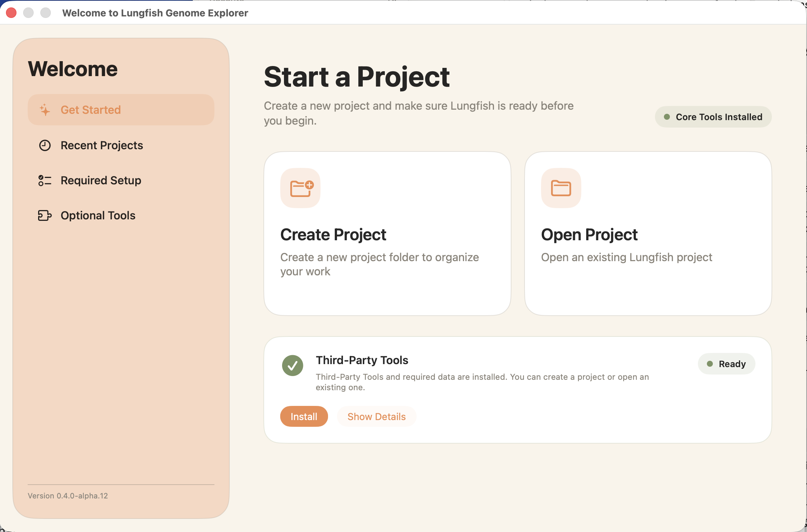
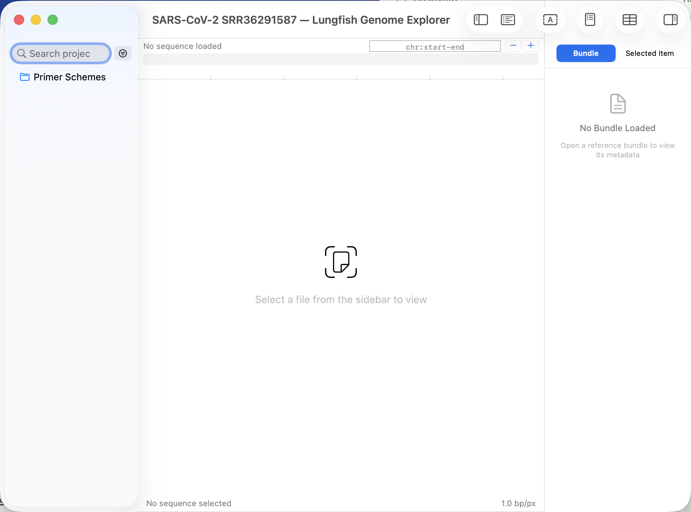
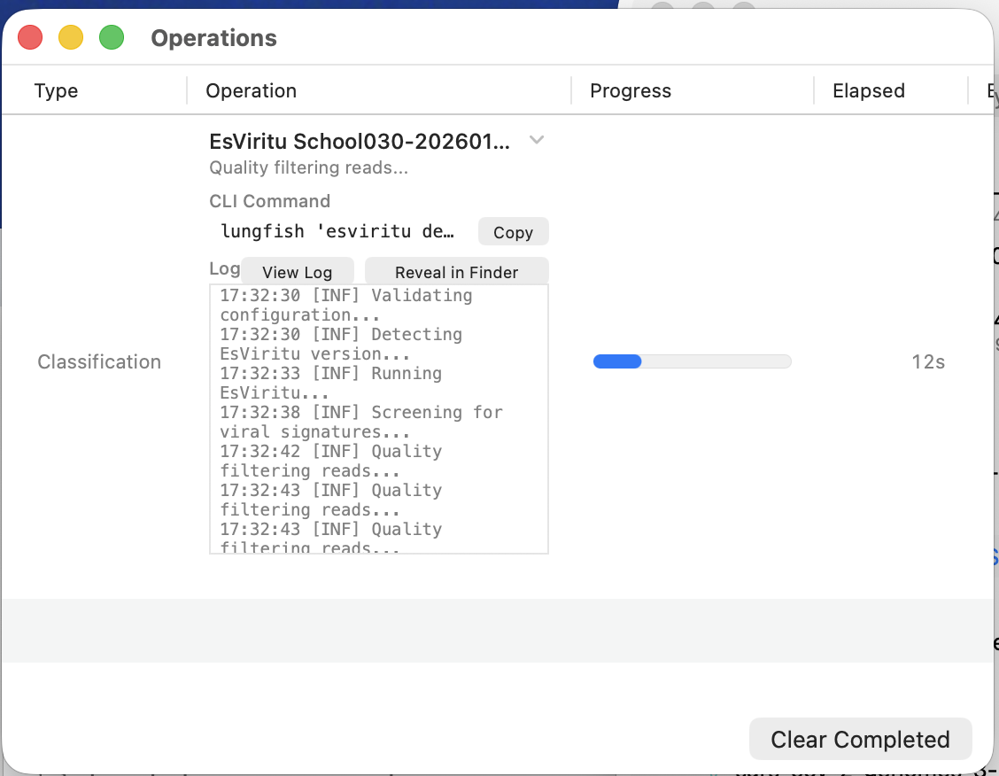
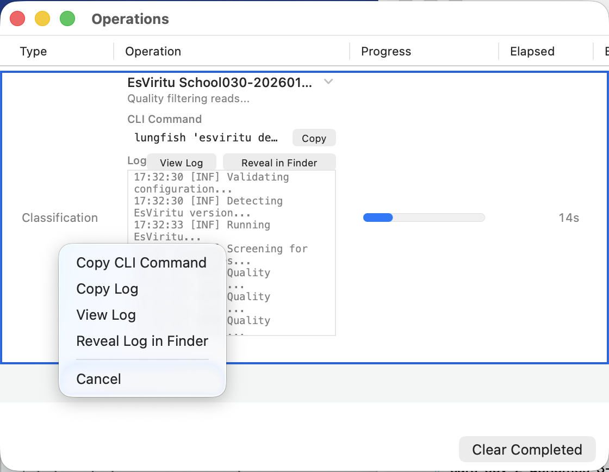

A Lungfish Genome Explorer (LGE) [project](../../GLOSSARY.md#project) is a folder on disk that holds the data, results, and provenance for one analysis. Sequencing reads you imported, references you downloaded, alignments you produced, variant tracks, classification results, and the provenance records that tie every output back to a reproducible command all live inside that one folder. There is no separate LGE database on your Mac that holds project content; opening the folder in Finder shows you everything LGE knows about the project.

A few analyses (Kraken2 classification, EsViritu, and similar metagenomics workflows) depend on large reference databases that LGE installs separately and shares across every project on the machine. Those databases stay outside the project folder by design, because copying tens of gigabytes into every project would be wasteful. The project's provenance records the database name and version it used, so the analysis is still reproducible: re-running on another Mac requires a compatible LGE version, the installed plugin packs, and the same external databases the project references.

Open a project and you get a window with three persistent panes. The [sidebar](../../GLOSSARY.md#sidebar) runs down the left and shows the project's contents as a folder tree. The main viewport fills the centre and shows whatever you have selected: a sequence track, an alignment, a variant table, a classification sunburst. The [Inspector](../../GLOSSARY.md#inspector) runs down the right and shows context-sensitive metadata and analysis actions for the current selection. A fourth surface, the [Operations Panel](../../GLOSSARY.md#operations-panel), opens in its own window from the **Operations** menu and reports every long-running job in the project.

LGE also ships a command-line interface (CLI) tool, `lungfish`, that mirrors most GUI actions. This chapter is GUI-focused. The CLI commands appear inline in later chapters wherever the GUI introduces a new operation. Most users do not need to work with the CLI directly; power users may appreciate the convenience of driving LGE data and tools without the GUI.

So what should you do with this? Read this chapter once before any other UI chapter, because every later chapter assumes you can locate the sidebar, the Inspector, and the Operations Panel by name.

## What you will learn

By the end of this chapter you will be able to create a new LGE project from the Welcome window, recognise the top-level project folders and what each one holds, locate the Inspector pane and understand that its contents change with your selection, find the Operations Panel and read a progress row, and understand that a [bundle](../../GLOSSARY.md#bundle) in LGE is a folder, not a single file. You will use these concepts in every later chapter.

## The Welcome window

When you launch LGE without a project open, the Welcome window appears. It has two primary actions and a recent-projects list.

<!-- SHOT: welcome-window -->

1. **Create Project** creates a new empty project folder at a location you choose. Keyboard shortcut: `Cmd-N`.
2. **Open Project** opens an existing project folder you select with the file dialog. Keyboard shortcut: `Cmd-O`.
3. **Recent Projects** lists projects you opened recently. Click any row to reopen.

If you already have a project window open and want a second one, `File > New Project` and `File > Open` work from the menu bar without going back to the Welcome window. (The menu items use the macOS-conventional names "New" and "Open"; the Welcome window cards say "Create Project" and "Open Project". Same actions, different surfaces.)

## Walkthrough: create your first project

This walkthrough creates an empty project named `SARS-CoV-2 SRR36291587` under your `Documents` folder, so later chapters can use the same project as a starting point. No data has been imported yet; the goal is just to recognise each surface.

1. Launch LGE. The Welcome window appears.
2. Click **Create Project**. A save dialog opens.
3. In the dialog, navigate to `Documents`, type `SARS-CoV-2 SRR36291587` as the project name, and click **Create**.
4. The Welcome window closes. A new project window opens, titled `SARS-CoV-2 SRR36291587`.
5. The window has three panes. The sidebar on the left shows the project name at the top and the project's top-level folders below. The centre is empty, with placeholder text inviting you to import or download data. The Inspector on the right is empty, because nothing is selected.

<!-- SHOT: empty-project-window -->

If the Inspector is not visible, choose `View > Show Inspector` or press `Cmd-Opt-I`. If the sidebar is not visible, choose `View > Show Sidebar` or press `Cmd-Shift-S`. The Operations Panel is hidden by default; bring it up with `Operations > Show Operations Panel` or `Cmd-Shift-P`.

The project folder on disk now exists at `~/Documents/SARS-CoV-2 SRR36291587/`. If you open it in Finder, you will see the project's top-level folders mirroring the sidebar. LGE stores no hidden state outside that folder for this project's data; the folder is the project.

## A tour of the sidebar

A LGE project is a folder-backed workspace. The most common top-level areas are listed below. Some are created when the project is created, and others appear the first time a workflow needs them; either way, you should treat the sidebar as the canonical view of the project.

<!-- SHOT: sidebar-folder-conventions -->

1. **Imports/** holds anything you imported from a local file on your Mac. Reads you copied off a sequencer, a reference FASTA a colleague mailed you, a BED file from an old analysis. The origin is your filesystem.
2. **Downloads/** holds anything LGE fetched from the internet. Reference genomes from NCBI, raw reads from SRA, sequences from Pathoplexus. Every download arrives with a [provenance sidecar](../../GLOSSARY.md#provenance-sidecar) that records the URL, the accession, the timestamp, and the checksum.
3. **Reference Sequences/** holds [reference bundles](../../GLOSSARY.md#reference-bundle), each with the extension `.lungfishref`. A reference bundle is a folder, not a single file. It contains a FASTA, an index, optional annotations such as GFF3 or GTF, and any tracks you have attached to that reference (alignments, variants, classifications).
4. **Assemblies/** holds de novo [assembly bundles](../../GLOSSARY.md#assembly-bundle), also `.lungfishref`. The format is the same as a reference bundle. The folder name is what distinguishes "this came from SPAdes or MEGAHIT" from "this is a published reference".
5. **Primer Schemes/** holds amplicon [primer-scheme](../../GLOSSARY.md#primer-scheme) bundles with the extension `.lungfishprimers`. Each bundle carries the BED coordinates, the primer sequences as a companion FASTA, and provenance.
6. **Analyses/** holds the outputs of analyses that are not naturally attached to a reference or assembly bundle, such as taxonomic classifier runs, minimap2 alignments against ad-hoc references, and SPAdes assembly intermediates. Each analysis lives in its own timestamped subfolder with its own provenance sidecar.

The distinction between `Imports/` and `Downloads/` matters because their provenance is different. An imported file has provenance only as far back as your local copy. A download carries a full network trail: where it came from, when, and what checksum it matched at fetch time. Later workflows export that provenance verbatim into the run record. If you need to reproduce a published analysis, prefer downloads.

The distinction between `Reference Sequences/` and `Assemblies/` is conventional, not technical. Both folders hold `.lungfishref` bundles with identical internal structure. The folder you find a bundle in tells you whether it was published (a reference) or generated in this project (an assembly). LGE workflows that need a reference accept bundles from either folder; the chapter that introduces each workflow says which is appropriate.

### What "bundle" means

Every time this manual says "bundle", it means a folder that the Finder shows as a single icon with an extension. A `.lungfishref` is not a zipped archive and not a single file. It is a directory with a `manifest.json` at the root, a primary FASTA, an index, optional annotations, optional attached tracks, and a `provenance/` subfolder. You can right-click any bundle in Finder and choose **Show Package Contents** to see inside. The bundle structure is documented in the [Importing and Viewing](../02-sequences/01-importing-and-viewing.md) chapter.

Bundles travel as a unit. When you copy a `.lungfishref` to another project, you copy the FASTA, the index, the annotations, and the provenance together. There is no chance of losing the index without the FASTA, or the annotation without the sequence it annotates.

## The Inspector

The [Inspector](../../GLOSSARY.md#inspector) is the right-hand pane. It is context-sensitive: its contents change every time you change what is selected in the sidebar or the main viewport.

Select a paired-end FASTQ bundle in `Imports/`, and the Inspector shows the read count, the average length, the per-base quality summary, and a button to run a classification or a mapping. Select an alignment track inside a `.lungfishref`, and the Inspector switches to alignment statistics: mapped read count, mean coverage, coverage uniformity, and a button to call variants. Open a variant track and click a row in the variant table at the bottom of the viewport, and the Inspector switches again, this time to that variant's `INFO` and `FORMAT` fields, the supporting read counts on each strand, and a button to copy the position to the clipboard. (Variant rows are selected in the table drawer rather than the sidebar, because there are far more variants per track than the sidebar can usefully list. Whichever surface you select from, the Inspector is where the per-item detail appears.)

<!-- SHOT: inspector-fastq-selected -->

The Inspector for a FASTQ selection is worth looking at in close-up because the same pattern repeats for every other selection type. The top of the pane identifies the item (a FASTQ dataset, with a read count). Then comes a section of summary statistics, a section of ingestion settings recorded when the file was imported, the processing pipeline that produced this exact dataset (each step with its tool name, command line, and elapsed time), and editable sample metadata at the bottom.

<!-- SHOT: inspector-fastq-detail -->

The pattern is the same throughout the app. Whatever you have selected, the Inspector shows what is known about it and what you can do next. If the Inspector is ever empty, nothing is selected. Click an item in the sidebar or the viewport to populate it.

Toggle the Inspector with `Cmd-Opt-I`. Hide it when you want a wider viewport for a coverage track or a sunburst; show it when you want metadata or actions.

## The Operations Panel

The [Operations Panel](../../GLOSSARY.md#operations-panel) shows live long-running work in LGE: downloads, mapping runs, variant calls, classification runs, exports. Open it from the menu bar at `Operations > Show Operations Panel`, or with `Cmd-Shift-P`.

Each operation produces a row with the operation type, its name, a progress bar, and the elapsed time. Click the disclosure triangle on the row to expand it: the expanded row shows the CLI command LGE built, buttons to view or reveal the log file, and the running log output in a scrolling text area. Failed operations stay in the panel until you dismiss them, so you can read the log and decide whether to retry.

<!-- SHOT: operations-panel-row -->

The Operations Panel shows the operations for the current session. **Clear Completed** at the bottom of the panel removes finished rows when you no longer need them on screen. The durable audit trail lives in the [provenance](../../GLOSSARY.md#provenance) sidecars and logs that completed workflows write into the project folder; those records persist after the panel row scrolls away or the app is relaunched. The [Provenance and Reproducibility](08-provenance-and-reproducibility.md) chapter walks through reading and exporting that record.

### When things go wrong

Right-click any row in the Operations Panel to act on it without leaving the panel. The context menu shows what is available for that row, and the available items depend on the row's state.

<!-- SHOT: operations-panel-right-click-menu -->

1. **Copy CLI Command** copies the exact command line LGE ran for that operation, so you can paste it into a terminal to reproduce the run by hand. This is also the fastest way to capture the command for a bug report.
2. **Copy Log** copies the operation's log text to the clipboard. **View Log** opens the log inline. **Reveal Log in Finder** opens the project folder at the log file so you can attach it to a bug report or read it in another tool.
3. **Cancel** appears on running operations. Cancellation is cooperative; tools are asked to stop and clean up, and the row's status becomes "cancelled" once they do. You can also press `Cmd-Period` with the row selected.
4. **Copy Failure Report** and **Open GitHub Issue** replace **Cancel** on failed rows. **Copy Failure Report** gathers the operation title, the CLI command, the error message, the error detail, and the log into a single text block ready to paste into a GitHub issue. **Open GitHub Issue** opens a pre-filled GitHub issue in your browser with the failure report attached, so you can review and submit it from the browser; nothing is filed without your explicit action.

When something fails and the error message is not enough to diagnose, the recommended sequence is to open the panel, expand the failed row to read the inline log, right-click and choose **Open GitHub Issue**, and then add anything else (screenshots, project context) in the browser before submitting. The [Troubleshooting](../appendices/troubleshooting.md) appendix lists the most common failure modes and their fixes.

## Finding this manual inside the app

The user manual ships inside the application. From any project window choose `Help > Lungfish Genome Explorer Help` to open this manual in your default browser. `Help > Report an Issue...` opens a pre-filled GitHub issue template that includes the version string and is the right surface when the failure is not tied to a specific operation; for a failure you can see in the Operations Panel, the right-click **Open GitHub Issue** path is faster because it captures the command, the log, and the error automatically.

For the full list of keyboard shortcuts referenced by this chapter and the rest of the manual, see the [Keyboard Shortcuts](../appendices/keyboard-shortcuts.md) appendix.

## Next

Continue to [Plugin Packs](07-plugin-packs.md) to learn how LGE manages the bioinformatics tools (minimap2, samtools, iVar, and others) that the workflow chapters depend on.
