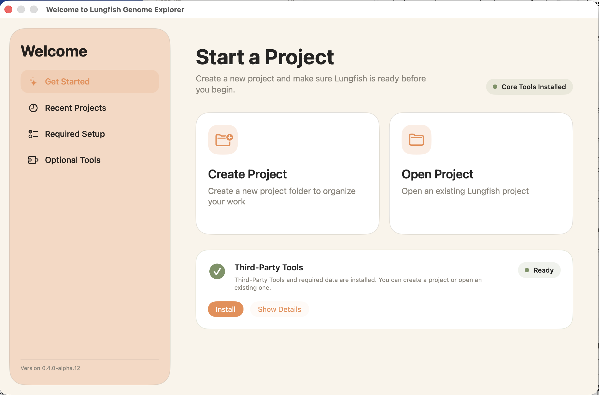
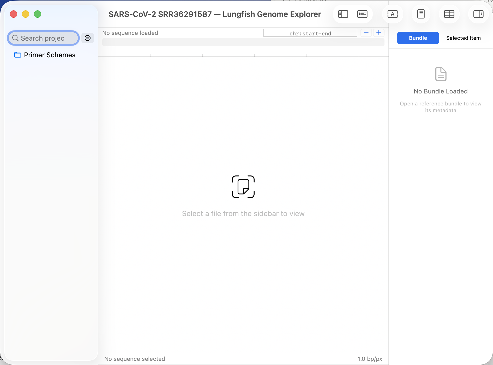
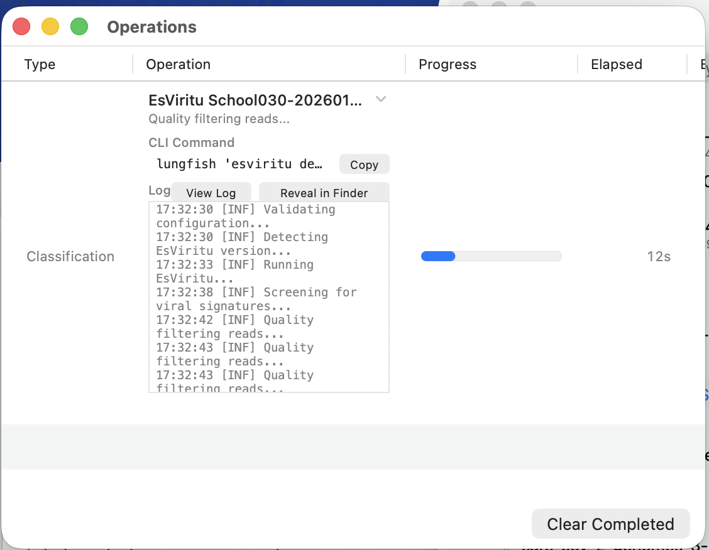
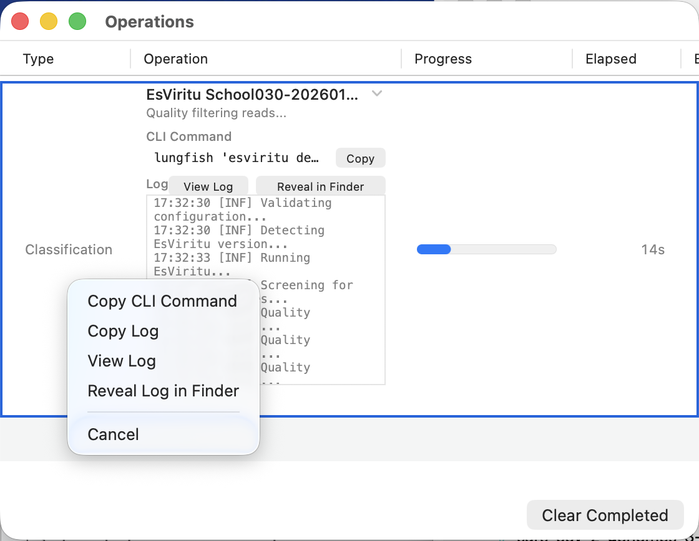

A Lungfish Genome Explorer (LGE) [project](../../GLOSSARY.md#project) is one folder on disk. It holds everything for a single analysis: the sequencing reads you imported, the references you downloaded, the alignments you produced, the variant tracks, the classification results, and the provenance records that tie every output back to a reproducible command. Nothing hides in a separate database somewhere on your Mac. Open the folder in Finder and you see everything LGE knows about the project.

A handful of analyses lean on large reference databases: Kraken2 classification, EsViritu, and similar metagenomics workflows. LGE installs those databases once and shares them across every project on the machine. They sit outside the project folder on purpose, because copying tens of gigabytes into every project would be wasteful. The project's provenance still records the database name and version it used, so the analysis stays reproducible. Re-running it on another Mac takes a compatible LGE version, the installed plugin packs, and the same external databases the project references.

Open a project and a window appears with three persistent panes. The [sidebar](../../GLOSSARY.md#sidebar) runs down the left and lists the project's contents as a folder tree. The main viewport fills the centre and shows whatever you select: a sequence track, an alignment, a variant table, a classification sunburst. The [Inspector](../../GLOSSARY.md#inspector) runs down the right with context-sensitive metadata and analysis actions for the current selection. A fourth surface, the [Operations Panel](../../GLOSSARY.md#operations-panel), opens in its own window from the **Operations** menu and reports every long-running job in the project.

LGE also ships a command-line tool, `lungfish`, that mirrors most GUI actions. This chapter stays with the GUI. CLI commands appear inline in later chapters wherever the GUI introduces a new operation. Most people never touch the CLI directly; power users may enjoy driving LGE's data and tools without it.

Read this chapter once before any other UI chapter. Every later chapter assumes you can find the sidebar, the Inspector, and the Operations Panel by name.

## What you will learn

Five ideas carry through the rest of the manual. You will create a new LGE project from the Welcome window and learn to recognise the top-level project folders and what each holds. You will locate the Inspector pane and see how its contents shift with your selection. You will find the Operations Panel and read a progress row. And you will learn that a [bundle](../../GLOSSARY.md#bundle) in LGE is a folder, not a single file. Every later chapter builds on these.

## The Welcome window

Launch LGE with no project open and the Welcome window greets you. It offers two main actions and a list of recent projects.

<!-- SHOT: welcome-window -->

1. **Create Project** makes a new empty project folder at a location you pick. Shortcut: `Cmd-N`.
2. **Open Project** opens an existing project folder you choose from the file dialog. Shortcut: `Cmd-O`.
3. **Recent Projects** lists the projects you opened lately. Click any row to reopen it.

Already have a project window open and want a second? `File > New Project` and `File > Open` work from the menu bar, no trip back to the Welcome window required. The menu items use the macOS names "New" and "Open", while the Welcome window cards say "Create Project" and "Open Project". Same actions, different surfaces.

## Walkthrough: create your first project

This walkthrough builds an empty project named `SARS-CoV-2 SRR36291587` inside your `Documents` folder, ready for later chapters to pick up. Nothing is imported yet. The goal is simply to recognise each surface.

1. Launch LGE. The Welcome window appears.
2. Click **Create Project**. A save dialog opens.
3. In the dialog, navigate to `Documents`, type `SARS-CoV-2 SRR36291587` as the project name, and click **Create**.
4. The Welcome window closes. A new project window opens, titled `SARS-CoV-2 SRR36291587`.
5. The window opens with three panes. The sidebar on the left shows the project name up top and the top-level folders below. The centre sits empty, with placeholder text inviting you to import or download data. The Inspector on the right is empty too, because nothing is selected yet.

<!-- SHOT: empty-project-window -->

If the Inspector is not visible, choose `View > Show Inspector` or press `Cmd-Opt-I`. If the sidebar is not visible, choose `View > Show Sidebar` or press `Cmd-Shift-S`. The Operations Panel is hidden by default; bring it up with `Operations > Show Operations Panel` or `Cmd-Shift-P`.

The project folder now exists on disk at `~/Documents/SARS-CoV-2 SRR36291587/`. Open it in Finder and you will find the same top-level folders the sidebar shows. LGE keeps no hidden state outside that folder for this project's data. The folder is the project.

## A tour of the sidebar

An LGE project is a folder-backed workspace. Its most common top-level areas appear below. Some are created with the project; others show up the first time a workflow needs them. Either way, treat the sidebar as the canonical view of the project.

<!-- SHOT: sidebar-folder-conventions -->

1. **Imports/** holds anything you brought in from a local file on your Mac: reads copied off a sequencer, a reference FASTA a colleague mailed you, a BED file from an old analysis. The origin is your own filesystem.
2. **Downloads/** holds anything LGE fetched from the internet: reference genomes from NCBI, raw reads from SRA, sequences from Pathoplexus. Every download lands with a [provenance sidecar](../../GLOSSARY.md#provenance-sidecar) recording the URL, the accession, the timestamp, and the checksum.
3. **Reference Sequences/** holds [reference bundles](../../GLOSSARY.md#reference-bundle), each carrying the extension `.lungfishref`. A reference bundle is a folder, not a single file. It contains a FASTA, an index, optional annotations such as GFF3 or GTF, and any tracks you have attached to that reference, including alignments, variants, and classifications.
4. **Assemblies/** holds de novo [assembly bundles](../../GLOSSARY.md#assembly-bundle), also `.lungfishref`. The format matches a reference bundle exactly. Only the folder name separates "this came from SPAdes or MEGAHIT" from "this is a published reference".
5. **Primer Schemes/** holds amplicon [primer-scheme](../../GLOSSARY.md#primer-scheme) bundles with the extension `.lungfishprimers`. Each bundle carries the BED coordinates, the primer sequences as a companion FASTA, and its provenance.
6. **Analyses/** holds the outputs that do not naturally attach to a reference or assembly bundle: taxonomic classifier runs, minimap2 alignments against ad-hoc references, SPAdes assembly intermediates. Each analysis lives in its own timestamped subfolder with its own provenance sidecar.

The split between `Imports/` and `Downloads/` matters because the two carry different provenance. An imported file's trail reaches back only as far as your local copy. A download carries the full network history: where it came from, when, and what checksum it matched at fetch time. Later workflows copy that provenance verbatim into the run record. When you need to reproduce a published analysis, prefer downloads.

The split between `Reference Sequences/` and `Assemblies/` is a convention, not a technical divide. Both folders hold `.lungfishref` bundles with identical internal structure. The folder a bundle sits in tells you whether it was published, making it a reference, or generated in this project, making it an assembly. LGE workflows that need a reference accept bundles from either folder. The chapter that introduces each workflow says which one fits.

### What "bundle" means

Every time this manual says "bundle", it means a folder that Finder shows as a single icon with an extension. A `.lungfishref` is neither a zipped archive nor a single file. It is a directory holding a `manifest.json` at the root, a primary FASTA, an index, optional annotations, optional attached tracks, and a `provenance/` subfolder. Right-click any bundle in Finder and choose **Show Package Contents** to look inside. The [Importing and Viewing](../02-sequences/01-importing-and-viewing.md) chapter documents the full structure.

Bundles travel as a unit. Copy a `.lungfishref` to another project and the FASTA, the index, the annotations, and the provenance all move together. You cannot lose the index without the FASTA, or strand an annotation from the sequence it describes.

## The Inspector

The [Inspector](../../GLOSSARY.md#inspector) is the right-hand pane, and it reacts to you. Its contents change the moment you change what is selected in the sidebar or the main viewport.

Select a paired-end FASTQ bundle in `Imports/` and the Inspector shows the read count, the average length, the per-base quality summary, and a button to run a classification or a mapping. Select an alignment track inside a `.lungfishref` and it switches to alignment statistics: mapped read count, mean coverage, coverage uniformity, and a button to call variants. Open a variant track, click a row in the variant table at the bottom of the viewport, and the Inspector switches again, now to that variant's `INFO` and `FORMAT` fields, the supporting read counts on each strand, and a button to copy the position to the clipboard. Variant rows live in the table drawer rather than the sidebar, because a track holds far more variants than the sidebar could usefully list. Wherever you select from, the Inspector is where the per-item detail lands.

<!-- SHOT: inspector-fastq-selected -->

The FASTQ Inspector rewards a close look, because the same pattern repeats for every other selection type. The top of the pane names the item: a FASTQ dataset, with a read count. Below that come summary statistics, then the ingestion settings recorded when the file was imported, then the processing pipeline that produced this exact dataset, each step carrying its tool name, command line, and elapsed time. Editable sample metadata sits at the bottom.

<!-- SHOT: inspector-fastq-detail -->

That pattern holds throughout the app. Whatever you select, the Inspector shows what is known about it and what you can do next. An empty Inspector means nothing is selected. Click an item in the sidebar or the viewport to fill it.

Toggle the Inspector with `Cmd-Opt-I`. Hide it for a wider viewport when you study a coverage track or a sunburst. Show it when you want metadata or actions.

## The Operations Panel

The [Operations Panel](../../GLOSSARY.md#operations-panel) tracks the long-running work in LGE as it happens: downloads, mapping runs, variant calls, classification runs, exports. Open it from the menu bar at `Operations > Show Operations Panel`, or with `Cmd-Shift-P`.

Each operation gets a row showing its type, its name, a progress bar, and the elapsed time. Click the disclosure triangle to expand it. The expanded row reveals the CLI command LGE built, buttons to view or reveal the log file, and the running log output in a scrolling text area. Failed operations stay in the panel until you dismiss them, so you can read the log and decide whether to retry.

<!-- SHOT: operations-panel-row -->

The panel covers the current session only. **Clear Completed** at the bottom removes finished rows once you no longer need them on screen. The durable audit trail lives elsewhere, in the [provenance](../../GLOSSARY.md#provenance) sidecars and logs that completed workflows write into the project folder. Those records outlast the panel row and survive a relaunch. The [Provenance and Reproducibility](08-provenance-and-reproducibility.md) chapter walks through reading and exporting them.

### When things go wrong

Right-click any row in the Operations Panel to act on it without leaving the panel. The context menu offers what that row supports, and the choices depend on the row's state.

<!-- SHOT: operations-panel-right-click-menu -->

1. **Copy CLI Command** copies the exact command line LGE ran, ready to paste into a terminal and reproduce the run by hand. It is also the fastest way to capture the command for a bug report.
2. **Copy Log** copies the operation's log text to the clipboard. **View Log** opens it inline. **Reveal Log in Finder** opens the project folder at the log file, so you can attach it to a bug report or open it in another tool.
3. **Cancel** appears on running operations. Cancellation is cooperative: the tool is asked to stop and clean up, and the row reads "cancelled" once it does. You can also press `Cmd-Period` with the row selected.
4. **Copy Failure Report** and **Open GitHub Issue** replace **Cancel** on failed rows. **Copy Failure Report** gathers the operation title, the CLI command, the error message, the error detail, and the log into one text block, ready to paste into a GitHub issue. **Open GitHub Issue** opens a pre-filled issue in your browser with the failure report attached, so you review and submit it yourself. Nothing is filed without your explicit action.

When something fails and the error message alone will not tell you why, work through it in order. Open the panel, expand the failed row to read the inline log, then right-click and choose **Open GitHub Issue**. Add anything else, such as screenshots or project context, in the browser before you submit. The [Troubleshooting](../appendices/troubleshooting.md) appendix lists the most common failure modes and their fixes.

## Finding this manual inside the app

The user manual ships inside the application. From any project window, choose `Help > Lungfish Genome Explorer Help` to open it in your default browser. `Help > Report an Issue...` opens a pre-filled GitHub issue template that includes the version string, and it is the right surface when a failure is not tied to a specific operation. For a failure you can see in the Operations Panel, the right-click **Open GitHub Issue** path is faster, because it captures the command, the log, and the error for you.

For the full list of keyboard shortcuts referenced by this chapter and the rest of the manual, see the [Keyboard Shortcuts](../appendices/keyboard-shortcuts.md) appendix.

## Next

Continue to [Plugin Packs](07-plugin-packs.md) to learn how LGE manages the bioinformatics tools (minimap2, samtools, iVar, and others) that the workflow chapters depend on.
