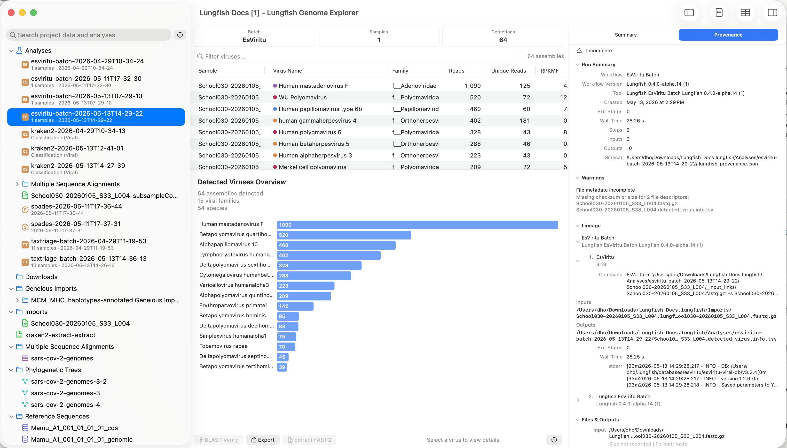
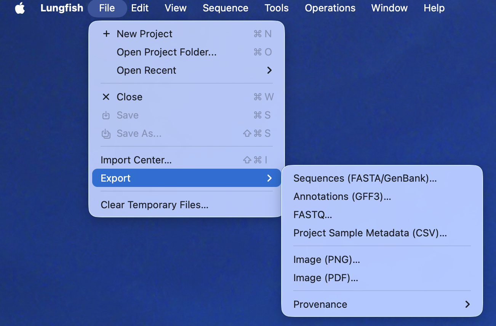
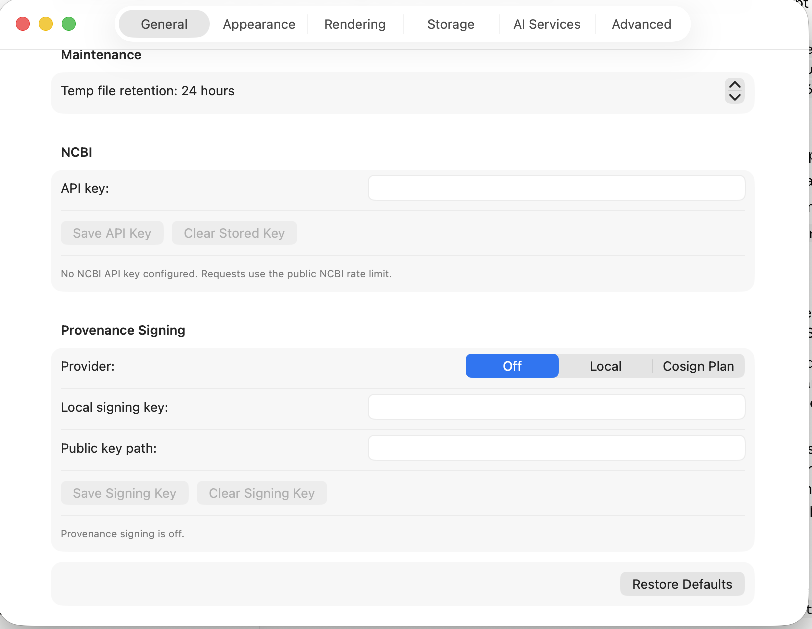

When Lungfish Genome Explorer (LGE) produces a result, it remembers how. For every workflow that creates, imports, or transforms data (a download, a mapping, a primer trim, a variant call, a classification, an assembly), LGE keeps a run record attached to the result. The record names the tool that ran, its version, the parameters you chose, the inputs it read, and the outputs it produced. You read the record through the GUI; you do not have to think about how it is stored.

This chapter answers three practical questions. First, where in the app you see the run record for a result. Second, how to export a workflow so a collaborator can re-run it. Third, what LGE records automatically and what you still need to add by hand (the methods-section export, in particular, is a draft you fill in with citations and accession numbers before submitting).

## What provenance is for

[Provenance](../../GLOSSARY.md#provenance) is the record of how a result was produced. [Reproducibility](../../GLOSSARY.md#reproducibility) is the practical use of that record: another researcher (or you, six months from now) re-runs the same tool with the same version and the same parameters on the same inputs, and reaches the same answer. The two ideas are linked but not the same. Provenance is what LGE writes down. Reproducibility is what you, your collaborators, or a regulator do with what was written down.

Practically, the run record exists so you can:

1. Audit an old result and see exactly which tool version and parameters produced it.
2. Write a methods section that names every tool you used, without having to remember.
3. Hand a collaborator a runnable copy of your workflow without composing it by hand.
4. Investigate when a workflow fails and you need to know which step broke.

LGE writes the record automatically for every supported workflow. You do not have to ask for it, and you cannot accidentally skip it.

## Reading provenance in the Inspector

When you select a result in the project sidebar (a classification, a variant call, an assembly, a download), the [Inspector](../../GLOSSARY.md#inspector) on the right shows what LGE knows about it. The Inspector has a **Provenance** tab that shows the run record for that result.

<!-- SHOT: classifier-provenance-disclosure -->

The tab is organised into sections you can scan top to bottom. **Run Summary** names the workflow, the tool, and its version, with the time the run started and how long it took. **Inputs** lists every file the run read. **Outputs** lists every file it produced. **Warnings** surfaces any non-fatal notes the tool emitted. **Lineage** shows the chain of earlier steps that produced this run's inputs, so you can click backward through the workflow.

If you open a result and the Provenance tab is empty, that is a bug; please file an issue from `Help > Report an Issue...`.

## Exporting a workflow

When a collaborator at another institution asks for your workflow, or a reviewer asks how to reproduce your figure, LGE can produce a complete, runnable copy of every step from the project's starting inputs to the result you selected. Choose `File > Export > Provenance` with a result selected in the sidebar.

<!-- SHOT: file-export-provenance-menu -->

The Provenance submenu offers six formats, grouped into a runnable-script group and a human-readable group:

| Format | What you get | When to use it |
|---|---|---|
| Shell Script | A `run.sh` bash script that re-runs every step in order | A collaborator who wants to re-run on their own Mac or a Linux server |
| Python Script | A `reproduce.py` that drives the same tool calls programmatically | Embedding in a Jupyter notebook for batch re-runs |
| Nextflow Pipeline | A Nextflow project ready to run on a cluster | Scaling out across many samples |
| Snakemake Workflow | A Snakefile and config | Labs that already use Snakemake |
| Methods Section | A Markdown paragraph naming every tool and version | A methods section for a paper or clinical report |
| Full Provenance | The complete machine-readable record as JSON | Archiving the full record; ingesting into a compliance system |

Each export is a folder containing the chosen primary artifact (the script, the Snakefile, the Markdown, or the JSON) and a `provenance/` directory that carries the per-step records the export was built from. Send the whole folder to your collaborator (zip it first); the script will not run without the contents of `provenance/` and any reference files alongside it.

For a deeper look at the runnable-script and pipeline formats, see [Exporting workflows for collaborators](../../README.md) (coming in a later part of the manual). For most Foundations readers, the format that earns its place here is the Methods Section export, covered below.

## The methods-section export

Choose `File > Export > Provenance > Methods Section...` and LGE writes a `methods.md` file with a draft methods paragraph that names every tool and version your workflow used. The paragraph is structured from the workflow type and the per-step run records; the wording reads roughly like this:

> Reads were mapped to MN908947.3 with minimap2 v2.28, sorted and indexed with samtools v1.21, primer-trimmed with iVar v1.4.4 against the QIAseq Direct SARS-CoV-2 primer scheme, and called against the same reference with iVar variants v1.4.4 at minimum allele frequency 0.05 and minimum depth 10, codon-annotated with the matching GFF3.

Treat the output as a structured starting point, not a finished paragraph. Before you submit, you need to add:

1. **Formal citations.** LGE fills in tool names and version numbers but not citations. Add the primary citation for each tool (for example, Li 2018 for minimap2, Danecek et al. 2021 for samtools and bcftools, Grubaugh et al. 2019 for iVar). See [Tool Versions](../appendices/tool-versions.md#appendix-tool-versions) for the LGE release-level reference of which tools are bundled.
2. **Accession numbers and access dates.** SRA, ENA, GISAID, or GenBank accessions for the data you used, with the date you fetched them. The export records the URL the data came from but not your decision to cite it formally.
3. **Database DOIs.** When you used a classification database (Kraken2 Standard, EsViritu Viral DB, NCBI Taxonomy), cite the database itself with its version date, not just the tool that read it.

Read the draft alongside your actual methods to make sure the parameters match what you intended; LGE writes down what ran, not what you meant to run. If a value differs (because you changed your mind mid-workflow, or because you re-ran with new settings), use this as a prompt to either re-run cleanly or to explain the difference in your methods.

## What provenance does not promise

The run record names the tool, the version, the parameters, and the inputs. Three things it cannot promise for you:

1. **External sources stay the same.** If your workflow downloads a SARS-CoV-2 reference from NCBI, LGE records the accession and the date you fetched it, but cannot guarantee NCBI will still serve those exact bytes next year. Re-runs against a different fetch date can produce different results if the upstream record was revised.
2. **Tool environments stay identical across machines.** LGE pins the plugin pack version (the bundle that includes the tool), which makes a re-run on the same Mac reliable. Re-running on a different machine, on a different OS version, or on a different CPU family can introduce small differences in tool output (some tools are sensitive to thread counts or hardware; others are not). LGE tells you which.
3. **A methods paragraph is a final paragraph.** As above, the methods export is a draft. You still write the paper.

For clinical-audit workflows that need tamper-evident records, LGE has a Provenance Signing option in `Settings > General` (default Off). The default Off is the right setting for research workflows; the Local and Cosign Plan options exist for sites that have to produce signed audit artifacts.

<!-- SHOT: provenance-signing-settings -->

## Next

Foundations is complete. Continue to one of the workflow parts:

- [Sequences](../02-sequences/) for sequence import, viewing, and download workflows
- [Reads (FASTQ)](../03-reads/) for read import, QC, trimming, and decontamination
- [Alignments](../04-alignments/) for mapping, alignment review, and primer trimming
- [Variants](../05-variants/) for variant calling and VCF interpretation
- [Classification](../06-classification/) for taxonomic classification of reads

The [Assembly](../07-assembly/) part covers de novo assembly workflows.
