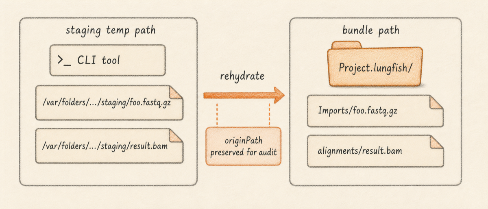
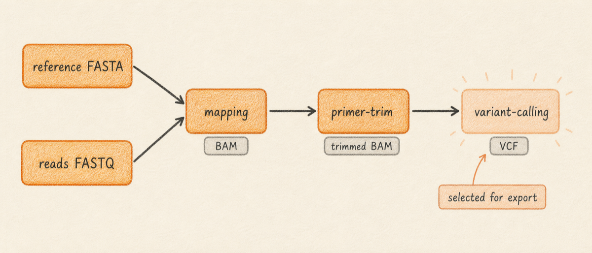

For supported scientific workflows that create, import, transform, export, or wrap data, Lungfish Genome Explorer (LGE) records reproducibility [provenance](../../GLOSSARY.md#provenance) with the output. The [provenance sidecar](../../GLOSSARY.md#provenance-sidecar) is a JSON file written alongside the result that records the resolved tool name and version, the exact command that ran (with all paths and parameters substituted), the input files with checksums and sizes, the runtime environment (LGE version, OS, CPU architecture, plugin pack, optional container fingerprint, optional git commit), the per-step exit status and useful stderr, and the wall time. Every workflow in LGE is required to produce a sidecar. If a workflow ever produces output without one, treat that as a bug worth reporting.

This chapter teaches three concrete things. First, where sidecars live, what they contain, and how to read one. Second, how to export a project's provenance graph as a runnable Shell script, a Python script, a Nextflow pipeline, a Snakemake workflow, a methods-section paragraph for a paper, or the complete provenance file. Third, what a sidecar does and does not capture, so you know which kinds of [reproducibility](../../GLOSSARY.md#reproducibility) the record can underwrite and which it cannot.

Provenance has practical use beyond reproducibility. The iVar variant-calling step in the [pilot chapter](../05-variants/01-calling-variants-from-amplicons.md) reads a small sidecar that the primer-trim step writes, sees that primer trimming already ran, and skips the manual confirmation prompt it would otherwise show. Workflows behave this way throughout the app: when an upstream step's sidecar can answer a question the downstream dialog would ask, LGE answers the question from the sidecar (this chapter calls that pattern "auto-confirm"). So what should you do with this? Treat the sidecar as the authoritative record of how a file was made, and reach for the export menu when a collaborator asks for a runnable copy of your workflow.

## What you will learn

By the end of this chapter you will be able to find the provenance sidecar for any output file, read the resolved command and tool version from a sidecar, export a project's workflow in any of the six supported formats, and turn the methods-section export into a citable paragraph for a paper. You will also know what the sidecar does not promise: bit-identical output across different conda environment hashes or across different CPU microarchitectures.

## Where sidecars live

A sidecar lives next to the file it describes, with the suffix `.lungfish-provenance.json` appended to the original filename. For a downloaded FASTA at `Downloads/MN908947.3.fasta`, the sidecar is `Downloads/MN908947.3.fasta.lungfish-provenance.json`.

<!-- planned: sidecar-in-finder -->

For files inside a bundle (a `.lungfishref` reference bundle, a `.lungfishprimers` primer scheme, an assembly bundle), per-file sidecars are gathered into a `provenance/` subdirectory at the bundle root, with one JSON per output and a roll-up `bundle.lungfish-provenance.json` that lists every contained file in step order. Right-click the bundle in Finder and choose **Show Package Contents** to see the layout.

Provenance is also surfaced in the GUI alongside each result. After a classifier run finishes (Kraken2, EsViritu, NAO-MGS, and the others), the result view shows an inline **Provenance** disclosure that opens the sidecar; the same pattern applies to variant calls and assemblies. The on-disk JSON is the source of truth; the inline disclosure is the fast path when you are already looking at a result. There is no Provenance button in the Operations Panel, because operations there are session events rather than persistent outputs.

<!-- planned: classifier-provenance-disclosure -->

Some workflows write additional small sidecars with a different suffix for fast-path lookups. The primer-trim step is the example you will most often encounter: it writes both the canonical `<trimmed.bam>.lungfish-provenance.json` and a companion `<trimmed.bam>.primer-trim-provenance.json` that the variant-calling dialog reads to auto-confirm trimming without re-parsing the full canonical sidecar. The two files carry overlapping information; the canonical sidecar is always authoritative.

## Sidecar coverage

Every LGE workflow that produces a scientific artifact declares a provenance policy. The policy says what the workflow runs, what inputs it takes, what outputs it writes, and that the workflow must attach a sidecar to its outputs. Lungfish checks the policy when the workflow runs: a workflow without a declared policy fails fast rather than silently producing untracked output. The policy covers most CLI commands and every managed third-party tool LGE invokes, including all the variant callers, mappers, classifiers, assemblers, and read-processing tools you will meet in this manual.

The practical consequence is that the absence of a sidecar means something specific went wrong, not that the writer was simply skipped. If a workflow output appears without a sidecar next to it, file a bug.

## The sidecar schema

A sidecar is a single JSON document at a stable `schemaVersion` (the format version, so future LGE releases know how to read older sidecars). The example below shows the most informative fields with realistic values; the real file on disk carries some additional legacy duplicates (`name`, `status`, `startTime`, `endTime`, `parameters`, and `legacyWorkflowRun`) that exist for backward compatibility with older readers. New code reads the canonical names; the legacy names track the same data. The truncated `sha256` digests below (`c7e1d3...`) stand in for full 64-character hex digests; real sidecars carry the entire digest.

```json
{
  "schemaVersion": 1,
  "id": "0F2A5B96-9A0D-4C28-A1B7-2E3F6B0C9D11",
  "createdAt": "2026-05-12T14:22:08Z",
  "workflowName": "variants.call.ivar",
  "workflowVersion": "0.4.0-alpha.15",
  "toolName": "ivar",
  "toolVersion": "1.4.4",
  "tool": {
    "kind": "managed",
    "name": "ivar",
    "version": "1.4.4"
  },
  "argv": [
    "ivar", "variants", "-p", "variants",
    "-q", "20", "-t", "0.05", "-m", "10",
    "-r", "MN908947.3.fasta", "-g", "MN908947.3.gff3"
  ],
  "reproducibleCommand": "ivar variants -p variants -q 20 -t 0.05 -m 10 -r MN908947.3.fasta -g MN908947.3.gff3",
  "options": {
    "explicit": { "minAF": 0.05, "minDepth": 10 },
    "defaults": { "minQuality": 20 },
    "resolvedDefaults": { "minAF": 0.05, "minDepth": 10, "minQuality": 20 }
  },
  "files": [
    {
      "path": "Reference Sequences/MN908947.3.lungfishref/MN908947.3.fasta",
      "sha256": "c7e1d3...",
      "sizeBytes": 30428
    },
    {
      "path": "Reference Sequences/MN908947.3.lungfishref/alignments/SRR36291587.trimmed.bam",
      "sha256": "9f4a82...",
      "sizeBytes": 16742391
    }
  ],
  "output": {
    "path": "Reference Sequences/MN908947.3.lungfishref/variants/SRR36291587.ivar.vcf.gz",
    "sha256": "ae8b91...",
    "sizeBytes": 4218
  },
  "outputs": [
    {
      "path": "Reference Sequences/MN908947.3.lungfishref/variants/SRR36291587.ivar.vcf.gz",
      "sha256": "ae8b91...",
      "sizeBytes": 4218
    }
  ],
  "steps": [],
  "runtimeIdentity": {
    "appVersion": "0.4.0-alpha.15",
    "executablePath": "/Users/me/.lungfish/conda/envs/ivar/bin/ivar",
    "processIdentifier": 48291,
    "operatingSystemVersion": "macOS-26.4.1-arm64-arm-64bit",
    "architecture": "arm64",
    "gitRevision": "cef4f4cd...",
    "user": "me",
    "condaEnvironment": "ivar",
    "condaPrefix": "/Users/me/.lungfish/conda/envs/ivar",
    "pluginPack": "variant-calling@0.3.2",
    "containerImage": null,
    "containerDigest": null
  },
  "wallTimeSeconds": 11.3,
  "exitStatus": 0,
  "stderr": null,
  "signatures": []
}
```

The fields read top to bottom as a story. Each block answers a different question:

| Block | What it tells you |
|---|---|
| Header (`schemaVersion`, `id`, `createdAt`, `workflowName`, `workflowVersion`, `toolName`, `toolVersion`, `tool`) | What ran, when, and what version of LGE produced the record. |
| Invocation (`argv`, `reproducibleCommand`, `options`) | Exactly what the tool was asked to do, with explicit and default parameters separated. |
| Data (`files`, `output`, `outputs`, `steps`) | Which files went in, which came out, and (for multi-step records) the chain that produced the result. |
| Environment (`runtimeIdentity`) | Where the tool ran: app version, OS, CPU architecture, plugin pack, optional container fingerprint. |
| Outcome (`wallTimeSeconds`, `exitStatus`, `stderr`, `signatures`) | How the run ended, with optional signatures for tamper evidence. |

Below the table, the deep-dive: the **header block** identifies the run. `id` is a UUID for this specific run, so it changes every time the workflow runs, even with identical inputs. `tool.kind` distinguishes `managed` tools (installed through a plugin pack) from `native` helpers and `external` user-supplied paths. `workflowVersion` is the LGE app version that produced the sidecar; `toolVersion` is the underlying bioinformatics tool's version.

The **invocation block** records exactly what the tool was asked to do. `argv` is the canonical form: the command as a list of separate arguments, the form a process actually receives, with no shell quoting ambiguity. `reproducibleCommand` is the equivalent shell-friendly string, convenient for reading or pasting into a terminal. `options` carries three views, `explicit` (set by the user), `defaults` (filled in by LGE because the user did not specify), and `resolvedDefaults` (the merged view actually passed to the tool). The three-way split lets a reader tell whether a value came from the dialog or from a built-in default that might change between LGE versions.

The **data block** records every file the run touched. `files[]` lists every input the step read, each with a SHA-256 checksum and a byte size. `output` records the primary result; `outputs[]` is the list view for steps that produce more than one (a variant-calling step that emits both a VCF and a TSV uses both). When a step has a single output, `output` and `outputs[0]` point at the same record. `steps[]` is the inline workflow graph for multi-step records. A single-tool sidecar like the iVar variant call above leaves it empty; an export bundle's roll-up sidecar populates it with the full chain of upstream sidecars in dependency order (each step appears after the steps that produced its inputs).

The **environment block** records how and where the tool ran. `runtimeIdentity` covers the machine, OS, CPU architecture, conda environment, plugin pack version, and (when running under a container) the container image and digest. `gitRevision` is the LGE commit hash if the build recorded one. `user` records the macOS account name. `pluginPack` carries both the pack name and the version (`variant-calling@0.3.2`), pinning the recipe the tool came from.

The **outcome block** summarises the run's result. A non-zero `exitStatus` is uncommon because LGE typically refuses to write a sidecar for a failed step, but a step that exits zero with warnings on stderr still records them here. `signatures[]` is empty by default; when provenance signing is enabled (see [Signed sidecars](#signed-sidecars)), the corresponding signature artifacts are referenced here.

When LGE reads a sidecar later (for auto-confirm in dialogs, or for export), it walks the inputs to verify checksums match the files currently on disk. A mismatch downgrades the auto-confirm to a manual prompt and surfaces a warning in the operation row.

### A note on field names

The on-disk sidecar carries both canonical and legacy aliases for two common entries: file digests appear as both `sha256` (canonical) and `checksumSHA256` (legacy), and file sizes appear as both `sizeBytes` (canonical) and `fileSize` (legacy). Both pairs always carry identical values in a freshly-written sidecar; older sidecars on disk may carry only the legacy pair, and LGE's reader accepts either. When you write a script against these files, prefer the canonical names.

When a workflow runs through the CLI inside a temporary staging directory (a common pattern when the GUI runs a wizard), the underlying tool sees temporary paths like `/var/folders/.../staging/foo.fastq.gz`. LGE rewrites canonical input and output payload paths to the final project-relative paths after the operation finishes, recomputes checksums against the final files, and preserves the original argv and reproducible command verbatim. The sidecar may also keep the staging path in `originPath` as audit metadata, but the payload paths a user follows point at the final stored files in the project or bundle.



## Export paths

Every LGE project carries a complete provenance graph: every output's sidecar plus the cross-references that link a sidecar's input to an earlier sidecar's output. `File > Export > Provenance` walks that graph from a selected leaf node back to the project's roots and emits the result in one of six formats. The menu only enables when a sidecar-bearing artifact is selected in the sidebar; if you click it without a selection, the items appear disabled.



<!-- planned: file-export-provenance-menu -->

The menu is organised into two groups separated by a divider. The first group is the runnable scripts and pipelines, ordered from simplest to most structured; the second group is the human-readable methods paragraph and the complete provenance file.

| Format | Primary artifact | Best for |
|---|---|---|
| Shell Script… | `run.sh` (a bash script with environment activation and ordered tool calls) | Quick re-run on a similar machine; debugging a production failure |
| Python Script… | `reproduce.py` (a Python script that drives the same tool calls programmatically) | Embedding in a Jupyter notebook; building a reusable function for batch re-runs |
| Nextflow Pipeline… | `main.nf`, `nextflow.config`, `containers/manifest.json` | Running on a cluster; scaling out across many samples |
| Snakemake Workflow… | `Snakefile`, `config.yaml` | Lab pipelines that already use Snakemake conventions |
| Methods Section… | `methods.md` (a Markdown paragraph with tool names and versions inline) | Methods sections in papers and clinical reports |
| Full Provenance (JSON) | `provenance.json` (the complete envelope, signed when signing is enabled) | Archiving the audit record; ingesting into external compliance systems |

Every export writes its primary artifact plus a `provenance/` directory containing the original per-step sidecars copied verbatim. The Nextflow export adds a `nextflow.config` and a `containers/manifest.json` that lists the container images each process expects. The Snakemake export adds a `config.yaml`. The Methods Section export opens with a draft-warning banner (`<!-- This is an automatically-generated draft. Read it before submitting. -->`) so the text gets a deliberate human review pass before submission. The Full Provenance (JSON) export is the same envelope a sidecar contains, but flattened into one file with the full `steps[]` chain populated; this is the format to archive when a downstream compliance system needs to ingest the audit record machine-readably.

When provenance signing is enabled, the export bundle also includes signature artifacts for each generated file, so a reviewer downstream can verify the export was produced by an authorised LGE installation.

### Sending the export to a collaborator

The export is a folder, not a single file. Zip or tar the entire exported folder (including the `inputs/` and `provenance/` directories) before sending; the script will not run without them, and the collaborator has no way to reconstruct them on their end. If your project pulls reads or references from public repositories, the `inputs/` directory holds your local copies of those files so the collaborator does not have to refetch them.

## Worked example: iVar variant call

Take the variant-calling step from the [variants chapter](../05-variants/01-calling-variants-from-amplicons.md). When that step finishes, LGE writes `variants/SRR36291587.ivar.vcf.gz.lungfish-provenance.json` next to the VCF inside the reference bundle. The sidecar is structurally identical to the example above; the relevant fields are the resolved command, the trimmed BAM checksum, and the iVar tool version.

Select that VCF in the sidebar, then choose `File > Export > Provenance > Shell Script…`. LGE produces a folder (or `.zip` when you choose to compress) containing `run.sh`, an `inputs/` directory with the reference FASTA and the GFF copied in, and a `provenance/` directory with every sidecar from the project's start to the variant call. The script body looks like this:

<!-- planned: exported-folder-in-finder -->

```bash
#!/usr/bin/env bash
set -euo pipefail

# Activate the LGE-managed iVar environment.
# Plugin pack: variant-calling@0.3.2
source ~/.lungfish/conda/envs/ivar/bin/activate

# Step 1: download reference (from Downloads/MN908947.3.fasta sidecar)
curl -fsSL "https://eutils.ncbi.nlm.nih.gov/entrez/eutils/efetch.fcgi?db=nuccore&id=MN908947.3&rettype=fasta&retmode=text" \
  -o inputs/MN908947.3.fasta

# Step 2: download GFF
curl -fsSL "https://eutils.ncbi.nlm.nih.gov/entrez/eutils/efetch.fcgi?db=nuccore&id=MN908947.3&rettype=gff3&retmode=text" \
  -o inputs/MN908947.3.gff3

# Step 3: download reads from ENA
curl -fsSL "ftp://ftp.sra.ebi.ac.uk/vol1/fastq/SRR362/087/SRR36291587/SRR36291587_1.fastq.gz" -o inputs/SRR36291587_1.fastq.gz
curl -fsSL "ftp://ftp.sra.ebi.ac.uk/vol1/fastq/SRR362/087/SRR36291587/SRR36291587_2.fastq.gz" -o inputs/SRR36291587_2.fastq.gz

# Step 4: map
minimap2 -ax sr inputs/MN908947.3.fasta inputs/SRR36291587_1.fastq.gz inputs/SRR36291587_2.fastq.gz \
  | samtools sort -o SRR36291587.bam
samtools index SRR36291587.bam

# Step 5: primer trim
# ivar trim -p takes a prefix; iVar appends .bam to produce SRR36291587.trimmed.unsorted.bam.
ivar trim -e -i SRR36291587.bam -b inputs/qiaseq-direct-sars2.bed -p SRR36291587.trimmed.unsorted
samtools sort -o SRR36291587.trimmed.bam SRR36291587.trimmed.unsorted.bam
samtools index SRR36291587.trimmed.bam
rm SRR36291587.trimmed.unsorted.bam

# Step 6: call variants (this is the step whose sidecar we exported from)
# samtools mpileup flags are from the published iVar amplicon protocol (Grubaugh et al. 2019):
# -aa keep zero-coverage positions, -A include anomalous read pairs, -d 600000 raise depth cap
# for amplicon coverage, -B disable BAQ, -Q 20 minimum base quality, -q 0 keep multi-mapped
# amplicon reads (iVar handles mapping-quality filtering itself).
samtools mpileup -aa -A -d 600000 -B -Q 20 -q 0 -f inputs/MN908947.3.fasta SRR36291587.trimmed.bam \
  | ivar variants -p variants -q 20 -t 0.05 -m 10 -r inputs/MN908947.3.fasta -g inputs/MN908947.3.gff3

# Convert iVar TSV to VCF.gz with LGE's helper script.
python provenance/scripts/ivar_to_vcf.py variants.tsv \
  | bgzip -c > SRR36291587.ivar.vcf.gz
tabix -p vcf SRR36291587.ivar.vcf.gz
```

The Methods Section export produces `methods.md`, starting with `<!-- This is an automatically-generated draft. Read it before submitting. -->` and a paragraph along the lines of: "Reads were mapped to MN908947.3 with minimap2 v2.28, sorted and indexed with samtools v1.21, primer-trimmed with iVar v1.4.4 against the QIAseq Direct SARS-CoV-2 primer scheme, and called against the same reference with iVar variants v1.4.4 at minimum allele frequency 0.05 and minimum depth 10, codon-annotated with the matching GFF3." The exact wording is templated from the workflow type and the tool versions in each sidecar; see [Tool Versions](../appendices/tool-versions.md#appendix-tool-versions) for the release-level reference.

The methods export gives you tool names and version numbers but does not include formal citations. Before submission, add the primary citation for each tool (for example, Li 2018 for minimap2, Danecek et al. 2021 for samtools and bcftools, Grubaugh et al. 2019 for iVar). Add accession numbers, access dates, and any database DOIs that the export does not know about (for example, the GISAID or SRA accession the reads came from). Treat the auto-generated paragraph as a structured starting point to verify, edit, and cite, not as a final methods section.

The Full Provenance (JSON) export produces `provenance.json`, the complete envelope as a single file with the full chain of upstream steps populated under `steps[]`. This is the format to archive when a downstream compliance system needs to ingest the audit record machine-readably.

## Signed sidecars

For audit workflows that need tamper evidence, LGE can write a signature artifact next to `.lungfish-provenance.json`. In the local deterministic Curve25519 signing provider used for offline labs and tests, a signed sidecar has two companion files: `.lungfish-provenance.json.signature.json` and `.lungfish-provenance.json.pub`. Verification recomputes the provenance SHA-256, checks the public key digest in the signature envelope, and fails clearly if the sidecar, signature, or public key is missing or if any bytes changed after signing.

<!-- planned: provenance-signing-settings -->

Configure signing at **Settings > General > Provenance Signing** (open Settings from the Lungfish menu or with `Cmd-,`). The picker offers three providers: **Off** (the default; no signature is written), **Local** (the local Curve25519 provider, with the private key stored on disk and the public key path configurable in the same panel), and **Cosign Plan** (the documented intended sigstore/cosign workflow for sites that already manage signing keys outside LGE). CLI and automation environments can set `LUNGFISH_PROVENANCE_SIGNING_KEY` or `LUNGFISH_PROVENANCE_SIGNING_KEY_FILE` instead of using the GUI; when either is present, the local provider attaches the signature artifact after writing the JSON sidecar.

The cosign-plan setting documents the intended workflow without enacting it: sign the sidecar digest with cosign, keep the signature and public key beside the sidecar, and verify those artifacts during intake. LGE's built-in verifier currently checks the local sidecar format only.

Use the CLI to verify a signed sidecar:

```bash
lungfish provenance verify Results/SRR36291587.ivar.vcf.gz.lungfish-provenance.json
```

You can also point at a bundle or directory; LGE looks for the root `.lungfish-provenance.json` first and then for a bundle roll-up under `provenance/`. A missing signature reports the expected signature path, a tampered sidecar reports a digest mismatch, and a mismatched public key reports a public-key mismatch. Treat any verification failure as an audit blocker until the sidecar is regenerated from the original workflow or the signature artifact is restored from a trusted source.

## Reproducibility checklist

Before you claim that a re-run reproduces an earlier result, verify each item on this list against the sidecars from both runs. The first three are necessary for any meaningful comparison; the last two are necessary for bit-identical output.

- [ ] `toolVersion` is the same in both sidecars.
- [ ] `runtimeIdentity.pluginPack` matches between runs (recorded as `name@version`, so a difference is visible at a glance).
- [ ] Every input checksum in `files[]` matches between runs (SHA-256 over file contents).
- [ ] `runtimeIdentity.architecture` matches (`arm64` vs `x86_64`; some tools are not bit-identical across architectures).
- [ ] The CPU thread count recorded in `options.resolvedDefaults` matches if the tool's output depends on thread count.

Thread-count sensitivity catches more workflows than people expect. Common offenders include SPAdes assembly, MEGAHIT assembly, and parallelised mappers like BWA-MEM and minimap2 when run with more than one thread; single-threaded variant callers like iVar are generally deterministic. If the first three items match but the last two differ, expect logically equivalent output (same variants, same coverage) but not byte-identical files. If all five match and the output still differs, you have found a bug worth reporting.

## What provenance does not capture

The sidecar is honest about its scope. Three things it does not capture, listed so you can plan around them.

1. The conda environment hash. LGE records `runtimeIdentity.pluginPack` (the pack name and version), which pins the recipe, but does not hash every package in the resolved environment. Two machines on the same plugin pack version will usually have identical environments, but conda's solver can pick different transitive dependencies if the upstream channel state has changed.
2. The CPU microarchitecture beyond `arm64` or `x86_64`. Some tools (notably any that use SIMD-vectorised math) produce different floating-point results on different microarchitectures even within a single architecture family.
3. External network state. A re-run that fetches `MN908947.3` from NCBI assumes NCBI still serves that accession; the sidecar records the URL and the SHA-256 of what was fetched, but cannot guarantee the server returns the same bytes next year.

For workflows that need true bit-identical reproduction (clinical audit, regulatory submission), pair the provenance export with a containerised plugin pack image so the environment hash is fixed at the container layer (OCI is the open container standard; the digest is the image fingerprint). When that path runs, `runtimeIdentity.containerImage` and `runtimeIdentity.containerDigest` record the exact image, closing the environment-hash gap.

## Why this matters

Provenance has four audiences in practice. Clinical labs need an audit trail that links a reported variant back to a specific tool version and a specific input checksum, for regulatory inspection. Researchers need methods sections that match what they actually ran, not a remembered approximation. Collaborators need a runnable artifact (Shell, Python, Nextflow, or Snakemake) so a colleague at another institution can reproduce a result without a back-and-forth. Anyone debugging a workflow that failed partway through needs exit statuses and stderr to find which step broke and why.

LGE writes the sidecar regardless of which audience asked for it, which means the audit trail is always there when someone asks. The export menu is the surface that turns the trail into something portable.

## Next

Foundations is complete. Continue to one of the workflow parts:

- [Sequences](../02-sequences/) for sequence import, viewing, and download workflows
- [Reads (FASTQ)](../03-reads/) for read import, QC, trimming, and decontamination
- [Alignments](../04-alignments/) for mapping, alignment review, and primer trimming
- [Variants](../05-variants/) for variant calling and VCF interpretation
- [Classification](../06-classification/) for taxonomic classification of reads

The [Assembly](../07-assembly/) part covers de novo assembly workflows.
