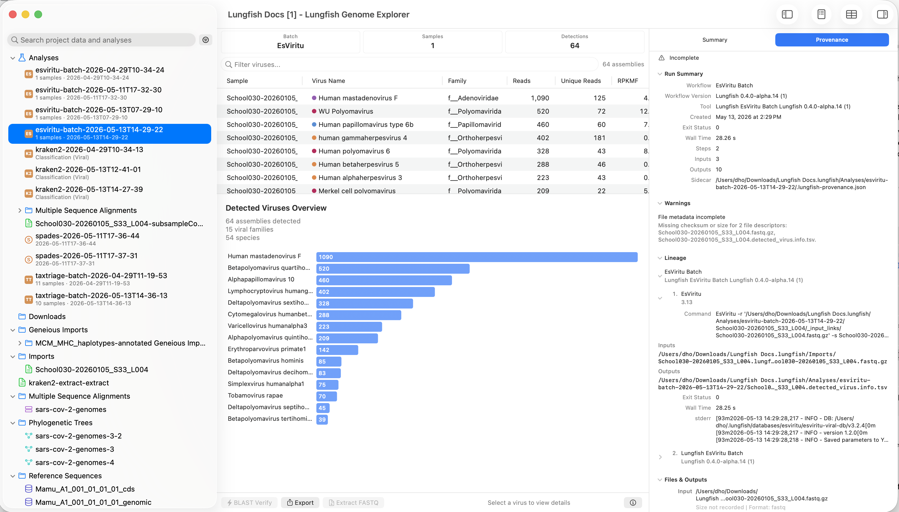
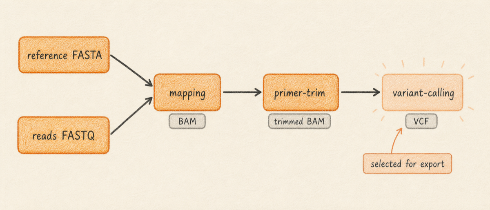
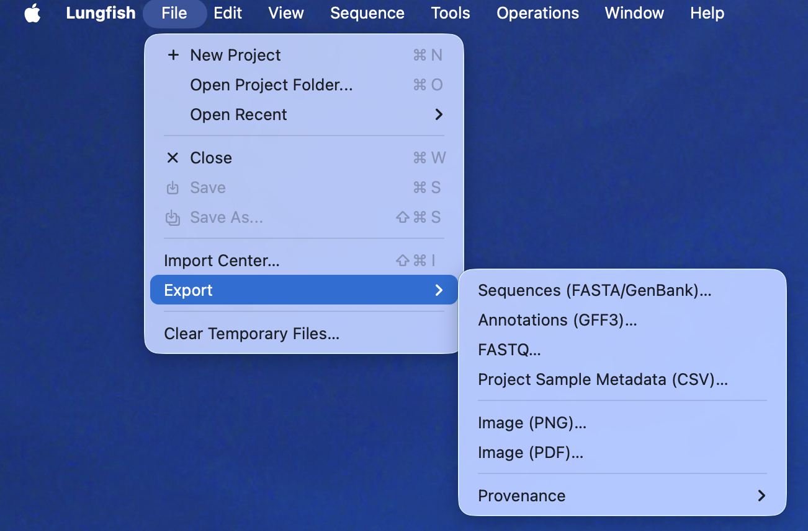
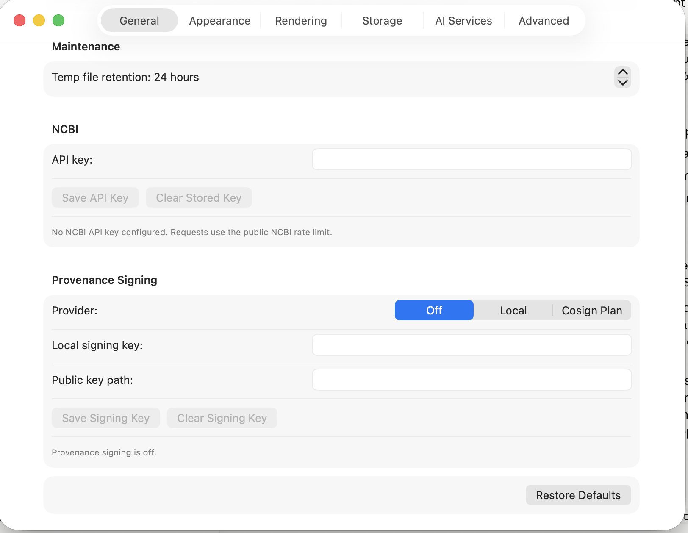

Every time Lungfish Genome Explorer (LGE) produces a bundle, it remembers how the bundle came to be. For any workflow that creates, imports, or transforms data, a download, a mapping, a primer trim, a variant call, a classification, an assembly, LGE attaches a run record to the result. The record names the tools that ran, their versions, the parameters you chose, the inputs it read, and the outputs it produced.

This chapter answers three practical questions. Where in the app do you find the run record for a result? How do you export a workflow so a collaborator can re-run it, or, when that collaborator also runs LGE, hand off the project itself? And what does LGE record on its own, versus what must you still add by hand? The methods-section export, in particular, is a very rough draft.

## What provenance is for

[Provenance](../../GLOSSARY.md#provenance) is the record of how a result was produced. [Reproducibility](../../GLOSSARY.md#reproducibility) is what you do with that record. Another researcher, or you six months from now, re-runs the same tool at the same version with the same parameters on the same inputs, and lands on the same answer. The two ideas are linked but not identical. Provenance is what LGE writes down. Reproducibility is what you, your collaborators, or a regulator do with what was written.

Practically, the run record exists so you can:

1. Audit an old result and see exactly which tool version and parameters produced it.
2. Write a methods section that names every tool you used, without having to remember.
3. Hand a collaborator a runnable copy of your workflow without composing it by hand.
4. Investigate when a workflow fails and you need to know which step broke.

LGE writes the record automatically for every supported workflow. You never have to ask for it, and you cannot skip it by accident.

## Reading provenance in the Inspector

Select a result in the project sidebar, whether a classification, a variant call, an assembly, or a download, and the [Inspector](../../GLOSSARY.md#inspector) on the right shows what LGE knows about it. One of its tabs, **Provenance**, holds the run record for that result.

<!-- SHOT: classifier-provenance-disclosure -->


The tab breaks into sections you can scan top to bottom. **Run Summary** names the workflow, the tool, and its version, with the start time and how long the run took. **Inputs** lists every file the run read. **Outputs** lists every file it produced. **Warnings** surfaces any non-fatal notes the tool emitted. **Lineage** traces the chain of earlier steps that produced this run's inputs, so you can click backward through the workflow.

If you open a result and the Provenance tab is empty, that is a bug. Please file an issue from `Help > Report an Issue...`.

## Exporting a workflow

When a collaborator at another institution asks for your workflow, or a reviewer asks how you made a figure, LGE can build a complete, runnable copy of every step, from the project's starting inputs to the result you picked. Select a result in the sidebar and choose `File > Export > Provenance`.



<!-- SHOT: file-export-provenance-menu -->


The Provenance submenu offers six formats, split into a runnable-script group and a human-readable group:

| Format | What you get | When to use it |
|---|---|---|
| Shell Script | A `run.sh` bash script that re-runs every step in order | A collaborator who wants to re-run on their own Mac or a Linux server |
| Python Script | A `reproduce.py` that drives the same tool calls programmatically | Embedding in a Jupyter notebook for batch re-runs |
| Nextflow Pipeline | A Nextflow project ready to run on a cluster | Scaling out across many samples |
| Snakemake Workflow | A Snakefile and config | Labs that already use Snakemake |
| Methods Section | A Markdown paragraph naming every tool and version | A methods section for a paper or clinical report |
| Full Provenance | The complete machine-readable record as JSON | Archiving the full record; ingesting into a compliance system |

Each export is a folder. Inside sits the primary artifact you chose, the script, the Snakefile, the Markdown, or the JSON, alongside a `provenance/` directory carrying the per-step records the export was built from. Send the whole folder to your collaborator, compressed. The script will not run without the contents of `provenance/` and any reference files beside it.

If your collaborator also runs LGE, you need not export at all. A project is just a folder on disk. Hand over the folder directly, or share it on lab storage, and they will see the same sidebar, the same Inspector tabs, and the same run records you do. For the conventions around handing a project to another LGE user, especially on shared lab storage where two people might open it at once, see [Shared Projects and Bundle Migration](../appendices/shared-projects.md) in the appendices.

For a deeper look at the runnable-script and pipeline formats, see [Exporting as Nextflow or Snakemake](../08-workflows/02-exporting-as-nextflow-or-snakemake.md).

## Verifying and citing from the command line

Two more `provenance` subcommands run from the command line, against a bundle or an export's `provenance/` directory. Neither has a menu equivalent, so reach for them when you are scripting or auditing outside the app.

`lungfish provenance verify` checks a signed provenance sidecar against its signature. Point it at a sidecar file, a bundle, or an output directory:

```sh
lungfish provenance verify ~/Projects/SARS-CoV-2.lungfish
```

By default it looks for the signature beside the sidecar at `<sidecar>.signature.json` and the public key at `<sidecar>.pub`; pass `--signature` or `--public-key` to point elsewhere. On success it prints `Signature valid` along with the signing provider, the provenance SHA-256, and the two artifact paths it checked. Verification only means something for a sidecar that was actually signed, so it pairs with the Provenance Signing setting described below: with signing Off, there is nothing to verify.

`lungfish provenance bibliography` reads a bundle's provenance and prints a citation for every tool it recognizes:

```sh
lungfish provenance bibliography ~/Projects/SARS-CoV-2.lungfish
```

Each matched tool prints its name, a formatted citation, and a DOI or URL when one is known. Tools the catalog does not recognize are listed separately under a "Tools without known citations" heading, so you can see at a glance which ones you still have to cite by hand.

## What provenance does not promise

The run record names the tool, the version, the parameters, and the inputs. Three things it cannot promise:

1. **External sources stay the same.** If your workflow downloads a SARS-CoV-2 reference from NCBI, LGE records the accession and the date you fetched it, but cannot promise NCBI will serve those exact bytes next year. A re-run against a different fetch date can land on different results if the upstream record was revised.
2. **Tool environments stay identical across machines.** LGE pins the plugin pack version, the bundle that carries the tool, which makes a re-run on the same Mac reliable. Re-run on a different machine, a different OS version, or a different CPU family and tool output can shift a little. Some tools are sensitive to thread counts or hardware, others are not, and LGE tells you which.
3. **The methods export is a very rough draft.** You still write the paper, and you will likely add more: accession numbers and access dates for downloaded data, database DOIs for classification references, and citations for any tool the bibliography command does not recognize. You need not compose every tool citation by hand, though. `lungfish provenance bibliography`, described above, prints a formatted citation for each recognized tool as a starting point. Read the draft against your actual methods to be sure the parameters match what you intended. LGE writes down what ran, not what you meant to run.

For clinical-audit workflows that need tamper-evident records, LGE offers a Provenance Signing option in `Settings > General`, set to Off by default. Off is the right setting for research work. The Local and Cosign Plan options exist for sites that must produce signed audit artifacts.

<!-- SHOT: provenance-signing-settings -->


## Next

Foundations is complete. Continue to one of the workflow parts:

- [Sequences](../02-sequences/) for sequence import, viewing, and download workflows
- [Reads (FASTQ)](../03-reads/) for read import, QC, trimming, and decontamination
- [Alignments](../04-alignments/) for mapping, alignment review, and primer trimming
- [Variants](../05-variants/) for variant calling and VCF interpretation
- [Classification](../06-classification/) for taxonomic classification of reads

The [Assembly](../07-assembly/) part covers de novo assembly workflows. For the advanced CLI commands that coordinate shared-storage workflows, see [Shared Projects and Bundle Migration](../appendices/shared-projects.md) in the appendices.
