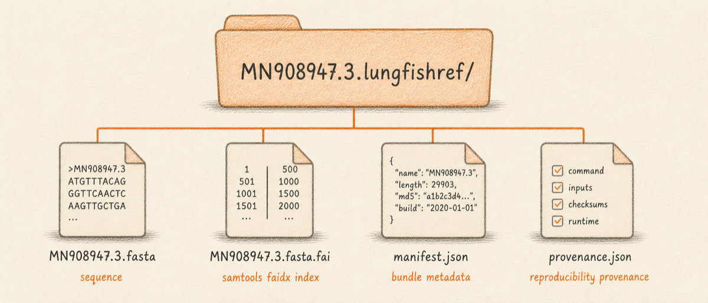
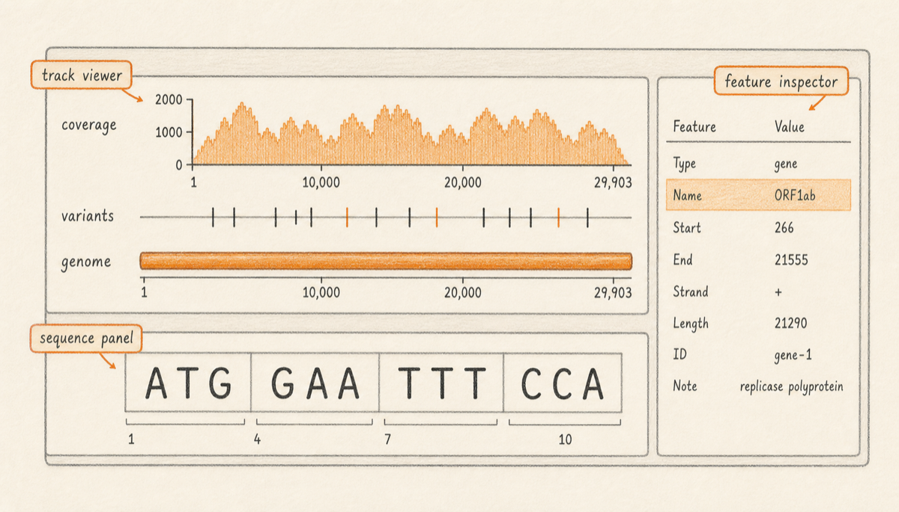

Lungfish keeps every genome you work with inside a **reference bundle**: a
folder with the `.lungfishref` extension that the Finder shows as a single
icon. Importing converts a loose `.fasta` or `.gb` on your Desktop into a
bundle in the project's `Reference Sequences/` folder. Your original file
stays where it was; the bundle holds a copy and, where the format supports
it, the gene and CDS annotations the file carried.

Once a bundle exists, opening it loads the genome into the **sequence
viewport**: a position ruler along the top, the bases below it, and
coloured blocks marking features when the source file carried them. Every
downstream operation in Lungfish, from alignment to variant calling,
points at a bundle rather than at a raw file.

## Accepted formats

The format you choose determines what shows up in the viewport. A FASTA
gives you the sequence and nothing else. A GenBank gives you the sequence
plus every feature the submitter recorded. A GFF3 carries features only
and must be imported alongside the matching FASTA.



| Format | Extension | Carries sequence | Carries annotations | Notes |
|---|---|---|---|---|
| FASTA | `.fasta`, `.fa`, `.fna` | Yes | No | Single or multi-record. Headers start with `>`. |
| GenBank | `.gb`, `.gbk` | Yes | Yes | Annotations import as a feature track automatically. |
| GFF3 | `.gff`, `.gff3` | No | Yes | Must be paired with a matching FASTA in the same import. |
| Compressed FASTA | `.fasta.gz`, `.fa.gz` | Yes | No | Decompressed during import. |

If you are pulling a record from NCBI, fetch it as GenBank. The
annotations come along, and downstream operations like variant
annotation and ORF translation pick them up without further setup.

## Three ways to import

You can import a sequence three ways. All three produce the same bundle
on disk; pick by habit.

### Drag-drop into the sidebar

For most imports this is the fastest route. Open the project window,
then drag the `.fasta`, `.gb`, or GFF3+FASTA pair from the Finder onto
the **Reference Sequences** folder in the sidebar. Lungfish creates the
bundle, indexes the FASTA if needed, and selects the new bundle so it
opens in the viewport.

### The Import Center

Reach for the Import Center when you want to see what is in a file
before it becomes a bundle. Open it from the menu bar with
**File > Import Center**. The sheet shows a drop zone and a format
picker, and previews the file before you commit. Click **Import** when
the preview looks right. The Operations Panel keeps a record of exactly
what was imported.

### The CLI

For batch work, automated pipelines, or anything you would rather not
click through, run the importer from a terminal with the project folder
as the working directory:

```bash
lungfish import path/to/MN908947.3.gb
```

The CLI accepts the same formats as the GUI and produces the same
bundle. A `--name` flag overrides the default bundle name, which
otherwise comes from the source filename.

## Procedure: import the SARS-CoV-2 reference

This walkthrough imports the SARS-CoV-2 Wuhan-Hu-1 reference (NCBI
accession MN908947.3) from the Import Center. The plain FASTA is a
single contig (one continuous stretch of sequence) of 29,903 bases with
no annotations.

1. **Open a project.** From the Lungfish welcome window, choose
   **Open**, navigate to your project folder, and select it. The
   project window opens with the sidebar on the left and an empty
   viewport on the right.

   <!-- planned: import-center-fasta -->

2. **Open the Import Center.** From the menu bar, choose
   **File > Import Center**. A sheet drops down with a drop zone in the
   centre.

3. **Drop the FASTA into the drop zone.** Drag `MN908947.3.fasta` from
   the Finder onto the drop zone. The format picker auto-detects FASTA
   and previews the file's contents.

4. **Click Import.** Lungfish creates the bundle at
   `Reference Sequences/MN908947.3.lungfishref`, builds the FASTA index,
   and logs the operation in the Operations Panel. The new bundle
   appears in the sidebar and is selected automatically.

5. **Confirm the bundle opened in the viewport.** The sequence viewport
   now shows the position ruler at the top and the bases below it. The
   annotation lane is empty because plain FASTA carried no features.

To see the annotated case, repeat the procedure with `MN908947.3.gb`
(GenBank flat file). The same bundle structure is produced, but the
annotation lane now shows the spike (`S`), nucleocapsid (`N`),
ORF1ab, and other coding regions as Creamsicle-coloured blocks.

## What you see in the viewport

<!-- planned: sequence-viewport-genbank -->



The viewport renders the genome on a single horizontal axis. Three panes
stack vertically. The **position ruler** at the top reports base-pair
coordinates. The **base track** below it shows the actual letters when
zoomed in far enough, and a coverage-style density rendering when zoomed
out. The **annotation track**, present only when the bundle carries
features, draws genes and CDS regions as labelled blocks.

The Inspector on the right summarises the bundle: the source file,
contig list, total length, annotation count, and any tracks attached to
this reference (alignments, variants, classifications). Tracks become
populated as you run downstream operations against the bundle.

The sidebar on the left shows the bundle as a leaf inside the
**Reference Sequences** folder. Right-click for rename, reveal in
Finder, and move-to-trash actions.

## Navigating the sequence

Three actions cover most navigation, all reached from the **Sequence**
menu in the menu bar. **Sequence > Go to Location** opens a coordinate
field; type a number, press Return, and the viewport centres on that
base. A range like `21563-25384` zooms to fit. **Sequence > Go to Gene**
opens a fuzzy-matched picker over the annotation names; on the
SARS-CoV-2 reference, typing `spike` jumps to the `S` gene at position
21563. To centre on a feature you can already see, click its block in
the annotation track.

## When import fails

The error sheet names the file, the line number where parsing stopped,
and the offending text. Two cases account for most first-time failures,
and both are easier to recognise once you know what a valid FASTA looks
like. A FASTA is a plain text file that begins with a header line
starting with `>`, followed by one or more lines of nucleotide letters:

```
>MN908947.3 Severe acute respiratory syndrome coronavirus 2 isolate Wuhan-Hu-1
ATTAAAGGTTTATACCTTCCCAGGTAACAAACCAACCAACTTTCGATCTCTTGTAGATCT
GTTCTCTAAACGAACTTTAAAATCTGTGTGGCTGTCACTCGGCTGCATGCTTAGTGCACT
...
```

- **Header missing the `>` marker.** If the first line starts with
  whitespace, with the sequence directly, or with anything other than
  `>`, Lungfish cannot tell where the record begins. Open the file in a
  text editor, prepend `>` and an identifier, save.
- **Invalid characters in the sequence.** Lungfish accepts the standard
  nucleotide letters (`A`, `C`, `G`, `T`, plus ambiguity codes like `N`)
  and gap characters. If the file contains anything else, parsing stops.
  The most common cause is a file that looks like a FASTA but was saved
  from a word processor such as Microsoft Word, which adds invisible
  formatting characters. Re-export the file as plain text from the
  original tool, or paste the sequence into a code editor and save.

## Next

Continue to [Downloading from NCBI](02-downloading-from-ncbi.md) to
learn how to fetch a reference accession from NCBI directly into the
project, with provenance recorded automatically.
