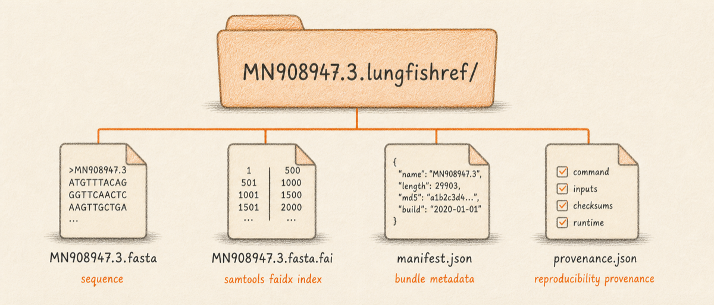
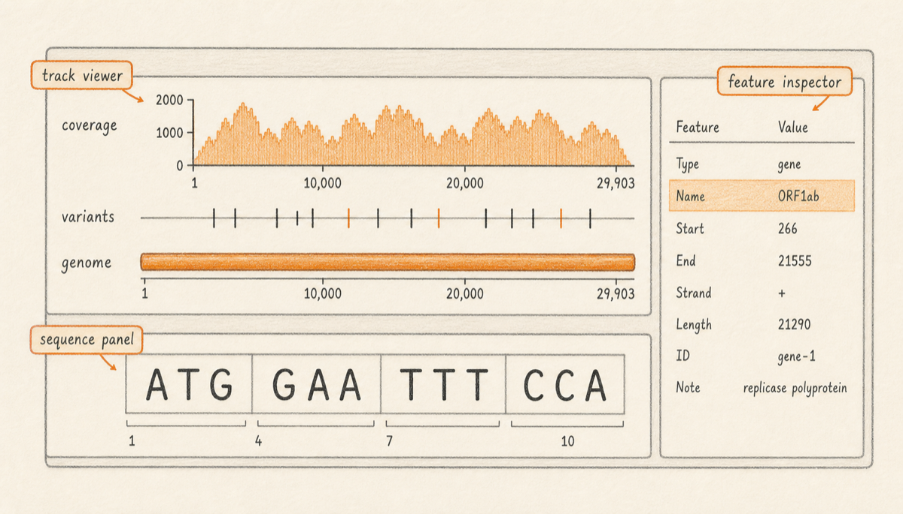

## What it is

Every genome you open in Lungfish lives inside a **reference bundle**: a
folder carrying the `.lungfishref` extension that the Finder shows as a
single icon. Import takes a loose `.fasta` or `.gb` sitting on your Desktop
and turns it into one of these bundles in the project's
`Reference Sequences/` folder. Your original file never moves. The bundle
holds a copy, and where the format allows, the gene and CDS annotations the
file carried.

Open a bundle and the genome loads into the **sequence viewport**: a
position ruler along the top, the bases beneath it, and coloured blocks
marking features when the source file carried them. From alignment to
variant calling, every downstream operation in Lungfish points at a bundle,
never at a raw file.

So in practice: import each genome once, then aim every later operation at
the bundle instead of reopening the loose file.

## Accepted formats

The format you feed in decides what the viewport shows. A FASTA gives you
the sequence and nothing more. A GenBank gives you the sequence plus every
feature the submitter recorded. A GFF3, GTF, or BED carries features alone,
with no sequence at all, so it cannot create a bundle by itself. You attach
one to a reference bundle that already exists.



| Format | Extension | Carries sequence | Carries annotations | Notes |
|---|---|---|---|---|
| FASTA | `.fasta`, `.fa`, `.fna` | Yes | No | Single or multi-record. Headers start with `>`. |
| GenBank | `.gb`, `.gbk`, `.gbff` | Yes | Yes | Annotations import as a feature track automatically. EMBL (`.embl`) is also accepted. |
| Annotation track | `.gff`, `.gff3`, `.gtf`, `.bed` | No | Yes | Attached to an existing reference bundle, not imported on its own. |
| Compressed FASTA or GenBank | `.gz`, `.bgz`, `.bz2`, `.xz`, `.zst` | Yes | No | Decompressed during import. |

Import a GenBank record and Lungfish converts its features into an
annotation track named `imported_annotations`. Later chapters call it by
that name, for instance when a variant caller reads gene coordinates to
translate nucleotide changes into amino-acid changes.

When you pull a record from NCBI, fetch it as GenBank. The annotations ride
along, and downstream operations like variant annotation and ORF
translation pick them up with no further setup.

In short: a FASTA or GenBank creates the bundle. Reach for the separate
annotation-track importer only when you have a standalone GFF3, GTF, or BED
to attach to a bundle you already built.

## Three ways to import

Three routes lead to the same bundle on disk. Pick by habit.

### Drag-drop into the sidebar

For most imports this is the quickest route. Open the project window and
drag the `.fasta` or `.gb` from the Finder onto the **Reference
Sequences** folder in the sidebar. Lungfish builds the bundle, indexes
the FASTA if it needs to, and selects the new bundle so it springs open in
the viewport. A GFF3 attaches in a separate step through the Import
Center, described above, so drag the sequence first.

### The Import Center

Reach for the Import Center when you want to see inside a file before it
becomes a bundle. Open it from the menu bar with
**File > Import Center…**, or press Cmd-Shift-I. The sheet offers a drop
zone and a format picker, and previews the file before you commit. When
the preview looks right, click **Import**. The Operations Panel records
exactly what came in. This is also where you attach a standalone GFF3,
GTF, or BED file as an annotation track to a bundle that already exists.

### The CLI

For batch work, automated pipelines, or anything you would rather not
click through, run the importer from a terminal with the project folder
as your working directory:

```bash
lungfish import fasta path/to/MN908947.3.gb
```

The `fasta` subcommand handles FASTA, GenBank, and EMBL, plain or
compressed, and produces the same bundle as the GUI. The `--name` flag
overrides the default bundle name, which otherwise comes from the source
filename; `-o`/`--output-dir` points at the target project when you are
not already inside it.

## Procedure: import the SARS-CoV-2 reference

This walkthrough imports the SARS-CoV-2 Wuhan-Hu-1 reference, NCBI
accession MN908947.3, from the Import Center. The plain FASTA is a
single contig, one continuous stretch of sequence, 29,903 bases long with
no annotations.

1. **Open a project.** From the Lungfish welcome window, choose
   **Open**, find your project folder, and select it. The project window
   opens: sidebar on the left, an empty viewport on the right.

   <!-- planned: import-center-fasta -->

2. **Open the Import Center.** From the menu bar, choose
   **File > Import Center…**, or press Cmd-Shift-I. A sheet drops down
   with a drop zone at its centre.

3. **Drop the FASTA into the drop zone.** Drag `MN908947.3.fasta` from
   the Finder onto it. The format picker detects FASTA on its own and
   previews the file's contents.

4. **Click Import.** Lungfish creates the bundle at
   `Reference Sequences/MN908947.3.lungfishref`, builds the FASTA index,
   and logs the operation in the Operations Panel. The new bundle
   appears in the sidebar, already selected.

5. **Confirm the bundle opened in the viewport.** The sequence viewport
   now shows the position ruler up top and the bases below. The
   annotation lane sits empty, because plain FASTA carried no features.

For the annotated case, run the procedure again with `MN908947.3.gb`, a
GenBank flat file. You get the same bundle structure, but now the
annotation lane fills with orange blocks: the spike (`S`), nucleocapsid
(`N`), ORF1ab, and the other coding regions. Those features land in a
track named `imported_annotations`, the very track later chapters point
to for variant annotation.

## What you see in the viewport

<!-- planned: sequence-viewport-genbank -->



The viewport lays the genome along a single horizontal axis, in three
panes stacked top to bottom. The **position ruler** at the top reports
base-pair coordinates. Below it, the **base track** shows the actual
letters once you zoom in far enough, and a coverage-style density
rendering when you pull back out. The **annotation track**, present only
when the bundle carries features, draws genes and CDS regions as labelled
blocks.

The Inspector on the right sums up the bundle: source file, contig list,
total length, annotation count, and any tracks attached to this reference,
be they alignments, variants, or classifications. Those tracks fill in as
you run downstream operations against the bundle.

The sidebar on the left shows the bundle as a leaf inside the
**Reference Sequences** folder. Right-click it for rename, reveal in
Finder, and move-to-trash actions.

To save what you see, choose **File > Export > Image (PNG)…** or
**Image (PDF)…**. The save panel carries three extra controls. **Scope**
sets how much to capture: `Tracks View` for the sequence, variant, and
annotation tracks; `Full Viewer Pane` for the ruler, tracks, and
annotation table together; or `Selected Region Only`, which appears once
you have dragged out a selection. **Format** offers `PNG`, `JPEG`,
`TIFF`, or `PDF`. **Bitmap Scale** renders at `1x`, `2x` (the default), or
`4x` for a crisper raster, and greys out for `PDF`, which writes true
vector output.

## Navigating the sequence

Three actions cover most navigation, all under the **Sequence** menu in
the menu bar. **Sequence > Go to Location…** (Cmd-L) opens a coordinate
field: type a number, press Return, and the viewport centres on that
base. The editable position field on the ruler takes the same input, with
placeholder `chr:start-end`. A single number jumps to one base. A range
like `MN908947.3:21563-25384` zooms to fit, and on a single-contig bundle
the bare range `21563-25384` resolves to it. **Sequence > Go to Gene…**
(Cmd-Shift-G) opens a fuzzy-matched picker over the annotation names; on
the SARS-CoV-2 reference, typing `spike` jumps straight to the `S` gene
at position 21563. To centre on a feature already in view, click its
block in the annotation track.

### Right-click actions

Right-click (or Control-click) inside the viewport and the menu matches
whatever sits under the pointer. Right-click a feature block in the
annotation track for its own menu:

- **Copy**: a submenu for the feature's name, coordinates, bases, complement, reverse complement, or FASTA, with a protein-FASTA option on CDS features.
- **Extract Sequence…**: writes the feature's bases to a fresh bundle or FASTA.
- **Run FASTQ/FASTA Operation…**: sends the feature's sequence into the operations dialog.
- **Zoom to Annotation**: fits the view to the feature.
- **Edit Annotation…** and **Delete Annotation**: revise or remove it.

Right-click a region you have dragged out instead, and the menu turns to
the selection: **Copy Visible Region** puts its bases on the clipboard,
**Zoom to Visible Region** fits the view to it, and **Center View Here**
recentres on the click point.

## Translating a sequence to protein

Translation reads a nucleotide sequence three bases at a time and swaps each
triplet (a codon) for the amino acid it encodes, turning DNA or RNA into the
protein it would build. Which amino acid a codon maps to depends on the
genetic code, so the tool lets you choose one: the standard code (table 1)
covers most nuclear genes, while alternatives cover vertebrate mitochondria
(table 2), yeast mitochondria (table 3), and bacteria (table 11). A reading
frame is the offset the triplets are counted from, and there are six: three on
the forward strand (`+1`, `+2`, `+3`) and three on the reverse-complement
strand (`-1`, `-2`, `-3`).

The practical takeaway: translate in the frame and code that match your
sequence to read the protein, or scan all six frames when you do not yet know
which one is coding.

### In the app

Open a sequence bundle, then choose **Sequence > Translate…**. A sheet opens
with a Mode control offering `Single Frame`, `3 Forward`, `3 Reverse`, and
`All 6 Frames`; pick `Single Frame` to reveal a picker for one specific frame.
Choose the genetic code under `Genetic Code`, leave `Show Stop Codons` on if you
want stop positions marked, and click `Apply`. The translation appears as an
overlay aligned to the bases in the viewport, and `Hide Translation` clears it.
The in-app tool overlays the translation for reading; it writes no protein
file.

### From the command line

To write a protein FASTA to disk, drop to the CLI:

```bash
lungfish translate MN908947.3.fasta --frame 1 --table 1 -o spike-protein.fasta
```

Frames `1` to `3` are the forward strand; `4` to `6` are the reverse
complement. Omit `--frame` to translate all six. `--table` selects the genetic
code (default 1, the standard code). Three flags shape the output:
`--trim-to-stop` cuts each translation at its first stop codon,
`--no-stop-asterisk` drops the `*` characters that mark stops, and
`--longest-orf` keeps only the longest stop-free stretch per frame. The command
drops a provenance sidecar next to the output, recording the exact options
used.

## Annotating features on a sequence

An annotation is a labelled interval on the genome: a start, an end, a strand,
and a type such as `gene` or `CDS` (the coding part of a gene). A GenBank import
carries annotations in for you, but you can also add your own or let Lungfish
detect them.

So what should you do with this? Add an annotation by hand when you already know
where a feature sits, and auto-detect open reading frames when you want the
software to propose candidate coding regions for you.

### Adding one annotation by hand

Drag across the bases in the sequence viewport to select a region, then choose
**Sequence > Add Annotation…**. A dialog asks for a name, a type (`gene`,
`CDS`, `exon`, `mRNA`, `region`, and a few others), and a strand (`+`, `-`, or
none). Click **Add**. Lungfish writes the annotation into the bundle's
annotation track and redraws the viewport with the new labelled block. It saves
inside the `.lungfishref` bundle, so it travels with the reference.

### Auto-detecting open reading frames

An open reading frame (ORF) is a stretch that begins with a start codon and
runs to a stop codon without a break, which makes it a candidate
protein-coding region. Choose **Sequence > Find ORFs…** on an open reference
bundle. The dialog exposes five controls:

- `Reading Frames`: checkboxes for `+1`, `+2`, `+3`, `-1`, `-2`, `-3` (all six on by default).
- `Codon table`: the genetic code used to recognise starts and stops.
- `Minimum ORF length`: the shortest ORF to keep, in nucleotides (default 100).
- `Include partial ORFs`: keep ORFs that run off the end of the selected range.
- `Allow alternative starts`: also treat `GTG`, `TTG`, and `CTG` as starts.

Click **Run**. Lungfish writes a new annotation track (named `ORFs` by default)
into the bundle, one feature per ORF, each carrying its translated protein as an
attribute. The same operation runs from the command line:

```bash
lungfish sequence annotate-orfs MN908947.3.lungfishref \
  --frames +1,+2,+3 --table 1 --min-length 300 --track-name "ORFs"
```

### Transferring best-match CDS annotations

Once you have mapped a reference's coding sequences against a new assembly,
Lungfish can carry the best-matching CDS models across as annotations on a fresh
bundle. This path lives under the alignment tools rather than the Sequence menu,
because it reads a mapping result:

```bash
lungfish bam annotate-cds-best \
  --bundle source.lungfishref \
  --mapping-result mapping-out/ \
  --output-bundle annotated.lungfishref \
  --output-track-name "CDS (best match)"
```

It builds a new `.lungfishref` bundle and leaves the source untouched. The new
bundle's annotation track holds one gene and CDS model per query that aligned
well enough. The `--min-query-cover` option sets that bar (default 0.5, meaning
at least half of the CDS query must be covered by the alignment).

## When import fails

The error sheet names the file, the line where parsing stopped, and the
offending text. Two cases account for most first-time failures, and both
grow obvious once you know what a valid FASTA looks like. A FASTA is a
plain text file: a header line starting with `>`, then one or more lines
of nucleotide letters:

```
>MN908947.3 Severe acute respiratory syndrome coronavirus 2 isolate Wuhan-Hu-1
ATTAAAGGTTTATACCTTCCCAGGTAACAAACCAACCAACTTTCGATCTCTTGTAGATCT
GTTCTCTAAACGAACTTTAAAATCTGTGTGGCTGTCACTCGGCTGCATGCTTAGTGCACT
...
```

- **Header missing the `>` marker.** If the first line starts with
  whitespace, with the sequence itself, or with anything other than
  `>`, Lungfish cannot tell where the record begins. Open the file in a
  text editor, prepend `>` and an identifier, and save.
- **Invalid characters in the sequence.** Lungfish accepts the standard
  nucleotide letters (`A`, `C`, `G`, `T`, plus ambiguity codes like `N`)
  and gap characters. Anything else stops the parser. The usual culprit
  is a file that looks like a FASTA but was saved from a word processor
  such as Microsoft Word, which slips in invisible formatting characters.
  Re-export as plain text from the original tool, or paste the sequence
  into a code editor and save.

## Next

Continue to [Downloading from NCBI](02-downloading-from-ncbi.md) to fetch
a reference accession straight from NCBI into the project, with provenance
recorded automatically.
