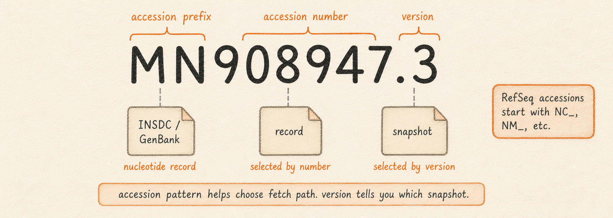

## What it is

NCBI hosts public reference sequences for every well-studied organism, identified by accession numbers like `MN908947.3` (a SARS-CoV-2 isolate) or `NC_045512.2` (the RefSeq record for the same isolate). Lungfish fetches these directly through `Tools > Search Online Databases > Search NCBI`. The dialog accepts an accession, a format (FASTA, GenBank, GFF3, or XML), and a save location. The Operations Panel runs the fetch and writes the file plus a provenance sidecar to the project's `Downloads/` folder.

For variant-calling workflows you usually want both the sequence and the feature annotations. For a single annotated nucleotide accession, the most direct path is now a GenBank file: Lungfish imports the sequence and converts GenBank features such as `gene`, `CDS`, and `mat_peptide` into a bundle-owned GFF3 annotation track. This matters because some callers (iVar in particular) need annotations to translate nucleotide changes into amino-acid changes; without bundled annotations, the AA columns in your VCF will be empty.

So what should you do with this? When annotations are needed for a single accession, fetch or import GenBank once and reuse the resulting `.lungfishref` for every downstream operation in the project. Use separate FASTA + GFF3 files when you already have a curated GFF3 from another source or need to preserve that exact upstream GFF3 file.

## What you will learn

By the end of this chapter you will be able to download a sequence by accession, choose between FASTA, GenBank, and GFF3 format depending on what your workflow needs, find the file in the `Downloads/` folder, and import an annotated GenBank record into a reference bundle that downstream chapters can use.

## Accession types: when to use which fetch path

NCBI uses different accession schemes for different kinds of records, and they go through different Lungfish commands. The two you will see most often are nucleotide accessions (one molecule, one record) and assembly accessions (a whole genome with chromosomes, scaffolds, and annotation packaged together).



A nucleotide accession looks like `MN908947.3`: a two-letter prefix, a number, a dot, and a version. These are the records that come back from `Tools > Search Online Databases > Search NCBI` and from `lungfish fetch ncbi`. Almost every viral reference in common use is a nucleotide accession, because viral genomes are usually one molecule.

An assembly accession looks like `GCF_009858895.2` (RefSeq) or `GCA_009858895.3` (GenBank). These are not single records; they are bundles of FASTA, annotation, and metadata for an entire assembled genome. Lungfish handles them through a different command, `lungfish fetch genome`, which is documented in the Genomes chapter. If you paste an assembly accession into the NCBI dialog covered here, the dialog will refuse it.

The rest of this chapter covers nucleotide accessions only.

## Format choices: what each one contains

The dialog gives you four format choices. They differ in what is in the file, and therefore in what you can do with it next.

| Format | What is in the file | When to choose it |
|---|---|---|
| FASTA | The raw sequence and a one-line header. No annotations. | Mapping reads, calling variants, any workflow that only needs the bases. |
| GenBank | The sequence plus a curated, human-readable annotation block (genes, products, references). | Single-file reference import when annotations are needed; browsing a record manually; reading the curator's notes. |
| GFF3 | A tab-separated table of features (gene, CDS, mat_peptide) with start, end, strand, and attributes. No sequence. | Pairing with a FASTA so a variant caller can translate to amino-acid changes. |
| XML | The full INSDC XML record, all fields, machine-readable. | Power-user pipelines that parse fields the GUI does not surface. |

For most single-accession viral variant-calling work, choose GenBank when the record has annotations. Lungfish imports the sequence and materializes the GenBank features as GFF3 inside the `.lungfishref` bundle. FASTA + GFF3 remains useful when an external source supplies a specific GFF3 that you want to keep separate from the sequence record.

## Procedure: download a reference by accession

The steps below assume you have an open project. If you do not, create one first via `File > New Project`.

<!-- planned: ncbi-search-dialog -->

1. Choose `Tools > Search Online Databases > Search NCBI`. The database search dialog opens.
2. In the **Accession** field, type or paste the accession (for example, `MN908947.3`).
3. From the **Format** menu, choose `GenBank` when you need annotations. Leave the save location at its default, which is the project's `Downloads/` folder.
4. Click `Run`. The dialog closes and a row appears in the Operations Panel showing the fetch in progress.
5. When the row turns green, the file is on disk. Import that GenBank file as a reference bundle; Lungfish writes the sequence, an annotation database, a GFF3 annotation sidecar, and bundle provenance.

If you choose `FASTA` instead, you are downloading only the bases. For annotated downstream work, either download a matching `GFF3` and bundle the pair, or use the single-file GenBank path above.

<!-- planned: ncbi-bundle-prompt -->

If you leave the downloaded file loose in `Downloads/`, you can import it later from the command line with `lungfish import fasta path/to/file.gb -o path/to/project`.

## Worked example: SARS-CoV-2 reference (MN908947.3)

This is the most common starting point for a viral variant-calling project, and most chapters later in the manual assume you have it.

1. With your project open, choose `Tools > Search Online Databases > Search NCBI`.
2. Type `MN908947.3` into the **Accession** field. Choose `GenBank` from the **Format** menu. Click `Run`.
3. Wait for the Operations Panel row "Fetch NCBI: MN908947.3 (genbank)" to turn green. This usually takes a second or two for a viral genome over a normal connection.
4. Import the downloaded GenBank file as a reference bundle.

You should now see, under the project sidebar:

- `Downloads/MN908947.3.gb` and its `.lungfish-provenance.json` sidecar
- `Reference Sequences/MN908947.3.lungfishref` containing the sequence plus `annotations/imported_annotations.gff3`
- `Reference Sequences/MN908947.3.lungfishref/.lungfish-provenance.json`, recording the import command, inputs, output checksums, file sizes, runtime, exit status, and wall time

The bundle is what later chapters will refer to when they say "select the SARS-CoV-2 reference".

The same operation runs from the command line as a GenBank fetch followed by a reference import. The CLI form is useful for scripted setup or for reproducing a colleague's project from a methods paragraph:

```sh
lungfish fetch ncbi MN908947.3 \
  --fetch-format genbank \
  --save-to ./Downloads/MN908947.3.gb

lungfish import fasta ./Downloads/MN908947.3.gb \
  --output-dir . \
  --name MN908947.3
```

The fetch writes a provenance sidecar next to the GenBank file, recording the resolved endpoint, the accession, the output checksum, the file size, retry count and backoff timings, whether an API key was provided, and the exact command line. The import writes bundle provenance into the `.lungfishref` directory and points to the final stored payloads, including the generated GFF3 annotation sidecar. The sidecar records only `apiKeyProvided: true` or `false`; it never writes the key itself.

If you batch many NCBI fetches, set `NCBI_API_KEY` in the shell that runs Lungfish to use NCBI's higher authenticated rate limit:

```sh
export NCBI_API_KEY=your_ncbi_key
lungfish fetch ncbi MN908947.3 --fetch-format genbank --save-to ./Downloads/MN908947.3.gb
```

HTTP 429 rate-limit responses are retried automatically up to five times with exponential backoff, starting at 5 seconds and capping at 5 minutes. Scripts that prefer fail-fast behavior can opt out:

```sh
lungfish fetch ncbi MN908947.3 \
  --fetch-format genbank \
  --save-to ./Downloads/MN908947.3.gb \
  --no-retry
```

## Interpretation: what the provenance sidecar tells you

Every NCBI fetch writes a `<filename>.lungfish-provenance.json` next to the output. Open one and you will see the source URL it actually hit (so you can confirm whether you fetched from `eutils.ncbi.nlm.nih.gov` or a mirror), the accession you asked for, the format the server returned, the SHA-256 checksum of the bytes that landed on disk, the size, and the timestamp.

Two practical uses for this. First, if a colleague hands you a FASTA and you want to know where it came from, the sidecar answers that question. Second, if a project is rebuilt later and the upstream record at NCBI has changed (versions go from `.3` to `.4`, for example), the checksum mismatch flags the change before it propagates into your variant calls.

## Pathoplexus and SRA: when not to use NCBI fetch

Two adjacent workflows live in different places and are worth flagging so you do not get lost.

The database browser has a `Pathoplexus` tab for pathogen-genomics submissions that are hosted at Pathoplexus rather than NCBI. Use it when an outbreak record is available there, when you need Pathoplexus metadata, or when the record has not yet propagated to INSDC.

To search Pathoplexus:

1. Choose `Tools > Search Online Databases`, then select `Pathoplexus`.
2. On first use, read and accept the ABS/data-use notice. Lungfish stores that consent locally and shows the search panel after acceptance.
3. Choose an organism chip. The current dialog supports CCHF, Sudan ebolavirus, Zaire ebolavirus, HMPV, Marburg virus, measles virus, mpox, RSV-A, RSV-B, and West Nile virus. If no organism is selected, the app defaults to mpox.
4. Enter an accession or free-text search term, then add filters if needed: country, clade, lineage, host, nucleotide mutations, amino-acid mutations, INSDC availability, collection date range, or sequence length range.

To download Pathoplexus records:

1. Click search. Lungfish requests latest-version, open data-use records. If a result set is large, the dialog asks whether to load the first thousand records, load all records, or cancel.
2. Download selected records. Restricted records are rejected in the UI.
3. Review the imported bundle. When a record has an INSDC accession, Lungfish tries the GenBank path first and appends Pathoplexus metadata. If GenBank retrieval fails or no INSDC accession exists, Lungfish builds a FASTA-backed bundle from the Pathoplexus record.

For raw sequencing reads (FASTQs from the SRA), use the SRA chapter ([R02, Downloading from SRA](../03-reads/02-downloading-from-sra.md)) instead. SRA accessions begin with `SRR`, `ERR`, or `DRR` and route through `lungfish fetch sra`, which uses an ENA mirror and falls back to the SRA Toolkit. The NCBI dialog covered in this chapter does not handle them.

## Troubleshooting

A few failure modes account for almost every problem with NCBI fetches.

- **Accession not found.** NCBI returned an empty record for the accession you typed. Double-check the version suffix (the `.3` in `MN908947.3`) and confirm the record exists by pasting the accession into a browser at `https://www.ncbi.nlm.nih.gov/nuccore/`. If the record is an assembly accession (starts with `GCF_` or `GCA_`), use `lungfish fetch genome` instead.
- **Rate limit (HTTP 429).** NCBI's eutils endpoint throttles unauthenticated traffic to roughly three requests per second. Lungfish retries 429 responses automatically up to five times with exponential backoff. If a scripted workflow should fail immediately instead, add `--no-retry`. For sustained batches, set `NCBI_API_KEY` in the shell before running Lungfish.
- **Network failure.** A red row with a connection-reset or DNS error usually means a transient outage. Retry the same fetch; if the second attempt also fails, check whether your machine can reach `https://eutils.ncbi.nlm.nih.gov/` at all before assuming a Lungfish bug.
- **Wrong format returned.** If you asked for GFF3 and got an XML error document, the upstream record probably does not have annotations in GFF3 form. Fall back to GenBank for single-file import; Lungfish converts supported GenBank features into a bundle-owned GFF3 annotation track.

If a fetch leaves a partial file behind after a crash or cancel, the provenance sidecar will be missing or marked incomplete; delete both files and re-run the fetch rather than trying to repair in place.

## Next

Continue to [MSAs and Trees](04-msa-and-trees.md) for multiple-sequence-alignment workflows, or jump to [Reads (FASTQ)](../03-reads/) to start working with sequencing data against the reference you just downloaded.
