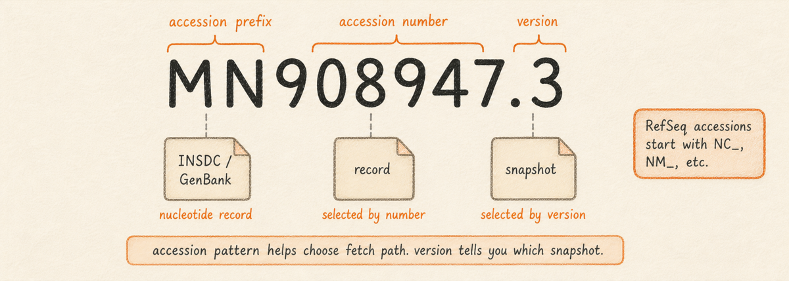

## What it is

NCBI hosts public reference sequences for every well-studied organism, identified by accession numbers like `MN908947.3` (a SARS-CoV-2 isolate) or `NC_045512.2` (the RefSeq record for the same isolate). Lungfish fetches these through `Tools > Search Online Databases > Search NCBI…`, which opens a search dialog on its "GenBank & Genomes" tab. You type a query, run the search, select a record, and download it. The download writes a `.lungfishref` reference bundle straight into the project, along with a provenance sidecar recording where it came from.

For variant-calling workflows you usually want both the sequence and the feature annotations. The most direct path for an annotated record is to leave the "Include GFF3 Annotations" toggle on: Lungfish builds the bundle with the sequence plus a bundle-owned annotation track converted from the record's `gene`, `CDS`, and `mat_peptide` features. This matters because some callers (iVar in particular) need annotations to translate nucleotide changes into amino-acid changes; without bundled annotations, the AA columns in your VCF will be empty.

So what should you do with this? Download an annotated record once with annotations included, and reuse the resulting `.lungfishref` for every downstream operation in the project.

## What you will learn

By the end of this chapter you will be able to download a sequence by accession in the GUI, choose the Mode and the annotation toggle that match what your workflow needs, find the bundle in the project, and reproduce the same download from the command line for scripted setup.

## Accession types: which Mode handles which record

NCBI uses different accession schemes for different kinds of records, and the dialog's **Mode** picker routes them. The two you will see most often are nucleotide accessions (one molecule, one record) and assembly accessions (a whole genome with chromosomes, scaffolds, and annotation packaged together).



A nucleotide accession looks like `MN908947.3`: a two-letter prefix, a number, a dot, and a version. Search for these with Mode set to **Nucleotide** (or **Virus** for curated viral records). They are also what `lungfish fetch ncbi` retrieves. Almost every viral reference in common use is a nucleotide accession, because viral genomes are usually one molecule.

An assembly accession looks like `GCF_009858895.2` (RefSeq) or `GCA_009858895.3` (GenBank). These are not single records; they are bundles of FASTA, annotation, and metadata for an entire assembled genome. The dialog handles them with Mode set to **Genome**, which downloads the assembly FASTA plus its GFF3 and builds a `.lungfishref` bundle. The same job runs from the command line as `lungfish fetch genome`, documented in the Genomes chapter. Either way, assembly accessions are a first-class case here, not something the dialog blocks.

The walkthroughs below use a single viral nucleotide accession, the most common starting point for this manual.

## What the download produces

The GUI has no four-way file-format menu. Instead, two checkboxes shape the bundle, and the Mode picker decides the record type.

| Control | What it does | When to use it |
|---|---|---|
| Include GFF3 Annotations | Converts the record's features into a bundle-owned annotation track. | Leave on for variant calling, so the caller can translate to amino-acid changes. |
| RefSeq Only | Restricts results to curated RefSeq records (the `NC_`/`GCF_` series). | When you want the reviewed reference rather than any submitter's record. |
| Mode: Nucleotide / Virus | Searches single-molecule nucleotide records. | Viral references and any one-molecule sequence. |
| Mode: Genome | Searches and downloads whole assemblies. | Bacterial or eukaryotic assemblies keyed by `GCF_`/`GCA_`. |

The four file formats FASTA, GenBank, GFF3, and XML are a command-line concept, exposed through `lungfish fetch ncbi --fetch-format`. In the GUI you do not pick a file format; you pick a Mode and decide whether to include annotations, and Lungfish assembles the bundle for you.

## Procedure: download a reference by accession

The steps below assume you have an open project. If you do not, create one first via `File > New Project`.

<!-- planned: ncbi-search-dialog -->

1. Choose `Tools > Search Online Databases > Search NCBI…`. The database search dialog opens on its **GenBank & Genomes** tab.
2. Set **Mode** to `Nucleotide`. Leave **Include GFF3 Annotations** on so the bundle carries features.
3. Type the accession (for example, `MN908947.3`) into the search field and click **Search**.
4. Select the matching record in the results list. The primary button changes from **Search** to **Download Selected**.
5. Click **Download Selected**. Lungfish downloads the record and builds a `.lungfishref` reference bundle in one action, then logs the operation in the Operations Panel.

There is no separate import step in the GUI. The download produces the bundle directly, with the sequence, the annotation track, and a provenance sidecar already inside it. When the Operations Panel row turns green, the bundle is in the sidebar under `Reference Sequences/`, ready to use.

<!-- planned: ncbi-bundle-prompt -->

If you turn **Include GFF3 Annotations** off, the bundle holds the bases only. That is the right choice for read mapping or any workflow that does not need amino-acid translation.

## Worked example: SARS-CoV-2 reference (MN908947.3)

This is the most common starting point for a viral variant-calling project, and most chapters later in the manual assume you have it.

1. With your project open, choose `Tools > Search Online Databases > Search NCBI…`.
2. Set Mode to `Nucleotide`, leave **Include GFF3 Annotations** on, type `MN908947.3` into the search field, and click **Search**.
3. Select the `MN908947.3` record in the results, then click **Download Selected**.
4. Wait for the Operations Panel row to turn green. This usually takes a second or two for a viral genome over a normal connection.

You should now see, under the project sidebar, `Reference Sequences/MN908947.3.lungfishref`. Inside it are the sequence, the annotation track `annotations/imported_annotations.gff3`, and a `.lungfish-provenance.json` sidecar recording the source, the output checksums, file sizes, runtime, exit status, and wall time. The download is one operation; there is no loose `.gb` to import afterward.

The bundle is what later chapters will refer to when they say "select the SARS-CoV-2 reference".

The same result is reproducible from the command line, which is the place the four file formats live. The CLI is a two-step form, a fetch followed by an import, useful for scripted setup or for reproducing a colleague's project from a methods paragraph:

```sh
lungfish fetch ncbi MN908947.3 \
  --fetch-format genbank \
  --save-to ./Downloads/MN908947.3.gb

lungfish import fasta ./Downloads/MN908947.3.gb \
  --output-dir . \
  --name MN908947.3
```

The fetch writes a provenance sidecar next to the GenBank file, recording the resolved endpoint, the accession, the output checksum (a fingerprint of the file's exact bytes), the file size, retry events, whether an API key was provided, and the exact command line. The import writes bundle provenance into the `.lungfishref` directory and points to the final stored payloads, including the generated GFF3 annotation track. The sidecar records only `apiKeyProvided: true` or `false`; it never writes the key itself.

## From the command line: batch and search fetching

The GUI downloads one selected record at a time. For setting up many references at once, or for searching when you do not yet know the accession, the command line goes further. A bench reader can skip this subsection; it is here for scripted and core-facility setup.

`lungfish fetch ncbi` takes several accessions in one call, so a whole reference set lands in a single command:

```sh
lungfish fetch ncbi MN908947.3 NC_002549.1 NC_001802.1 \
  --fetch-format genbank \
  --save-to ./Downloads/references.gb
```

When you have the accessions in a spreadsheet, the GUI can import an accession list from a CSV or text file and queue the whole set for download. When you do not have accessions at all, `lungfish fetch search` runs a query and lists the matching accessions so you can pick before fetching. The European Nucleotide Archive is reachable directly too, through `lungfish fetch ena search`, `lungfish fetch ena fasta`, and `lungfish fetch ena reads`, which is useful when ENA holds a record NCBI has not mirrored.

Two flags matter for batches. `--db nucleotide` or `--db protein` selects the database, and `--api-key <key>` (or the `NCBI_API_KEY` environment variable) raises NCBI's rate limit for authenticated traffic:

```sh
export NCBI_API_KEY=your_ncbi_key
lungfish fetch ncbi MN908947.3 --fetch-format genbank --save-to ./Downloads/MN908947.3.gb
```

HTTP 429 rate-limit responses are retried automatically with exponential backoff (the delay grows after each retry). Scripts that prefer to fail immediately can add `--no-retry`.

## Interpretation: what the provenance sidecar tells you

Every NCBI fetch writes a `<filename>.lungfish-provenance.json` next to the output. Open one and you will see the source URL it actually hit (so you can confirm whether you fetched from `eutils.ncbi.nlm.nih.gov` or a mirror), the accession you asked for, the format the server returned, the SHA-256 checksum of the bytes that landed on disk, the size, and the timestamp.

Two practical uses for this. First, if a colleague hands you a FASTA and you want to know where it came from, the sidecar answers that question. Second, if a project is rebuilt later and the upstream record at NCBI has changed (versions go from `.3` to `.4`, for example), the checksum mismatch flags the change before it propagates into your variant calls.

## Pathoplexus and SRA: when not to use NCBI fetch

Two adjacent workflows live in different places and are worth flagging so you do not get lost.

The same database dialog has a **Pathoplexus** tab, reached through the `Tools > Search Online Databases > Search Pathoplexus…` menu item, for pathogen-genomics submissions hosted at Pathoplexus rather than NCBI. Use it when an outbreak record is available there, when you need Pathoplexus metadata, or when the record has not yet propagated to INSDC (the partnership of NCBI, EMBL-EBI, and DDBJ that mirrors deposited sequences).

To search Pathoplexus:

1. Open the dialog and switch to the Pathoplexus tab.
2. On first use, read and accept the ABS/data-use notice. Lungfish stores that consent locally and shows the search panel after acceptance.
3. Choose an organism chip from the offered set (a curated list of outbreak-relevant pathogens such as mpox, Marburg, and measles). The app picks a default if none is selected.
4. Enter an accession or free-text term, then narrow with filters such as country, lineage, host, mutations, INSDC availability, collection date, or sequence length.

To download Pathoplexus records, click search, then select the records you want and download them. Restricted records are rejected in the dialog. When a record has an INSDC accession, Lungfish tries the GenBank path first and appends Pathoplexus metadata; if that retrieval fails or no INSDC accession exists, it builds a FASTA-backed bundle from the Pathoplexus record instead.

The offered organisms are a fixed catalogue of ten outbreak-relevant pathogens: Mpox virus, Marburg virus, measles, the Sudan and Zaire ebolaviruses, RSV-A and RSV-B, human metapneumovirus, West Nile virus, and Crimean-Congo hemorrhagic fever. A few carry segmented genomes, meaning the organism's sequence is split across several molecules rather than one; Crimean-Congo hemorrhagic fever splits into `S`, `M`, and `L` segments, which the dialog lets you pick between. Whichever retrieval path builds the bundle, the result is a `.lungfishref` reference bundle in the project's `Reference Sequences/` folder with a provenance sidecar, so a Pathoplexus import behaves exactly like an NCBI download in every later chapter.

For raw sequencing reads (FASTQs from the SRA), use the SRA chapter ([R02, Downloading from SRA](../03-reads/02-downloading-from-sra.md)) instead. SRA accessions begin with `SRR`, `ERR`, or `DRR` and route through `lungfish fetch sra`, which uses an ENA mirror and falls back to the SRA Toolkit. The NCBI tab covered in this chapter does not handle them.

## Troubleshooting

A few failure modes account for almost every problem with NCBI fetches.

- **Accession not found.** NCBI returned an empty record for the accession you typed. Double-check the version suffix (the `.3` in `MN908947.3`) and confirm the record exists by pasting the accession into a browser at `https://www.ncbi.nlm.nih.gov/nuccore/`. For an assembly accession (`GCF_` or `GCA_`), switch Mode to Genome, or use `lungfish fetch genome` from the command line.
- **Rate limit (HTTP 429).** NCBI throttles unauthenticated traffic. Lungfish retries 429 responses automatically with exponential backoff. If a scripted workflow should fail immediately instead, add `--no-retry`. For sustained batches, pass `--api-key <key>` or set `NCBI_API_KEY` in the shell before running Lungfish.
- **Network failure.** A red row with a connection-reset or DNS error usually means a transient outage. Retry the same fetch; if the second attempt also fails, check whether your machine can reach `https://eutils.ncbi.nlm.nih.gov/` at all before assuming a Lungfish bug.
- **No annotations on the bundle.** If the AA columns in a later VCF are empty, the bundle was probably built with **Include GFF3 Annotations** off, or the record carries no annotations to convert. Re-download with the toggle on; if the record genuinely has none, choose a RefSeq record (which usually does) instead.

If a fetch leaves a partial file behind after a crash or cancel, the provenance sidecar will be missing or marked incomplete; delete both files and re-run the fetch rather than trying to repair in place.

## Next

Continue to [Extracting and Comparing Sequences](03-extracting-and-comparing.md) to cut regions out of the reference you just downloaded, or jump to [Reads (FASTQ)](../03-reads/) to start working with sequencing data against it.
