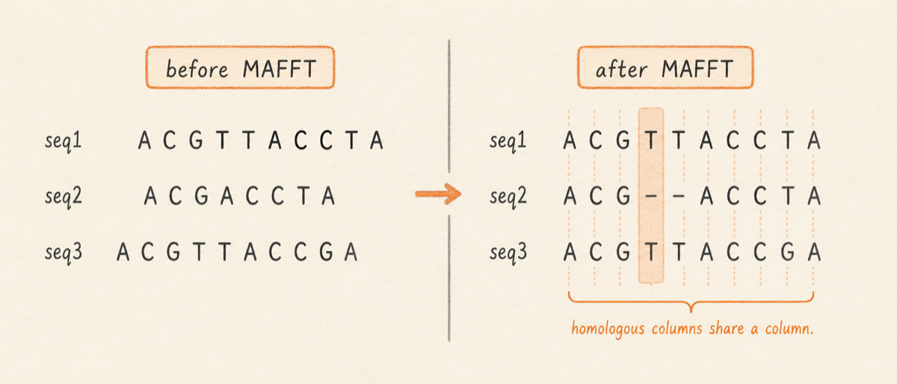
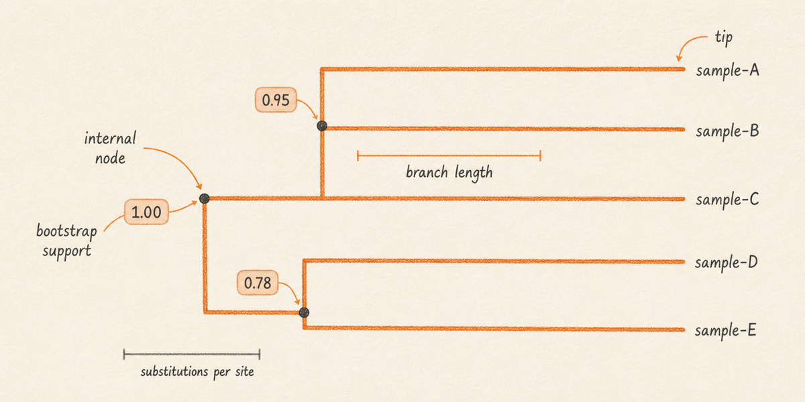

## What it is

A multiple sequence alignment (MSA) takes a set of related sequences and lines them up so homologous positions fall in the same column. Where one sequence carries an insertion the others lack, MAFFT pads the others with `-` gap characters. The result is a rectangular block: rows are sequences, columns are inferred homologous sites, and conservation at any column is simply a count of how many rows agree.

Lungfish runs MAFFT under `Tools > FASTQ/FASTA Operations > Multiple Sequence Alignment…` and writes the result as a `.lungfishmsa` bundle that opens in the MSA viewport. From that open bundle, right-click and choose **Build Tree with IQ-TREE…** to run IQ-TREE, which estimates a maximum-likelihood phylogenetic tree and writes it as a `.lungfishtree` bundle that opens in the tree viewport. Both bundles carry a provenance sidecar recording the exact tool version and command line.

This chapter runs more advanced than the rest of Part II, because it assumes you already have a reason to align: comparing related viral isolates, tracing transmission, or designing diagnostic primers across variants. MAFFT and IQ-TREE are well-documented academic standards, and this chapter teaches the Lungfish workflow around them, not the algorithm internals.

So in practice: with a handful of related FASTAs and a question about how they relate, build the MSA first, read the conservation, then infer a tree only if topology genuinely matters for your question.



## What you will learn

You will start with a set of related sequences, assemble them into a single FASTA, run MAFFT to align them, read the alignment in the MSA viewport, run IQ-TREE on that alignment to infer a maximum-likelihood phylogeny, read the tree in the tree viewport, and export a Newick file for use in external tools.

## Why MAFFT

Lungfish uses MAFFT because for the inputs this manual targets (tens to a few hundred viral or bacterial sequences of comparable length), its `--auto` strategy picks a sensible algorithm, runs in seconds, and produces alignments downstream tools agree with. MAFFT is the only aligner wired into Lungfish, in both the GUI and the CLI; there is no aligner picker to choose among.

The table below lists MUSCLE and Clustal Omega for context, in case a published methods section leaned on one of them. Neither is selectable in Lungfish. To reproduce a paper that used MUSCLE or Clustal Omega exactly, run that tool outside Lungfish and import the resulting alignment as a bundle (see "Importing a pre-built alignment or tree", below).

| Tool | Speed on ~100 viral genomes | In Lungfish | Strengths | Weaker on |
|---|---|---|---|---|
| MAFFT | Seconds | Yes | Auto-selects algorithm by input size, handles ragged ends well | Very large (>10k) divergent inputs without `--parttree` |
| MUSCLE | Seconds to minutes | No | Often slightly higher accuracy on small protein sets | Slower than MAFFT at scale |
| Clustal Omega | Minutes | No | Scales to thousands of sequences via HMM seeding | Less accurate than MAFFT on closely related nucleotide sets |

## Procedure: build an MSA with MAFFT

The worked example assumes ten SARS-CoV-2 S-gene FASTAs in one folder, each from a different lineage, a mix of Alpha, Delta, and Omicron. The exact accessions do not matter. What matters is that each FASTA holds a single S-gene sequence with a header line naming the lineage, for example `>BA.2_OQ123456`.

1. Drop the ten FASTAs into your project's `Imports/` folder, or use `File > Import Center…` (Cmd-Shift-I) and add them there. Each lands as its own item in the sidebar.
2. Choose `Tools > FASTQ/FASTA Operations > Multiple Sequence Alignment…`. The MSA wizard opens on the MAFFT pane.
3. In the wizard's inputs list, add all ten FASTAs. Lungfish concatenates them into a single multi-FASTA before handing them to MAFFT.
4. Leave **Strategy** on **Auto** (MAFFT is the only aligner, so there is nothing else to select). The pane also has **Sequence Type** and **Output Order** pickers, whose defaults are fine for this input. For inputs under a few hundred viral-scale sequences, Auto is what you want.
5. Name the output bundle (for example, `S-gene-10-isolates.lungfishmsa`) and click `Run`.

The **Strategy** picker exposes the full MAFFT algorithm set: **Automatic** (`--strategy auto`), **L-INS-i** (`linsi`), **G-INS-i** (`ginsi`), **E-INS-i** (`einsi`), **FFT-NS-2** (`fftns2`), and **PartTree** (`parttree`), the last for very large inputs. **Sequence Type** takes **Auto**, **Nucleotide**, or **Protein** (`--sequence-type`). An **Advanced Options** disclosure holds the rest. **Direction Adjustment** (Off, Adjust Direction, or Adjust Direction Accurately; `--adjust-direction off|fast|accurate`) reverse-complements records whose strand disagrees. **Symbol Policy** (Strict Alphabet or Allow Any Symbol; `--symbols strict|any`) governs non-standard residues. **Threads** plus a **Deterministic threading** toggle trade reproducibility for speed; clearing the toggle is the `--allow-nondeterministic-threads` flag. **Treat FASTQ records as assembled or consensus sequences** (`--allow-fastq-assembly-inputs`) lets FASTQ inputs stand in for FASTA. A **MAFFT Parameters** field (`--extra-mafft-options`) passes text straight to MAFFT after the chosen strategy.

MAFFT typically finishes in under a minute on this input size. The new bundle appears in the sidebar; double-click to open the MSA viewport.

<!-- SHOT: msa-viewport -->

## Interpretation: reading the MSA viewport

The MSA viewport has three regions. On the left, the row picker lists every input sequence in alignment order, each with a checkbox to hide that row from the column ruler's conservation calculation. The main pane is the alignment grid: one row per sequence, one column per alignment position, bases in the standard four-color nucleotide palette and gaps as light dashes on the Cream background. The column ruler across the top carries two tracks: a 1-based column index and a conservation track whose height at each column is the fraction of non-gap rows that share the modal base.

Three patterns are worth hunting for. First, blocks where every row agrees: conserved regions, useful as primer-design targets. Second, columns where one or two rows break ranks: lineage-defining substitutions, the signal phylogenetic inference will lean on. Third, ragged stretches of gaps: insertion and deletion events, often clustered at recombination breakpoints or in repetitive regions where the aligner is unsure.

If a reference annotation is already loaded (say, the SARS-CoV-2 GFF3 from your Reference Sequences folder), the viewport's `Annotations` toggle projects gene boundaries onto the column ruler, so you can tell at a glance whether a divergent column falls inside the receptor-binding domain or the signal peptide.

For the ten-isolate worked example, you should see a strongly conserved 5' block (the S1 signal region), a band of lineage-defining columns clustered in the receptor-binding domain (positions roughly 319 to 541 in the S-gene reference frame), and a shorter conserved 3' block. Omicron rows carry a visible insertion near position 214 that Alpha and Delta rows lack; in the MSA it shows up as a column block where eight of ten rows are gap characters.

## Working with an alignment after you build it

An alignment is often the input to more than a tree. The `lungfish msa` command transforms and inspects an existing `.lungfishmsa` bundle; it does not build one, that job belongs to `lungfish align mafft`. A bench reader can skip this subsection.

Two transforms come up constantly. `lungfish msa consensus` collapses the alignment into a single consensus FASTA, and `lungfish msa distance` writes a pairwise distance matrix as a TSV, either percent identity or p-distance. That is the quickest way to ask how different these sequences are from each other without building a tree:

```bash
lungfish msa distance S-gene-10-isolates.lungfishmsa \
  --output S-gene-10-isolates-distances.tsv
```

The same command family also extracts a sub-alignment, masks or trims columns, edits annotations, and exports to other formats. `lungfish msa export` writes aligned FASTA, PHYLIP, NEXUS, Clustal, Stockholm, and the a2m/a3m HMMER formats through `--output-format`, for handing the alignment to a tool that expects one of them.

## Procedure: infer a tree with IQ-TREE

You launch tree inference from inside the open alignment, not from the Tools menu. With the MSA bundle open in the MSA viewport, right-click and choose **Build Tree with IQ-TREE…**. The **Phylogenetic Tree Operations** dialog opens (subtitle "Configure IQ-TREE for the selected multiple sequence alignment"), pre-populated with the current MSA bundle.

1. Set **Output Name** for the tree bundle (for example, `S-gene-10-isolates`).
2. Leave **Model** on **MFP**. MFP is ModelFinder Plus: it tests a set of substitution models and picks the best-fitting one from your data before inferring the tree.
3. Tick **Ultrafast Bootstrap** to turn on support values, then set the replicate count to `1000`. This step is easy to miss: bootstrap is off by default, so skip it and the tree carries no support values, leaving the next section's "read the support values" advice with nothing to read. Tick **SH-aLRT** too if you want a second, faster support measure alongside.
4. The remaining fields (Sequence Type, Seed, Threads, Safe numerical mode, Keep identical sequences) have sensible defaults; leave them unless you have a reason to change them. There is no outgroup field here. Rooting on an outgroup is a separate step you take after the tree exists (see "Procedure: re-root a tree", below).
5. Click `Run`.

To build a tree from part of the alignment rather than all of it, select the rows or columns you want in the MSA viewport before choosing **Build Tree with IQ-TREE…**; the selection carries into the inference. The CLI exposes the same scoping through `--rows` and `--columns`.

IQ-TREE on ten sequences finishes in seconds to a minute. The new bundle appears in the sidebar; double-click to open the tree viewport.

The same inference runs from the command line. Unlike the post-inference commands later in this chapter, it requires both `--project` (for staging) and `--output`:

```bash
lungfish tree infer iqtree S-gene-10-isolates.lungfishmsa \
  --project . \
  --output S-gene-10-isolates.lungfishtree \
  --model MFP \
  --bootstrap 1000
```

Drop `--bootstrap` and the tree is built without support values, the CLI equivalent of leaving the Ultrafast Bootstrap box unticked. The builder command for the alignment itself is `lungfish align mafft <inputs> --project <dir>`; note that `lungfish msa` is a different command, one that transforms an existing alignment and cannot build one from unaligned FASTA.

<!-- SHOT: tree-viewport -->



## Interpretation: reading the tree viewport

The tree viewport renders a rectangular phylogram by default. Branch length encodes inferred substitutions per site, so longer horizontal branches mean more accumulated change. Tip labels come straight from the FASTA header lines; name your inputs with lineage prefixes and the lineage groupings jump out at a glance.

Three things to read off the tree. First, the topology: which tips group with which. For the worked example, Alpha tips should form one clade, Delta tips a separate clade, and Omicron tips a third, set well apart from the other two by a long internal branch. Second, the support values: if you ticked Ultrafast Bootstrap, a number at each internal node gives the percentage of bootstrap replicates that recovered that exact split, values above 95 strong, values below 70 uncertain. If you did not enable bootstrap, there are no numbers to read, and a tree with no support values is the usual sign you forgot to tick the box. Third, the root: IQ-TREE produces an unrooted tree, so the apparent root position is a display convention until you re-root the bundle on a chosen outgroup (next).

The tree viewport's toolbar offers a few controls. `Layout` switches between a branch-length phylogram and an equal-depth cladogram. `Color` can highlight support values or branch lengths. `Tip labels` can switch from the original tree labels to a column in `metadata.tsv` when the bundle includes one. The toolbar also carries navigation buttons: `Zoom in`, `Zoom out`, `Fit tree`, and `Reset`. A `Find tip or node` search field filters the tree to labels that match. Right-click a node or tip to copy labels, copy Newick for a subtree, center the view, reveal provenance, re-root, collapse, or extract a subtree as a new bundle.

A persistent `Nodes` table drawer lists every tip and internal node, with `Node`, `Type`, `Tips`, `Branch`, and `Support` columns. Click a row to center that node in the canvas, and clicking a node in the canvas highlights its row in turn. Selecting any node also fills the inspector with its detail rows, among them `Descendant Tips`, `Cumulative Divergence` (the summed branch length back to the root), and, where support is present, `Support` and `Support Type`. The right-click menu offers two ways to lift out a clade, and they differ in what they write: `Extract Subtree as New Bundle...` produces a fresh `.lungfishtree` bundle with its own provenance (see "Procedure: extract a subtree", below), while `Export Subtree...` writes a plain `.nwk` Newick file for handing to an external tool.

## Procedure: re-root a tree

Re-rooting changes where the tree is read from; it leaves the source bundle untouched. In the tree viewport, right-click the tip or internal node that should become the root and choose `Re-root Here`. Save the result as a new `.lungfishtree` bundle. The new bundle records the source bundle, selected node, resolved options, checksums, file sizes, command line, runtime identity, exit status, wall time, and any useful stderr in `.lungfish-provenance.json`.

The same operation is available from the CLI:

```bash
lungfish tree reroot \
  --bundle S-gene-10-isolates.lungfishtree \
  --on Wuhan-Hu-1 \
  --output S-gene-10-isolates-rooted.lungfishtree
```

Use a stable tip label, raw label, or normalized node id for `--on`. If more than one node matches a label, Lungfish reports the ambiguity instead of guessing.

## Procedure: relabel tips from metadata

Tip relabeling earns its keep when raw FASTA headers are accession-heavy but your analysis needs lineage, host, collection site, or another readable field. Add a tab-separated `metadata.tsv` file at the bundle root with an id column named `id`, `sample`, `sample_id`, `name`, or `tip`, followed by the columns you want to use:

```tsv
id	lineage	country
OQ123456	BA.2	USA
OQ123457	BA.5	Canada
```

Open the tree bundle and choose the column from the `Tip labels` control. To create a permanent derived bundle from the CLI, run:

```bash
lungfish tree relabel \
  --bundle S-gene-10-isolates.lungfishtree \
  --column lineage \
  --output S-gene-10-isolates-lineage-labels.lungfishtree
```

The source bundle stays unchanged. The derived bundle's provenance includes the metadata file identity and the selected column.

## Procedure: collapse and select tips

For dense trees, right-click an internal node and choose `Collapse Clade`. The viewport keeps the clade on hand as a single highlighted node; right-click it again and choose `Expand Clade` to restore the full view. Click a tip to select it. Shift-click more tips to build a highlighted tip set, then right-click and choose `Copy Selected Tip Names` to copy one name per line for downstream filtering or notes.

Collapse and multi-selection are viewport operations. They do not write scientific output and therefore do not create bundle provenance.

## Procedure: extract a subtree

Subtree extraction creates a new `.lungfishtree` bundle holding the selected clade, and leaves the source bundle unchanged. In the viewport, right-click an internal node or tip and choose `Extract Subtree as New Bundle...`. Use this when you want to keep a focused clade with its own manifest, normalized tree, index, and provenance.

The CLI equivalent is:

```bash
lungfish tree extract-subtree \
  --bundle S-gene-10-isolates.lungfishtree \
  --node node-12 \
  --output Omicron-clade.lungfishtree
```

For compatibility with older workflows, `lungfish tree export subtree` still writes a plain Newick export plus sidecar provenance. Prefer `extract-subtree` when the result should remain a Lungfish bundle.

## Importing a pre-built alignment or tree

You do not have to build everything in Lungfish. If an external pipeline already produced an alignment or a tree, import it as a native bundle and use the same viewports and operations you would for an in-app result. `lungfish import msa` reads aligned FASTA, Clustal, PHYLIP, NEXUS, Stockholm, and a2m/a3m and writes a `.lungfishmsa` bundle; `lungfish import tree` reads Newick or Nexus and writes a `.lungfishtree` bundle. Both take a `--project` directory:

```bash
lungfish import msa my-alignment.fasta --project .
lungfish import tree my-tree.nwk --project .
```

This is the route for reproducing a published MUSCLE or Clustal Omega alignment, or for bringing in a tree from a tool Lungfish does not run.

## What this chapter does not cover

Phylogenetics is a deep field, and Lungfish ships only the inference workflow most viral-genomics analysts need day to day. The following are deliberately out of scope and not in the app today.

- Ancestral state reconstruction (inferring sequences at internal nodes).
- Time-calibrated trees in the BEAST or TreeTime style, where branch lengths represent calendar time rather than substitutions per site.
- Recombination detection (RDP, GARD, 3SEQ) for sequences with mosaic ancestry.
- Coalescent population-genetic inference such as effective population size over time.
- Phylogeographic inference that maps tree branches onto geographic locations.

If your question needs any of those, export the Newick or the MSA FASTA from the bundle and run the appropriate external tool. The provenance sidecar records the Lungfish-side inputs, so the external analysis stays reproducible.

## Troubleshooting

When MAFFT produces a poor alignment, the input is almost always to blame. Sequences in mixed orientation (some forward strand, some reverse complement) align as if they were unrelated. There is no `Tools > Orient` for reference FASTA; the FASTQ "Orient Reads" operation handles reads, not the records going into an MSA. Let MAFFT flip them instead: open the wizard's **Advanced Options** and set **Direction Adjustment** to **Adjust Direction** (or **Adjust Direction Accurately**), which reverse-complements records as needed during alignment. The CLI spelling is `lungfish align mafft --adjust-direction fast`. Sequences from different genes, or of wildly different lengths, produce mostly-gap alignments; confirm every input is what you think by spot-reading a few headers and lengths in the sidebar inspector. Very divergent sequences (below ~50% pairwise identity) sit at the edge of MAFFT's default settings; switch **Strategy** from Auto to **L-INS-i** for higher accuracy at the cost of runtime (the CLI spelling is `--strategy linsi`), or accept that an MSA is not the right tool for that data.

When IQ-TREE struggles, it usually says so in its log. Identical or near-identical sequences collapse into zero-length branches and produce trees with low support across the board; deduplicate the input FASTA first if that is the case. Very short alignments (under a few hundred informative columns) carry too little signal for confident bootstrap support; expect support values in the 50s to 70s and do not over-read them. If IQ-TREE warns that ModelFinder picked a model with very few parameters, your data is probably too uniform for the question you are asking; ask whether a tree is the right summary at all.

For the ten-isolate S-gene worked example, both tools should run cleanly. If they do not, check the operation's log link in the Operations Panel; the full MAFFT or IQ-TREE stderr sits there, along with the resolved command line.

## Next

This is the last chapter in [Sequences](.). Continue to [Reads (FASTQ)](../03-reads/) for sequencing data workflows, or [Variants](../05-variants/) for variant calling against a reference.
