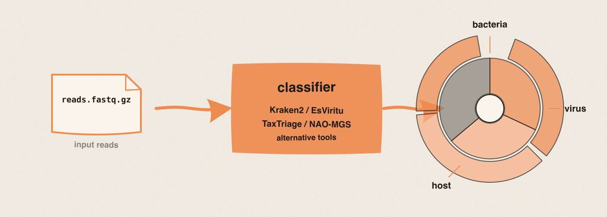

## What it is

Read classification answers a single, very practical question: "what is in this FASTQ?" Given a pile of short reads (often tens of millions of them), a classifier walks read by read and decides which organism each one most likely came from. The answer for one read is a taxonomic node, meaning a labelled point on the tree of life such as *Escherichia coli* (a species), *Klebsiella* (a genus), or *Coronaviridae* (a family). The answer for the whole sample is a summary of how many reads landed at each node.

This is different from mapping reads to a reference. Mapping assumes you already know what you are looking for and asks "where on this genome does each read fit?" Classification makes no such assumption. It surveys the sample. You run it when you have a sample whose contents you cannot fully predict: a clinical specimen with a possible mixed infection, a wastewater pellet, an environmental swab, or a contaminated culture you want to triage before deeper analysis.

The output is not a yes-or-no answer. It is a distribution. A typical run produces something like "63% human, 22% bacterial (mostly *Streptococcus*), 4% SARS-CoV-2, 11% unclassified". Lungfish renders that distribution three ways inside the same taxonomy viewport: a sunburst diagram (concentric rings, one per taxonomic rank), a sortable per-taxon table, and a breadcrumb bar that tracks where you have drilled down. All three update together when you click.

So what should you do with this? Before you run anything, decide which question you are actually asking, because the four classifiers Lungfish ships answer slightly different questions. Then pick the matching tool from the Unified Metagenomics Wizard at `Tools > FASTQ/FASTA Operations > Classification` and let it pick the right database.

## What you will learn

By the end of this chapter you will be able to articulate what read classification produces (a per-read taxonomic assignment, summarized as a sunburst and a table), tell the four runnable classifiers Lungfish ships apart, understand when imported CZ-ID results and Freyja lineage demixing fit, pick the right path for your question, and find the Unified Metagenomics Wizard.

## Classifiers and imported results

Lungfish bundles four runnable classifiers because no single tool does everything well. A general-purpose tool with a giant database is the right answer when you have no prior hypothesis, but it is overkill (and sometimes wrong) when you already know you are looking for a virus and want to call the strain. A surveillance pipeline that flags pathogens with confidence scores is the right answer in a clinical lab, but it adds noise to a routine wastewater run.

Lungfish also imports CZ-ID taxon report TSVs. CZ-ID is a hosted metagenomics platform, so Lungfish does not run it locally or submit reads to it. The import path preserves an upstream CZ-ID result beside the rest of the project, converts the taxon report into Lungfish's taxonomy result schema, and records the CZ-ID pipeline and database metadata when those columns are present.

Freyja is adjacent to classification but answers a narrower wastewater question. It does not classify every read in a FASTQ. It consumes variant and depth tables from a SARS-CoV-2 wastewater sample and estimates lineage mixture. Use it after you have mapped and summarized the target genome, not as a replacement for Kraken2, EsViritu, TaxTriage, or NAO-MGS.

The table below gives the high-level regime each classifier was designed for. Each tool has its own chapter later in this part with a full walkthrough.

| Classifier or import | Question it answers best | Database | RAM to plan | Resolution | Typical regime |
|---|---|---|---|---|---|
| Kraken2 | "What domains and broad taxa are in this sample?" | Large, multi-domain (bacteria, archaea, viruses, fungi, human) | Database-sized; Viral fits in 16 GB, Standard/PlusPF need much more | Genus or species, depending on database build | Discovery, contamination triage, broad metagenomics |
| EsViritu | "Which virus is this, and at what strain?" | Curated viral, with strain-level annotation | 16 GB for default viral runs | Strain (subtype, lineage) within virus | Targeted viral identification once you suspect a virus |
| TaxTriage | "Is there a clinically reportable pathogen here, and how confident are we?" | Clinical-surveillance reference set | 16 to 32 GB for the default clinical profile | Species, with confidence flags | Clinical surveillance and reporting workflows |
| NAO-MGS | "How are pathogen levels in this site changing over time?" | Surveillance-tuned, wastewater-oriented | 16 to 32 GB for default wastewater runs | Species or strain, time-series friendly | Longitudinal wastewater monitoring |
| CZ-ID import | "How do I bring an upstream hosted CZ-ID result into this project?" | Upstream CZ-ID NT/NR database versions, recorded from the export when present | No local classifier RAM; import only | Taxon report rows as exported by CZ-ID | Labs that already ran CZ-ID outside Lungfish |

A few features cut across all four. They all consume FASTQ (single or paired) from a Lungfish FASTQ bundle. They all emit a taxonomy result that opens in the same viewport class. They all record their database version and command line in the project's provenance sidecar, so a methods export later names the exact build you used. And they all need their reference database installed before they will run, which is the one piece of upfront work this part covers in detail.

## Picking a classifier for your sample

The decision usually falls out of two questions: *how much do I already know about this sample?* and *what will I do with the answer?* Walk down the path that fits, and the right tool tends to pick itself.

If you have a brand-new sample and you have no specific hypothesis, start with **Kraken2**. It is the broadest net Lungfish casts. A standard Kraken2 database covers bacteria, archaea, viruses, fungi, and the human genome, so a single run tells you whether your sample is dominated by host, by one bacterial genus, or by something unexpected. This is also the right choice for routine quality-control work, where you mostly want to know "is the host fraction what I expected, and is there obvious contamination?"

If your Kraken2 result (or some prior knowledge) says you are looking at a virus and you now want to call the strain, switch to **EsViritu**. Kraken2 will often place a viral read at the family or genus level because its database does not carry every strain. EsViritu's database is curated specifically for viruses and tracks strain-level annotation, so it can take the same FASTQ and tell you not just "*Influenzavirus A*" but "H3N2, clade 3C.2a1b". Run it as a second pass after a broad survey, or as a first pass when the sample type guarantees a viral target (for example, a respiratory swab in flu season).

If you are working in a clinical-surveillance setting and you need a confidence-scored, reportable answer, run **TaxTriage**. TaxTriage is a pipeline that combines multiple classifiers and emits per-organism confidence flags so a downstream reviewer can see at a glance which calls are well-supported and which are tentative. The trade is that it is heavier than a single Kraken2 run and assumes a clinical reference set, so it is not the right tool for an environmental discovery sample.

If you are running wastewater surveillance and you want signals that compare cleanly across samples and across weeks, run **NAO-MGS**. Its database and reporting are tuned for the longitudinal wastewater regime: relative abundances that mean the same thing from one Cassette to the next, and outputs structured for time-series plotting. Use it for monitoring; pick a different tool for one-off identification.

If your wastewater question is specifically "which SARS-CoV-2 lineages are mixed in this sample?", run **Freyja** after producing the required variant and depth inputs. In the app, start from `Tools > FASTQ/FASTA Operations > Lineage Demixing > Freyja` to install or verify the pack. On the CLI, `lungfish freyja demix` writes a command plan and provenance by default, and `--execute` runs Freyja when the `wastewater-surveillance` pack is installed.

If your lab already ran **CZ-ID**, import the taxon report instead of rerunning another classifier just to view it in Lungfish. The current importer accepts a taxon report TSV, converts it to a Lungfish classification result directory, and records the upstream pipeline version plus NT/NR database versions when the export includes them. It is imported, not native: use the CZ-ID website or your upstream automation to run the analysis, then bring the result into Lungfish for side-by-side review and provenance.

A useful rule of thumb: when in doubt, run Kraken2 first to see the lay of the land, then run a more specific tool on the same FASTQ to refine the answer. Lungfish keeps each classification result as its own track on the FASTQ bundle, so you can have a Kraken2 result and an EsViritu result side by side without them overwriting each other.

## What you will see in the viewport

Every classifier produces output that opens in the same taxonomy viewport. Three views show the same data, linked: when you click a wedge in the sunburst, the table scrolls to that taxon, and the breadcrumb bar updates to show where you are in the tree.

The sunburst is the at-a-glance view. The innermost ring is the root of life; each successive ring is a finer rank (domain, phylum, class, order, family, genus, species). Wedge size encodes the read count assigned at or below that node. A glance at the sunburst tells you whether the sample is dominated by one wedge or spread across many.

The table is the precise view. Each row is one taxon, with columns for rank, name, read count, and percent of classified reads. Sort by read count to find the dominant taxa, or filter by rank to see, for example, only species-level calls.

The breadcrumb bar is the navigation aid. It records the path you have drilled down (root > Bacteria > Proteobacteria > *Escherichia coli*) and lets you back up to a parent rank without losing your place.

<!-- planned: taxonomy-viewport-overview -->

What this means for your interpretation: the viewport is not telling you "the sample contains X". It is telling you "this many reads were assigned to X by this classifier with this database". Reads can be unclassified because the organism is not in the database, because the read is too short, or because it falls in a region that does not carry a discriminating signal. Treat a 10% unclassified fraction as normal; a 60% unclassified fraction is a signal to question the database choice or the sample prep.

## Databases and the Plugin Manager

A classifier without its database is a program with nothing to compare against. None of the four classifiers ship with a database inside the Lungfish app bundle, because the smallest useful Kraken2 database is several gigabytes and the largest is over a hundred gigabytes. Asking every Lungfish user to download all of them on first launch would be inappropriate.

Instead, Lungfish installs each classifier and its default database on demand through the Plugin Manager. The first time you open the Unified Metagenomics Wizard and pick (for example) Kraken2, the wizard checks whether the Kraken2 plugin pack is installed. If it is not, it opens the Plugin Manager so you can install it. The install runs `micromamba` against the bioconda channel for the tool itself and downloads the matched database from the official source for the data, both with full provenance recording.

You only do this once per classifier. After install, the wizard runs the tool directly. See [Plugin Packs](../01-foundations/07-plugin-packs.md) for the install walkthrough and the disk-space figures for each database build.

A practical consequence: if you are setting up a new Lungfish install for a project that needs all four classifiers, plan for an afternoon of one-time downloads and roughly 100 to 200 GB of disk. If you only need one classifier, you only install one.

## Where the wizard lives

The Unified Metagenomics Wizard is the one entry point for all four tools. Open it from `Tools > FASTQ/FASTA Operations > Classification`. The wizard opens with a tool picker at the top showing the four classifiers as cards (Kraken2 in blue, EsViritu in green, TaxTriage in purple, NAO-MGS in amber, matching the colors used elsewhere in the Lungfish UI), the FASTQ input below, and the database selector below that. Pick a tool, and the wizard reconfigures itself to show only the parameters that tool exposes.

<!-- planned: classification-wizard-tool-picker -->

The Run button always says "Run". When you click it, the classifier launches in the background, the Operations Panel logs the run, and the result appears as a new track on the source FASTQ bundle when it completes. You can keep working in the meantime.

## Next

Continue to [Running Kraken2](02-running-kraken2.md) for general-purpose classification, jump to the classifier that matches your question, or see [Importing CZ-ID Results](07-importing-cz-id-results.md) when you already have a CZ-ID export.
