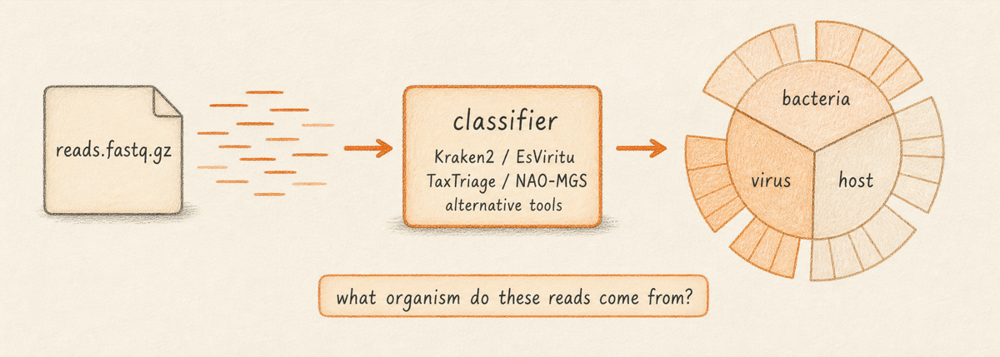

## What it is

Read classification answers one blunt, practical question: what is in this FASTQ? Hand a classifier a pile of short reads, often tens of millions of them, and it walks through them one at a time, deciding which organism each read most likely came from. For a single read, the answer is a taxonomic node: a labelled point on the tree of life such as *Escherichia coli* (a species), *Klebsiella* (a genus), or *Coronaviridae* (a family). For the whole sample, the answer is a tally of how many reads landed at each node.

That is a different job from mapping reads to a reference. Mapping assumes you already know your target and asks where on this genome each read fits. Classification assumes nothing. It surveys the sample. You reach for it whenever the contents are unpredictable: a clinical specimen with a possible mixed infection, a wastewater pellet, an environmental swab, or a contaminated culture you want to triage before you dig deeper.

The output is never a yes or no. It is a distribution. A typical run reports something like 63% human, 22% bacterial (mostly *Streptococcus*), 4% SARS-CoV-2, 11% unclassified. For a Kraken2 result, Lungfish draws that distribution three ways in the taxonomy viewport: a sunburst diagram of concentric rings, one per taxonomic rank; a sortable per-taxon table; and a breadcrumb bar that tracks how far you have drilled down. Click anything and all three move together. The other tools bring their own table-based viewports, covered in their chapters.

So before you run anything, pin down the question you are really asking, then match a tool to it. Lungfish runs three classifiers itself and imports the results of three more. Open the run wizard at `Tools > FASTQ/FASTA Operations > Classification…` and let it pick the right database.

## What you will learn

This chapter gives you enough to say what read classification produces (a per-read taxonomic assignment, summarized as a table and, for Kraken2, a sunburst), tell the three runnable classifiers apart from the three import-only tools, know when Freyja lineage demixing fits, choose the right path for your question, and find the run wizard.

## Three runnable classifiers, three import-only tools

Three classifiers run inside the app, each launched on a FASTQ bundle: Kraken2 for a broad survey, EsViritu for viral strain calling, and TaxTriage for clinical-surveillance triage. Three more arrive as imports from tools you ran elsewhere: CZ-ID, NAO-MGS, and NVD (Novel Virus Diagnostics). Imported results sit, display, and verify alongside native runs, but Lungfish never runs those three for you.

No single tool does everything well, which is the whole reason there is more than one. A general-purpose classifier with a giant database is exactly right when you have no hypothesis, and overkill, sometimes wrong, when you already know you want a virus and its strain. A clinical pipeline that scores pathogens by confidence earns its keep in a clinical lab and only adds noise to a routine wastewater run.

The import-only tools are hosted platforms or heavy external pipelines. CZ-ID is a hosted metagenomics service. NAO-MGS is SecureBio's wastewater metagenomic surveillance pipeline, built for large cloud machines. NVD (Novel Virus Diagnostics) is a Snakemake pipeline that assembles contigs and BLASTs them to hunt for novel viruses. For all three, Lungfish neither runs the analysis nor submits your reads. It takes the output you already made, converts it into a Lungfish result, and records the upstream pipeline and database metadata wherever those columns exist. Results from Kraken2, EsViritu, or TaxTriage run outside Lungfish import the same way through the Import Center, so the path is not limited to CZ-ID.

Freyja sits next to classification but answers a narrower wastewater question. It does not classify every read in a FASTQ. It takes variant and depth tables from a SARS-CoV-2 wastewater sample and estimates the lineage mixture. Run it after you have mapped and summarized the target genome, never as a stand-in for a classifier.

12S amplicon metabarcoding is also adjacent, and also distinct. It names which vertebrate species a sample holds by matching merged 12S amplicon reads exactly against a curated reference FASTA, rather than classifying reads against a taxonomic database. Reach for it on diet, eDNA, or mixed-sample work, and see [12S Metabarcoding](09-twelve-s-metabarcoding.md) for the walkthrough.

The table below sorts the tools by one line: does it run inside Lungfish? Each tool also gets its own chapter later in this part, with a full walkthrough.

| Tool | Runs in Lungfish? | Question it answers best | Resolution |
|---|---|---|---|
| Kraken2 | Yes, in the run wizard | "What domains and broad taxa are in this sample?" | Genus or species, depending on the database |
| EsViritu | Yes, in the run wizard | "Which virus is this, and at what strain?" | Strain (subtype, lineage) within a virus |
| TaxTriage | Yes, in the run wizard | "Is there a reportable pathogen here, and how confident are we?" | Species, with a confidence score |
| CZ-ID | No, import only | "How do I bring an upstream hosted CZ-ID result into this project?" | Taxon report rows as exported by CZ-ID |
| NAO-MGS | No, import only | "What viral taxa did my external wastewater surveillance run find?" | Per-taxon hit counts from the SecureBio pipeline |
| NVD | No, import only | "Which assembled contigs match (or near-miss) a known virus?" | Per-contig best BLAST hit, with secondary hits |

The three runnable classifiers share a few habits. Each consumes FASTQ, single or paired, from a Lungfish FASTQ bundle. Each records its database version and command line in the project's provenance sidecar, so a later methods export names the exact build you used. And each needs its reference database installed before it will run, the one piece of upfront work this part covers in detail. TaxTriage asks for more than a database (see its chapter); Kraken2 and EsViritu ask for the database alone.

## Picking a classifier for your sample

The choice usually falls out of two questions: *how much do I already know about this sample?* and *what will I do with the answer?* Follow the path that fits and the right tool tends to pick itself.

A brand-new sample with no specific hypothesis calls for **Kraken2**, the broadest net Lungfish casts. A standard Kraken2 database spans bacteria, archaea, viruses, fungi, and the human genome, so one run tells you whether the sample is dominated by host, by a single bacterial genus, or by something you did not expect. It is also the tool for routine quality control, where the question is mostly: is the host fraction what I planned for, and is anything obviously contaminating it?

Once a Kraken2 result, or prior knowledge, points to a virus and you want the strain, switch to **EsViritu**. Kraken2 often parks a viral read at the family or genus level, because its database does not carry every strain. EsViritu's database is curated for viruses and carries strain-level annotation, so from the same FASTQ it tells you not just "*Influenzavirus A*" but "H3N2, clade 3C.2a1b". Run it as a second pass after a broad survey, or as a first pass when the sample type all but guarantees a viral target, such as a respiratory swab in flu season.

Clinical-surveillance work that needs a confidence-scored answer calls for **TaxTriage**. It runs a Nextflow pipeline that combines classifiers and ranks each organism by a confidence score, so a downstream reviewer sees at a glance which calls are well-supported and which are tentative. The trade is weight: it is heavier than a single Kraken2 run and needs more setup, a container runtime covered in its chapter, so it is the wrong tool for a quick environmental survey.

When the wastewater question is precisely "which SARS-CoV-2 lineages are mixed in this sample?", run **Freyja** after producing the variant and depth inputs it needs. In the app, use `Tools > Plugin Manager…` to install or verify the `wastewater-surveillance` pack. On the CLI, `lungfish freyja demix` writes a command plan and provenance by default, and `--execute` runs Freyja once the pack is installed.

If your lab already ran an external tool, import the result rather than rerun a classifier just to look at it. **CZ-ID** taxon reports, **NAO-MGS** wastewater-surveillance output from the SecureBio pipeline, and **NVD** novel-virus BLAST results all import through the Import Center. Each importer folds the upstream result into a Lungfish bundle and records the source pipeline version whenever the export carries it. These are imports, not native runs: run the analysis on the upstream service or your own automation, then bring the result into Lungfish for review and provenance.

A rule of thumb worth keeping: when in doubt, run Kraken2 first to read the lay of the land, then run a more specific tool on the same FASTQ to sharpen the answer. Lungfish keeps each classification result as its own track on the FASTQ bundle, so a Kraken2 result and an EsViritu result sit side by side without overwriting each other.

## What you will see in the viewport

The viewport depends on the tool. Kraken2 and imported CZ-ID results open the sunburst taxonomy viewport described here. EsViritu, TaxTriage, NAO-MGS, and NVD each bring their own table-based viewport, covered in their chapters. What follows is the Kraken2 and CZ-ID sunburst view.

Three linked views show the same data. Click a wedge in the sunburst and the table scrolls to that taxon while the breadcrumb bar updates to show where you stand in the tree.

The sunburst is the at-a-glance view. Its innermost ring is the root of life, and each ring outward is a finer rank (domain, phylum, class, order, family, genus, species). Wedge size tracks the read count assigned at or below that node. One look tells you whether a single wedge dominates the sample or the reads spread across many.

The table is the precise view. Each row is one taxon, with columns for rank, name, read count, and percent of classified reads. Sort by read count to surface the dominant taxa, or filter by rank to see, say, only species-level calls.

The breadcrumb bar is the navigation aid. It traces the path you have drilled down (root > Bacteria > Proteobacteria > *Escherichia coli*) and lets you back up to a parent rank without losing your place.

<!-- planned: taxonomy-viewport-overview -->

What this means for your reading: the viewport is not claiming the sample contains X. It is reporting that this many reads were assigned to X by this classifier with this database. A read stays unclassified when its organism is absent from the database, when it is too short, or when it lands in a stretch that carries no discriminating signal. Treat a 10% unclassified fraction as ordinary; a 60% unclassified fraction is a prompt to question the database choice or the sample prep.

## Databases and the Plugin Manager

A classifier without its database is a program with nothing to compare against. The runnable classifiers ship without one inside the Lungfish app bundle, because the smallest useful Kraken2 database runs to several hundred megabytes and the largest tops a hundred gigabytes. Making every Lungfish user download all of them on first launch would be unreasonable.

Instead, Lungfish installs each classifier and its default database on demand through the Plugin Manager, reached from `Tools > Plugin Manager…` (Cmd-Shift-B). The first time you open the run wizard and pick, say, Kraken2, the wizard checks whether the Kraken2 plugin pack is installed. If it is not, it points you to the Plugin Manager to install it. That install runs `micromamba` against the bioconda channel for the tool and downloads the matched database from the official source for the data, both with full provenance recording.

You do this once per classifier. After install, the wizard runs Kraken2 and EsViritu directly. TaxTriage also needs a container runtime, which its chapter covers. See [Plugin Packs](../01-foundations/07-plugin-packs.md) for the install walkthrough and the disk-space figures for each database build.

One practical consequence: setting up a new Lungfish install for a project that wants all three runnable classifiers and several large databases means an afternoon of one-time downloads and a generous slice of disk. Need one classifier, install one.

## Where the wizard lives

The run wizard is the single entry point for all three runnable classifiers. Open it from `Tools > FASTQ/FASTA Operations > Classification…`. It is one menu item, not a submenu: no `Classification > Kraken2` or `Classification > EsViritu` path exists. The wizard opens on a tool picker showing the three runnable classifiers (Kraken2 in blue, EsViritu in green, TaxTriage in purple, the same colors used elsewhere in the Lungfish UI), the FASTQ input, and the database selector. Pick a tool and the wizard reshapes itself to show only the parameters that tool exposes. The import-only tools (CZ-ID, NAO-MGS, NVD) are not here; you reach them from the Import Center.

<!-- planned: classification-wizard-tool-picker -->

The Run button always reads "Run". Click it and the classifier launches in the background, the Operations Panel logs the run, and the result appears as a new track on the source FASTQ bundle once it finishes. You can keep working while it does.

## Next

Continue to [Running Kraken2](02-running-kraken2.md) for general-purpose classification, jump straight to the classifier that matches your question, or see [Importing CZ-ID Results](07-importing-cz-id-results.md) and [Novel Virus Diagnostics](08-novel-virus-detection.md) when you already have an external result in hand.
