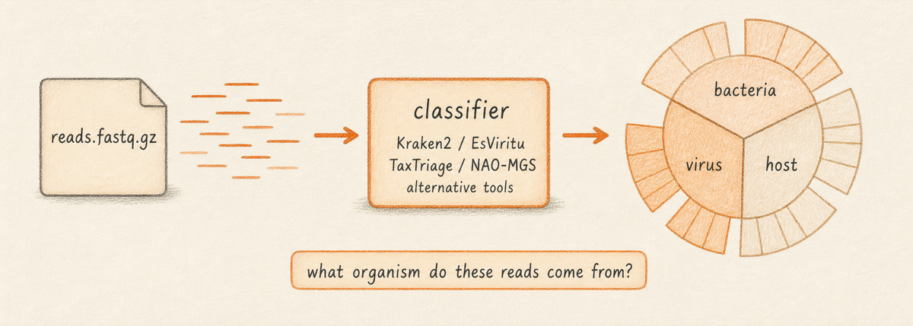

## What it is

[Read classification](../../GLOSSARY.md#read-classification) answers one practical question about a sequencing run, which is what organisms the sample contained. A [read](../../GLOSSARY.md#read) is the record a sequencer writes for one DNA [fragment](../../GLOSSARY.md#fragment), with its bases and a quality for each, stored as one record in a [FASTQ](../../GLOSSARY.md#fastq) file. A classifier is a program that compares each read against a reference database of known genomes and writes down which organism it best matches. The database is a folder of files installed on your own Mac, not a website the app queries. Classify every read in the file and you have a count of which organisms are present.

The answer for a single read is a [taxon](../../GLOSSARY.md#taxon), which is any named group on the tree of life. *Homo sapiens* is a taxon, and so are the primate family Hominidae and the virus family *Coronaviridae*. Every taxon sits at a [taxonomic rank](../../GLOSSARY.md#taxonomic-rank), the level of the naming hierarchy it belongs to. The ranks these tools report run from broadest to narrowest as domain, kingdom, phylum, class, order, family, genus, and species, so for a person the ladder reads Eukaryota, Metazoa, Chordata, Mammalia, Primates, Hominidae, *Homo*, *Homo sapiens*.

A classifier does not always reach species, and a call that stops at genus is still a usable answer. When a read's sequence is shared by several close relatives, the classifier steps back up the hierarchy and reports the [lowest common ancestor](../../GLOSSARY.md#lowest-common-ancestor), the most specific taxon that all the matching organisms belong to. In a database that holds both genomes, a read that fits the rhesus macaque and the cynomolgus macaque equally well is reported as the genus *Macaca* rather than guessed at species. The tool picks that level from what the database contains, and you do not set it yourself.

This is a different question from [mapping](../../GLOSSARY.md#mapping). Mapping starts from an organism you already named and asks where on its genome each read fits. Classification starts from nothing and asks which organism each read came from. A common working pattern is to classify first to find out what is present, then map against whichever genome the classification named.

The whole-sample answer is a distribution rather than a yes or no. It reports what share of the reads went to each taxon, plus a separate share of [unclassified reads](../../GLOSSARY.md#unclassified-reads), the ones the classifier could not name at any rank. This is [metagenomics](../../GLOSSARY.md#metagenomics), the study of all the nucleic acid in a mixed sample at once. Lungfish Genome Explorer (LGE) offers several classifiers, and they answer different questions, so the one decision to make before you run anything is which question you are asking.

### Counts, shares, and normalised figures

Every result in this part reports how much of an organism it found, and three kinds of number do that job. The glossary entry [abundance](../../GLOSSARY.md#abundance) collects them.

A read count is the evidence. It is the number of reads, read pairs, or alignments assigned to a taxon, such as the Reads column of a Kraken 2 table. A count grows with sequencing depth, so 2,000 reads means something different in a run of one million reads than in a run of fifty million, and a long genome collects more reads than a short one at the same concentration.

A [relative abundance](../../GLOSSARY.md#relative-abundance) is a share of a stated denominator, such as the percentage of all reads, of classified reads only, or of one virus's reads. Two shares can be compared only when their denominators match, and the tools in this part use different ones. Kraken 2's percentage counts unclassified reads in its denominator, while the 12S table leaves unmatched reads out of its own.

A normalised abundance scales the count by the size of the library and sometimes by the length of the genome, so samples sequenced to different depths can sit side by side. [RPM](../../GLOSSARY.md#reads-per-million) and [RPB](../../GLOSSARY.md#reads-per-billion) divide by library size, and EsViritu's [RPKMF](../../GLOSSARY.md#rpkmf) divides by genome length as well. Compare samples on the normalised figure of one tool, and use the count to judge how much evidence sits behind it. [Comparing the result views](#comparing-the-result-views) names each view's denominator.

## Why you would do this

You classify when you cannot fully predict what is in the tube. A clinical swab from a person or a macaque is the clearest case. Most of what a nasal or throat swab yields is the host's own genome, because sampling collects far more host cells than microbes, and whatever pathogen you are chasing sits somewhere in the remainder. Classification answers three questions at once:

1. How much of the run went to host background?
2. Does one bacterium dominate the rest?
3. Is the virus you suspected present at all?

A targeted assay, meaning a test that looks only for organisms chosen in advance, answers only the third.

The same reasoning covers wastewater, a culture you suspect is contaminated, and any run where you need to check that the library holds what you think it holds. [Host depletion](../../GLOSSARY.md#host-depletion), the removal of the sampled organism's own reads, is often run first because the host fraction is so large, and [Decontamination](../03-reads/05-decontamination.md) covers that step.

## Choosing a tool

First check the facts in [Know your reads before you choose a tool](../01-foundations/02-sequencing-reads.md#know-your-reads-before-you-choose-a-tool). Here the choice rests on what kind of organism you expect and how the library was made. If the sample came from one organism you already know, such as a person's whole-genome library, classification is only a contamination check, and one Kraken 2 run answers it.

<!-- ILLUSTRATION: classifier-decision-flowchart -->

### Three ways to match a read

Every classifier here matches reads in one of three ways. The first is exact word lookup. Kraken 2 cuts each read into [k-mers](../../GLOSSARY.md#k-mer), overlapping words of exactly k bases, and looks each word up in a prebuilt table that records which taxon owns it. Take the read `ACGTTGCA` and words of five bases. It gives four words, `ACGTT`, `CGTTG`, `GTTGC`, and `TTGCA`. If three of the four are listed under one bacterium, the read is named as that bacterium. Real words are about 35 bases long, and Kraken 2 looks up a compact sample of them called [minimizers](../../GLOSSARY.md#minimizer). It is fast because nothing is aligned, but a word counts only when it matches exactly, so a virus that differs from every database genome every few bases leaves many reads unclassified.

The second is read mapping. EsViritu, and TaxTriage in its second round, line each read up against whole reference genomes with [minimap2](../../GLOSSARY.md#minimap2), allowing mismatches, and TaxTriage in LGE uses minimap2's short-read mode for Illumina reads and its nanopore mode for Oxford Nanopore reads. Mapping is slower but gives [coverage breadth](../../GLOSSARY.md#coverage-breadth), the share of a genome the reads reached. A hundred reads spread along a whole viral genome show the virus is present, and a hundred stacked on one conserved gene do not, though Kraken 2 counts both the same.

The third is lineage [demixing](../../GLOSSARY.md#demixing), which is what Freyja does. From reads mapped to one virus, it reads the [allele frequency](../../GLOSSARY.md#allele-frequency), the share of reads at one position that carry the alternate base, at the positions that define each lineage, and estimates the blend of lineages that best explains them.

12S Amplicon Matching sits beside these three. It asks whether a read contains a whole known reference sequence, base for base, which is a stricter form of the first way.

### Sensitivity, precision, and the database

[Sensitivity](../../GLOSSARY.md#sensitivity) is the share of the organisms truly present that a tool finds. [Precision](../../GLOSSARY.md#precision) is the share of its reported names that are correct. [Specificity](../../GLOSSARY.md#specificity) is the share of absent organisms correctly left out. Raising sensitivity usually lowers precision, as Kraken 2's [Sensitivity control](02-running-kraken2.md#settings) shows.

The database matters more than any setting. A read from an organism the database lacks is not simply left out. It can be named as the nearest relative the database holds, and host reads are the usual case. The Kraken protocol paper therefore advises including the host genome, and its [Confidence](../../GLOSSARY.md#confidence-kraken-2) threshold should stay above zero. Kraken 2 also loads its whole database into memory. The capped builds Standard-8 and Standard-16 fit in 8 GB and 16 GB by keeping only a sample of the full Standard collection's words, so they recognise fewer reads of every organism. On the corneal sample, Standard-16 found about a tenth as many HSV-1 reads as the [Viral database did](02-running-kraken2.md#the-same-reads-a-different-database).

### The tools

**Kraken 2 with Bracken** is the broad survey. Its Standard database covers archaea, bacteria, viruses, plasmids, the human genome, and UniVec, a collection of cloning vector sequence that can contaminate a library. Fungi and protozoa need the PlusPF builds. Every run started from the Kraken2 dialog also runs [Bracken](../../GLOSSARY.md#bracken), which shares reads Kraken 2 could place only at genus or family among the species below. It is the fastest and broadest tool here, and the weakest on divergent viruses.

**EsViritu** is the viral specialist. It maps reads against 19,925 curated viral assemblies and reports reads, breadth and depth of coverage, and a [consensus sequence](../../GLOSSARY.md#consensus-sequence), the sequence the mapped reads agree on, for each virus. It was built for short-read Illumina data, finds only viruses, and ignores any alignment shorter than 100 bases.

**TaxTriage** is the scored report. It runs Kraken 2, downloads a reference genome for each top hit, maps the reads to them, and folds breadth and depth into one [TASS score](../../GLOSSARY.md#tass-score) from 0 to 1 per organism. It was built for clinical batches that include a [negative control](../../GLOSSARY.md#negative-control), a blank tube carried through the whole protocol. It is the slowest route, runs its steps in [containers](../../GLOSSARY.md#container) through Docker Desktop as [Tools that run in containers](../01-foundations/07-plugin-packs.md#tools-that-run-in-containers) explains, and shares its Kraken 2 database's gaps.

**12S Amplicon Matching** names the vertebrate species in a mixed sample from a short PCR-copied stretch of the mitochondrial [12S](../../GLOSSARY.md#twelve-s) gene, counting a read only when it contains a whole known reference sequence. Kraken 2 cannot answer this, because the only vertebrate in its Standard database is human.

**Freyja** estimates which SARS-CoV-2 [lineages](../../GLOSSARY.md#lineage), the named subgroups of one virus species, are mixed in a sample. LGE runs it from `lungfish-cli` only, with SARS-CoV-2 lineage barcodes downloaded when its experimental pack is installed. For one patient's SARS-CoV-2 genome use [The Viral Recon Wizard](../04-alignments/05-viral-recon-wizard.md) instead.

Three routes are imports only, and each suits a different request to a colleague or a core facility. **CZ ID** is a hosted web service that searches reads against NCBI's nucleotide collection and, separately, its protein collection. The protein search can catch viruses too divergent for word lookup, but LGE's import carries only the nucleotide counts into its viewport, as [Importing CZ ID Results](08-importing-cz-id-results.md#what-the-conversion-keeps) explains. **NAO-MGS** is SecureBio's pipeline for very large wastewater studies, reporting every read that hit a viral genome, site by site. **NVD** is the O'Connor laboratory's pipeline that assembles reads into [contigs](../../GLOSSARY.md#contig), long stretches built from overlapping reads, and searches each contig with BLAST, which suits hunting a virus no database names exactly.

| Tool | Built for | Choose it when | Choose something else when |
|---|---|---|---|
| Kraken 2 with Bracken | Broad surveys of shotgun data | You have no hypothesis, or you are checking a library | You need coverage evidence for a virus call |
| EsViritu | Viruses in short-read data of 100 bases or more | You suspect a virus and want to show how much of its genome you recovered | Reads are under 100 bases, or the target is not a virus |
| TaxTriage | Clinical pathogen reports with controls | Each call must carry a score a reviewer can check, bacteria included | Docker Desktop is not an option, or a quick look will do |
| 12S Amplicon Matching | Vertebrate species from a 12S amplicon | You need a species list from an amplicon run | The library is shotgun, or the species are not in the reference |
| Freyja | SARS-CoV-2 lineage mixes | The sample is known SARS-CoV-2 and may hold several lineages | You have one patient's genome |
| CZ ID (import) | Hosted pathogen detection with a protein search | A colleague already ran the sample there | You need per-read evidence, BLAST checks, or read extraction |
| NAO-MGS (import) | Per-read viral hits across a wastewater study | A surveillance team hands you its virus-hit table | You need anything other than viruses |
| NVD (import) | Contig-level virus discovery | You are hunting a virus that matches known ones only partly | You need a census of the whole sample |

### What this part's examples use

The examples use public runs from the NCBI Sequence Read Archive. Each run has an [accession](../../GLOSSARY.md#accession), the permanent identifier the archive gives one public sequencing run. A [paired-end](../../GLOSSARY.md#paired-end) run reads each fragment from both ends, giving two [mates](../../GLOSSARY.md#mate) that together form a [read pair](../../GLOSSARY.md#read-pair), and LGE stores both mates of a sample in one bundle.

The Kraken 2, TaxTriage, and BLAST chapters use human corneal tissue from BioProject PRJNA381365, a study that diagnosed eye infections from preserved clinical specimens. The main run, SRR12486983, comes from a person with herpes simplex keratitis, an infection of the cornea by herpes simplex virus 1 (HSV-1). It is the pathogen-identification example in the Kraken authors' own protocol paper, Lu et al. 2022, [Metagenome analysis using the Kraken software suite](https://doi.org/10.1038/s41596-022-00738-y), *Nature Protocols* 17, 2815. It is a [shotgun](../../GLOSSARY.md#shotgun) library of 4,819,760 read pairs of up to 76 bases, so the reads sample whatever DNA the tissue held rather than one chosen target. The TaxTriage chapter adds a second case, SRR12486989, recorded as a *Streptococcus agalactiae* infection, to make a two-sample batch. The Pathogen Detection demo project, which **Help > Demo Projects…** opens as [Demo projects](../01-foundations/06-the-lungfish-project.md#demo-projects) explains, holds both runs ready to classify.

EsViritu and Freyja use SRR36291587, a SARS-CoV-2 [amplicon](../../GLOSSARY.md#amplicon) run of 85,199 read pairs from a clinical specimen. An amplicon is a stretch of genome copied many times by PCR before sequencing, so that run reads one viral genome deeply. EsViritu discards any read that aligns along fewer than 100 bases, so the 76-base corneal reads give it nothing to report, and Freyja names SARS-CoV-2 lineages, so it needs SARS-CoV-2 reads. Kraken 2 surveys SRR36291587 first, in [Running EsViritu](03-running-esviritu.md), and Freyja closes the part's thread on that sample by setting three tools' answers side by side. The 12S chapter uses a simulated mixture of human, rhesus macaque, and cynomolgus macaque 12S reads whose true proportions are known.

A macaque specimen works the same way as a human one with one difference. The Standard database holds the human genome and no macaque genome, so macaque reads land on human or primate rows or stay unclassified. Do not read those rows as [contamination](../../GLOSSARY.md#contamination). Expect a larger unclassified share than a human sample of the same kind would give.

With your own data, run Kraken 2 first to see the shape of the sample, then a more specific tool on the same reads. Citations are in the [Tool Bibliography](../appendices/bibliography.md#tools-installed-by-a-plugin-pack), with TaxTriage under [Pinned external pipelines](../appendices/bibliography.md#pinned-external-pipelines) and the imports under [Imported classification results](../appendices/bibliography.md#imported-classification-results).

## Why a classifier reports things that are not there

Every result in this part lists some organisms that were never in the specimen. A [false positive](../../GLOSSARY.md#false-positive) is a name a tool reported for something absent, and a [false negative](../../GLOSSARY.md#false-negative) is something present that the tool missed. Knowing where false positives come from is most of what it takes to read a classification honestly. Three sources account for nearly all of them.

The first is mis-assignment to a relative. A read from an organism the database lacks is named as the nearest relative the database holds, and a read from a stretch that relatives share goes to whichever one the database happens to favour. The Kraken 2 chapter shows the pattern, with a few dozen HSV-1 reads matching the chimpanzee herpesvirus slightly better than the HSV-1 reference.

The second is laboratory and reagent [contamination](../../GLOSSARY.md#contamination), DNA that entered the tube from extraction kits, water, the bench, or the people handling the sample. Low-biomass samples, those with little DNA of their own, such as a corneal scraping, show it most, because a trace of contaminating DNA is a larger share of a small total. Skin bacteria and a handful of genera that live in reagents turn up again and again for this reason.

The third is carry-over between samples. Reads from one sample reach another through a shared plate, an index that was misread on the sequencer, or a pipette tip. A strong signal in one sample can then appear weakly in its neighbours on the same run.

The defences are the same whichever tool you use. A negative control shows what the laboratory and reagents put in every tube. Breadth of coverage shows whether reads spread along a genome or pile onto one shared stretch. An independent method, such as a BLAST search against NCBI's full collection, shows whether the reads really belong to the named organism. An organism that recurs across unrelated samples, whatever their diagnosis, is suspect in all of them. The next section turns those defences into one habit.

## The evidence checklist

Before you report a name from any classification result, ask five questions of it. Each chapter's What good looks like section says which of them its result view can answer on screen.

1. How many reads support the name? A handful can come from any of the sources above.
2. How are the reads spread along the genome? Reads tiling a whole genome support presence, and reads stacked on one short stretch do not.
3. How many of the reads are independent? Copies of one original fragment are one observation, however many there are.
4. What do the controls show? An organism in the negative control is suspect in every sample of the batch.
5. Does an independent method agree? A BLAST search, a second classifier, or a PCR test that names the same organism turns a lead into a finding.

Set the thresholds for the first question before you look, such as "check any taxon above ten reads with BLAST". Writing the rule first stops you raising the bar to dismiss an inconvenient hit or lowering it to keep an exciting one. Kraken 2's table answers only the first question. EsViritu, TaxTriage, NAO-MGS, and NVD each add the spread and a unique-read count, TaxTriage and a well-run batch add the controls, and [BLAST Verification](06-blast-verification.md) answers the fifth for every view that supports it.

## What LGE runs and what it only imports

LGE draws a firm line between classifiers it launches for you and results it accepts from elsewhere. Knowing the side a tool sits on saves a search for a menu item that does not exist. The operation dialog describes the three runnable classifiers as "Classify reads taxonomically.", "Detect viruses and report coverage.", and "Run the TaxTriage pathogen workflow."

| Tool | How you get a result in LGE |
|---|---|
| [Kraken2](../../GLOSSARY.md#kraken2), which its authors write Kraken 2 | Run it from **Tools > Classification > Kraken2...** |
| [EsViritu](../../GLOSSARY.md#esviritu) | Run it from **Tools > Classification > EsViritu...** |
| [TaxTriage](../../GLOSSARY.md#taxtriage) | Run it from **Tools > Classification > TaxTriage...** |
| 12S Amplicon Matching | Run it from **Tools > Genotyping** once it is turned on |
| [Freyja](../../GLOSSARY.md#freyja) | Run it with `lungfish-cli freyja`, with no menu item |
| [CZ ID](../../GLOSSARY.md#cz-id), [NAO-MGS](../../GLOSSARY.md#nao-mgs), [NVD](../../GLOSSARY.md#nvd) | Import only |

For the three imports, you run the analysis elsewhere and bring its output into LGE, which turns it into a result you can browse and export. Each import chapter names the file its tool produces. A colleague may also have run Kraken 2, EsViritu, or TaxTriage for you on another machine, so those results import too, as each tool's chapter shows under its own "Importing a result made elsewhere" heading. That is why the Import Center's Classification Results tab carries six cards rather than three. Open the [Import Center](../../GLOSSARY.md#import-center) with **File > Import Center...** (Cmd-Shift-I), which [The Import Center](../01-foundations/06-the-lungfish-project.md#the-import-center) describes. Then click the Classification Results tab.

<!-- SHOT: import-center-classification-tab -->

12S Amplicon Matching is a specialized workflow, so the app files it under **Tools > Genotyping** rather than Classification. It shows there as "12S Amplicon Matching (not enabled)" in grey until you turn it on once in the [Workflow Library](../../GLOSSARY.md#workflow-library), as [Turning on a specialized workflow](../01-foundations/07-plugin-packs.md#turning-on-a-specialized-workflow) shows.

## Where the classifiers live

Every runnable classifier opens from **Tools > Classification**, a submenu with three items, **Kraken2...**, **EsViritu...**, and **TaxTriage...**. You choose the tool in the menu rather than in a later dialog.

<!-- SHOT: classification-submenu -->

A [bundle](../../GLOSSARY.md#bundle) is a folder LGE treats as one item, as [What bundle means](../01-foundations/06-the-lungfish-project.md#what-bundle-means) explains. Select a reads bundle in the project sidebar before you open the menu, because the classifier works on whatever is selected. [Importing Sequencing Reads](../03-reads/01-importing-fastq.md) shows how the bundle gets there. Picking a menu item opens the FASTQ/FASTA Operations dialog with your classifier already selected. The dialog follows the layout [Operation dialogs](../01-foundations/06-the-lungfish-project.md#operation-dialogs) describes. Its tool sidebar lists all three classifiers, so switching from Kraken2 to EsViritu takes one click rather than a trip back to the menu.

<!-- SHOT: classification-dialog-tool-sidebar -->

Kraken 2 and EsViritu need a database installed before the first run. Download them from the Plugin Manager's Databases tab, as [The Databases tab](../01-foundations/07-plugin-packs.md#the-databases-tab) describes. Kraken 2 holds its whole database in memory, so choose a build that fits your Mac, such as Standard-8 or Standard-16 rather than the full 72 GB PlusPF, for the reasons [Sensitivity, precision, and the database](#sensitivity-precision-and-the-database) gives. EsViritu's database wants about 8 GB of memory. To see how much memory your Mac has, choose **Apple menu > About This Mac**. TaxTriage uses an installed Kraken 2 database.

Click **Run** to start, and watch the run in the [Operations Panel](../01-foundations/06-the-lungfish-project.md#the-operations-panel), which opens with **Operations > Show Operations Panel** (Cmd-Shift-P). Where each result lands is in the table below.

## Comparing the result views

The tools in this part put their results in different folders, open them in different views, and count different things. The first table says where each result comes from and where it goes, following [Where results land](../01-foundations/06-the-lungfish-project.md#where-results-land).

| Tool | How you get it | Where it lands | Result view |
|---|---|---|---|
| Kraken 2 | Run, or import a kreport | `Analyses/kraken2-<timestamp>/`, or `Imports/classification-<name>/` when imported | Taxonomy viewport, a sunburst beside a table of taxa |
| EsViritu | Run, or import a results folder | `Analyses/esviritu-<timestamp>/`, or `Imports/esviritu-<name>/` | EsViritu viewport, a detection table with coverage sparklines |
| TaxTriage | Run, or import a results folder | `Analyses/taxtriage-batch-<timestamp>/`, or `Imports/taxtriage-<name>/` | TaxTriage viewport, an organism table with an alignment pane |
| 12S Amplicon Matching | Run | `Analyses/12S amplicon results/<name>.lungfish12s` | 12S viewport, a species table and an Unresolved view |
| Freyja | Run from the command line | The folder you name with `--output-dir` | No viewport, a text file |
| CZ ID | Import | `Classifications/<sample>.lungfishtax` | Taxonomy viewport |
| NAO-MGS | Import | `Analyses/naomgs-<name>/` | NAO-MGS viewport, a taxon table with read pileups |
| NVD | Import | `Imports/nvd-<experiment>/` | NVD viewport, a contig outline with ranked BLAST hits |

The second table says what each view counts and against what. The unit matters because a paired-end run gives two reads per fragment, so a count of pairs and a count of reads differ by a factor of two. The denominator matters because two percentages mean the same thing only when they divide by the same total.

| Tool | Unit counted | Normalised figure and its denominator | What Unique Reads means | BLAST Verify | Extract FASTQ |
|---|---|---|---|---|---|
| Kraken 2 | Read pairs, one per fragment | % of every read in the sample, unclassified included | No such column | Yes, against `nt` | Yes |
| EsViritu | Reads, each mate on its own | RPKMF, per kilobase of reference per million filtered reads | [Deduplicated](../../GLOSSARY.md#unique-reads-deduplicated), left after duplicate marking | Yes, against `core_nt` | Yes |
| TaxTriage | Alignment records in its alignment file, each mate counted | Abundance, TaxTriage's % of the sample's reads aligned to the organism | [Deduplicated](../../GLOSSARY.md#unique-reads-deduplicated), left after duplicate marking | Yes, against `core_nt` | Yes |
| 12S Amplicon Matching | Reads containing a whole reference sequence | % of Sample, a share of exact-matched reads only | No such column | Unresolved clusters only | No |
| Freyja | Mutation frequencies at lineage-defining positions | Abundances, shares of the virus in the sample | No such column | No | No |
| CZ ID | CZ ID's nucleotide read count per taxon | % of the root row's reads, with RPM in the command-line summary | No such column | No | No |
| NAO-MGS | Read-to-reference alignments, called Hits | No normalised figure | [Deduplicated](../../GLOSSARY.md#unique-reads-deduplicated) | Yes, limited to the taxon's own records | Yes |
| NVD | Contigs, with the reads that mapped back to each | RPB, per billion of the sample's reads | [Deduplicated](../../GLOSSARY.md#unique-reads-deduplicated), on a full run with its alignment files | Yes, the contig itself, on a full run | Yes, on a full run with its alignment files |

The Unique Reads column means the same thing in all four views that carry it. It counts the reads left after LGE marks duplicates, collapsing reads that start and end at the same place on the same strand, because copies of one original fragment are one observation. In a [shotgun](../../GLOSSARY.md#shotgun) library it should sit close to the read count, and a small share means the evidence rests on a few fragments that PCR copied. In an amplicon library every read of one amplicon starts and ends at the same primers, so a small share is the design of the protocol rather than a warning, as [Running EsViritu](03-running-esviritu.md#reading-the-results) shows.

Five of the views share one layout control, the **Panel Layout** choice on the Inspector's Summary tab, which offers Detail | List, List | Detail, and List Over Detail. The Kraken 2, EsViritu, NAO-MGS, and NVD views open in Detail | List, with the detail pane on the left and the table on the right. A TaxTriage result opens in List Over Detail, the table above its alignment pane, until you pick a layout once, and after that every view follows the one setting.

Three words also shift between views. Kraken 2's Confidence is a threshold on k-mer agreement, TaxTriage's Confidence column is a High, Medium, or Low label derived from its TASS score, and a BLAST verification ends in a verdict, Supported, Mixed, Unsupported, or Inconclusive, rather than a confidence. Unclassified means a read the classifier could not name. In an Oxford Nanopore run the same word names reads assigned to no barcode, an unrelated meaning.

## Next

Continue to [Running Kraken 2](02-running-kraken2.md) for a full walkthrough of a broad survey, which is the run most readers want first. The part then follows one thread. [Running EsViritu](03-running-esviritu.md) surveys the SARS-CoV-2 run with Kraken 2 and then measures the virus's coverage, [Running TaxTriage](04-running-taxtriage.md) scores the corneal samples, and [BLAST Verification](06-blast-verification.md) checks a call against NCBI. [12S Amplicon Metabarcoding](10-twelve-s-metabarcoding.md) and [Running Freyja](07-running-freyja.md) follow, and the three import chapters close the part.
