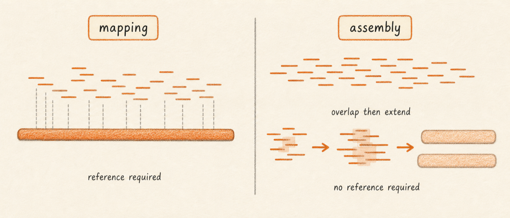

## What it is

Assembly takes sequencing reads and stitches them together into longer
contiguous sequences, called contigs, without consulting a reference genome.
The assembler looks for overlaps between reads, builds a graph of those
overlaps, and walks the graph to produce a small set of long sequences that
together represent the sample's genome. Where reference mapping asks "where
on this known genome does each read fit?", assembly asks "what sequence
must the sample have for these reads to make sense?".

Three situations call for assembly. The first is a sample with no good
reference: a novel virus, a known virus that has drifted far enough from
its closest GenBank entry that mapping wastes most of the reads, or a
contaminating organism you want to identify by BLASTing the resulting
contigs. The second is a sample where you want a higher-quality consensus
than reference mapping can give. Mapping forces every read into the
reference's coordinate system, which masks insertions, deletions, and
rearrangements; assembly recovers them. The third is structural variation.
Large duplications, inversions, and translocations leave reads soft-clipped
or unmapped against a reference, but appear as their actual sequence in
contigs.

Lungfish runs five assemblers through one wizard and packages every result
the same way: a `.lungfishref` assembly bundle in the project's
`Assemblies/` folder, with each contig as a navigable sequence and assembly
statistics (N50, total length, contig count) in the Inspector. The bundle
format is identical to a reference bundle, so any contig you produce can be
used downstream as a mapping target, an annotation target, or a phylogeny
input.

So what should you do with this? Before you click Assembly, work through
the decision walkthrough in the next section. Most short-read viral and
bacterial work belongs on SPAdes; metagenomic work belongs on MEGAHIT;
long-read work belongs on Flye or Hifiasm; and a meaningful fraction of
projects do not need assembly at all.

## What you will learn

By the end of this chapter you will be able to decide whether to assemble
or to map against a reference, choose the right assembler for your data
type, run the Assembly wizard, and find the resulting assembly bundle in
the project.

## The five assemblers at a glance

Lungfish ships five de novo assemblers. Each was built for a specific
combination of read length, error profile, and genome class, and using one
outside its niche usually produces a worse assembly than the alternative.
The table below summarises the niches.

| Assembler | Read type | Best for | Genome size | Notes |
|---|---|---|---|---|
| SPAdes | Illumina paired short reads | Viral and bacterial isolates | up to ~10 Mb | Has a `--viral` mode tuned for viral coverage profiles. Default for SARS-CoV-2 and similar amplicon work. |
| MEGAHIT | Illumina short reads | Shotgun metagenomes | unbounded | Lower memory than SPAdes on complex mixtures. Use when one sample contains many organisms. |
| SKESA | Illumina short reads | Bacterial isolates | up to ~10 Mb | NCBI's preferred isolate assembler. Conservative; emits fewer mis-joins than SPAdes at the cost of slightly more contigs. |
| Flye | Oxford Nanopore long reads | Anything from viral to bacterial chromosomes | up to ~100 Mb | Handles repeats well because long reads span them. Polish with short reads afterwards if available. |
| Hifiasm | PacBio HiFi long reads | High-accuracy long-read assembly | unbounded | Designed for HiFi's <1% error rate. Produces near reference-grade contigs from a single technology. |

Two assemblers are not in this table because Lungfish does not ship them:
Canu and Trinity. Canu has been superseded by Flye for Nanopore work in
most published comparisons. Trinity targets transcriptome assembly, which
Lungfish does not currently expose.

## A decision walkthrough

Work through three questions in order. The answers select an assembler or
send you back to reference mapping.

**Do I have a reference that fits?** A reference fits when the sample
shares more than ~95% identity across most of the reference's length. For
SARS-CoV-2 from 2020 onwards this is always true: every sequenced isolate
maps cleanly against MN908947.3 or a Wuhan-Hu-1 derivative. For a sample
where the closest GenBank hit is the wrong genus, or where mapping leaves
more than half the reads unmapped, you do not have a reference that fits
and assembly is the right tool. If a reference fits, assembly is usually
unnecessary; map and call variants instead, and only assemble if you
suspect structural variation that mapping is hiding.

**Is the genome small or large?** Small means viral or single-bacterial
(under ~10 Mb). Large means metagenomic, multi-species, or eukaryotic.
Small genomes go to SPAdes (viral or bacterial) or SKESA (bacterial
isolates with strict isolate-quality requirements). Large or mixed samples
go to MEGAHIT, which trades some contiguity for the ability to assemble
many organisms in one pass without exhausting memory.

**Are the reads short or long?** Illumina is short (50–300 bp), and SPAdes,
MEGAHIT, or SKESA apply. Oxford Nanopore is long (1–100 kb) with ~5–10%
per-base error, and Flye applies. PacBio HiFi is long (10–25 kb) with <1%
error, and Hifiasm applies. Mixing read types in one assembly is possible
(SPAdes accepts a Nanopore long-read pool alongside Illumina pairs) but
out of scope for this chapter; the wizard exposes single-technology runs
only.

A worked example. Suppose you have a wastewater sample sequenced with
Illumina paired-end shotgun and you want to recover any viral genomes
present. You do not have a single fitting reference because you do not yet
know what organisms are in the sample, so the first question sends you to
assembly. The genome is large in aggregate (a metagenome), so the second
question sends you to MEGAHIT rather than SPAdes. The reads are short, so
the third question confirms MEGAHIT. After assembly, you BLAST the longest
contigs to identify what assembled. If one of those contigs is a complete
SARS-CoV-2 genome, you can drop it back into the project as a reference
bundle and re-map the full read set against it for a clean variant call.

A second worked example. A clinical bacterial isolate with Nanopore
sequencing and no Illumina backup. The first question sends you to
assembly because there may be a closer reference but you want a
chromosome-level genome with the structural variation intact. The second
question is bacterial-isolate territory but the third question (long
reads) overrides it: Flye, not SKESA. After Flye, polish with Medaka if
you have it, or accept the assembly as-is for a draft genome.

## Comparing SPAdes and MEGAHIT on the same sample

SPAdes and MEGAHIT both accept Illumina paired short reads, and both
appear in the wizard's tool picker for that input type. The difference
shows up in the output. Consider SRR36291587, a SARS-CoV-2 amplicon
Illumina run.

Run SPAdes in viral mode against the paired FASTQ. The expected output is
one or a small number of contigs, with the longest near 29.9 kb (the full
SARS-CoV-2 genome) when amplicon coverage is uniform, plus one or two
shorter fragments where amplicon dropouts forced a graph break. The N50
is essentially the longest contig length. Total assembly length is close
to 30 kb.

Run MEGAHIT against the same FASTQ. The expected output is a noticeably
longer contig list, with the longest contig often shorter than SPAdes's
longest, total assembly length similar, and N50 lower. MEGAHIT's
metagenomic-first heuristics treat the input as a possibly mixed sample
and split the graph more aggressively at coverage transitions, which a
viral isolate exhibits at every amplicon boundary.

For this sample SPAdes is the right tool because the input is a
single-organism amplicon run with a known target size. If the same FASTQ
came from a wastewater shotgun preparation, MEGAHIT would be right
because the assumption of a single dominant organism would not hold. The
take-away: identical input, different assembler assumption, different
shape of result. Match the assembler's assumption to your sample.

## Where the result lands

Every assembler in this list writes a `.lungfishref` assembly bundle into
the project's `Assemblies/` folder. The bundle's primary FASTA contains
the contigs in length-descending order. The Inspector shows N50, total
assembled length, contig count, longest-contig length, and the resolved
tool version. The contigs themselves appear as navigable sequences in the
sidebar, and any contig can be opened in a sequence viewport, used as a
mapping target for a fresh `Map Reads` run, or annotated with a transferred
GFF3.

<!-- planned: assembly-bundle-in-sidebar -->

## Next

Continue to [Running SPAdes](02-running-spades.md) for short-read viral or
bacterial assembly, or [Running Flye or Hifiasm](03-running-flye-or-hifiasm.md)
for long-read assembly.
