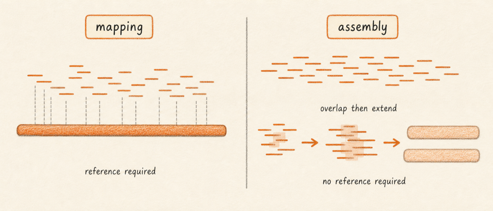

## What it is

Assembly stitches sequencing reads into longer contiguous sequences, called
contigs, without ever consulting a reference genome. The assembler hunts for
overlaps between reads, builds a graph of those overlaps, and walks the graph
to yield a small set of long sequences that together stand in for the sample's
genome. Reference mapping asks "where on this known genome does each read
fit?" Assembly asks the harder question: "what sequence must the sample carry
for these reads to make sense?"

Three situations call for assembly. The first is a sample with no good
reference: a novel virus, a known virus that has drifted so far from its
closest GenBank entry that mapping throws away most of the reads, or a
contaminating organism you want to identify by BLASTing the resulting contigs.
The second is a sample where you want a cleaner consensus than mapping can
give. Mapping forces every read into the reference's coordinate system, which
buries insertions, deletions, and rearrangements. Assembly brings them back.
The third is structural variation. Large duplications, inversions, and
translocations leave reads soft-clipped or unmapped against a reference, yet
they show up as their actual sequence in contigs.

Lungfish runs five assemblers through one wizard and packages every result
the same way: a `.lungfishref` assembly bundle in the project's `Assemblies/`
folder, with each contig as a navigable sequence and the assembly statistics
(N50, total length, contig count) in the Inspector. One menu item opens the
wizard, `Tools > FASTQ/FASTA Operations > Assembly…`, and you pick the
assembler from a segmented Assembler control inside it. The bundle format
matches a reference bundle exactly, so any contig you produce can serve
downstream as a mapping target, an annotation target, or a phylogeny input.

Before you open the Assembly wizard, work through the decision walkthrough in
the next section. Most short-read viral and bacterial work belongs on SPAdes.
Metagenomic work belongs on MEGAHIT. Long-read work belongs on Flye or
Hifiasm. And a fair share of projects need no assembly at all.

## What you will learn

This chapter walks you through deciding whether to assemble or to map against
a reference, choosing the right assembler for your data type, running the
Assembly wizard, and finding the resulting assembly bundle in the project.

## The five assemblers at a glance

Lungfish ships five de novo assemblers. Each was built for a specific
combination of read length, error profile, and genome class, and pushing one
outside its niche usually yields a worse assembly than the right alternative.
The table below lays out the niches.

| Assembler | Read type | Best for | Genome size | Notes |
|---|---|---|---|---|
| SPAdes | Illumina paired short reads | Viral and bacterial isolates | up to ~10 Mb | The first-reach assembler for single-virus and single-bacterium short reads. Profiles: Isolate (default), Meta, Plasmid. |
| MEGAHIT | Illumina short reads | Shotgun metagenomes | unbounded | Lower memory than SPAdes on complex mixtures. Use when one sample contains many organisms. |
| SKESA | Illumina short reads | Bacterial isolates | up to ~10 Mb | NCBI's preferred isolate assembler. Conservative; emits fewer mis-joins than SPAdes at the cost of slightly more contigs. |
| Flye | Oxford Nanopore long reads | Anything from viral to bacterial chromosomes | up to ~100 Mb | Handles repeats well because long reads span them. In this version Flye accepts ONT reads only. |
| Hifiasm | PacBio HiFi long reads | High-accuracy long-read assembly | unbounded | Designed for HiFi's <1% error rate. Produces near reference-grade contigs. Also accepts ONT reads. |

Two assemblers are missing from this table because Lungfish does not ship
them: Canu and Trinity. Flye has overtaken Canu for Nanopore work in most
published comparisons. Trinity targets transcriptome assembly, which Lungfish
does not currently expose.

The wizard reads the FASTQ headers, detects the read class for you, and then
shows only the assemblers that fit. Select a paired Illumina bundle and the
Assembler picker offers SPAdes, MEGAHIT, and SKESA; an ONT bundle offers Flye
and Hifiasm. So a tool you expected may be absent simply because it does not
accept your detected read type, not because it went missing.

## A decision walkthrough

Work through three questions in order. The answers point you to an assembler
or send you back to reference mapping.

**Do I have a reference that fits?** A reference fits when the sample shares
more than ~95% identity across most of the reference's length. For SARS-CoV-2
from 2020 onward this always holds: every sequenced isolate maps cleanly
against MN908947.3 or a Wuhan-Hu-1 derivative. If the closest GenBank hit is
the wrong genus, or mapping leaves more than half the reads unmapped, no
reference fits and assembly is the right tool. When a reference does fit,
assembly is usually unnecessary. Map and call variants instead, and assemble
only when you suspect structural variation that mapping is hiding.

**Is the genome small or large?** Small means viral or single-bacterial
(under ~10 Mb). Large means metagenomic, multi-species, or eukaryotic. Small
genomes go to SPAdes (viral or bacterial) or SKESA (bacterial isolates with
strict isolate-quality requirements). Large or mixed samples go to MEGAHIT,
which trades some contiguity for the reach to assemble many organisms in one
pass without exhausting memory.

**Are the reads short or long?** Illumina is short (50–300 bp), and SPAdes,
MEGAHIT, or SKESA apply. Oxford Nanopore is long (1–100 kb) with ~5–10%
per-base error, and Flye applies. PacBio HiFi is long (10–25 kb) with <1%
error, and Hifiasm applies. Hybrid assembly that blends read types in one run
exists in some assemblers, but it sits out of scope here: the Lungfish wizard
detects one read class per bundle and runs a single technology at a time.

A worked example. Suppose you have a wastewater sample sequenced with Illumina
paired-end shotgun, and you want to recover any viral genomes it holds. No
single reference fits, because you do not yet know what organisms are in the
sample, so the first question sends you to assembly. The genome is large in
aggregate (a metagenome), so the second question steers you to MEGAHIT over
SPAdes. The reads are short, so the third question confirms MEGAHIT. After
assembly you BLAST the longest contigs to see what assembled. If one is a
complete SARS-CoV-2 genome, drop it back into the project as a reference
bundle and re-map the full read set against it for a clean variant call.

A second worked example. A clinical bacterial isolate, Nanopore sequenced,
with no Illumina backup. The first question sends you to assembly: a closer
reference may exist, but you want a chromosome-level genome with the
structural variation intact. The second question reads as bacterial-isolate
territory, yet the third question overrides it on read length: Flye, not
SKESA. Flye runs its own internal polishing, so its output is usable as a
draft genome straight from the wizard.

## Comparing SPAdes and MEGAHIT on the same sample

If you have never assembled before, skip this comparison and come back after
your first run. It goes a step deeper than the decision walkthrough above.

SPAdes and MEGAHIT both accept Illumina paired short reads, and both surface
in the wizard's Assembler picker for that input type. The difference emerges
in the output. Consider SRR36291587, a SARS-CoV-2 amplicon Illumina run.

Run SPAdes with its default Isolate profile against the paired FASTQ. Lungfish
ships no viral profile, and for a single-organism amplicon run the Isolate
profile is the right default. Expect one contig or a small handful, the
longest near 29.9 kb (the full SARS-CoV-2 genome) when amplicon coverage is
uniform, plus a shorter fragment or two where amplicon dropouts forced a graph
break. The N50 is essentially the longest contig length. Total assembly length
sits close to 30 kb.

Now run MEGAHIT against the same FASTQ. Expect a noticeably longer contig
list, its longest contig often shorter than SPAdes's longest, total assembly
length similar, and N50 lower. MEGAHIT's metagenomic-first heuristics treat
the input as a possibly mixed sample and split the graph more aggressively at
coverage transitions, which a viral isolate throws up at every amplicon
boundary.

For this sample SPAdes wins, because the input is a single-organism amplicon
run with a known target size. Had the same FASTQ come from a wastewater
shotgun preparation, MEGAHIT would win, because the single-dominant-organism
assumption would collapse. The takeaway: identical input, different assembler
assumption, different shape of result. Match the assembler's assumption to
your sample.

## Where the result lands

Every assembler in this list writes a `.lungfishref` assembly bundle into the
project's `Assemblies/` folder. The bundle's primary FASTA holds the contigs
in length-descending order. The Inspector shows N50, total assembled length,
contig count, longest-contig length, and the resolved tool version. The
contigs themselves appear as navigable sequences in the sidebar, and any one
can be opened in a sequence viewport, used as a mapping target for a fresh
`Map Reads` run, or annotated with a transferred GFF3.

<!-- planned: assembly-bundle-in-sidebar -->

## Next

Continue to [Running SPAdes](02-running-spades.md) for short-read viral or
bacterial assembly, which also covers MEGAHIT and SKESA in the same wizard,
or [Running Flye or Hifiasm](03-running-flye-or-hifiasm.md) for long-read
assembly.
