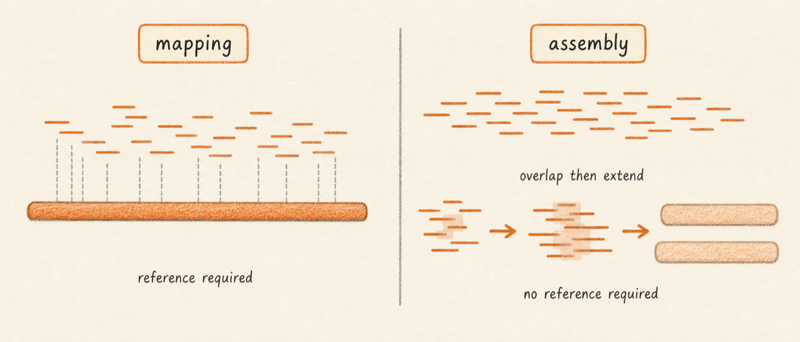

## What it is

This chapter helps you decide whether a sample needs assembling and which of the five assemblers in Lungfish Genome Explorer (LGE) fits your reads. The chapters after it run one end to end.

[De novo assembly](../../GLOSSARY.md#de-novo-assembly) rebuilds a sample's sequence from its own [reads](../../GLOSSARY.md#read), with no reference genome in the calculation. A read is one short stretch of sequence the instrument produced. On their own the reads are a heap of fragments in no order. "De novo" is Latin for "from new", because the assembler is told nothing about what the sample should look like.

An assembler works in three moves. It finds places where the end of one read matches the start of another. It records every such overlap in an [assembly graph](../../GLOSSARY.md#assembly-graph), a network of pieces joined by their overlaps. Then it traces paths through that network and writes out the long stretches those paths spell. A [contig](../../GLOSSARY.md#contig) is one continuous stretch of sequence an assembler rebuilt from overlapping reads.

Mapping asks a different question. It starts from a genome you have already named and asks where on it each read belongs. Assembly starts from nothing and asks what sequence the sample must carry for these reads to make sense. The two work well together. A common pattern is to assemble to find out what a sample holds, then map against what the assembly turned up.

An assembly rarely comes back as one sequence per chromosome. The reason is repeats, stretches of sequence that occur more than once in the genome. At the end of a repeat the assembler finds two reads matching equally well, one from each copy, so it stops rather than guess. A read long enough to span the whole repeat settles the question, and a shorter read cannot, so the contig breaks there. A good assembly of a large genome still holds many contigs. A small, deeply sequenced genome such as the 16,569-base human [mitochondrial genome](../../GLOSSARY.md#mitochondrial-genome) can come back whole, and this chapter shows one that does.

## Why you would do this

If a good reference exists for your organism, map instead. Mapping is faster, needs far less memory, gives depth at every position, and feeds variant calling directly. Assemble only when mapping cannot answer your question, which happens in three situations.

The first is a sample with no reference that fits. A novel virus is the clearest case. So is an organism whose closest published relative is distant enough that many of its reads fail to map, or a contaminant you want to identify by assembling it and then searching its contigs against a public database.

The second is a sample where mapping would hide what you care about. Mapping forces every read into the reference's numbered positions. A short insertion, extra sequence the reference does not have, still shows inside the reads that cross it. An insertion longer than a read has no slot there. Reads crossing it are cut short or left unaligned, so mapping cannot show the inserted sequence. In an assembly the insertion appears in the contig at its real length.

The third is [structural variation](../../GLOSSARY.md#structural-variation), a rearrangement that moves, duplicates, inverts, or deletes a whole block of sequence. Against a reference it shows only indirectly, for example as [paired-end](../../GLOSSARY.md#paired-end) reads landing implausibly far apart. A paired-end run reads each fragment from both ends, so the two reads should land a known distance apart. In an assembly the rearranged sequence is simply written out.

## Choosing a tool

First check the facts in [Know your reads before you choose a tool](../01-foundations/02-sequencing-reads.md#know-your-reads-before-you-choose-a-tool). Here the choice rests on whether the reads are short or long and whether the sample holds one organism or many.

### Two ways to put reads together

A [de Bruijn graph](../../GLOSSARY.md#de-bruijn-graph) assembler, such as SPAdes, MEGAHIT, or SKESA, never compares whole reads with each other. It cuts every read into [k-mers](../../GLOSSARY.md#k-mer), overlapping words of exactly k bases, and links two words when the last k minus 1 bases of one are the first k minus 1 of the next. Take the read `ATGGC` and k of 3. Its words are `ATG`, `TGG`, and `GGC`. `ATG` ends in `TG` and `TGG` starts with it, so they link, and `TGG` links to `GGC` the same way. Walking the three words spells `ATGGC` again. A read with an error, `ATGCC`, adds the words `TGC` and `GCC`, a side branch off `ATG` seen only once, so the assembler prunes it. This handles the tens of millions of reads an Illumina run gives, but one wrong base spoils every word covering it, and the graph breaks at any repeat longer than a word that no read pair spans.

Long-read assemblers compare reads with each other, since there are far fewer of them and each overlap runs for thousands of bases. Hifiasm descends from the [overlap-layout-consensus](../../GLOSSARY.md#overlap-layout-consensus) approach. It finds overlaps, lays the reads out in order, and keeps the two parental copies of each chromosome, the [haplotypes](../../GLOSSARY.md#haplotype), apart where other assemblers merge them.

Flye borrows from both families. It joins rough overlaps into draft pieces, builds a repeat graph in which each repeat collapses into one piece, and uses reads spanning a repeat to find its path.

### Three questions

**Does a reference fit my sample?** Judge this on the reads from your target organism, not the whole run, which may be mostly host. Take the reads [Kraken 2](../06-classification/02-running-kraken2.md) assigns to your target and map them in a trial run of [Mapping Reads to a Reference](../04-alignments/01-mapping-reads-to-a-reference.md), which reports the share that aligned. A [BLAST](../../GLOSSARY.md#blast) search of a few of them reports [percent identity](../../GLOSSARY.md#percent-identity), the share of matching positions, to the nearest genomes. If most target reads align closely, map, and otherwise assemble.

**Are my reads short or long?** This is a hard constraint. Illumina reads, tens to a few hundred bases long, go to SPAdes, MEGAHIT, or SKESA. Oxford Nanopore reads, thousands to tens of thousands of bases, go to Flye or hifiasm, and PacBio HiFi reads, long and unusually accurate, go to hifiasm. Illumina and HiFi make well under one error per hundred bases. Nanopore reads make a few per hundred on older flow cells, the consumable chip the reads come from, and about one per hundred on current R10.4.1 flow cells. The MinKNOW run report names the flow cell, and recent basecallers write a model name such as `dna_r10.4.1` into each read's header. LGE takes one read type per run, so it offers no hybrid assembly, though outside LGE polishing a nanopore assembly with short reads of the same sample is standard practice.

**Is my sample one organism or many?** An isolate, grown from a single organism, sequences its genome to about even depth. A [metagenome](../../GLOSSARY.md#metagenomics), a sample holding many organisms, sequences some deeply and others barely. An isolate assembler discards thinly covered sequence as error, which throws away rare organisms, so use a community mode for a metagenome. A virus population inside one host counts as one organism, and the assembler writes out its majority sequence.

### The assemblers

**SPAdes** is the usual first choice for Illumina reads from a virus, bacterium, or small eukaryote such as a fungus, not a mammal-sized genome. Its Isolate profile expects one organism at even depth, Meta a community, and Plasmid pulls out plasmids, the small circular DNA molecules many bacteria carry.

**MEGAHIT** stores its graph compactly, so it needs much less memory than SPAdes on large metagenomes. On Apple Silicon its runs often stop with no contigs, a [known defect](../appendices/troubleshooting.md#known-defects-in-this-release), though a run that finishes is correct.

**SKESA** is NCBI's isolate assembler for the genomes SPAdes suits. It stops a contig whenever the next step is uncertain, which gives more contigs and fewer wrong joins.

**Flye** is built for Nanopore reads, including older noisy ones. It scales to mammal-sized genomes, though its documentation reports hundreds of gigabytes of memory for a human genome. LGE preselects Nano Raw below a mean quality of Q10 and Nano HQ at Q10 or above. Flye documents Nano HQ for reads under 5 percent error, about Q13, so reads between Q10 and Q13 may do better on Nano Raw. Flye merges the two haplotypes of a diploid genome into one sequence.

**Hifiasm** was built for PacBio HiFi reads, and recent versions, including the 0.25.0 LGE installs, also accept Nanopore reads. That mode was developed on R10.4.1 reads, so older Nanopore data probably suits Flye better. Its Diploid profile keeps the two haplotypes apart, and Haploid/Viral expects one copy.

| Tool | Built for | Choose it when | Choose something else when |
|---|---|---|---|
| SPAdes | Illumina reads, with Meta and Plasmid modes | You have short reads from a virus, bacterium, or mitochondrion | The reads are long, or memory runs out |
| MEGAHIT | Illumina reads from large metagenomes | A community is too big for SPAdes Meta | The sample is one organism, or the run stops with no contigs |
| SKESA | Illumina reads from isolates | You prefer fewer wrong joins to fewer contigs | The sample is a community |
| Flye | Nanopore reads, old or current | You have Nanopore reads from a bacterium, a virus, or a community | You need a diploid's two haplotypes kept apart |
| Hifiasm | HiFi and current Nanopore reads | You have HiFi reads, or both haplotypes matter | The reads are older Nanopore, or the genome is haploid |

### Worked choices

A macaque stool sample sequenced on Illumina for its viruses is a community, and many of its viruses have no close reference. The answer is SPAdes with the Meta profile, or MEGAHIT if it completes on your Mac. LGE ships no macaque host index, and its human index removes only some macaque reads, as [Decontamination](../03-reads/05-decontamination.md) explains.

A virus grown in cell culture from a macaque sample and sequenced on a nanopore instrument is one organism with long reads. If its reads sit close to a published genome, such as the SIVmac239 clone, map instead. Otherwise choose Flye, since a virus has one copy and gains nothing from hifiasm's haplotype separation.

A bacterial isolate sequenced only on nanopore goes to Flye for the same reason.

In a macaque MHC region, the highly variable immune gene cluster, similar genes can collapse into one contig in any assembler. For allele calls, use [Full-length ONT MHC genotyping](../09-genotyping/01-what-is-mhc-genotyping.md#choosing-a-tool) rather than assembly.

The human-mito fixture is Illumina reads from one small circular genome, so [Running SPAdes](02-running-spades.md) uses the Isolate profile, and [Running Flye or hifiasm](03-running-flye-or-hifiasm.md) assembles its long reads. Citations are in the [Tool Bibliography](../appendices/bibliography.md#tools-installed-by-a-plugin-pack), with the mode papers under [Assembler modes with their own papers](../appendices/bibliography.md#assembler-modes-with-their-own-papers).

## Before you start

The five assemblers arrive in one pack. Install the `assembly` [plugin pack](../../GLOSSARY.md#plugin-pack), a themed group of tools LGE installs on request, as [Plugin Packs](../01-foundations/07-plugin-packs.md#procedure) shows. The Plugin Manager lists it as Genome Assembly. If it is missing, the assembly sheet's Readiness line names what is absent.

The versions are pinned, so a run today and a run next year use the same code. This release ships SPAdes 4.3.0, MEGAHIT 1.2.9, SKESA 2.5.1, Flye 2.9.6, and hifiasm 0.25.0. Menus write the last one as Hifiasm, which is the same tool.

The comparison later in this chapter uses the human-mito fixture. Download `HG002.chrM_R1.fastq.gz` and `HG002.chrM_R2.fastq.gz` from [the human-mito fixture folder](https://github.com/dhoconno/lungfish-genome-explorer/tree/v2026.9.40/docs/user-manual/fixtures/human-mito), as [Practice data for this manual](../01-foundations/06-the-lungfish-project.md#practice-data-for-this-manual) explains. You only need it if you want to repeat the comparison. The Long Reads and Assembly demo project, which **Help > Demo Projects…** opens as [Demo projects](../01-foundations/06-the-lungfish-project.md#demo-projects) explains, already holds these reads as the `HG002.chrM` bundle.

## How the sheet decides what you may run

LGE puts each assembler under **Tools > Assembly** as its own item, SPAdes..., MEGAHIT..., SKESA..., Flye..., and Hifiasm.... Each opens one shared sheet with that tool already chosen. Select the FASTQ bundle in the sidebar first, because the sheet takes whatever is selected and offers no file picker. A paired-end sample is one row, since LGE keeps both mates in one bundle.

<!-- SHOT: assembly-submenu -->

The sheet works out which class of instrument produced the reads and offers only the assemblers that accept that class, as this table shows. How it detects the class, and what to do when it cannot, is covered in [Running SPAdes](02-running-spades.md#settings).

| Read class | Assemblers offered |
|---|---|
| Illumina short reads | SPAdes, MEGAHIT, SKESA |
| Oxford Nanopore reads | Flye, hifiasm |
| PacBio HiFi reads | hifiasm |

<!-- SHOT: assembly-sheet-assembler-picker -->

The sheet takes one read class per run, so it refuses a selection that mixes short and long reads. [Choosing a tool](#choosing-a-tool) explains how to pick among the assemblers it offers.

## Two assemblers on the same human reads

The human-mito fixture holds Illumina reads from the mitochondrial chromosome of [HG002](../../GLOSSARY.md#hg002), a benchmark human genome characterised by many independent methods. The reads were thinned at random to about 300-fold coverage, leaving 9,958 read pairs. That is far more than assembly needs, which is part of why the fixture assembles cleanly. The published sequence is NCBI [accession](../../GLOSSARY.md#accession) `NC_012920.1`, 16,569 bases and circular, so there is a known answer to check against.

SPAdes returned one contig of 16,697 bases, with an N50 of 16,697 and an L50 of 1. SKESA returned one contig of 16,570 bases, with the same N50 and L50. Both have 44.4% [GC content](../../GLOSSARY.md#gc-content), the share of bases that are G or C. Both rebuilt the genome end to end.

SKESA is one base over the published length, and SPAdes is 128 bases over, about 0.8%. That excess is the overlap an assembler can write twice where it cuts a circle open, not a real insertion, as [Running Flye or hifiasm](03-running-flye-or-hifiasm.md#reading-the-results) explains. Run times differed too, but a run time says nothing about which answer is better.

Two assemblers given identical reads give different answers because they make different assumptions. The difference is informative. Match the assumption to your sample.

## What the numbers mean

Two statistics dominate every assembly report, and both are easy to misread.

[N50](../../GLOSSARY.md#n50) is a length. It is the contig length at which contigs that long or longer hold half of all assembled bases. To find it, sort the contigs longest first, add up their lengths from the top, and stop at the first contig where the running total reaches half the assembly's total length. That contig's length is the N50. LGE computes it exactly this way.

[L50](../../GLOSSARY.md#l50) is a count. It is how many contigs you walked through to reach that halfway point.

Here is the walk on a small made-up assembly of five contigs.

| Contig | Length | Running total | Past half of 100 kb? |
|---|---|---|---|
| 1 | 40 kb | 40 kb | no |
| 2 | 30 kb | 70 kb | yes, stop here |
| 3 | 15 kb | 85 kb | |
| 4 | 10 kb | 95 kb | |
| 5 | 5 kb | 100 kb | |

The total is 100 kilobases (kb, thousands of bases), so half is 50 kb. The running total first passes 50 kb at contig 2, so the N50 is 30 kb and the L50 is 2. On the SPAdes result above, the single contig is the whole assembly, so the N50 is its full 16,697 bases and the L50 is 1.

N50 beats an average contig length because it is weighted by length. Every assembly picks up a scatter of short contigs, which barely move the N50 but drag an average down. A genuinely fragmented assembly drags the N50 down hard. N50 going up and L50 going down are the same good news said two ways.

No single N50 separates good from bad across all genomes. Compare against the genome you were trying to assemble. An N50 near the full length of a small circular genome means it came back whole. An N50 of 50 kb on a 5 Mb bacterial chromosome is an ordinary short-read result. The same 50 kb on a genome expected to be 30 kb needs review, since the assembler may have duplicated sequence or the reads may hold a different organism.

## Where the result lands

The result lands under `Analyses/` in a new folder, as [Where results land](../01-foundations/06-the-lungfish-project.md#where-results-land) describes, and appears in the sidebar as one row. The contig table and the Assembly Context block are read as [Running SPAdes](02-running-spades.md#reading-the-results) explains.

## What good looks like

Four checks tell you an assembly is worth building on.

1. The run finished and produced contigs. A run with none shows "Assembly completed, but no contigs were generated." in the viewport, meaning the reads held too little overlapping sequence.
2. The total assembled length is close to the genome's published length, as the fixture's 0.8% overshoot is. Far short means the reads did not cover the genome.
3. The contig count and N50 fit the read type and the genome. A small circular genome sequenced deeply should come back as one contig or a few. A short-read bacterial assembly in the tens to low hundreds of contigs is ordinary. Tens of thousands of contigs from a sample you believed was one organism says it was not, or that coverage was thin.
4. The Assembly Context block names the assembler you meant, which matters after the picker narrowed your choices.

When an assembly disappoints, suspect coverage before the assembler. Select the FASTQ bundle and read **Read Count** in the Inspector. Coverage is roughly that count times the read length, divided by the genome's length. This is an average across the genome, like the 30x figure in [The coverage curve](../04-alignments/02-reading-an-alignment.md#the-coverage-curve), not a per-position floor. Thin coverage is the most common reason an assembly comes back in many short pieces.

## Next

Continue to [Running SPAdes](02-running-spades.md), which runs a short-read assembly end to end and covers MEGAHIT and SKESA in the same sheet. [Running Flye or hifiasm](03-running-flye-or-hifiasm.md) does the same for long reads. [Extracting Contigs](04-extracting-contigs.md) turns chosen contigs into a reference bundle you can map against.
